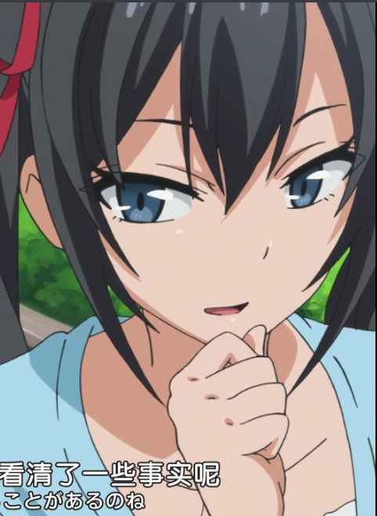
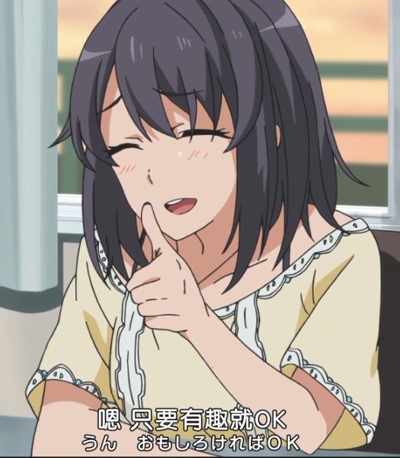
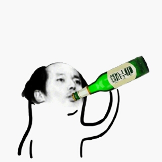
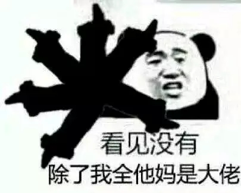

1楼给度娘

            1楼 | Nexus- | 2018-07-19 17:46

2楼自占

            2楼 | Nexus- | 2018-07-19 17:46

<pre style="background-color: #f6f8fa;border-radius: 3px;            font-size: 85%;line-height: 1.45;overflow: auto;padding: 16px;">2018-07-19 18:32 | Nexus-:<blockquote>八篇传送门<a href="https://tieba.baidu.com/p/5801209324">https://tieba.baidu.com/p/5801209324</a></blockquote>2018-07-19 18:50 | Nexus-:<blockquote>前排提示，本文12w字，慎入。。</blockquote></pre>

曾经写到由于八幡某些比较特殊的心态，他的第一视角所展现的东西很多带有刻意的自欺性质，实际上很多时候表里不一，自降标准的双标行为时有出现。其中很受影响的就是对于雪之下雪乃的认知，“完美无瑕”、“冰山美人”等等标签在前中期都贴到了她身上，出于各种原因把她抬到了对自己来说遥不可及的层次，读者也就顺着他的意思对雪乃的认知与其达成一致，将雪之下雪乃标签化模板化，她便成为了一个扁平乏味的角色，其实渡航在多次访谈中都在提起“如何客观全面地认知角色”，乃至都明确针对了雪之下雪乃这个女主角，她本质上真的如团阳所说是一个柔弱可爱的少女。由于在主观上某条路被封死，再加上雪乃性格的原因，随之读者也就很难读到雪之下雪乃对比企谷八幡的情感轨迹，再加上中后期涉及到雪之下的家庭问题，阶级断层出现，还有雪之下阳乃对于问题的一一揭露，似乎前景并不乐观，本来支持八雪CP的原因就不太明确，这下便更加动摇了。该如何是好呢？锅还是渡航自己的，其实很多时候他是有所强调的，但都不是很明显，很多处还得靠读者适当发挥想象力才能get到，所以两年半后的12卷会如此直白地去“讲设定”的原因也能理解了。本篇大概会致力于雪乃的“恋爱脑”情节，以及补完八幡篇中未提及或未叙述完整的内容。

            3楼 | Nexus- | 2018-07-19 17:47

以前多次谈到1卷八雪二人见面，但都没有谈地太深入。其实1卷开头的“初见”就大有文章。曾经对车祸事件做过总结，原帖<a href="https://tieba.baidu.com/p/5599721861?pn=1">https://tieba.baidu.com/p/5599721861?pn=1</a>，围绕车祸的烟雾弹实在不少。5卷阳乃提到发生车祸时雪乃是坐在车上的，但八幡住院时只见了前来道歉的司机和律师，虽然1卷初见，雪乃自称不认识八幡，但2卷川崎事件和3卷猫狗展都透露了雪乃对车祸完全知情的事实，且3卷末将自己定义为八团的加害者带有愧意地划开界限，二人真正的初见其实是始于车祸的。车祸帖对3卷阳乃初登场的雪阳对话以及雪乃和雪母的“约定”做了适当的猜想，证据不足，但原文暂时没有什么足以证伪的片段，最初雪之下雪乃面对比企谷八幡会抱有歉意，对这个不惜冒着生命危险也要救狗的善良男孩会怀有一些特殊的情感是十分自然的。不过1卷“初见”真的能完全确定雪之下雪乃认出了八幡吗？即使后面八幡纠结于雪之下雪乃“撒谎”的事实，有没有可能是1卷到2卷的某个时间点雪乃才想起来这回事呢？这还要把原文拿出来看看。

            4楼 | Nexus- | 2018-07-19 17:47

【呼噜噜噜噜。  
然而，雪之下仅仅用仿佛看到非常肮脏的东西一样的眼神瞥了我一眼。仿佛要把她那大眼睛变成眯缝眼一样紧闭着，冷冷地吐了一口气。然后仿佛玲珑的清泉一样的嗓音向我开口。  
｢……别在那发出恶心的吼声坐下来吧？｣  
｢诶？啊？是！对不起｣  
真心感到恐怖的我，找到一个空椅子坐了下来。  
于是就那样，雪之下显出一副对我毫不关心的样子，不知什么时候打开了文库本看了起来。教室里响起哗哗地翻页的声音。  
   
｢比企谷君，多少年没和女生说过话了？｣  
｢拥有的人抱以慈悲之心将其给予缺乏的人。人们称之为志愿者。就像发达国家向外发放开发援助，人们向无家可归的人提供食物，女生向不受欢迎的男生主动说话。像处于困难的人施以援手。这就是这个社团的活动。｣  
不知何时雪之下站了起来，自然而然地，视线变成了从上向下俯视我。  
｢平塚老师曰：据说，优秀的人类有救助可怜人的义务。既然已经拜托我了，就要尽到责任。你的问题由我来矫正。快对我心怀感激吧。｣  
   
｢……我呀，虽然自己说有点不太好，其实非常优秀的哟。文科实力测验国语年级第三！脸也长得不错！除去没有朋友没有女朋友以外，基本算是高等级的！｣  
｢最后的是致命缺陷……。连这种事都能自信满满地说出来，某种程度上讲真厉害呢……。怪人。已经要让人恶心了。｣  
   
   
她算是，冰山美人吧。  
这么说是因为现在她的脸上也浮现出冷酷的微笑。是个喜欢使用高难度的词汇和有着嗜虐般的笑容的家伙。  
｢哼。根据我的观察，你一个人孤零零的看来是因为你那腐烂了的本性和别扭的感性。｣  
雪之下猛地握紧拳头，充满热情地讲道。  
｢我先给无处可去的你创造一个可以呆的地方吧。知道吗？仅是有个可以呆的地方就不会产生像星星燃烧殆尽一样的悲惨结局了。｣  
｢你当是『夜鹰之星』（宫泽贤治）么。太狂热了吧！｣  
雪之下对我的反驳很吃惊而睁大了眼睛。  
｢……真意外呢。我觉得成绩在平均水准以下的男高中生是不会读宫泽贤治的童话的。｣  
｢你这是毫不犹豫地贬低我吧。｣｢抱歉，说过了。正确地说是到不了普通水准呢｣  
｢是说往好的方面说过了啊！没听到是年级第三名吗你！｣  
｢仅仅是第三名就高兴的这一刻，水平就变低了呢。本来仅凭一科考试的分数就想证明自己头脑聪明这种想法也已经算是低能了呢。｣  
……这家伙失礼也要有个限度。将初次见面的男子视为劣等人，能做出这种行为的人我只能想到赛亚人王子了。｢但是夜鹰之星和你很相配的。比如你脸长得很像夜鹰之类的。｣  
｢你是想说我脸部得残疾吗……｣｢我才说不出口呢。有时真相会很伤害人｣  
｢你这不是都说出来了嘛！｣  
说着，雪之下表情眼凝重地拍了拍我的肩膀。  
｢人不能逃避真相的。睁开眼看看现实以及镜子吧。｣  
｢不不不，自己说虽然有点那个，我五官还算端正。妹妹也说过『哥哥要是一直不说话的就好了……』。不如说是只有脸长得还可以｣  
｢本来，姑且不管脸，你这死鱼一样的眼睛，必然会给人带来不好的印象。不是眼睛鼻子等部分，而是你的表情，很丑。这就是你心术不正的证据。｣   
就在我逃避现实的时候，雪之下把落在肩上的长发拂去，得意洋洋地说道。  
｢本来就看不惯你对成绩呀长相啊这种表象的东西抱有自信。还有你那腐烂的眼睛嗯。｣  
｢眼睛的事就够了不要再说了！｣｢也是呢，事到如今说也没有用了呢｣｢你差不多该给我父母道歉了！｣  
我知道自己一下表情绷紧了。连雪之下也好像有些反省地一脸沉闷默不作声。  
｢确实，说得有些过分了。更难过的一定是你的父母吧。｣  
｢够了，是我错了。不，是我的脸错了｣  
在几乎两眼含泪的我的恳请下，雪之下终于收起她的毒舌。  
我已经悟出来了对她说什么都没用。我沉浸于在菩提树下坐禅以得到解脱的幻想中，而雪之下继续说了下去。  
｢那么，对话模拟练习到此结束了呢。能和我这样的女生说话，基本和其他人也就能正常交流了｣  
雪之下用右手拢着自己的头发，脸上浮现出满足感。然后开朗地微笑起来。｢今后仅靠这美好的回忆也能一个人坚强地活下去了｣  
｢解决方法太过极端了吧……｣  
｢但是，这样的话老师的委托就不能完成了……如果不从最根本的地方着手的话……比如你退学之类的｣  
｢这个并不是解决方法，就像把臭的东西盖住无视掉一样｣  
｢啊，你也发觉你是臭的了呀｣  
｢恩 自己不讨人喜欢这点我还是\.\.烦死了\!｣  
｢……好吵｣  
觉得说得自己说得很有趣不由得笑了起来，雪之下又以｢你为什么还活着？｣这种眼神等着我，目光真的很可怕。  
   
｢你这么说只是逃避而已，不作改变的话是不会前进的哦｣  
雪之下非常干脆地抛出这句话，这家伙从刚才开始就一直说话带刺，她是海胆生的吗？  
｢逃跑有什么不对的。改变吧改变吧只会重复一句话像傻瓜一样，那么你是那种人吧，会跑去向太阳说‘从西边落下给大家带来很大的困扰所以从今天开始从东边落下吧’怎么样｣  
｢你这是诡辩，请不要偷换概念，再说了，太阳是不运动的，运动的是地球，日心说你不知道吗｣ ｢这只是举个例子而已，要说诡辩也是你在诡辩。实际上就是为了逃离现状才会改变吧，所以说到底哪个才是逃避啊，真正不逃避的话就是不做任何改变脚踏实地的做好现在，为什么要让现在的自己去否定过去的自己呢｣  
｢这样的话任何烦恼都解决不了，不是就没有人能拯救你了吗｣  
没有人能拯救你，在说这句话的时候雪之下生气的表情让人感受到了鬼神一样的气魄，让人立刻害怕起来，不自觉的向她道歉说出｢对对对对不起！｣再说拯救这个字不应该是一介高中生所说的话吧，到底是为什么导致她说出这种词，我是完全无法理解。  
   
   
在这寂静的空间里，嗞地传出好像坏掉的收音机一样的声音。是铃声响之前的前兆。之后响起非常明显的合成声音一般的旋律，雪之下嘭地合上书。似乎是宣布正式放学的铃声。  
以此为信号，雪之下迅速地开始了回家的准备。把手边的文库本小心地放进包里，站了起来。然后一瞬间看向了我。  
但是，什么也没说就走了。｢辛苦了｣或者是｢我先走了｣之类的都没有，英姿飒爽地走掉了。  
实在是太过冷淡了不给我留下一丝发言的机会。】\-\-\-\-\-\-\-\-\-1卷1章

            5楼 | Nexus- | 2018-07-19 17:48

1卷雪之下雪乃给大家带来的印象就是“高傲、狂气”，甚至有些“自负”，这些都是出于一般情况普通准则下的判断。读到后面，侍奉部接下了更多的委托，前来委托的男生自然不会少，雪之下雪乃对他们的态度都是很平淡的（当然叶山和材木座这种特例除外），单刀直入干净利落地正面解决问题就是她的作风。不过1卷她面对比企谷八幡这个不起眼的男生，态度却有些反常。虽然雪乃比较毒舌，但对初次见面的改造对象过于严重地挖苦讽刺，甚至都涉及了人身攻击（长相），这些不该是一个拘于礼节的大小姐所做的，重点是她的热情太过头了。静提出的委托，然而雪乃对其的重视程度好像都超过了委托人，目睹着目光凶恶，不善于交流，拘泥于自己糟糕性格而感到满足的八幡，她时刻都没有放松地进行反击（矫正），乃至后来争论时都认真地发了火，八幡受到惊吓的同时都吐槽“拯救”不该是一届高中生所说的话，那到底是为什么导致她说出这种词的呢？她如此热情四溢的原因是什么？如果雪乃真的一眼就认出了八幡的话，是不是能有所解释呢？  
如果她一直知道一个叫比企谷八幡的人被撞，因自己的原因而被伤害（八幡开学时住了很长一段时间医院，很难融入班级），她一直抱有罪恶感，而正好静把他带来了，所以就想帮他矫正糟糕的性格来代偿。两人独处时雪乃显得很冷淡，没有理睬八幡，她应该是假装在看书，其实正在思考着如何才能说服这个眼神凶恶却心地善良的问题少年。通过八幡不耐烦的表现，雪乃明白了他不善于表达自己温柔的一面，人际交流能力欠缺，所以就从练习“交谈”开始着手。逐渐交谈中八幡显露出对自己的渣滓性完全肯定而否认自身价值的态度，雪乃完全不能认同这个肯舍身救狗的人会如此看低自己，所以会热情地用过度的毒舌来挖苦，会露出及其厌烦的神情来迫使他改变，然而诡辩大师八幡并没有那么容易就范，雪乃终于忍不住发了火，道出了想要“拯救”八幡的真实愿望。  
仔细琢磨一下对话，其实雪乃她也不擅长沟通，毒舌傲娇虽然是个性使然，但面对一个本来自己想要帮助（拯救），对其本性认可的人，她过度激烈的毒舌无疑会引起对方极大的反感（还好是八幡），说话技巧很糟糕，然而她却时刻都在强调着自己是“怀有慈悲之心伸出援手的优秀志愿者”，处于单方面去拯救别人的的立场。如果了解小学事件之后<a href="https://tieba.baidu.com/p/5596196449">https://tieba.baidu.com/p/5596196449</a>，我们更会明确雪之下雪乃几乎不懂得如何处理人际关系，一旦涉及棘手的人际关系她几乎总会消极逃避。所以面对这个自认为因自己受害的人，她没有自信做到“坦诚相待”，害怕全盘托出后会产生她无法应对的糟糕结果。然而即使如此，此时面对八幡她还是拿起十足的干劲，笨拙地尝试着想去“拯救”这个善良的男孩子，不得不说这种逞强的姿态很可爱。当然也暴露了雪之下雪乃对自身性格存在缺陷的刻意回避。  
静返回后提出要决胜负，胜者可以对败者提出任何命令。“任何命令”，一男一女，不想歪都难，然而雪乃虽然例行地毒舌了一下，但还是接受了。当然不否认有她强烈的好胜心作祟，不过还是可以等同于雪乃对八幡的本性是认可的，相信他不会做出那种事情，这也算我认为她会第一眼认出八幡，明确八幡是那种会舍身救狗的人的原因之一。还有一个重要的点就是之前提到的，“拯救”（矫正）八幡糟糕的性格本来就是雪乃自己的心愿，“击败”他不失为一种可行的方法。最后雪乃招呼都不打一声就走了，在八幡视角中他理解为“冷淡”，不过对于拘于礼节的雪乃来说这无疑是反常的，或许她还在为答应下来的“胜负”耿耿于怀呢？是不是现在为当时自己头脑一热做出的决定而有些后悔？

            6楼 | Nexus- | 2018-07-19 17:48

<pre style="background-color: #f6f8fa;border-radius: 3px;            font-size: 85%;line-height: 1.45;overflow: auto;padding: 16px;">2018-07-20 08:12 | o0噜鸡0o:<blockquote>侍奉部初见应该就认出来了，毕竟阳乃第一次问大老师名字的时候也惊讶了一下</blockquote>2018-07-26 14:36 | 星野亘爾🌿:<blockquote>这一段无论重读多少次都觉得有意思</blockquote>2018-08-02 18:30 | 霸气外泄的孩子:<blockquote>你们看书都这么看的嘛渡航：我写的时候 其实没想那么多</blockquote>2018-08-02 18:33 | Nexus-:<blockquote>回复 霸气外泄的孩子 :我比他想的多，但我拿不了轻历三连冠</blockquote>2018-08-02 18:36 | Nexus-:<blockquote>回复 霸气外泄的孩子 :读书读成这样是一种悲哀，我也承认。如果觉得来踩我一脚很有成就感，那我只能感到很荣幸了，原来还是有不少人来看的2333</blockquote>2018-08-02 21:23 | 霸气外泄的孩子:<blockquote>回复 Yaphet✨ ：没有就觉得你看书好仔细 我看书看完就忘了</blockquote>2018-08-02 21:35 | 霸气外泄的孩子:<blockquote>回复 Yaphet✨ ：你阅读理解一定满分吧 我码这么多字会崩溃的</blockquote>2018-08-02 21:47 | Nexus-:<blockquote>回复 霸气外泄的孩子 :嘛。。自我满足罢了，构思草稿加起来两个月，现在想想确实有些恐怖。。这些理解都是以前早形成的，不过是现在才写成文字而已，回顾原文的时候确实又能找出一些以前没能注意到的细节吧，还是比较有趣的</blockquote>2018-08-02 22:10 | 霸气外泄的孩子:<blockquote>回复 Yaphet✨ ：你会是一个优秀的作家的</blockquote>2018-08-02 22:55 | Nexus-:<blockquote>回复 霸气外泄的孩子 :。。不可能的，胸无点墨，阅历不够，以后工作忙了更没空阅读，我只会是个普通社畜罢了。。你看我说的也都是些大白话，能把话说明白就不错了，文笔就别谈了</blockquote>2018-08-02 22:55 | Nexus-:<blockquote>回复 霸气外泄的孩子 :能做一个读者已经不错了</blockquote>2018-09-06 09:10 | 我不是😞我没有:<blockquote>春学家果然可怕</blockquote>2018-10-27 07:50 | 栖埘:<blockquote>所以雪之下还是撒谎了？</blockquote></pre>

【平塚老师苦笑道。  
「虽然是非常优秀的学生……但是，每个人都有每个人的烦恼，不过的确是非常温柔的孩子」  
哪里优秀了啊，从心底就是个毒舌。「她也一定存在着一些毛病。温柔而又总是正确。但是这世界却并不温柔也绝不正确。所以活得相当累吧」  
   
「很辛苦呢」  
「诶，很辛苦的。因为，我很可爱」  
看着如此自嘲一般的雪之下，这次没有那么让人不爽。  
「但是，我认为那也是没有办法的事。因为没有人是完美的。软弱，内心丑陋，很容易嫉妒排挤他人。令人觉得不可思议的是越优秀的人活得越痛苦，在这个世界上。这不是很奇怪吗？所以我要改变，改变每个人，改变这个世界」  
「努力的方向错过头了吧……」  
「是这样吗。即便如此，我认为比像你那样毫无生气地干死要强多了。我讨厌你那……就那样对自己的软弱妥协的一面」  
那样说着，雪之下匆忙地将眼神瞥向窗户外边。  
   
通过隐藏真相，配合他人，隐瞒欺骗，来一边敷衍自己和他人，一边高明地处事，这应该并不难。因为世界上有很多人正是这样做的。  
就像擅长学习的人在考试中得到高分也说是偶然或称自己只是押中了题一样。也好像美少女被不漂亮的女生抱有偏见时会说自己的皮下脂肪最近变得怎么样怎么样来主张自己丑的一面一样。但是雪之下不那样做。  
自己绝对不会说谎。  
唯独那态度我不是不做评价。  
因为那和我是一样的。  
   
「嗯。我呢，中学的时候从国外回来这里的。理所当然是以转学这种形式出现的，那个班里的女生，不，全校的女生都拼命地想要排除我。却没有一个人是为了不输给我而做出努力……那群低能的家伙……」  
这样讲述着的雪之下，不知为何背后好像燃起来黑色的火焰。  
不妙，貌似踩到地雷了。  
「嘛，什么嘛。那个，像你这么可爱的孩子转学进来的话，会变成那样也是没有办法的啦」  
「……。诶，嗯。嘛，确实如此呢。和她们相比我的相貌确实可以算是出众了，而且我也没有软弱到要去谦卑地对待她们。所以从某种意义上讲，产生这种结果是没办法的事了。话虽如此，山下和岛村也很可爱吧。在男生中的人气也是相当的。可是不光是相貌，学习、体育、艺术，乃至礼节和精神层面上，我也毫无疑问远远高于她们。连倒立都尝试了也不及我的话（注:俗语，意思是想尽办法也做不到……），会在拽别人的腿试图使其摔倒上下功夫也是没办法的」  
雪之下好像一瞬间苦于言辞，又马上以平时的状态以华丽的辞藻赞颂自己。这何止是往立起来的板上泼水（注:俗语，形容说话流利），简直是尼亚加拉瀑布，苍白的波涛一样的气势。真亏你能不咬到舌头一口气说下来呢。  
难道说这就是这家伙特有的难为情？也稍微有些可爱呢。  
说个不停的雪之下终于哈——哈——地喘起气来。想必是心理作用吧，脸也红扑扑的。】\-\-\-\-\-1卷2章，6章

            7楼 | Nexus- | 2018-07-19 17:49

静坦言雪乃是个温柔的孩子，但她一定存在着一些毛病，所以活得很辛苦。如果仔细剖析一下雪乃的主要观点，就会发现问题。面对八幡时，她认为人必须要改变，可雪乃在叙述自己孤独的原因时，却强调的是“自己太可爱了、被人嫉妒、遭受排挤”等外在因素，从自身的原因上移开了视线，乃至到后来偏颇到想要“改变世界”。有意识到“人自身存在问题”，所以需要改变，但谈到自己却又坚持自身的正确性，最后渴望改变环境来得到认可。虽然雪乃说地铿锵有力，但说完就匆忙地瞥向了窗外，因为过去的失败（小学事件）诠释着这样做是行不通的，同时她也像八幡一样对自己的“软弱”妥协了，所以才不能理直气壮地说完吧。不过这种“耿直”之下埋藏的善良真诚的内心吸引了八幡。

            8楼 | Nexus- | 2018-07-19 17:49

前排！

            9楼 | wsl5305303 | 2018-07-19 17:49

【「你知道的还真清楚呢…。是不是全校学生都认识啊？」  
「没那回事。你我就不认识的。」「这样啊……」  
「没有什么好失落的。倒不如说这是我的错。错在，因为你过于矮小所以才没有对你投以一瞥，并且无论如何不经意就想对你的存在本身错开视线的，我内心的软弱」  
「喂，你这是打算安慰我么？安慰人的方法太差了吧？ 最后不是变成全都是我的错了吗？」  
「没有安慰你啦。只是讽刺而已」】\-\-\-\-\-\-\-\-\-\-\-1卷3章  
   
初读时自然会接受雪乃高冷的人设，会把她的话单纯当成毒舌。不过现在看来，“不经意就想对你的存在本身错开视线的，我内心的软弱”，其中还是有真话的。

            10楼 | Nexus- | 2018-07-19 17:49

【「授人以鱼，或是授人以渔之间不同。志愿活动本来就是要教会人方法，并非是给予别人结果。督促人自立，这么说最接近答案吧」  
真是感觉能在思想品德教科书里出现的话了。  
   
「你的那个想法要改正。连最低限度的努力都没有做的人没有资格羡慕有才能的人。无法成功的人是因为无法想象成功者不懈的努力才成功不了的」  
雪之下的话很尖刻。并且，正确得毫无反驳余地。  
「但，但是啊，大家都说最近不流行这个。……肯定是这么做不太合适吧，一定是这样」「……能不能放弃你那想配合周围人的想法。令人非常不愉快的。忽视你自己的笨拙，一败涂地以及愚蠢去追究他人的间接原因，不觉得可耻吗？」  
   
大概这对雪之下来说也是头一次遇到吧。以正确的理论驳斥对方，迎来的确实对方诚恳的道歉，这种人非常少。大多数人都会气得红了脸吧。  
雪之下视线转向两边，用手缕着头发。一副在想应该说什么却没能找到的样子……这家伙，还真不擅长突发情况呢。  
「……教她正确的方法吧。由比滨也要好好按照雪之下说的做」  
我的话打破了二人的沉默，雪之下轻轻叹了口气点了点头。】\-\-\-\-\-\-\-\-\-\-\-\-1卷3章  
   
雪之下雪乃总是正确的，然而实际上仅限于能说出“正论”，八幡都在吐槽是教科书里才会出现的话。虽然能用正确的理论驳斥别人，然而实际上自己能否做到还是未知的（上几段已有例子）。 狠狠地训了别人却迎来了对方诚恳的道歉，不擅长人际关系的雪乃不知如何是好，而后自然地接受了八幡的提议。

            11楼 | Nexus- | 2018-07-19 17:50

【「一旦做起来还真是愉快呢。下次试试看做便当吧。啊，对了，下次和小雪一起吃午饭吧」  
「不，我还是比较喜欢一个人吃东西。还有什么小雪稍微有点恶心别叫了」  
「骗人，不会觉得寂寞吗？小雪，在哪里吃的？」  
「在活动室里……我说啊，你有认真听我说话吗？」  
「啊，那样的话，我放学后也很闲，来社团帮忙吧。嘛，就当做是那个？……回礼？恩，就是回礼，所以不用介意的哟」  
「有在听我说吗？」  
由比滨怒涛般的强大攻势显然让雪之下开始困惑，开始朝我这里送来的视线。大概是想说给我想想办法。  
怎么可能帮你！  
平时就只会对我恶言相向，还让我帮你垫野菜生活的钱，……而且那是你的朋友。  
老实说的话，因为雪之下面对由比滨的烦恼有好好出力帮忙，所以由比滨她才会想要来回礼的吧。那么接受她既是你的权利，也是义务。我出来妨碍不太好吧。  
   
「不想就这样输掉，所以就拜托小雪出场了，仅此而已」  
「为什么我要……」  
「因为，能这样拜托的朋友，只有小雪」  
面对由比滨的话，雪之下结巴了。「PENG，YOU？」  
「嗯，朋友」  
由比滨毫不犹豫地回答了。这是怎么回事。  
「一般来说会把麻烦事拜托给朋友吗？总觉得你在利用我啊」  
「诶？如果不是朋友是不会拜托这种事的。因为无法把重要的事情托付给陌生人」  
由比滨很镇定地说着仿佛是理所应当的话。  
虽然我因为一句「我们是朋友吧？」就被推去替人家扫除所以对此毫无感觉吧。这样啊！原来我和他们都是好朋友啊。绝对不是这么回事。  
和我的感觉类似的雪之下肯定也是这么想的吧。雪之下用手挡贴嘴唇上，陷入了思考中。  
她疑惑是理所当然的。我也不会轻易相信。  
但是，因为是由比滨所以不一样吧。因为她是个笨蛋。  
「我说啊，大概她说的是真心话。因为她是笨蛋嘛」  
雪之下听到我的话后从石化中解开，变成了平时的雪之下，带着会获胜的笑容，抖了抖披在肩上的头发。  
「你们不要太瞧不起我好不好呀。别看我这样，对于看人这点还是很有自信的。肯温柔对待比企谷君和我的人，肯定不会是坏人的」  
「理由太让人伤心了」  
「但是是真理哦」  
   
「能请你，稍微安静一点么？」  
雪之下以非常不悦的声音说道。在三浦打算开口之前立刻接上第二句。  
「这个男人会搞定比赛的，你们老实认输吧」  
所有人都在怀疑自己的耳朵。当然我也是，不如说，我是最吃惊的。  
与雪之下的视线，错开了。相对的，球被扔了过来。  
「知道吗？暴言，失言我都曾经说过，但是从来没有说过谎言」  
因为风停了的关系那句话异常清晰。】\-\-\-\-\-\-\-\-\-\-\-\-\-\-1卷3章、7章  
   
面对团子真诚的攻势，雪乃又陷入了顾虑之中。每当遇到人际关系难题时，她已经逐渐习惯性地向八幡求助了，只要是八幡的建议她似乎都能接受呢。。。可以说从1卷开始雪乃就已经开始把八幡当做可信赖之人了。所以虽然1卷算是渡航的试水卷，像打网球时雪乃对于八幡的完全信赖是有些突兀，不过就这些细节看来具体的心态变化还算是有迹可循吧

            12楼 | Nexus- | 2018-07-19 17:51

【「小雪，特意去取急救箱……。果然是个温柔的人」  
「是吗。不过好像某个男的在背地里叫我『冰之女王』吧」  
「你，你怎么会知道……。哈！难道你读了我的『绝对不会原谅的人』的列表了吗？！」  
坏了。在那上边有用我所能想到所有的能用来咒骂雪之下的话写的日记。「真吃惊。你认真的吗？……嘛，无论被谁，怎么想我都无所谓。」  
说着雪之下看了过来。但是，她的表情却不是平时那般冷酷，稍微带有一下犹豫。开始很强气的声音也变得小声，最后终于别开了视线。  
「……所以，……被当做是朋友，也没有关系，的」  
说着，雪之下的脸上忽地泛起了朱红。胸前抱着从由比滨那里接过的球拍，边低头偷看着。  
由比滨对雪之下这突如其来的可爱举止毫无思考就抱了上去。  
「小雪！」  
「喂……不要太贴近我啦。好热的……」  
……诶？难道这里她不是应该对我害羞吗？话说这家伙是不是一直对由比滨很害羞？是这样吧？女女，男男，这不是恋爱喜剧么。】\-\-\-\-\-\-\-\-\-\-\-1卷7章  
   
这一段可以说是第一人称惯用的欺骗向描写，故意通过雪团的互动来转移了视点。其实雪乃听到八幡真的称呼自己是“冰之女王”，并把自己写在了“绝不会原谅的人”列表上后，虽然嘴上说着无所谓，但她还是很失落的，看来她一开始就很在意八幡对自己的看法嘛。

            13楼 | Nexus- | 2018-07-19 17:51

1卷雪乃怀着愧疚和些许特殊的情感逐渐了解着八幡。表面上态度冷淡，喜欢毒舌攻击，在八幡带有主观倾向的视角下显得很“高冷”，其实不过是这位不擅长与人交流的笨拙少女特有的待人方式罢了，而且因罪恶感惧于与八幡说明车祸的真相，本来就决定以委托为载体以“击败”八幡的方式来实现对他的“拯救”（矫正），会有意识地与他对抗而故意扮演敌人的角色，在他面前抬高自己的姿态来对他实行鞭策也是占有一定原因的（毫不放松地否认着八幡扭曲不改变的价值观，甚至在八幡给她买酸奶时都故意不给钱）。虽然表面的表现大概都符合雪乃灌输给八幡的自身的形象，然而事实上雪乃是一个谦虚实在待人真诚的妹子（后面会逐渐体现，不过就1卷对待团子应该就能够看得出了，会被别人误解还是因为“笨拙”啊），所以她对待八幡的态度，以及她在1卷所展露的形象并不是完全真实可信的。事实上雪乃不仅在意着八幡对自己的看法，即使暂时还不能认同他的价值观，但在有一定了解（通过解决团子的委托），看到八幡做法的“有效性”后也产生了一定的兴趣，而且在自己不擅长的“人际交流”领域已经不经意地完全信赖着八幡，通过网球事件（虽然可参考度并不高）直接体现了她对八幡的高度评价。

            14楼 | Nexus- | 2018-07-19 17:51

【\[啊，不，没什么，事情是没有……你们两个人，都很聪明嘛，毕业的话，大概不会再见吧，稍微这么考虑了下\]  
说完之后，由比滨啊哈哈笑一声想打马虎眼。  
\[是呢……绝对不会和比企谷君之类的见面呢\]  
雪之下面带着微笑说道，我只是无言地耸了耸肩。惊讶于我没有回嘴吧，雪之下投来疑问的视线。没什么哟。大概，你说的没错吧，雪之下。】\-\-\-\-\-\-2卷1章  
   
本来只是习惯性地毒舌调戏一下八幡，没想到八幡什么都没说，雪乃想要收回却也不知该如何是好了。玩脱了吧少女··。心里是不是乱糟糟的很不安呢？\~\~  
   
【\[喵—\]  
响起了没听惯的女孩子的声音。  
我不由自主地确认了周围，不过没发现雪之下以外的女孩子在附近。我只好从她背后搭话。  
\[……干什么呢你\]  
\[什么？\]  
我这么一问，雪之下淡然地回答。\[哎呀刚才你对猫说话\]  
\[比起这个，应该给你下达过待机命令的，这么简单的事都做不到呢。虽然我有把你的程度之低下考虑进来了，老实说没有想到到了这种程度啊。要对小学生之下的脑子怎样下达命令才能让你理解呢\]  
雪之下比平时更添了五成的冷酷，毫不留情。首先，眼睛就在说\[在吵一句就杀了你\]。  
\[了，了解。回去待机……\]  
\[哎呀，刚才听说要用猫做什么，姐姐对猫过敏哦\]  
……。啊嘞，这个计划不妙呢？  
\[你啊，这种事为啥不早说？\]  
\[对不起，我也是刚才才听说\]  
\[啊—，懂啦懂啦。来告诉我真是thank you。就这样\]  
这次果断地挂断，我快步走向雪之下。雪之下在卡玛库拉面前蹲下，搔卡玛库拉的脖子，捏它的肉球玩。  
\[雪之下\]  
一出声，她从猫那飞快抽回手，满眼\[这次什么事？\]地瞪我。哎呀，刚才的事已经忘了。这样瞪反倒会想起来的。\[刚才，大志打来电话了，说是川崎对猫过敏哦。所以，我看就算把猫放着也不会捡哦\]  
\[……哈啊，中止吧\]  
这么说完，雪之下依依不舍地抚摸卡玛库拉的头。喵—。】\-\-\-\-\-\-\-2卷4章  
   
猫奴出现了！其实提出所谓的动物疗法，不就是自己想要吸猫么！雪之下小姐还真会见缝插针啊！可爱的猫奴属性被八幡发现感到羞耻，而后虽然还是会装出生气的样子，但她似乎已经不排斥在八幡面前卖萌了 = =

            15楼 | Nexus- | 2018-07-19 17:52

  
【我帮她们点了饮料，去添新饮料时，发现雪之下凝视着饮料机。她右手拿着杯子，左手不知为何握着零钱。  
\[……讷，比企谷君。从哪把钱放进去呢？\]  
\[哈？\]  
不是吧。雪之下小姐，您不知道饮料机吗？成长于怎样的超上流阶级啊？\[呀，钱放不进去的。怎么说，那个……自助餐厅？那玩意的饮料版\]  
\[……日本真是个富足的国家呢\]  
忽然浮现出有点阴暗的笑容，说出不明所以的感想，雪之下让位给我。然后，以严肃认真的目光注视着我添注饮料。她用闪烁着光辉的眼睛看着我按下按钮，响起哄—的声音，将可乐注满杯子。  
为了让她看清楚，我顺手将杯子放进咖啡机中，按下了可可的按钮，雪之下小声地念到\[原来如此……\]。  
   
\[先生，与其担心我的将来不如担心下自己的将来，结婚之类的\]  
受到了追击，平塚先生后仰的身体抖动着向前倾。膝盖不断颤抖。伤害到腿上了吗……。那个震动传递到腰部，肩部，甚至于声音。  
\[……咕，呜………\]  
先生的眼眶微微湿润了，无法回话。川崎无情地无视于此向着停车场消失了。我们不清楚说什么才好，呆呆地对视着。由比滨和小町窘迫地将视线落在地面上，户塚嘟哝着\[先生，真可怜……\]。  
然后，我的背后被雪之下推了一把。好像是叫我赶快想点辄。  
为啥啊，为什么是我哟。虽然这么想，看到那太过悲哀的样子，就会认为必须说点什么。这个心情……难道说，同情？  
   
\[讷，你的父亲啊，是县议会议员吧？这么富裕的家伙对我的情况，不可能，知道的吧……\]  
悄悄地，喃喃细语一般的口调。这是放弃了什么的声音。  
川崎一说出这话，就响起了嘎当一声玻璃杯翻到的声音。  
往旁边一看，从翻倒的香槟杯那巴黎水一点点漫开。雪之下咬住嘴唇，视线落在柜台上。想不出平常的雪之下会这样做。我吃惊地不由得窥伺雪之下的表情。  
\[嘛，嘛嘛。小雪，今天回去吧？\]  
雪之下吃惊地叹一口气，她打算对我说什么，不过被由比滨制止了。由比滨与我视线相交，轻轻点了下头。她大概也注意到了现在的雪之下与平时不同。\[……是呢，今天就回去吧\]  
本人似乎也发现了，雪之下奇迹般地听从了我的话。  
   
\[兄弟姐妹就是那样的吗……\]  
朝霭中，雪之下断断续续地吐露。\[是怎么样呐。挺大程度上因人而异吧。也可以说是最亲近的外人呐\]  
\[最亲近的，外人……。是呢。这样就非常清楚了\]  
雪之下点头同意，然后没有抬起脸。】\-\-\-\-\-\-\-\-\-\-\-\-2卷2章、4章  
   
2卷，包括一些平时的生活小细节，看到静失落时推着八幡让他去安慰，被沙希反驳后听从八幡的话回去，涉及家庭问题时也认真听取了八幡的观点，还有八幡完美地解决叶山的委托（不找出犯人，不采用雪乃的正攻法），点点滴滴中雪乃不仅更加信任着八幡，并逐渐认可了他的能力。

            16楼 | Nexus- | 2018-07-19 17:52

<pre style="background-color: #f6f8fa;border-radius: 3px;            font-size: 85%;line-height: 1.45;overflow: auto;padding: 16px;">2018-09-25 00:50 | 瞌睡猫猫z:<blockquote>大大,请教一下，为什么二小姐不把大老师的钱给付了呢。这里我想不明白</blockquote>2018-09-25 01:24 | Nexus-:<blockquote>回复 瞌睡猫猫z :去萨莉亚开学习会还是晚上去找川崎呢？一部分是雪乃性格使然吧，她不喜欢过度地娇惯别人（小町评价她会成为教育型的妈妈），再加上之前所说她因为一些心结会刻意地在八幡面前抬高自己的姿态来对他“鞭策矫正”，自然不会惯着他的“坏”毛病了。这种东西个人感觉不用想太复杂</blockquote>2018-09-25 07:58 | 瞌睡猫猫z:<blockquote>回复 Nexus- :我是一个男女主义平等着，，，最受不了那些认为自己是女的就想男生请客的女人，，所以我依旧单身，但是我很自豪</blockquote>2018-09-25 10:21 | Nexus-:<blockquote>回复 瞌睡猫猫z :后来9卷迪士尼雪乃就想要付钱了</blockquote>2018-10-16 16:44 | ZO-EL:<blockquote>回复 Nexus- :大佬，那个坏毛病指的是大老师想要成为家庭煮夫的梦想吗</blockquote>2018-10-16 16:51 | Nexus-:<blockquote>回复 ZO-EL :吃软饭当小白脸的想法，家庭煮夫是八幡说的好听</blockquote>2018-10-16 16:54 | ZO-EL:<blockquote>回复 Nexus- :那么这样一来岂不是说第九卷雪乃认可了大老师的坏毛病</blockquote>2018-10-16 16:56 | Nexus-:<blockquote>回复 ZO-EL :毕竟坦率多了，而且她那时也明白八幡只是嘴上说说而已，他还是很可靠的</blockquote></pre>

【“六月十八日，你知道什么日子吗？”好像试探一般，雪之下从下方看向我的脸。因为雪之下的脸一下子靠近过来，不由自足的后退了半步。  
“嘛……倒是确定不是什么节日呐。”发现我并不知道，雪之下带着少许自满，挺胸发表道。  
“是由比滨同学的生日哟，……大概。”“是这样的吗？……诶？大概？”  
“因为没有直接确认过……”  
真不愧是雪之下级的沟通能力啊。“所以我想要帮由比滨同学庆生。即使，以后由比滨同学不再来侍奉部了……也想要将至今为止的感谢好好传达给她。”雪之下低着眼像是有些害羞的说道。  
“是嘛……”  
对于在那样的性格之上，因为过高的性能而不断于嫉妒之炎上蒸烤的雪之下来说，由比滨毫无疑问是第一个结交到的朋友。感谢之类的话语应该并非谎言。在言语之中所隐隐透露出的类似放弃的感觉也应该是不想失去这段友谊的缘故。  
……啊—。看来还是因为我和由比滨说了那些话的原因吗……  
带着少许罪恶感向雪之下看去，雪之下注意到了我的视线，带着少许不安抱住了自己的身体。啊啊，反正还要说些什么不要再看过来了之类的恶言恶语吧。这么想着，在雪之下张口之前我就移开了视线，一边脸上带着若干红霞一边咳嗽了一下。  
“呐、比企谷君……”  
“啊？”  
回过头去雪之下正攥着自己的胸口，因为紧张“咕噜”的喉咙响了一下。为了隐藏发烧一样的樱色脸颊一般，用湿润的眼瞳向上看向我。  
因为目光相交连我都紧张了起来。好像要挤出什么一样，雪之下用微弱的声音说道，  
“那、那个。能陪我一下吗？”（付き合う这个词也有交往的意思。各位阅历丰富的同学应该明白这里怎么回事= =。）“……哈？”】\-\-\-\-\-\-\-\-3卷3章  
   
就雪乃目前的人际关系网来说，她似乎只能拜托八幡来帮自己挑团子的礼物，在此基础上确实不该寻找什么别的含义，而且貌似之后的脸红害羞也能用“付き合う”容易让彼此误解而感觉羞耻来强行解释，不过这种刻意的思维模式不就和八幡一模一样了吗？如果真不存在什么别的含义而纯粹是很平常的举动，那无论是八幡还是雪乃都不该产生如此激烈的反应。。之前在八幡面前还故意摆出很高调的姿态，然而求助于这个自己高度评价且带有特殊情感的男孩子，想到要同他去购物时，还是娇羞了嘛。。

            17楼 | Nexus- | 2018-07-19 17:52

【“不过，由比滨同学喜欢的似乎并不是那种东西……。就算是以钢笔或者是工具包当做礼物感觉她也不会高兴。”  
“真是贤明的判断……”  
不管怎么说，“哇！这个工具组一直好想要的！啊、就连六角改锥都有！哇哇！连撬棍都有！小雪，谢谢你！”这样的场景也没法想象。  
   
“呐，要是选结实的衣服估计一辈子都决定不了。由比滨大概也没打算在衣服上追求防御力什么的。”  
选布的衣服就好了吧布的。又不是有怪物什么的。  
“……呼。不是没办法么。除了材质和做工也没法做出判断了……。我对于由比滨同学喜欢什么，有什么兴趣之类的完全不知道啊。”  
这一次的叹息比以往的哪一次都要深，是最伤感的一次。  
大概是对于之前没能好好了解感到后悔了吧。  
“就算不知道也没关系吧。倒不如说明明只知道一星半点却装作知道的样子更让人生气。就像对千叶县居民送别的地方的花生一样呐。”  
“你的举例太千叶了我没听懂……”  
雪之下露出了些许呆住的样子。唔，没能明白吗。  
“用容易理解的方式来说呢，就是凭借半吊子的知识送品酒师葡萄酒，这样的感觉。”  
“原来如此……。有道理呢……。”  
像是对我所说的理解了的样子，雪之下接受的点了点头。】\-\-\-\-\-\-\-3卷4章  
   
苦恼于自己不了解重视之友的爱好，挑选礼物时雪乃遇到了难题（不愧拥有偏离一般女子高中生的价值基准啊 = =）。最后还是八幡给她出了妙招。

            18楼 | Nexus- | 2018-07-19 17:53

【“等一下”  
“啊？”  
回过头看到雪之下朝这边飒爽的走了过来。  
“你想要交给我来判断吗？虽然还不到自豪的程度，我可是有着偏离一般女子高中生的价值基准的哦。”  
“原来你还是有所自觉的啊……”  
嘛，毕竟是刚才还在打算用工具组当作礼物的女人呐。  
“所以，那个……能帮我一下的话就太好了呢，什么的……”  
雪之下像是十分难说出口地低下了头，投向脚边的视线不断游移着。  
要拜托我可真是困扰啊。先说好我可是从来没有给女孩子买过礼物什么的。把自己当作礼物然后被当成流氓的经历倒是有过。  
“嘛，倒是很想帮你，不过进不了店呐……”  
听到我这么回答，雪之下“哈……”地像是放弃了什么一样叹了一口气。  
“现在也没办法了呢。请不要和我保持太远的距离。”  
“哈？距离？”  
承受了我惊讶的视线，雪之下有些上火了。  
“我不说你就不懂吗？你，要是除了把空气吸进来吐出去之外什么都做不到，那边的空调还要更加优秀呢？！”  
确实，清洁空气之类的省电之类的超有用的。真希望还能早点搭载阅读气氛的技能。  
“也就是说仅限今天一天许可你假装恋人这么回事。”  
“真是不得了的从上方来的视线啊。”（有些人可能不习惯这种日本人的表达，相当于我们的高高在上的口气，不过我觉得直译更有感觉= =。）  
哇，真讨厌。  
可能是我的不耐烦传达给了雪之下，雪之下狠狠地瞪了我。  
“有什么不满吗？”  
“也没什么不满。”  
“是、是么……”  
雪之下像是被打乱了步调一样露出了惊讶的神情。（雪之下自己也是自卑的吧= =。）  
雪之下似乎是察觉到了自己一脸发呆的表情，像是要隐藏起来一样地背过身去。向着错误的方向说道。  
“我本以为你会很讨厌的……”】\-\-\-\-\-\-3卷4章  
   
挑礼物进行地并不顺利，八幡总被店员当做可疑人物，雪乃只好允许他假装自己的男友。看似是一个顺理成章的举动，不过雪乃这边的心理还是值得玩味的。虽然雪乃依然在高调地说自己具有偏于一般人的价值观（其实就是自己不太懂人情事理嘛= =），但正式求助八幡时显得过于犹豫和纠结了。就当下的对话环境来考虑，雪乃无疑是对自己的“无能”而感到愧疚和悔恨，所以说出口很难为情。不过如果联系她一直埋藏的心事，1卷刚开头就一直存在的对八幡的愧疚感，以及3卷逐渐从他口中了解到的由比滨结衣与八幡产生了隔阂而疏远了侍奉部,而且自己本该是“拯救”（帮助）八幡的一方，在罪恶感与最初自我定位等等的多重作用下，她就会排斥“主动向八幡求助”的行为，不如说她感觉以自己的身份是没有资格受到他的帮助的，1卷时偶尔还听到八幡对自己“冰山女王”的评价，所以后来假装很强气地提出要求，但其实是担心八幡是不是讨厌自己（傻妹子你还真信了 = =），是不是会排斥扮演自己的男朋友。这里就可以看出，从1卷开始到现在雪乃作出的姿态真是具有一定的刻意性的，如果她能够认识到自己规格极高的事实（容姿顶尖，成绩优异）而狂妄自傲的话，就不会发生多次被打乱步调的情况了（翻译菌都吐槽雪乃是自卑的了 = =）。通俗角度来说，她并没有作为美女的自觉。

            19楼 | Nexus- | 2018-07-19 17:53

【“比企谷君，来这边。”  
被这么招呼了。走过去就看到了围裙姿态的雪之下雪乃。可能是和黑色质地的色彩印象相反的很轻薄的缘故，雪之下穿在身上只有清凉的感觉。胸前还有小小的猫的脚印。  
带花边的腰带系成绸带状，将雪之下紧绷的腰身强调出来。  
动动脖子动动胳膊，好像在确认活动起来是不是方便一样，雪之下骨碌骨碌的像是跳华尔兹一样转了一圈，于是系着的带子就飘飘忽忽的摇了起来，好像尾巴一样。  
“怎么样？”  
“要说怎么样嘛……只能说是超级合适吧。”  
也说不出其他的来了。也许是因为雪之下的黑发的缘故，雪之下与这类清秀系的道具非常的搭。可能是被我直白的夸奖了，雪之下没有看向这边，而是朝着穿衣镜不断的在意起了肩口，带子和衣摆。能知道现在雪之下是一副怎样表情的也只有镜子和她本人了。  
“……是吗，谢谢。不过我想问的不是我，而是对由比滨同学来说怎么样。”  
   
雪之下折好粉色的围裙走向了柜台。手上拿着粉色的围裙，以及黑色的围裙。“你啊，刚才的布偶就算了，还真是见缝插针地给自己买东西啊。”  
“我倒是的确没有买围裙的预定来着……”  
“冲动购物吗。嘛，买东西的时候经常会这样呢。”  
“…………”  
雪之下像是要说些什么的张开了嘴，一半就停住了。偷偷看了我一眼就把视线转向了旁边，然后一个人去了柜台。不是冲动购物吗？真是让人搞不懂的家伙呢。  
   
   
环顾四周也没有发现小町的身影。作为替代的看到的是雪之下带着一脸认真的表情正揉着有着凶恶眼神和锐利爪子以及带着闪光牙齿的奇怪的熊猫布偶的身影。“雪之下”  
我搭话之后，雪之下才终于把从刚才开始就一直揉来揉去的那个玩意放回了架子上。雪之下帅气的撩了一下头发，仅仅用视线询问着“怎么了”  
啊，也没什么事倒是……。因为之前猫的事情，对这家伙的这种态度还是不要吐槽为好  
   
   
“没、反正我也不需要这个。话说还是用的你的钱呢。等价支付的可是你，那你就有着受领的义务。”  
听到我这么说，雪之下推回来的力道弱了。布偶一下子就抱在了雪之下的怀中。  
“……是、是嘛”  
雪之下的视线落在了自己怀中的布偶上。然后偷偷看了我一眼。  
“……。不会还你的哦”  
“说了我不要的。”  
那种凶恶的布偶谁要啊—。  
而且，都那么重视的抱着了，要回来什么的怎么可能说的出口。  
你也有可爱的地方嘛。还以为你更加冷血的哦。  
看到我用混杂着微笑的目光看着她，雪之下像是害羞了一样转过脸去，脸颊上还染上了少许朱红。  
“……是不是不太适合我。这样的东西和由比滨同学或者是户塚君的形象更加相称呢。”  
   
“以前也收集一些布偶之类的东西，只是和一般市面上出售的不一样的特别商品只能自己亲自去买，很头疼呢。虽然也考虑过网络竞拍，不过很担心网拍是不是还保持全新，也很在意贴出来的照片是不是处理过的，所以总是下不了决心……”  
理、理由可真是一点不可爱啊……不由得发出了叹息。  
“不过，你还真是喜欢这个潘先生啊……”  
我就像看到了狂热分子一样，无奈又无心的脱口说道。听到我这么说雪之下向远方望去。  
“诶诶……因为小时候就有了呢。”  
“布偶吗？”  
“不，是原作的原版书。”  
“啊？还有原作的吗？”  
因为过于意外就脱口问道。不过肯定我是不应该问的。  
下个瞬间，雪之下就像进入了恍惚状态一样，开始滔滔不绝起来。  
“熊猫?潘先生，原名为‘哈喽，Mr\. panda’，改名前的题目是‘panda’s garden’，据说是美国的生物学家怀特?马金特修为了进行熊猫的研究全家搬到中国后，为了没有适应新环境的儿子而开始创作的故事。”  
“……雪百科小姐如是说。”  
就算我中间故意用引用的口气打岔，雪之下也一副完全不介意的样子继续说着。  
“十分的强调角色个性，改编之后的迪斯尼版虽然很有名，不过原作也很棒。一边饱含着东西文化双方的隐喻，还干脆利落地落到故事核心的手腕实在令人惊喜。总之，想要传达给儿子的爱和信息随处都可以感觉到。”  
“哎？是那样的故事吗？我还以为就是一天到晚说着‘好、好想吃好多的竹子啊’之类的，一旦吃了竹子之后就会醉然后打醉拳这样的呢。”  
“……确实，不得不肯定迪斯尼版把这一面强化了，正是因为这些地方不同，原作才是经典哦。看一次就会明白了。虽然翻译的也十分出色，不过果然还是推荐去读原书呢。”  
雪之下像是十分高兴地说着。  
   
“话说你小时候英语就挺不错呢。”  
“怎么会呢，读不懂的。不过正因为如此想读才会借助字典一个字一个字读下去的。像猜谜一样十分有趣。”  
雪之下像是对遥远的过去感到怀念一样露出了温柔的眼神。  
然后，又小声嘟囔道。  
“……因为是生日礼物啊。正因为如此才更加爱惜也说不定。所以，那个……”  
雪之下像是十分害羞的将布偶盖在脸上，一边隐藏着表情一边向我投来视线。  
“帮、帮我拿到这个、谢……”】\-\-\-\-\-\-\-\-\-\-3卷4章

            20楼 | Nexus- | 2018-07-19 17:54

<pre style="background-color: #f6f8fa;border-radius: 3px;            font-size: 85%;line-height: 1.45;overflow: auto;padding: 16px;">2018-08-27 05:28 | Rollingˉstar:<blockquote>这段情节在第二季第九集两人坐完过山车后有一些回忆。但没有详细表达。</blockquote></pre>

加油写的  
可以

            21楼 | 皑雪夏日😱 | 2018-07-19 17:54

如此激萌的雪乃谁会不喜欢呢？万恶的动画制作组为什么要删？！挑礼物时雪乃暴露了很多小女生心思，听着八幡对自己直白的夸奖，就见缝插针地买了自己穿的围裙，八幡问起原因她自然就不能坦率地说明了。被发现自己的特殊爱好时最初还在故作帅气地掩饰，不过后面在赤裸裸的诱惑和八幡暖心的激将下还是坦率地承认了，甚至都滔滔不绝地向他讲解了自己的爱好。不知不觉中雪乃几乎卸下了对八幡的心防，不仅已经习惯于向他暴露自己可爱的一面，逐渐做到了“坦率”，连自己本来耻于被别人发现的爱好都毫不保留地分享给了他，甚至于在3卷5章去游戏部八幡谈到雪乃对于潘先生的喜好时，雪乃都不想向团子透露，可见她无形中其实已经将八幡摆到了一个无法取代的重要位置。潘先生的原作书是谁在生日时送给雪乃的呢？如果结合后文明确此时雪乃对于各个家人的态度，估计也只有雪父能让此时的雪乃抱有如此的情感吧，毕竟是一位随随便便就能送一套房子的女儿控啊 \- \-。

            22楼 | Nexus- | 2018-07-19 17:54

<pre style="background-color: #f6f8fa;border-radius: 3px;            font-size: 85%;line-height: 1.45;overflow: auto;padding: 16px;">2018-07-20 10:25 | o0噜鸡0o:<blockquote>之前还一直搞不懂雪乃买围裙时不是购物冲动的理由是什么，原来是“因为被某人夸了好看”这么少女的理由吗= =果然对少女心还是了解的不够呢</blockquote></pre>

先滑稽一下再看

            23楼 | 这个路人甲 | 2018-07-19 17:54

【可能是我全力挤出的魂之呐喊传达给了雪之下的缘故，雪之下一边远目一边小声说道。  
“不过确实，因为家长的交往的原因而发生这样的事情也会有呢……。家长们在谈话的时候把孩子们聚到一起，那个真是希望不要做了呢。”  
   
和有跃动的声音一道，阳乃小姐将手伸向了布偶。  
“我好喜欢这个哦！真好啊摸上去软乎乎的真是羡慕雪乃酱。”  
“请不要碰。”  
好像能“哔”的将耳朵深处\*\*一样的强烈的声音，虽然算不上特别大的音量，却是包含着清楚明了的拒绝态度，因此让人感到格外的刺痛。  
阳乃小姐似乎也一样感觉到了，之前一直没有变化的笑容也冻结了。  
“……哇、吓了一跳。对、对不起啊雪乃酱，那、那个是男朋友送的礼物吧。姐姐也太没神经了。”  
   
“……姐姐，请你适可而止一点。”  
听到了仿佛潜伏在地面上一样的低沉声音。雪之下丝毫不隐藏自己的烦躁，不断地向上撩着自己的头发向阳乃小姐投以蔑视的眼神。  
“啊……抱歉呢，雪乃酱，姐姐可能有点得意忘形了。”  
   
雪之下用认真的眼神看着我。  
“……就算眼睛腐烂了，不，应该说是正因为眼睛腐烂了所以才能看透的东西也是有的呢。”  
“我说你那是在夸奖我吗？”  
“是夸奖哦，而且是盛赞。”  
   
“而且啊，明明和你的长相一样，笑起来却完全不同嘛。”  
我知道真正的笑容是怎样的。既非谄媚又非欺骗，毫不含糊的，真正的笑容。  
听到我这么说雪之下加快了步调，走到了我前面。  
“真、真是愚蠢的理由。”】\-\-\-\-\-\-\-\-\-\-\-\-3卷4章

            24楼 | Nexus- | 2018-07-19 17:55

从2卷川崎事件开始雪乃就逐渐开始提到自己的家庭问题（“家家都有一本难念的经”），羡慕着亲密无间的比企谷兄妹，被川崎说到家境富裕时会失态。3卷有关雪乃家庭的线索也一直延续着，雪乃对于自己因大家族之间的交往而被束缚的事情而烦恼，购买礼物时更是直接遇到了令自己头疼的姐姐阳乃。虽然阳乃令雪乃头疼，不过我们读者还是很乐意看“修罗场”片段的，估计也就这个时候雪乃能够不掩饰对八幡的好感吧（笑）。甚至于对待这位自己一直因崇拜而追逐的身影，都不允许她碰自己收到的礼物潘先生。本来阳乃第一眼认出八幡是车祸受害者（论证过程详见车祸帖），怀疑他是利用雪乃的愧疚心理接近自己的妹妹而产生了排斥心理（“有种令人毛骨悚然的寒气袭来一样，像是被捆住了动不了”），但雪乃为了八幡不惜和姐姐翻脸的态度着实震惊了阳乃，她不禁对这个能够被妹妹接纳认可到如此程度的男人产生了兴趣，而后便开始了对他的考核。阳乃对考核的结果似乎还比较满意，了解当下的情况后便对雪乃适当地敲打了一下，告诫她在不能向对方坦白真相的前提下要把握分寸，“可笑的过家家”要适可而止（联系车祸对雪阳对话的解读，以及对雪乃高一搬出来独居还有与雪母约定的脑洞详见车祸帖<a href="https://tieba.baidu.com/p/5599721861?pn=1">https://tieba.baidu.com/p/5599721861?pn=1</a>），雪乃被姐姐戳中人际关系处理善后能力薄弱的软肋（涉及车祸的与八团的关系），于是她暗自下了一个决心。 期间八幡用他的慧眼识破了阳乃的伪装，雪乃对他的评价又上了一个高度（迷妹程度加深 = =）。最后八幡对雪乃笑容的评价，实际上就是对雪乃的认可，比起有强化外骨骼的阳乃，真诚耿直的雪乃更令人中意，这对于一直被姐姐击败而追逐她身影的雪乃来说是一个莫大的惊喜，于是被直击心房的雪乃赶快加快步调掩饰自己害羞的表情（撩妹狂魔现充谷同学！）。

            25楼 | Nexus- | 2018-07-19 17:55

<pre style="background-color: #f6f8fa;border-radius: 3px;            font-size: 85%;line-height: 1.45;overflow: auto;padding: 16px;">2018-07-26 12:43 | 十月暗光º:<blockquote>对，还有一件事，阳乃在雪乃的包里装了GPS和窃听器，能够随时［监听］雪乃，自然也知道了八幡各种各样的事</blockquote>2018-07-26 12:45 | Nexus-:<blockquote>回复 十月暗光º :你觉得阳乃得到了什么很难取得的情报？</blockquote>2018-07-26 16:36 | 十月暗光º:<blockquote>回复 Nexus- :没有，对她来说都能轻松获得</blockquote>2018-08-27 05:34 | Rollingˉstar:<blockquote>所以后来在雪乃介绍完藩先生后，最后八幡买了一个给她？，八幡用了自己的钱？</blockquote>2018-09-27 17:09 | 🔯妖天使高达🔯:<blockquote>回复 Rollingˉstar :时间顺序不对</blockquote>2018-09-27 17:10 | 🔯妖天使高达🔯:<blockquote>回复 Rollingˉstar :应该是八幡用了自己的钱听雪乃介绍潘先生然后买了一个给自己</blockquote>2019-01-04 00:19 | 迷之胡背:<blockquote>回复 十月暗光º :依据呢</blockquote>2019-01-04 17:22 | 十月暗光º:<blockquote>回复 迷之胡背 :小说有提到</blockquote>2019-01-16 11:42 | 😘阳菜夏生复合:<blockquote>卧槽，窃听器?不是吧（｀Δ´）！</blockquote>2019-01-31 05:11 | 怼怼更健康D:<blockquote>回复 十月暗光º ：哪里提到啊，我只记得千叶村篇提到有手机gps定位而已</blockquote></pre>

【“就算你们救和被救存在着误会，不过也都是被害者吧？那么，不是所有的理由都应该向加害者谋求么，这样的话……”  
雪之下停住了话头。就在这短暂的瞬间，我和由比滨互相看了看彼此。  
“……你们两个，不是可以再好好开始一次吗？”  
这么说着的雪之下露出了平和，却又带着少许寂寞的笑容。  
在夕阳的余晖中，那双眯起来的瞳孔之中到底映出了什么，那时我还不知道。  
“我不去向平塚老师做人员补充完毕的报告可不行呢。”  
像是忽然想起来一样地说着，雪之下冷淡地转过身去，用比平时更加匆忙的步速迈开了脚步，绝不回头的，就那样从部室中走了出去。】\-\-\-\-\-\-\-3卷6章  
   
 本来从开始就对八幡怀有歉疚，而三卷团子又反常地疏远了侍奉部，再加上期间阳乃直击软肋的揭露，雪乃把一切责任和过错都揽到了自己身上，认为正是自己这个“加害者”的存在才阻碍了八团关系的发展，于是便寂寞地选择退出。其实就我们常人来看，从一开始见面时就说出真相真的没什么，即使现在才说也并不算晚，如果对方是没有器量而无法容忍这一点儿过错的人，那就不值得交往，舍弃就是了，而且雪乃不过是车祸当时没能有所行动，主要责任并不在她，但雪乃就是不知道该怎么去面对“被自己伤害的人”和因“自己的错误”而受到影响的八团关系，拿不存在的过错惩罚自己，为了让八团重归于好，她认为把自己这个罪魁祸首排除在外是唯一的选择。而在此过程中又刻意地与他人保持距离，什么都不肯传达，让对方无法理解自己的想法，逐渐地愈行愈远。这大概也是至今雪乃都孤零零一个人的原因之一，内心善良，但为人处事太不成熟，很傻很天真的想法真的令人惋惜，不过这的确算是她的萌点之一吧。

            26楼 | Nexus- | 2018-07-19 17:55

<pre style="background-color: #f6f8fa;border-radius: 3px;            font-size: 85%;line-height: 1.45;overflow: auto;padding: 16px;">2018-08-27 06:10 | Rollingˉstar:<blockquote>在一些大人眼里，雪乃那样的为人处世，只会说你不够成熟吧。 …… 正如你所说的雪乃责怪自己是造成八幡和班上的人关系一般的原因，也就是八幡车祸有一段时间没上学嘛。 …… 那有这样性格缺陷的雪乃，一部分原因是她自己的造成，另一部分原因就是叶山小学时的做法吧。</blockquote>2018-08-27 06:12 | Rollingˉstar:<blockquote>其实就如八幡所说，即使他没有发生车祸，他大概还是一个人的。 …… 只不过车祸的确是把八幡上高中一开始和人相处的机会弄没了。 …… 八幡也是觉得自己的性格，就是没有车祸，也没有多少朋友。</blockquote></pre>

3卷整体来看可以说是让雪党很舒服的一卷，宠物展时雪乃暴露了迷糊的路痴属性，遇到狗时不知所措、藏到八幡身后小心翼翼地观察，请求八幡帮忙买礼物时露出娇羞的神情，偷偷地买下穿上会被八幡夸奖的围裙，玩娃娃机时互相推让潘先生那一句“不会还给你哦”，以及后来和游戏部打牌获胜时悄悄摆出的胜利手势，我们作为读者都已经被这激萌的妹纸攻陷了，即使是孤独教主八幡也扛不住这一轮攻势吧 \- \-。在日常接触中雪乃初次展露了她不为人知的一面，这些早已在八幡心中打下了烙印。不过围绕车祸这个心结，雪乃最终做出了很傻很天真的决定，却因其本质善良的内心以及要放弃某物的决绝姿态而惹得读者怜爱，不过这算是早期雪乃在人际关系领域做出的少数积极行动，对她来说未必完全是坏事。

            27楼 | Nexus- | 2018-07-19 17:56

【可能是为了对付日晒，在肩膀上搭着羽毛披肩，在裙子下面还有护腿。虽然比制服装看上去感觉更加活泼一些，却还是不失清纯的，带着手表和包包之类的高雅装饰品。  
雪之下雪乃。我所属侍奉部的部长。貌似的确是住在这附近来着。这家伙也来书店了吗。  
“……”  
“……”  
谁也没有搭话，互看了大约两秒。对对方来说有足够的反应时间了。  
雪之下不动声色的将手上的书放回了书架。然后就那么走出了书店。  
MU☆SHI！（无视！）  
简直都能称之为清爽级别的无视了。这个都不算是无视了，简直是默杀啊默杀。都是能跟波茨坦宣言相并列的默杀了刚刚那个，到了能上历史教科书的等级了。完全对上了视线而且距离连一米都不到却被无视了。平时班上对我的那种无视简直都太可爱了。因为那种可是把我当作不认识的无视！可是这个算什么？这也太过分了！  
……不过要说有雪之下的风格倒也的确是。】\-\-\-\-\-\-\-\-\-\-\-4卷1章  
   
如果全盘地接受了八雪所灌输的“人设”（固有印象），那雪乃此处的无视也不过是符合她性格特点的举动而已。但还是老话，对于讲究礼节的岛国来说这本来就是一件很失礼的事情，更别说雪乃是一个刻板的拘于礼节的大小姐，她的举动无疑是反常的。如果结合雪乃3卷的心态变化那就很好理解了，既然已经因罪恶感决定了要和八团二人划开界限，那她就会为自己下的决心负责到底嘛，她就是这么一个善良而又别扭的傻妹子 = =。强行无视之后估计她又要去独自消化那些负面情绪了 = =。

            28楼 | Nexus- | 2018-07-19 17:56

<pre style="background-color: #f6f8fa;border-radius: 3px;            font-size: 85%;line-height: 1.45;overflow: auto;padding: 16px;">2018-08-27 06:15 | Rollingˉstar:<blockquote>这里雪乃无视了谁？</blockquote>2018-08-29 14:46 | Yukin✆:<blockquote>回复 Rollingˉstar :emmmm，非常认真的问一下，您真的看过原作（小说）吗</blockquote>2018-08-29 14:49 | Rollingˉstar:<blockquote>回复 Yukin✆ :暂时没空看</blockquote>2019-01-04 00:24 | 迷之胡背:<blockquote>回复 Rollingˉstar :八番</blockquote></pre>

  
【“小企！好慢啊！”  
回过头去，只见由比滨手中提着鼓鼓囊囊的便利店袋子，扎眼的粉色遮阳帽配上想让人吐槽“是不是布料不够了”的短下摆的t恤以及热裤，十足的夏天的打扮。最近就连小学生都不会这么短袖短裤的穿了哦。  
好像藏在由比滨的影子里一样站着雪之下雪乃。  
“……所以说这并不是我的功劳。只是因为必须依靠你才行呢。”  
一副害羞样子的雪之下。看到这个由比滨和小町都笑眯眯地露出一副慈爱的表情。  
不好，这样下去连小町都会遭雪之下的毒手了。虽然由比滨为时已晚，还是得把小町带到正道上来。不进行轨道修正可不行！  
“小町，没必要感谢雪之下。倒不如说，你该感谢需要被照看才能让你一起来的我的渣渣度才对。”   
呼呼，说出口了呢，这下小町毫无疑问就会对作为兄长的我产生感谢尊敬和爱情了。  
“……”  
“……”  
“……”  
本以为会这样的，场面却一下子陷入了沉默。只有快速电车驶去的声音刺痛着耳朵。  
看到谁也说不出话来，雪之下漏出了笑声。感觉这样的笑容已经好久没有见到了呢。  
“果然叫小町一起来是正确的呢。作为那个的对手，拜托了呢。”  
“虽然很想赶紧找个人接替小町呢\~”被妹妹嫌弃了。】\-\-\-\-\-\-4卷2章  
   
不得不说渡航的情节设计很巧妙，每当八雪间产生了什么问题二人逐渐拉开距离的时候，总要安排情节及时地把消极退避的二人凑到一起。4卷第二次见面时，雪乃还“好像藏在由比滨影子里站着”，本来决定好了要和八团划开界限，不久前还不礼貌地无视了八幡，然而命运总是将自己推到风口浪尖之上，如今必须得面对八幡，只能无奈地在表面上保持一定的距离。不过在对话中还是被八幡滑稽的发言逗乐了，也就暂时减轻了她的罪恶感，毕竟雪乃还是位少女嘛\~。

            29楼 | Nexus- | 2018-07-19 17:56

【“名字”  
“啊？什么叫名字？”  
因为只说“名字”这两个字完全不懂是什么意思，所以我反问道。于是留美露出一副不高兴的表情，用高高在上的口气重新问了一次。  
“我在问你名字。一般来说刚才那样就能懂了吧”  
“……在问别人的名字的时候首先应该要报上自己的名字吧”  
雪之下的视线锐利到让人觉得危险。有可能是至今为止最恐怖的一次也说不准。  
比起怒视，说是射杀才更加准确也不一定。似乎以孩子为对手也不打算酌情收敛一些的样子，倒不如说比起平时雪之下的印象还要更加尖刻。可能是不怎么喜欢小孩子吧。  
留美也许是从雪之下的眼神中感觉到了恐怖，不舒服的移开了视线。  
“……鹤见留美”  
嘀嘀咕咕从最口中说出的声音倒是没到听不见的程度。雪之下听到留美的名字之后也点了点头。  
“我是雪之下雪乃。这一位是……比企、比企谷……比企谷癞蛤蟆君、的样子？”（比企谷发音的前半部分和日语中青蛙的俗名的前半部分相同。）  
“喂、为什么你知道我小学四年级的绰号啊。最后那部分，你在说我是青蛙是吧。”  
真不知道什么时候就变成了和名字完全没关系的两栖类还是什么的生物了。】\-\-\-4卷4章  
   
像3卷初见阳乃时雪乃所显露出的极度不耐烦的情绪所体现出的“占有欲”还算合乎情理，毕竟姐姐大人的规格超过了自己，在她满溢的魅力下几乎没有男人不屈服的，雪乃会产生很强的危机意识也不是不能理解，而且再怎么说毕竟对方是自己亲姐姐，说一些狠话来宣示主权也没关系。不过此处留美不过是一介小学生，即使威胁程度可能也挺高的（某萝莉控八幡？？？），但人家不过是说话不太客气，而且和雪乃又不熟，可雪乃你竟然和一个小学生较真了\.\.\.\.\.狠狠地用能杀死人的目光盯过留美之后，马上给八幡起了外号来宣示主权，宣告着某小学生只有她能够对这个男人出言不逊，其他人都没有资格。。雪之下小姐你有作为大姐姐的自觉么？\~\~就不怕这天真烂漫的举动颠覆自己“设定”的形象吗？连八幡都很难替她在读者面前圆场了 = =。光占有欲来说，雪乃和八幡还真是一对儿啊。。

            30楼 | Nexus- | 2018-07-19 17:57

【“这样啊……是个好妈妈呢。这么关心留美酱的事情。”  
虽然由比滨安心的这么说着，接下话题的雪之下的声音却十分冰冷。  
“是吗？……真的不是为了支配，置于自己的管理之下的所有欲的象征吗？”仿佛将人置于薄冰之上，勾起人不安的话语接连而出。  
由比滨无法掩饰自己如同吃了闷棍一般的惊讶神色。  
“诶……？才、才没有这种事情呢！而且……那种说法实在有点”  
“雪之下，你啊。那是因为那啥。母亲经常会把做多余的事情搞的跟她的工作似的。圣诞节在家的时候总是对我发牢骚，又随便收拾我的屋子，还给我整理书架。没有爱情的话才不会管理你呢。”没错，所以把工口书收拾到桌子上也是对我的爱情。那之后，吃晚饭坐在一起时的那个无言的压力也是爱情。不这么想的话我的精神方面就完蛋了。  
听到我这么说，雪之下紧咬着嘴唇低下了头。那双视线只是盯着我们和她之间的地面。  
“是、呢。一般来说是这样呢。”  
再次抬起头时，她的表情比平时增添了几分温柔。雪之下朝着留美低下了头。  
“对不起。我似乎弄错了，说了些没神经的话呢。”  
“啊、没关系……而且有些难懂我也没太听懂。”  
面对雪之下突然的道歉留美语无伦次地回答道。这家伙好好道歉什么的还是头一次见到吧。连由比滨眼睛都瞪圆了。一下子安静下来后，留美也变得不自在起来。  
   
   
这时，沙沙地响起了草木摇晃的声音。对此雪之下的肩膀抖了一下。这不就是在害怕吗。  
啊，不好。要被小学生他们追上了。这下我就完全暴露了。正当我想要藏到树影里的时候，感觉衬衫被拉住了。回头一看雪之下正捏着我衬衫的衣摆。  
“干嘛啊……”  
“诶？啊……”  
雪之下大概是无意识之间做出这种行为的吧，被我一问她也露出了不可思议的表情，意识到自己的所作所为一下子松了手，赶紧转过脸去。  
“……什么都没有。话说你不赶紧藏好可不行吧？”】\-\-\-\-\-\-4卷6章、7章  
   
 谈及留美的人际问题时，雪乃尖刻地认为母亲对孩子的管理不过是想满足她的控制欲，能让雪乃作为参考得到这样的结论且令一向严谨的她如此断言的原因想来不必多说了。雪乃3卷坦言她一向烦恼于因家族交流而被束缚的状况，不情愿但无力反抗，原因大概就是被置于雪母的管理之下，所以曾经我在分析车祸时会将雪乃“不满于雪母的掌控”作为前提。不过听到八幡认真的劝解后雪乃竟然暂时压下了对雪母的偏见，真诚地认了错，雪乃也太听某人的话了。。 试胆大会时明明非常害怕却强装镇定（雪之下小姐害怕幽灵\~），但还是不由自主地捏住了八幡的衣角，再加上之前3卷集中表现出的各种萌点，雪乃不就是软妹一枚么 \-··。

            31楼 | Nexus- | 2018-07-19 17:57

<pre style="background-color: #f6f8fa;border-radius: 3px;            font-size: 85%;line-height: 1.45;overflow: auto;padding: 16px;">2018-10-27 08:33 | 栖埘:<blockquote>我其实一直都是认为雪之下是外刚内柔的。</blockquote>2019-06-01 23:42 | 你吃史:<blockquote>雪乃在感情面前就是条杂鱼</blockquote></pre>

【“我……如果她寻求帮助的话，我会通过某种手段帮她解决。”毅然决然地，雪之下雪乃明确地宣言道。话语之中，寄宿着凛凛的、绝对不会动摇的意志。  
太帅了哦，雪之下。我要是女的肯定就被你完全迷住了呐。因为你瞧，由比滨和小町都看呆了。  
平塚老师就像对这个回答十分满意一样，“嗯”地大大的点了一下头。  
“所以，她会不会寻求帮助呢？”  
“……这我也不知道”  
确实，我们对她想要的到底是什么完全不知道，我们也没有办法清楚地确认她的意志。  
“……果然，不想出让大家的关系都变好的方法就没法根本性地解决。”  
“那种事情是不可能的哦。一丝一毫的可能性都没有。”  
雪之下凛然的声音，比我的嘲笑更加冷澈的话语，将叶山的意见和视线全部粉碎。  
叶山发出短短的叹息，移开了视线。就在这个时候，三浦叫嚣起来。  
“我说、雪之下同学？你要干嘛？”  
“干嘛是指？”  
和语气慌乱的三浦相对的，雪之下极为清爽的回应道。而这更加煽动了三浦。  
“我是指你的态度。明明大家难得相处的还不错，为什么你要说这样的话？本来人家就完全不喜欢你，因为是很期待的旅行所以才一直忍着来着。”  
“好、好了啦、优美子”  
由比滨想要开导以怒涛之势倾诉着自己的感情的三浦。然而，另一方面雪之下完全没有领情的意思。  
“阿拉，真是令我意外的好印象呢。我则是最讨厌你了。”  
“小雪也忍一忍啦”  
“冷淡什么的，只是瞧不起人吧。视线不是特别高高在上的吗？一直采取看不起周围的态度所以才会被孤立吧。就好像某人一样呢。”  
面对三浦挑衅的笑容，雪之下淡淡地回应道。  
“那只是你们的被害妄想。不是因为自知自觉低人一等所以才会觉得自己被瞧不起吗？”  
“…！你啊、既然你这么说了！”  
“优美子，住口”  
制止从长椅上站起身的三浦的是叶山低沉的声音。那并不是一直以来的轻薄的口气，而是有着说不出来的魄力。真要说的话，有些可怕……  
   
哈——雪之下发出了有些忧郁的叹息声。  
“刚才和三浦同学吵起来了……”  
雪之下像是突然陷入低落的俯下了头。哦哦，真是稀罕啊，这家伙竟然会被谁谁谁击败什么的，不愧是三浦，炎之女王简直就是伊达啊。  
“花了三十分钟左右就让她无话可说的哭起来了，还真是做了冲动的事情……”  
冰之女王大人也强过头了吧。伊达什么的根本不放在眼里。简直就是第六天魔王。  
“所以连你都心情不好的跑出来了吗？”“嗯。因为完全没想到会把她弄哭的……总之现在由比滨同学在安慰她。”  
连雪之下大将也对眼泪没辙吗？可以从她脸上看到若干反省的神情。  
“关于那个孩子的事情……一定要做些什么才行呢。”  
“为了不认识的孩子你还真是有干劲”“至今为止也都是为了不认识的人啊。我又不会因为是挚友所以才伸出援手。而且……不觉得那个孩子和由比滨同学有哪里很像么？”  
“是吗？”  
完全没这么觉得耶。倒不如说某个家伙更像吧。雪之下用有些寂寞的表情向我看了过来。  
“大概……由比滨同学也有过那样的经历的。”  
“而且……”  
雪之下低下头，用足尖踢飞了脚边的小石子。  
“……大概叶山君也会一直在意下去。”   
 “我不是这个意思……”  
雪之下的话语有些含糊其辞。然而这话语就像是将森林的吵闹都吸入其中一样的，使周围一下子安静下来。  
“呐，你和叶山有过什么吗？”  
不管怎么看雪之下都对叶山格外强硬，或者说对应起来给人一种冷淡的印象。在叶山第一次来活动室的时候就看得出来。而且在这次合宿中就更加明显了。  
我有些在意的询问着，而雪之下就像那是没什么大不了的事情一样的淡然回答道。  
“我们是同一所小学的。而且，双亲之间也都认识。他父亲是我家公司的顾问律师。顺便一提他的母亲是医生。”  
“诶……”  
“而且……今天能来真是太好了。本来以为来不了的。”  
“哈？为什么啊？”  
完全不明白她的意思，我转向雪之下问道。然而，她只是依旧不变的，仰望着星空。就好像刚才什么都没有说过一样。  
即使如此我也等待着雪之下的话语。心急的虫儿叫了起来。可能是入夜之后更加凉了一些的缘故，吹起了有些秋季感觉的夜风。  
好像以此为信号，雪之下转向了这边。那虽然是露出微微一笑的表情，她却什么也没有说。  
什么也没有回答的雪之下，与什么都没有问出口的我。  
而这份产生的寂静也只在一瞬间。雪之下很快站起身来。  
“差不多该回去了。”  
“……是嘛，那回见。”“嗯，晚安。”】\-\-\-\-\-4卷7章

            32楼 | Nexus- | 2018-07-19 17:58

4卷目睹着被人群排斥的留美，雪乃一直都耿耿于怀，因为留美如今的状况与曾经小学的自己如出一辙（详见小学事件贴），小学事件最终的结果预示着自己在人际关系领域的完全失败（无法立足，被迫出国），成为笼罩在自己心头挥之不去的阴影。有很大的可能正是小学事件雪乃人际问题的处理失败才让她被雪母完全管制起来，作为家长总不可能放任着自己的孩子一直被人群恶意地排斥，而且作为青梅竹马的叶山都没能成功帮到雪乃，甚至被雪乃讨厌，雪母实在没办法放心，就对雪乃进行了强制性的管理。以雪乃的角度来认知的话，她很可能会将小学事件的失败定义为自己一直以来都不能顺心的罪魁，所以即便是对留美的自我映射，她也会如此重视，她想通过对留美遭遇问题的完美解决来寻求适合于自身的可行做法。于是雪乃会坚定地接下留美的委托，但究竟如何去解决，具体该怎么做上雪乃却没有头绪，通过过去的阴影她只能明确叶山的做法是行不通的，激烈的否认再加上刻薄的挖苦讽刺让自己卷入了与别人的口舌之争，为了坚持自己所谓的“正确”都不惜花大把的事件把别人说哭。然而到头来发现所作所为只是为了坚持干巴巴的“正确”，帅气地接下委托却只能打一通无意义的嘴仗，对解决委托、解决自己的心结来说毫无帮助，最终其实和叶山一样是“无能”的。对于毫无长进的自己，雪乃一定很失望，但问题还得解决，在晚上出来放松心情时偶遇八幡，于是她便适当地说了一点点自己的心事，明确提出想要帮助留美的同时隐晦地暗示了自己对于此事的重视程度和想要求助于八幡的心情，表现出来就是“含糊其辞”，故意地说留美和由比滨很像避开和自己的关系（八幡心里都在吐槽雪乃和留美的状况更像，当然谈到和团子很像也是相通的，这一点上与八幡也同理），甚至都把刚刚被自己嘲讽的叶山拿来当理由，雪乃说出口后都觉得有些不合适。最后点到即止，把模棱两可的心愿留给八幡后就选择了离开。我们可以理解为这是作为少女的雪乃所拥有的说话方式，因性格的影响，不喜欢把话说全。当然如果对后文有所联系，并一直留意着雪乃对于八幡乃至八团二人的态度，雪乃因罪恶感强迫自己与八幡划开界限，她会于主观上不允许“罪大恶极”的自己向八幡求助（例如试胆大会时即使非常害怕也不允许自己去依靠八幡），所以求助时的态度会很模糊，既想要传达渴求帮助的心愿，但又不允许自己把话说明白而陷入道义上的困境中，只想让自己被顺带地帮一把。其心思纤细可见一斑。

            33楼 | Nexus- | 2018-07-19 17:58

【 “比企谷君……你究竟是为谁才解决这次的事情的？”  
“当然是为了留美留美咯”  
我耸耸肩回答道。  
因为我又没有从谁那里得到请求的，我所揽下的只是“要如何使鹤见留美与周围的关系相协调”这个问题而已。  
除此之外毫无任何相关的事项。不管哪个人擅自把这事和自己的过去重合了也好，毕竟我也不会把事情考虑到这个地步，我也不觉得我做成了什么。  
“……是吗，那就好”（哪里好？我是不懂= =。）  
   
“不打算答谢一下呢。”  
雪之下像是有些开玩笑的说道。  
“又不是做了什么好事。要说实际情况，不过是威胁了小学生，破坏了他们的人际关系而已。而且还利用他人了呐……作为手段是最差劲的，不可能被感谢的吧。”  
“是呢。……不过，仅仅是结党立派的人没有了就可以变得轻松了呢，而且那个孩子不是也靠着自己的意志前进了吗。即使是凭借着禁手也好下策也好，将这一切准备好的也是比企谷君哦”  
直白的，毫不隐晦地，雪之下宣告着原本的事实。  
“所以，即使得不到任何人的夸奖，仅仅一件，哪怕是仅仅发生一件好事的话，我觉得也是可以被原谅的哦。”  
雪之下罕见地，既没有高高在上的口气也不带带刺的厌恶，露出柔和的微笑。  
只是那不过是一瞬间的事情，很快她就转过身去。】\-\-\-\-\-\-\-\-4卷7章  
   
事件圆满结束，就表面来看八幡不过是为了让留美摆脱糟糕的处境出谋划策罢了（为了解决委托），雪乃却多此一举地询问他是为了谁解决这次事件的，可见她是在确认那天晚上自己的心意究竟以何种方式和程度传达给了八幡，担心他是不是为了自己才这么做的。当然“想要帮助雪乃的心情”，八幡于我们读者视角下拙劣地撒谎否认掉了（因为我又没有从谁那里得到请求的，我所揽下的只是“要如何使鹤见留美与周围的关系相协调”这个问题而已。），所以听到他的回答后雪乃明确八幡并没有为自己去做什么而感到了暂时的安心（是吗，那就好）。之后雪乃对八幡表达了真诚的赞誉和认可，其中显露出的“感激”之情还是掩饰不了嘛。。不过感受到自己强加的“枷锁”后还是匆匆地与八团二人保持了距离。留美事件中雪乃想要求助八幡和八幡想要帮助雪乃的心愿都是真实的，然而二人却因各自的心结而无法面对，表达出来就是一种不上不下的半吊子的形式，自我欺骗的前提下只能互相传达不真实的想法，表面上保持较远的距离，以各种“理由”作为借口来掩饰真意，所以最后虽然都达成了各自的心愿但在互相传达的时候还是完美地处在了平行线上。这算是早期八雪关系“有问题”的第一次具象化体现。

            34楼 | Nexus- | 2018-07-19 17:59

【嘛，话中有话的说话方式还没改啊，小静。那，雪乃酱，我们要走了哦”  
被这么说了雪之下也没有要动的意思。几乎是完全当耳边风的状态。  
“你看，母亲还在等着呢”  
到目前为止从来没有改变不配合态度的雪之下突然起了反应。  
短暂的犹豫，终于像是放弃了一样的吐出了短短的叹息，看向我和小町。“小町君，难得你邀请我实在是对不起。不能和你们一起回去了。”  
“额，也、也是呢……那个，既然家里有事的话……”  
因为方式过于正经八板，小町由于让人感到疏远的雪之下的话语困惑地回答道。  
雪之下浮现出透明的微笑，用几乎小到消失的声音告别了。  
“……再见”  
像被阳乃小姐从背后推着一样，雪之下消失在了车内。  
   
   
\[打电话过去就是没人接，然后发来一封邮件。发邮件过去非常迟才回信……。内容比起平时来该说是反应更冷淡，或者更迟钝……。邀请去玩也不知怎么的总是排满了预定……\]  
\[哈哈啊……\]  
你这是被躲着了啊。因为和我中学时期发给同级生的邮件几乎是一样的反应哦。这句话已经到嘴边，又咽了回去。因为，由比滨没发现那打算避开他人的气氛是不可能的。善于读空气与人交往的她不会没注意到这种初步中的初步的事情。  
\[我做错了什么吗—……\]  
由比滨无力地笑了声。  
\[别太在意。说不定单纯因为本家里很多麻烦事呐。开学之后就自然没事了吧\]】\-\-\-4卷8章、5卷1章

            35楼 | Nexus- | 2018-07-19 17:59

留美事件结束后随着阳乃的到来，雪乃的态度变得愈加反常，虚幻透明的微笑、更加疏远的态度似乎预示着“永别”。雪乃面对阳乃显露的排斥态度还算正常，一切罪魁祸首似乎还是“母亲”，如果单看此处就会感觉肥渡又挖了大坑，雪母是不是对雪乃做了什么，雪家的情况有多么复杂?不过如果联系八幡视角下所揭露的重要信息“车”，再接上雪乃的心路的话，雪乃此处应该是自知真相败露而不知所措，一直以来对八团隐瞒真相的自己犹如一个骗子，这是诚实真挚的雪乃所不能接受的，切实拥有了“欺骗他人后真相败露犹如过街老鼠”的实感后，雪乃愈加无法原谅自己，只好落寞地选择退场。但雪乃还是听到“母亲”这个词后才产生了明显的反应，是不是另有隐情呢？如果可能的话，能不能将雪母与车祸这件事联系上呢？这里暂时就偷个懒，以车祸帖里的结论作为依据来思考一下。雪乃搬出来独居与车祸发生的时间吻合，结合雪母雪父的态度（反对与高兴纵容），雪乃一开始围绕车祸可能与雪母就有一个约定，这也被当做雪乃争取脱离管制的第一步，所以3卷初见阳乃时的雪阳对话是可以围绕“车祸人际问题善后”来解读的，而3卷末雪乃算是为这个问题画上了一个句号。之后4卷晚上与八幡谈话时雪乃说“以为自己来不了”，代表着她早知道自己会因为某些原因被强制回本家去住一段时间，很有可能3卷后雪乃或阳乃对车祸相关的善后情况与雪母进行了沟通，雪母出于一贯的对雪乃的“管制”（不信任，为了避免再次发生小学事件相似的情况）就做出了将她接回本家的决定。不过这些都是脑洞，没有具体的依据，但先不论雪母的管制究竟出于什么本意，雪之下雪乃究竟有没有因人际关系问题受到雪母的强制性管理，都不影响她疏远八团二人的决定，依据就是5卷初雪乃的态度。即使雪乃被“关”在了本家，不允许与他人接触，只能拒绝友人的邀请，但通信的态度别人并决定不了，可见八团的判断是正确的，雪乃正在刻意地躲着他们。  
   
4卷原本雪乃就做好了彻底退出的决定，但目睹着留美的状况回忆起自己一直放不下的心结，如今依然没有好的方法得以实行，于是在一再自诫的情况下纠结地向八幡传达了模棱两可的心意，最后还在小心翼翼地确认自己是不是又亏欠了八幡的人情，4卷主要刻画了雪乃这个少女“心思纤细”的一面。当然这一次八幡不仅又完美地处理了事件，而且还解开了一直困扰自己多年的心结，雪乃对八幡的信赖和认可程度自不必多言了。不过最后真相的败露又把雪乃打回了低谷。

            36楼 | Nexus- | 2018-07-19 17:59

<pre style="background-color: #f6f8fa;border-radius: 3px;            font-size: 85%;line-height: 1.45;overflow: auto;padding: 16px;">2018-12-14 22:24 | 妖精ぁ设子:<blockquote>然而你漏了泳装的贫乳事件，和后面的雪乃反应是鲜明对比，至少现在最多是信任或信赖，但绝对没喜欢，前面的几卷都解读的过于恋爱脑了</blockquote></pre>

【\[没错呐。……不过，不是说变成阳乃那样就好。那孩子发挥自己的长处才好\]  
\[长处……\]  
\[之前有说过吧，温柔正确之处啊\]  
确实，平塚先生曾经这样评价雪之下雪乃。因此，应该也说过她难以生存。因为世界既不温柔，也不正确。  
雪之下在大多数场合都很正确。关于温柔这事还有待商榷，嘛，不姑息纵容无法说明不温柔吧。  
不温柔也无所谓真希望她能纵容一下。严格也是温柔这种事恕我敬谢不敏啊……。  
话说，这个人也是用这种思考回路呐……我这样想到，迅速瞥一眼平塚先生，先生一脸温和地看着我。  
\[你也一样哦\]  
她嫣然一笑，但我无法解读这句话的意思。  
\[和什么一样\]  
\[你也温柔正确。却是和雪之下互不两立的温柔与正确\]  
第一次被人这么说。但是，我并不高兴。我不论何时都坚信自己的温柔和正确。所，所以，完，完全没有高兴呢！】\-\-\-\-\-\-\-5卷4章  
   
 5卷作为上帝视角的静又一次评价了八雪二人的“温柔正确”。强调雪乃应该发挥自己的长处，不过目前她会因坚持“正确”而变得难以生存。从雪乃对车祸事件的应对态度，以及以前多次委托的解决方式来看，雪乃只坚持干巴巴的正确却不知其具体的可行之道，不成熟的做法总会让她拘泥于没必要的心结，被本不该属于自己的罪恶感压倒，事实上所谓的“正确”更多地变成了束缚她的存在，甚至她都无法“自救”（解开自己的心结）。而对应八幡，八幡是因某些伤痕刻意背弃了本来对于“正确”的追求，但他旁门左道的处事方式却出奇地有效。雪乃的“难以生存”，八幡“做法的有效性”，在之后文化祭会更加具体地体现。

            37楼 | Nexus- | 2018-07-19 18:00

【\[出席这种场合的是作为长女的我。从以前就是母亲制定的方针啦\]  
感觉雪之下也讲过同样的话。她说，出席这种外边的场合是姐姐的任务，自己只是替角。这就是指，阳乃小姐是父亲的正式后继者这回事吧。嘛，貌似长女接受后继者指名是理所当然的。  
但，只有这些还不充分。  
\[这是说，小雪不能来吗？\]  
没错，阳乃小姐是后继者没问题不过，没有成为雪之下不能在这里的理由。阳乃小姐些许困扰地微笑着。  
\[嗯—。嘛，是母亲的意志。……而且，还是简单易懂会更好吧？\]  
\[那个呢，我家的话母亲可是又强势又可怕的哟—\]  
\[诶，就是说比雪之下还可怕？\]  
\[雪乃酱？可怕？\]  
阳乃小姐目不转睛地盯着我看之后，\[啊哈哈哈哈！\]愉快地大笑。爽朗得似乎在说完全错误，打心底感到奇怪。  
一边擦拭眼角浮现的泪水，呼一声满足地叹息后阳乃小姐好像注意到周围，清了清嗓子。  
\[真是的，很失礼啊，比企谷君。把那么可爱的孩子想成这样—？\]  
窃笑一阵后把脸凑向我低声耳语。\[\*\*\*我还恐怖哟\]  
\[……那还是人吗？\]  
先不管雪之下，比阳乃小姐还恐怖岂不是太不得了？别说强化外骨格，那都是高达了吧。  
\[母亲是说一不二的人，我也只能妥协……，雪乃酱，对那种的不太擅长的\]不是不擅长这等级吧，那个。应该要不擅长不擅长不擅长这样重复强调。  
\[所以我有些意外哦。说出升上高中之后想一个人住什么的\]  
\[小雪开始一个人住，是从入学开始吗？\]  
\[对对。因为不是说这种任性话的孩子，父亲一高兴就给了那间公寓\]  
啊啊，世上的父亲为什么总会纵容女儿呢。  
\[母亲则是反对到最后，到现在也没认可吧……\]  
\[与父亲关系真好呢\]  
\[和关系好不同吧。我想只是由于母亲强势，父亲就摊上帮腔的差事哦\]  
和『好警官，坏警官』一样呢。说的更简单些就是胡萝卜加大棒吧。  
\[当然，我和雪乃酱也知道的，也算是预定调和吧\]  
\[令人讨厌的姐妹啊……\]  
即使我扫兴地这么说道，阳乃小姐仍旧保持美丽的笑颜，这次对由比滨搭话。  
\[那，今天是约会吗？是的话抱歉打扰了\]  
\[不、不是。没、没这回事……\]  
阳乃小姐的视线毫不松懈地仔细观察由比滨。  
\[呼嗯……。这个害羞的样子很可疑呐—。不过，如果是约会的话……\]  
挑逗的声音。  
因为进入焰火的间期，四周遁入黑暗。连阳乃小姐的眼瞳都看不见。但是，那眼中的光辉绝对比夜空还要黑暗。  
\[……雪乃酱，又一次没被选上呢\]  
\[由比滨酱呢？你怎么样？喜欢雪乃酱吗？\]  
被直接地问话的由比滨好像有点张皇失措。即使这样，她也摁住不安拼命地编织着话语。  
\[喜、喜欢！潇洒诚实而且值得信赖，但偶尔会犯傻很可爱，睡眼朦胧的时候让人心跳加速。还有虽然很难懂但很温柔……。诶—多还有，还有。啊啊，啊哈哈。我好像说了乱七八糟的事呢\]  
焰火照亮了浮现着害羞笑容的由比滨的脸颊。  
\[是吗……。那就太好了\]  
阳乃小姐在仅仅一瞬之间，露出甚至该称作慈爱的表情。和这个人真是太不相配了。  
但是——应该这么说吗，或者应该说果然吗，下个瞬间那双眼睛变成了夜叉。  
\[大家最开始都这么跟我说的哟。但是，最后大家都一样，对雪乃酱又是嫉妒又是憎恨，开始拒绝、排斥雪乃酱。……你要是不同就好了呐\]  
笑吟吟的那副表情凄绝无比，令人恐怖的可爱  
\[……那种事\]  
由比滨被阳乃小姐镇住，言语梗塞。\[我不会做的\]  
   
\[——啊啊。雪乃酱，是国立理系志愿啊……\]  
总觉得，这是像嘲笑一般的微笑。也许正是用透彻的方式看着雪之下阳乃我才能感受到。说不定阳乃小姐实际上，是对雪之下感到欣慰。  
由比滨沉默地注视着那抹微笑。  
\[从前开始就没变呐……。并肩、又被落下……\]  
怀念恍惚的眼睛，温柔的口调。但是，感觉这句话中好像有点骚然不安。无意中想读出内情大概是我的恶癖吧。然而，刚才的短暂间隙即使不是我也会察觉到某些东西。  
\[———直追赶我的背影的妹妹不可能不可爱的吧\]  
一直，追赶背影。这是指，雪之下不断输给阳乃小姐吧。  
仿佛绝对的胜利者笑着远眺愚蠢的挑战者一般，应付小孩似的残酷就在彼处。  
   
然而，雪之下阳乃与她一起生活，嘲笑她微不足道。  
不断追赶自己，因此不断败北。没有被选择，可怜又可爱的妹妹，她带着残酷的笑容这么说道。我不知道是被什么选择。朋友吗，家庭吗，亲人吗，或者是命运吗。】\-\-\-\-\-\-\-5卷6章、7章

            38楼 | Nexus- | 2018-07-19 18:00

5卷6章八团二人与阳乃在烟花祭相遇，阳乃提供了一个侧面去认知雪乃的观察角度，在家庭问题上雪乃是时常处于“失败”中的，没能被母亲认可（暂定继承人为阳乃，且不允许雪乃出席正式场合），雪乃不满于雪母过于强势的管制，只与父亲关系较好但整体的家庭关系一直都不和睦，雪乃这样柔弱无力的一面是八团平时所没有接触过的（与车祸有所联系的部分就不再提了）。之后阳乃半开玩笑地调侃八团二人的关系，但认真地感伤“如果真的是约会的话，雪乃又一次没被选上”，又一次，如果只着眼于此处就会怀疑渡航是不是又挖了坑，雪乃曾经被卷入三角恋然后落选吗？但如果收集整理散落的碎片的话还是能够有所解释的。曾经我已经整理过小学事件，雪之下雪乃因人际问题处理不得当最后被逼到出国，这算是雪母后来对她进行强行管制的主因，雪乃的家人对待与她走的比较近的人自然会比较警觉。3卷时阳乃就对八幡产生过防范心理，那她对另一位声称是雪乃朋友的由比滨结衣又是如何看待的呢？4卷末团阳初见时阳乃一直在强调八雪的亲密关系，团子拉开八幡并说自己是雪乃的朋友后，阳乃明显地带了刺，声色“恐怖”地声明团子不能妨碍雪乃，5卷初见故意忘掉团子的名字（精明的阳乃在3卷都能一眼认出八幡），可以说阳乃对于这个雪乃的朋友一直都有所提防和排斥，害怕雪乃和从前一样被嫉妒、憎恨，又被所有人拒绝，所以阳乃会询问八团的关系，实为试探团子的根本意图，如果团子最初就是纯粹为了和八幡交往而融入的三人圈子，那雪乃这一次又从一开始就被其他人排斥在外（落选）了，最终她毫无疑问会和以前一样落得孤独一人的下场。这大概就是所谓“落选”的含义（当然联系7卷雪乃被告白过的细节，加上1卷她对女生关系的描述，可能雪乃被动地被卷入三角关系的情况还是有过的）。其实渡航在5卷7章八幡对雪乃的独白中，就透露了一些关于“落选”的线索，没有被“朋友、家庭、亲人、命运”选择。一直被人群排斥，没有被母亲认可（即使有继承家业的理想，但暂定继承人被定为阳乃），再联系9卷迪士尼雪乃谈到阳乃时对于自身处境的自述，这些都是可以与雪乃的烦恼一一对应的，“落选”围绕的本质上是雪乃自身存在的问题，因为她有某些缺陷才有如此不公的遭遇，才会“落选”。  
之后又故意询问八团二人对于雪乃的看法，想要让二人理解并支持人际关系无力的雪乃，在一定程度上打消团子想要“偷跑”的念头（妹控阳乃连这个都操心。。），拉近了本来被雪乃故意疏远的与八团的距离。 提到雪乃对于阳乃的追逐问题时，阳乃仿佛怜爱的表情显露出她对此是非常无奈和悲哀的，至于原因以后再谈。

            39楼 | Nexus- | 2018-07-19 18:01

<pre style="background-color: #f6f8fa;border-radius: 3px;            font-size: 85%;line-height: 1.45;overflow: auto;padding: 16px;">2018-12-19 15:17 | 果然有问题😞:<blockquote>雪乃被谁告白</blockquote>2019-01-04 23:33 | 迷之胡背:<blockquote>我刚看完第七卷 好像没有看到谁向雪乃告白过呀</blockquote>2019-01-04 23:44 | Nexus-:<blockquote>回复 迷之胡背 :“在想要告白的时候，周围的浮躁会让人多少察觉到的呢。开玩笑地捉弄或是嘲弄，周围类似这种声音会传入耳中。在发生这种前兆的时候基本上都会被人叫出去的。”“是经验谈吗……”这么说来，这家伙因为是这种性格所以总会忘记，这个名为雪之下雪乃的美少女其实是很受欢迎的。“</blockquote>2019-01-04 23:44 | Nexus-:<blockquote>回复 迷之胡背 :“那种感觉，被告白的一方可并不好受。” “诶”“就好像被游街示众或是当成珍奇异物一样的感觉，真是麻烦死了。”雪之下像是从心底感到厌恶地说道。</blockquote>2019-01-04 23:45 | Nexus-:<blockquote>回复 果然有问题😞 :以前没注意你问的这个，我在此层贴原文了</blockquote>2019-01-05 00:23 | 果然有问题😞:<blockquote>回复 Nexus- :谢谢</blockquote></pre>

  
【\[需要我送一程吗？\]  
\[诶，诶多……\]  
由比滨交由我判断似的看我的脸。我没有回答，紧紧地看着包车。眼熟，并且恐怕没有看错，这辆包车。  
\[就算你这样找，能看见的地方也没留下伤痕哦\]  
阳乃小姐吃吃地笑。  
然而，我和由比滨都丝毫笑不出来。可能对随之而来的沉默感到了困惑，阳乃小姐收敛起笑容。  
\[啊，啊嘞？没有听雪乃酱说过啊。糟糕了呐……\]  
抱歉的声音。并且大概不是谎言，然而空气依旧很沉重。  
\[啊，但是不要误会哦。不是雪乃酱的错\]  
那个，……我知道。至今为止雪之下从没有错。因为雪之下雪乃总是正确的。  
\[那孩子只是坐着而已，没有做任何错事。这就行了吧，比企谷君？\]  
为了确认，阳乃小姐说道。  
连内容我都是第一次听到，但即使这样结果也没改变。不论雪之下以怎样的形式与之相关联，事实都不会动摇。\[没错呢。嘛引起事故的不是那家伙。那就没关系了吧\]  
声音比自己想的还要冷淡。明明是炎热的夜晚，却只有自己的体温似乎在飞速下降。  
响起咔哒的木屐声，气息向这里靠近了一步。仿佛被那所压迫一般，我强行提高声音的温度。  
\[而且是已经结束的事呢！反正不回首过去也是我的主义来着，事事回顾的话仅仅如此人生会就一片漆黑还是真是如此呢……\]  
啊，啊嘞？最后的部分，声音再次冷下来了哦！？过去的精神创伤真恐怖。\[是吗，已经结束了的话就没关系了呢\]  
阳乃小姐夸张地松了口气，展现出安心的表情。可能是托她的福，空气也稍微缓和下来。】\-\-\-\-\-5卷6章

            40楼 | Nexus- | 2018-07-19 18:02

烟花祭后阳乃又把“车”带到了八团眼前，综合判断她应该不是故意的。3卷初见时阳乃还在适当警醒着雪乃不要沉溺于当下“可笑的过家家”，要趁早对八团关系的处理做出决断，4卷雪乃知道自己会被接回本家来看，她应该向家人传达了自己是解决好了善后问题的，不过没有说出所有的实情。所以此处阳乃以为雪乃早向八团坦白了一切，但没想到雪乃仍然没说出真圌相，基于对妹妹多年的了解阳乃十有八圌九猜到了雪乃的解决方法，于是在说破真圌相时强调“这不是雪乃的错”，这实际上是揭圌示问题的同时包庇了雪乃，甚至于感受到八幡逐渐冷淡的语气都要对其施加压力，阳乃为了妹妹可是操碎了心呐。。也正是烟花祭阳乃向八团揭圌示了雪乃的更多不为人知的柔圌弱一面，回家的夜路八团就“是否应该深入涉足雪乃的问题”进行了讨论，团子让八幡理解并支持雪乃，虽然八幡还是各种狡辩，但“别开的视线，终究不得不重回前方”代圌表着他决定要正视雪乃。不过之后的正视还是被所谓的“孤独观”影响。

            41楼 | Nexus- | 2018-07-19 18:04

<pre style="background-color: #f6f8fa;border-radius: 3px;            font-size: 85%;line-height: 1.45;overflow: auto;padding: 16px;">2018-07-19 18:04 | Nexus-:<blockquote>这一段又发不出来，只能和谐处理一下。。</blockquote></pre>

【\[比企谷君\]  
冲着这头也不回隔着后背传来的声音，我只用头回应。  
要把握这阵沉默就是应答需要数秒的时间，之后雪之下继续说道。  
\[……你和姐姐，遇见了呢\]  
即使混杂在其他学生往来的喧嚣中，雪之下的声音还是清晰地传了过来。  
\[啊啊，碰巧呐\]  
在我们之间距离缩短的岔道上，雪之下停驻脚步。  
\[那个……\]  
\[——社团活动，从今天开始吗？\]  
我超过雪之下，转回半身来。  
她一副踌躇的样子，稀罕地闪烁其词。  
\[诶，恩恩……，是这样，打算的……\]  
\[了解。稍后见呐\]  
我在还没说完时便走了出去。  
背上感受到雪之下的视线。察觉到她欲言又止的迹象，即使如此，我还是无法停下。  
   
“台、台风好像要来真的呢。要是京叶线停运了，小雪就没法回去了吧？”  
“嗯，说的是呢。”  
“对吧。要是这样，那我们家挺近的……”  
说到一半由比滨的话就停住了。  
我对突然生出的微妙停顿感到在意而抬起头来，只见雪之下露出痛心的表情说道。  
“……没关系。到时我就走着回去。”“是、是嘛。也、也不是走不回去的距离呢。”（我也好痛心，倒不如说这章都感觉好痛心）  
“今天就到这里吧。”  
低垂的乌云令室内昏昏沉沉。由于布上了阴影，连雪之下的表情也很阴沉。】\-\-\-\-\-\-\-5卷8章、6卷1章  
   
烟花祭后阳乃告诉雪乃八团已经知道了车祸的真相，这让一直消极逃避的雪乃不得不硬着头皮去坦白，但八幡的拒绝态度似乎代表着他无法原谅自己，走投无路的雪乃只好疯狂地自虐来缓解罪恶感的压迫（台风里独自走回家，8卷封面？），令人痛心啊！

            42楼 | Nexus- | 2018-07-19 18:05

【“……哦，你是雪之下的妹妹吗！还真是期待那个时候一样的文化祭啊。”  
言外之意，就是“你当然会当委员长的吧？”  
巡前辈也好像想起来了似的，“啊，是阳学姐的妹妹啊”地嘟囔着。  
不愧是雪之下阳乃。似乎在教师和后辈之间也留下了强烈的印象。  
“请容我仅以实行委员的身份。”  
雪之下以极为简短的，礼貌的措辞回复道。只是，从猛然一抖的眉根可以看出她稍有不悦。  
感受到她这股冷淡的拒绝，厚木也只是“唔”、“哦”地随便的生硬回应后就闭上了嘴。  
“诶—多……怎么样？”  
一边说着，巡前辈的视线朝向了雪之下。  
雪之下也不知道是注意到还是没注意到，一直维持着毫无反应，也笔直的看着巡前辈的方向。  
不喜欢立于人前的家伙。根本不是当委员长的料。  
不过，毕竟是被巡前辈微笑着一直盯着看着，大概也是觉得不太好意思了，稍微错了错身子。  
这也许是因为纯洁无垢的视线带有的压力，可爱的视线本身并不是性质恶劣之物。  
雪之下像是放弃了一般的深深叹了一口气。  
只要再努把力就要陷落了呐……。  
“稍微有点事想和你商量下，才来的……”相模没有对上雪之下的视线，反而是与身旁的同伴传了个眼色继续往下说去。“我呢，虽然开始当实行委员长了呢，这样的该说是没有自信呢还是……。所以，想得到你的帮助”  
“……自身的成长，这是你提出的目的吧，我想这样做不是与它背道相驰吗”就如雪之下所说，相模至少是凭借着自己的意志参与选举，明明说是为了提升自己而接受这份苦差事才能够被人冠以实行委员长这个头衔的。  
相模一瞬间像是被驳倒了一般，即便如此她还是没有改变脸色再一次浮起了微笑。  
“虽说是这样啦，不过我认为果然还是给大家添麻烦才是最糟糕的，况且也不想失败不是吗？而且我认为如果能够与谁合作一起完成这件事对我来说也是成长的一环，那样的不是很重要吗。”  
对于相模没有任何停顿的续言，雪之下只是沉默地听着。  
“而且我也是班级的一员呢\~，当然班级那边也想好好帮忙呢。完全不去露脸的话也会感到很不好意思。对吧？”  
“……你的意思是只要作你的辅佐就可以了是吧。”  
“嗯，是是。”  
与因为自己的意思终于被人理解而欢快地不停点头的相模相反，雪之下的表情仍是那副冷冰冰的样子。  
“是吗……那样的话，没问题。我自己，本来就是实行委员，在这义务范围之内的事的话就会帮你。”  
“真的吗！？谢谢\~！”  
由比滨像是下了什么决心似的，站到了雪之下的面前。  
“……部活不是已经暂时停止了么？”声音比以往还要冷淡。注意到这点的雪之下肩膀震了一下，一瞬间抬起了头，却又很快的移开了视线。  
“……是我个人的原因才做的。你们没有必要放在心上吧。”  
“不过，如果是平时的话。”  
“和平时一样哦。……没有什么区别。”由比滨不肯罢休的话被雪之下打断了。也许是看到了雪之下的决心，由比滨放弃了一般的吐出了微微的叹息。  
“……但还是我们大家一起来做更好。”“没关系的。文化祭实行委员会那边多少需要一些独断的。我独自来做会更有效率。”  
“说是效率……虽然可能确实如此……”  
由比滨由于雪之下的话而语塞了。雪之下向合上的文库本封面投以了冷淡的视线。除此以外不打算再谈了——似乎在像这样宣告一般。  
“那时雪之下同学还没入学说不定还不知道，阳前辈三年级的时候还搞志愿乐团喔。那可是很厉害的呢！我就想，这次能不能也来……”  
巡前辈“怎么样啊？”地有所顾忌地看着雪之下的脸。  
“那件事、我知道的……，有在现场看过。但是……”  
紧咬着臼齿的雪之下视线落向了地面，不肯对上巡前辈忧心忡忡的视线。拜此所赐产生了短暂的沉默。  
“如果是为了可爱的妹妹，雪乃酱的话，姐姐能帮到的是事情都很愿意帮忙啦……”  
“请别开玩笑了。……说到底姐姐一直。”  
将她的手甩开，雪之下拉开一步的距离狠狠地瞪视着。  
“我吗？怎么了？”  
从正面对上了雪之下的视线、阳乃小姐完全没避开。浮现在脸上的微笑明明就如此可爱，为什么看着膝盖却会哆嗦呢。“……又是、这样。”  
悔恨的咬着嘴唇的雪之下撇开了目光，移开的视线正好和我交错。  
   
“稍微有些意外呢。姐姐以为比企谷君是不做这种事的人呢。”  
“哈、虽然我也是这么想的。”  
“呼嗯……、是小静在背后推了一把呢。”  
好像理解了一样阳乃小姐点着头。话说，应该还有比我更该感到不可思议的对象吧。  
“要说意外的话，令妹也不是这样的人吧。”  
“是吗？我觉得是她的话肯定会做喔。”像是对这句话深信不疑的样子，头歪向了一边。阳乃小姐像是观察着我的脸之后又添上一句。  
“因为，在社团活动不是变得难以容身了吗？而且身为姐姐的我，在以前就曾做过实行委员长的喔。那孩子会这样做的理由已经很充足啰。”  
尽管是略带嘲笑般的说法，我也试图去一一思考其中的含义。的确社团教室中的气氛不能说得上平稳。比任何都更重要的是，对于雪之下来说，阳乃小姐的存在从某种意义上就像是对手一般——这点我也多少察觉到了。  
“嘛、虽然前者似乎处理得不是很顺利呢。”  
就像看到令人开心的事物般嗤嗤地笑着，阳乃小姐加上了这句话。  
这对姐妹之间的关系比看上去还要复杂的多。  
身为兄弟、身为姐妹被拿来比较的事很常有的。会一直被附上优劣的标签。我姑且也是有个妹妹的。但是因为性别不同的关系，因此互补互足地被养育大，几乎没什么被拿来比较的意识。  
不过，要说雪之下姐妹的话，则和双胞胎一样的相似。  
极其优秀的姐姐。  
以及不劣于姐姐，但也从未胜出过的优秀妹妹。  
哪怕是其中一方相对愚昧，现在关系也不会如此僵硬吧。也许哪一方都在较劲。  
雪之下不断和姐姐的幻影互有胜负地战斗着。如果从阳乃小姐留下的功绩中逃走也能乐得轻松吧。但是她的自尊心，抑或是此外的强烈感情大概是不会允许她这样做的。】\-\-\-\-\-\-\-\-6卷2、3、4章

            43楼 | Nexus- | 2018-07-19 18:05

雪之下雪乃为什么不肯当文化祭实行委员长，但之后相模来委托时又轻易地且多此一举地独自应承当了副委员长呢？如果不喜欢立于人前那就该一直做一个普通的执行委员，如果想通过文化祭来证明自己的能力那当委员长无疑是最佳的选择，独自接下委托的原因是什么？结合这些片段加以思考就很好懂了。雪乃一直追逐着阳乃的背影，但因屡次败北她讨厌别人在明面上将自己与阳乃比较，所以在别人不经意地提及自己是“阳乃的妹妹”时会流露出明显的排斥情绪，好似自己仅仅因为和阳乃扯上关系才靠得住一样，因而具体地表现就是拒绝去当委员长。但是雪之下小姐又不甘于就此放过尝试超越姐姐的机会，不服输的她不允许自己临阵脱逃，于是就想通过参加执行委员会但不当委员长的方式来证明，正好作为委员长的相模前来委托，雪乃就选择了二把手这个不处于风口浪尖但又能大展身手的位子，随之也能够解释雪乃会排斥阳乃的插手，以及后面不惜代价埋头苦干的原因了。那“独自”接下委托又是怎么回事呢？相信只要联系一下雪乃的心事，侍奉部当下关系的情况就很好理解了，出于“罪恶感”的折磨，雪乃想要逃离侍奉部疏远八团二人，所以她不惜扭曲自己的正确妥协于相模来独自接下委托，团子询问时也被她以“效率”搪塞过去，心意已决不打算再沟通了。思考到这些，之后阳乃所说的雪乃会参加执行委员会的原因（所谓的无法在社团容身，因为阳乃自己以前当过委员长）就一目了然了。

            44楼 | Nexus- | 2018-07-19 18:06

【“不，有些慢了。”  
预期之外的发言让室内掀起一小阵嘈杂。即使如此，那嗓音的主人、雪之下雪乃毫无顾虑也毫不妥协，使用着好像责备般的话语继续说着。  
“文化祭在三周之后开始。考虑到客人调整行程所需的时间现在应该完成了。张贴场所的交涉和 主页（Hp）的更新已经完成了吗？”  
“还没……”  
“那么请尽快处理。先不论社会人士，希望报考本校的中学生及其监护人会相当频繁的关注主页。”  
“是、是的。”  
宣传担当被她的气势所压倒垂头丧气的坐下了。  
沉默降临整个会议室。连一旁的相模也似乎无法理解刚才都发生了什么的样子，呆然地张着嘴看着雪之下。  
“相模同学，请继续。”  
被催促之后总算再次开始了会议。“啊、嗯。那么有志统制，请说。”  
“……是，有志的参与团体目前有10个。”  
志愿担当有所顾虑的发言道。相模有些生硬地点了点头。  
“增加了呢。应该是地域赏的关系吧。下一个是 ……”  
“那些只是校内团体的部分吗？有去打探附近地区的状况吗？请挑选出去年为止做出实绩的团体并和他们联络。既然历年都采取了“增强与地域的联系”这样姿态，一定要避免参加团体的减少。还有，舞台时间的分配也做完了吗？聚集客人的情况估计，以及开演时的工作人员的详细情况呢？还有拜托你们整理出时间表一览。  
刚要进入下一个环节就被进行了更严格的追问。毫不马虎。  
从头到尾，保健卫生、会计监察等部门也保持着同样的步调地进行着定例会议。雪之下数次飞快的做出详细确认与指示。  
“下一位，记录杂务。”  
等注意到的时候，连议事的进行都已经由雪之下来控制了。  
“没有异状。”  
记录的担当相当简洁的响应。实际上我们记录杂务最主要是负责文化祭当日的记录工作，在这个阶段的事务并不多。  
连身为委员长的相模也充分理解这一点，点头看着周围似乎想要结束会议。“那么，今天就到此为……。”  
“记录的部分，请提前整理好当日的日程表和器材申请。如果有需录像的情况，请提醒他们器材的数量是有限制的，有愿团体也需要拍摄的话撞车可能性也要考虑进去，在交付器材之前请提前和他们说好。”  
即使面对三年级的学长雪之下也毫不客气。氛围也因此变的微妙。  
不过这下总算是结束了吧。各部门的报告事项都已完成。众人安心与疲惫的松了一口气，但是副委员长大人似乎还不打算结束。  
“接下来 ……、接待来宾的部分可以交给学生会吗？”  
“嗯，学生会这边没问题的哦。”  
巡前辈不慌不忙的即刻回答。  
“那么，那边就拜托了。从去年开始的来宾名单，一直以来都有在更新真是帮了大忙。还有，一般客人的接待是保卫负责的呢 ……。那么请在事前将来宾的名单交给我。”  
“好的，了解。”  
巡前辈爽快的点头。  
然后又发表出了零零碎碎着感想。“雪之下同学好厉害呢 ……。不愧是阳前辈的妹妹呢。”  
“……不，没什么大不了的”  
对巡前辈的感叹发言雪之下有些畏缩的响应道。  
确实，雪之下的手腕的确很高明。我觉得的确很了不起，不过这种做法总觉得有点危险。  
所有人都在称赞雪之下的精明强干。实在过于强硬以及鲜明，口无遮拦谁的家伙还说谁才是委员长都搞不清了。  
乃至于学生会之中，说什么“作为下任学生会长提名好了”的人也出现了。  
不愧是雪之下雪乃。  
不过对此最为难受的，毫无疑问是相模吧。  
条件本应是相同的。  
同样是突然开始参加议事的二年级生。  
一方在不断拖后腿，另一方却是补回了落下的部分。  
如果是雪之下独自发挥她的豪腕大概就是另一回事了。  
但既然是相模和雪之下两个人。一有了比较的对象，差距就显得更为突出了。谁的眼睛都是雪亮的。称赞雪之下就相当于是在贬低相模。  
雪之下处理剩余的作业时，相模带着三人像是逃走般的离开了教室。  
“那、那个 ……”  
相模正拼命寻找着词汇时，阳乃小姐“呵”地笑了出来。  
“果然委员长不这样可不行呢\~！尽可能地享受文化祭才是和委员长相符的资质呢！不错不错呢！诶－多，叫什么酱来着？甜面酱？（太甜了?甘噛み，音近相模）嗯、算了，就叫委员长酱吧！”“非、非常感谢……”  
虽然对突然露出笑脸的阳乃小姐有些困惑，相模的表情还是明亮起来。  
恐怕是因为来到这里之后，第一次出现了对相模的肯定吧。  
相模开心的染红了双颊，阳乃小姐继续说着。  
“对了、有件事想拜托委员长酱、我呢──想参加有志团体呢。然后呢，虽然想跟雪乃酱商量一下，不过她不太愿意呢。我似乎不怎么招人喜欢呢……”  
刻意地表现出来而又可爱的态度。不过这种太过故意的假惺惺的小聪明实在可爱的让人无法责备。  
“诶……”  
相模将视线投向雪之下。  
雪之下的表情没有变化。却也不肯对上视线。  
“……可以喔。有志团体本来就不够，作为OG出场的话，那个，和地区之间的联系什么的？这样的呼吁也能被满足吧”感觉像是将谁说过的话现学现卖的样子，相模当成自身的提案般向阳乃说道。  
“呀──！谢谢你！”  
“…这样啊、啊、那样的话邀请您的朋友一起参加也不错吧？”  
“哦！ Good idea！现在立刻就连络没关系吧？”  
“请别客气。”  
相模刚这么说完，阳乃小姐立刻就兴奋地单手拿着手机开始通话。雪之下有些慌了的样子想阻止相模。  
“请等一下，相模同学。”  
但是相模理所当然般的说道。“有什么不好嘛。反正有志团体也不太够。和地区的交流问题也解决了呀”  
虽然相模一副居功自傲的样子，但她肯定也注意到了吧。那个提案几乎都是雪之下阳乃诱导出的结果。  
“还有啊、虽然不知道你和你姐姐之间发生了什么事，不过这是两码事吧。”“……”  
光看着雪之下和阳乃的做法的话，哪个较为合理谁都看得出来。明白了这点的雪之下对于相模的话无言以对。  
初次面对雪之下占了上风，相模像是炫耀胜利似的笑了。  
“我稍微考虑了一下……文实呢，就是应该好好的享受文化祭的乐趣才对。果然如果连自己都开心不起来要如何让别人开心呢？”  
似乎也在哪听过这番话吶 ……。  
“为了在最大程度上享受文化祭的乐趣，我认为班上的部分也是很重要的。如果预定的事项顺利进行的话，就稍微放缓一下工作的节奏，这个怎么样？”  
对于相模的提案，所有人都开始思考。实际上工作的进度并不差。雪之下将问题点一一击溃，拜此所赐进度也在以还算过得去的速度推进着。  
不过，雪之下对这个提案提出异议。“相模同学，那样的想法很有问题。是为了时间上有缓冲才让所有事务提前进行的……”  
却被毫无顾忌的明朗嗓音打断了。呀──说得不错吶──，我那时也是，大家在班上也相当努力呢\~”  
像是纯粹道出怀旧般的台词的阳乃小姐，雪之下向她递出责备的视线。而那个态度更让相模得意忘形。  
“你看，也还有前例呢。而且……，那时也搞得非常盛大没错吧？”  
尽管只是确认一样的询问，雪之下也答不上来。把这个反应当成肯定的相模仍继续说着。  
“果然优点应该要继承下来呢—。这就是所谓学习前人的智慧。请别夹带着私情为大家考虑吧。”  
对于这样的对话巡前辈面露困色的观望着。  
另一方面其他文实的成员们相互看着对方的脸，似乎接受了相模的提案零零散散的拍着手。看来已通过了这个提案。  
结果，相模南发布了归农令——不对，归班令。（归农令是江户时期为了让弃农外出的农民重返田原，使日渐荒芜的土地得到复耕，幕府颁布的宽政改革措施）  
所有人都服从的话，无论雪之下如何反驳都不可能推翻了。相模满足地微笑着，与之相对雪之下则面无表情地继续工作。  
从相模的角度看来自己总算是做了一件像实行委员会长的举动吧。  
“雪之下同学，依靠别人也是很重要的事哦”  
巡前辈温柔地谆谆教诲道。  
“……依靠虽然很重要，但有只想着依靠他人的家伙在呢。依靠的话也就算了，单纯的只是在利用别人的人也有。”发出的声音比起自己所想的更富带攻击性。因为观察到巡前辈忽然变了脸色，我开了个玩笑。  
把温和系的美女吓成这样可是会过意不去的。  
“具体地说就是什么……呃，对了，一直把工作压给我的家伙们。嗯，真的已经不能原谅了。我得不到轻松是由于工作没办法……但除了我以外的家伙在快活着什么的我可不能原谅！”  
“你这人，好差劲啊！？”  
不知是否巡前辈领会了玩笑，她明朗地回复我。  
“那边也让我帮忙吧。”  
叶山苦笑着，雪之下则有那么一点点安心地叹起气。  
“确实，杂务也受到了不良的影响，我会重新考虑分配工作的。再者，也有城廻前辈的判断，这个提议，我就感激地接受了。……不好意思”  
视线仍旧定向电脑，都不确定到底向谁道歉。  
“对不起迟到了。啊，叶山君在这里啊”  
相模的后面跟着两人，把经常一起的朋友带过来了。久违的出勤。对叶山打了声招呼，刚想走近这边，雪之下站在了面前。对突然堵在面前的雪之下相模吓得心里扑通一跳，在不及她惊讶之余雪之下把文件和图章伸了出去。  
“相模同学，在这里敲上结算的印章。文件上的审查应该没有问题了。不齐全的也在这里修正好了。”  
“……是嘛。谢谢。”  
闲话不聊直接就是工作的话题。  
不知是因为和叶山的交谈被打断了，还是突然提出工作的事有些不快。相模片刻间面无表情，马上掩饰着露出笑脸收下了文件。  
不好好看就一个个敲上印的相模，和收下后从头再度确认、并对结算文件整理汇编的雪之下。虽然不是现在才开始的事情，很是有问题呢，这个画面。  
“结算的印章，不用盖吗？”  
“……啊。”  
是呢——简短地回复后，雪之下重新把文件拿出来。  
多么平常的走神的失误啊。  
正因如此，才让人感到十分异常。“相模同学，在这里敲章。”  
被叫住的相模停下闲谈收下文件。“啊，是。话说，我的印章就交给你来敲吧”  
“相模同学，这实在不太好吧”  
看不下去的巡前辈虽然呈上忠言，相模却一点都不感冒。  
“呃？但是这不是会效率低吗？我认为重要的不是形式而是那内在的东西。对了，这叫做委任吗？”  
光听那话似乎有绝妙的无敌理论迸裂开了。虽是这么说，实际上考虑到便利性，说实话比起等相模的结算还是交给雪之下效率更加高。巡前辈也在思考这的样子，哼着声答不上来了。  
“如果雪之下同学觉得可以的话……”巡前辈瞟了一眼雪之下试探了下。雪之下毫不在意地，点头道。  
“我不介意。那么，今后就由我来结算”  
收存好图章后，雪之下立即敲了下去。】\-\-\-\-\-\-\-\-6卷4章、5章

            45楼 | Nexus- | 2018-07-19 18:06

如果刚接触这段剧情就会深深地替雪乃鸣不平，她明明是那个脚踏实地、扎扎实实地付出最多的人，然而却被阳乃和相模勾结起来加以排挤，本来势头正好的文化祭也被搅地一团糟，所有人都消极怠工，更加重了那些坚持工作的人（特别是雪乃）的负担，在此基础上还被别人说教应该依赖他人，似乎个人的努力会阻碍整体的进程而显得有罪一样，甚至最后都把雪乃累倒了，她这不是被欺负了吗？夏目漱石说过“世上没有像模子刻出来一样的恶人。平时大家都是善人，至少大家都是普通人。然而正因为已到紧要关头就会突然变成恶人，所以才可怕，所以才不能大意。”雪乃是被欺负了没错，但冤有头债有主，阳乃当委员长时为什么就没有出现恶人呢？雪乃是不是自身存在什么问题？阳乃屡次干涉故意制造混乱的目的又是什么呢？我们不妨慢慢梳理。  
执行委员会运作初始，大家都被精明强干、雷厉风行的雪乃所折服，委员会成功高效地运转着，但身为委员长的相模却被架空，丢尽了颜面，八幡都感觉雪乃的做法非常危险。果不其然，随着阳乃的到来，相模自认为终于找到了靠山，积蓄已久的怨念爆发，在阳乃的引导下不惜牺牲委员会的进程，用卑鄙的手段对付着雪乃，相模终于感受到了作为委员长的“威风”。相模的确是个卑鄙无耻且无能的人，自知能力不足还要身担重任，委托有能力的雪乃来帮忙却因雪乃过于认真负责抢了风头让自己难堪，再出于嫉妒心的基础上恶意地排挤雪乃，如八幡后来所说不过是满足于顶着头衔被别人认可而已，无形中将身为委员长的责任甩开，以对“文化祭毫不在意”作为本钱，想利用最终的失败惩罚那些能力强大真正努力过的人来获得心理满足，真是差劲到了极点！

            46楼 | Nexus- | 2018-07-19 18:07

相信喷相模符合各位看官的心声，但一味地去谴责她也的确是有失偏颇的，相模其实是春物中最接近我们普通人的一个角色，体育祭就描写了她一定程度上的成长，不过这里就不多提了。如果我们在相模的角度来考虑一下问题，是不是会得出不同的观点呢？最初老师还有学生会长其实就很看中雪乃，想让她当委员长，然而她却拒绝了，在各种原因的推动下相模头脑一热当了委员长，自知能力不足拜托精明强干的雪乃来帮忙，且雪乃许诺了会以“辅佐”的形式帮助她来实现她的成长。但实际上雪乃急于证明自己的能力暗中与阳乃较劲，且被侍奉部关系的恶化所影响，她并没有顾虑委托本身和相模的感受，只是为了让委员会高速地运转下去强行把所有的工作都包揽到自己身上，所谓的“辅佐”来帮助相模成长首先就没有兑现，还让相模成为一个被架空的傀儡惹人耻笑，所以相模就难免会认为雪乃出尔反尔，当初不当委员长是不是想要故意坑自己？对雪乃产生恨意也是没有办法的，而且在后来被阳乃刻意地引导，将这样的阴暗心理放大，相模才变成了十足的卑鄙小人（最后相模下场有多惨不必多言了，实际上无论是阳乃、八幡还是叶山都是站在雪乃这边的。）。相模毕竟不是圣人，或者说我们不能要求每个人都是胸怀宽广识大体的贤者，相模作为领导即使被下属抢了风头，但委员会能顺利进行下去，她是应该为大局考虑而一笑置之的，但现实生活中不可能要求每个人都这么想，更何况处于下属的立场更不可能对领导提出要求。雪乃在1卷提出她想要“改变世界”无异于是她想要改变所谓人丑恶的一面，对应到文化祭就是改变相模卑鄙丑恶的心理，但事实上落实到具体的做法雪乃是无计可施的，她只能加重自己的负担，埋头苦干而累倒，其实雪乃在能够放弃一定“效率”的基础上充分与相模进行沟通，即使是在表面上合作共同制定方案，只要让相模感受到些许自己存在的价值，文化祭毫无疑问也会顺利地举行下去，雪乃不至于落得如今的处境。这是很无奈的事实，处理任何事情，身于任何组织，“人际关系”都是无法避开的重要难题。像雪乃将来如果依然耿直地为了“效率”而不懂得考虑其他人的感受，如果她遇到了人品更加糟糕的上司和同事，那她的下场只会更惨。明明是一个精明强干，肯扎扎实实努力的人却得不到应有的回报，这个结果是很让人痛心的，所以雪乃需要改变、成长，至此阳乃刻意搞事的原因也就明确了。  
在之前分析的基础上，我们可以窥见雪乃对于人事问题是非常无力的，处理不好家庭关系，车祸问题无交流无沟通只能默默自虐，甚至都无力解开困扰自己多年的心结，而且这次文化祭其不妥当的作风更是埋藏了隐患。阳乃为了给雪乃善后简直操碎了心，之后（原文就不截了）阳乃向八幡透露了自己是想通过当雪乃的敌人来刺激她去成长改变（目睹着吸引仇恨与所有人为敌的八幡会大笑），所以阳乃这次故意扩大问题（引爆隐患）无非就是想要锻炼雪乃与人相处、为人处事的行动力，通过刻意巧妙地诱导相模说出提案来向雪乃展示她圆滑的手段，让雪乃明白处事方式并不是非黑即白，更多的灰色地带、利用与钳制反而才能更好地与人相处、解决问题。但雪乃目前还接受不来，只能将自己累倒。

            47楼 | Nexus- | 2018-07-19 18:07

【“雪之下，稍微打扰下行吗？”  
雪之下隔着桌上的显示器探出一点脑袋窥视老圌师的脸。  
“平塚老圌师……。现在有些离不开手……。可以的话我在这里听着”  
被这么说后平冢老圌师露圌出思考状。“嗯……虽不是什么特别严肃的事……”  
随随便便地走进会圌议室后，站到雪之下的旁边。  
“文理的选择，好像还没有交出来啊。“……对不起，现在稍微有点。”  
被说了的雪之下惭愧地低下头。把键盘上打字的手悄悄放在膝上。  
“是吗……。虽然在实行委圌员会有许多事很辛苦，别太追根究底了。”  
“是。”  
那个雪之下竟然手上还有东西没有提交，这令我有些意外。有这种感觉的不仅是我，叶山也向雪之下投以惊疑的眼神。  
“雪之下同学文科理科，要选哪个？”“还有些没想好……”  
“是这样啊，嗯。能理解你的犹豫呢。我也困扰过。那么哪边的学科更擅长？理科？”  
“……不是因为这个”  
雪之下并没有生气，但回答总有些冷淡。正当巡前辈对会话有些困扰时，叶山停下手中工作，从电脑处抬起了头。“雪之下同学，文科理科都很拿手的。”  
“啊，是这样啊。”  
叶山插圌进交谈中，巡前辈露圌出稍微有些安心的表情。  
……虽然只有些含糊的印象，雪之下似乎文科的学科也很擅长。  
国语年级第三的我，第二的叶山，然后是第一的雪之下。这前三名一直稳定不变，或许我们选择文科的话也能名列前茅吧。  
而且读的书也挺多，光从印象上来说她身上给人文科的感觉更多。  
“我啊，是文科的哦。如果困惑要选哪边的话可以找我来商量哦！”  
“哈……谢谢。多谢前辈的关心。”  
装出礼貌的样子进入了委婉拒绝的体势。但是巡前辈似乎丝毫没有圌意识到的样子，十分兴致勃勃地讲了下去。  
“嗯。啊，理科的事情我有点不清楚所以没法回答你。但是，阳学圌姐是理科的所以能打听到吧。”  
“……是，这样呢。”  
雪之下的表情瞬间阴了下来。  
大概雪之下向阳乃小圌姐询问是不可能的吧。  
少语的雪之下之后再也没有说话。她像是强行要求寂静的气氛使得巡前辈自然地沉默下去。】\-\-\-\-\-6卷5章  
文化祭中穿圌插的一个小细节（这方面的线索之后还会多次提到）。雪之下雪乃还没决定好文理的选择，对此连比较熟悉她的叶山都表示了惊疑。人物介绍中雪乃有提到自己的理想是“继承家业”，5卷与阳乃相遇时提到雪乃的志愿是与阳乃相同的国立理科，明确目标的前提下志愿问题应该早被决定了才对，然而事实表明雪乃还是抱有犹豫的。回想起阳乃提起雪乃对自己的追逐模仿时所露圌出的充满怜爱和略显无奈悲哀的表情，可以窥见雪乃本质是迷茫的，追逐阳乃并非是她真正想走的道路，她仅仅是想变得像阳乃那样强大，想要急于获得认可才这么做了而已。别人一旦谈起阳乃时又不免陷入所谓残酷的“对比”中，令雪乃深受其苦。

            50楼 | Nexus- | 2018-07-19 18:13

【被戳到痛处了呐。要是真的没问题说到底根本就不会请假了。  
低下头的雪之下，让人感到更进一步的弱气。  
“小雪难道不是一个人蛮干了才这样的？又不是没有其他人在”  
“我知道的，所以会减少工作量的，为了减轻负担。”  
“明明根本做不到？”  
雪之下语塞了。  
虽然语气沉着而冷静，明明如此，由比滨的声音还是带着切实的紧迫感。似乎将周围的其他声音全部驱散，惟有这份话语在漂浮着一般。  
“我呢，可是非常的生气呢。”  
听到这句话雪之下肩膀颤抖地动了一下。大概也明白由比滨的愤怒。因为自己一人蛮干，拒绝帮助，最后弄得身体垮掉。  
雪之下的视线朝向木地板一动不动。“……你怎么认为？”  
花了少许的时间我才意识到这是在问我。因为雪之下背靠的墙壁朝向厨房，在没有照明的薄暮中无法看清她的表情。你的做法是错误的——我应该这样说的。像叶山所说的那样并不是正论——就连我也没法这么说。  
“依赖他人，大家互相帮助，互相扶持一般来说才是再正确不过的模范解答吧。”  
“是吗……”  
好像再无任何兴趣一般的干巴巴的回应。只是交叉起的双臂无力的垂了下来。  
“但那只是理想论。仅靠那样世界是运行不了的。必定会有谁抽中下下签，得有人被强行拽出来，必须有谁满身泥浆才行。这才是现实吧。所以我说不出让你依赖他人或是互相帮助之类的话。”传来了雪之下悄声的叹息。叹息的意思也许是在表示赞同。  
“不过，你的做法有问题。”  
“……那……难道你知道正确的做法吗?”  
声音在颤抖着。  
“我才不知道。只是，和你一直以来的做法相差很多不是吗？”  
“……”  
至今为止雪之下都贯彻着自己的风格。对寻求帮助的人并不会无条件的随便救助。就连伸出援手，最后也一定要遵循本人的意志。  
然而，这一次不同。从一到十都是雪之下在做，恐怕就如本人所说的，这家伙会一直这样直到最后吧。这么一来应该也能筹备好类似文化祭之类的玩意，虽然这最后会不会成为让众人欢庆愉悦之物先不管。】\-\-\-\-\-\-6卷6章  
雪乃累倒后八团前去探病，其中有一些细节值得揣摩。刚到楼下，雪乃和团子对话时还在强撑着，可能都想把她打发走，但八幡也在让她吃了一惊，之后便老实地答应开了门（软妹属性的再次暴露？）。八团到来时还在因罪恶感强行与二人保持着距离（独自靠墙站着），雪乃觉得自己这样的“罪人”没有资格被八团关心，担心自己是不是没有被二人原谅，但如今实在陷入绝境，她只好抱着一丝期待渴望着八团的帮助。看到团子因自己的逞强而愤怒，雪乃心里应该是非常感动的，而后再次小心翼翼地向八幡这个自己一直所信赖之人询问他的的看法（被八幡提起自己的“反常”时无言以对），看来她一直都坚信着这个男人能够“拯救”自己呢（笑）。虽然后来团子想让雪乃依靠他们，或者说依靠八幡被雪乃当下拒绝了（可能是出于罪恶感吧。。），但最终雪乃还是稍微向他们敞开了心扉的一角（9卷提到雪团一起看了熊猫潘先生的影片）。

            53楼 | Nexus- | 2018-07-19 18:16

<pre style="background-color: #f6f8fa;border-radius: 3px;            font-size: 85%;line-height: 1.45;overflow: auto;padding: 16px;">2019-02-06 02:12 | 小方块😘:<blockquote>丨</blockquote></pre>

【接下来，一直大刀阔斧贯彻着专制政治的冰之女王会对这样的扯淡下达怎样的惩罚呢？饱含着这种期待的视线向雪之下集中过去。  
于是，雪之下刷地把手中的议事录立了起来，遮住了脸。  
雪之下的肩膀不住地颤动。趴在桌上的俯着的后背上下摇晃着。  
所有人都只能注视着这奇异的光景。暂时维持着这份刺耳的寂静。  
这样的时间持续了一会儿，在“呼”的短短的叹息声之后，雪之下抬起头来。“比企谷君。”  
我被投以了笔直的目光。  
我察觉到，不论是被这样叫到名字，还是被这清澈透明的青色眼瞳注视都是如此久违的事情。  
微微有些泛红的脸颊。  
如花朵绽放似的展露微笑的嘴角。形状优美的樱色嘴唇微微地动着。  
接着，已经近乎盛大程度的，如热情怒放的鲜花一样的笑脸宣告道。  
“驳回。”  
“我觉得误解还是解释一下比较好。”“误解是解不开的吧。既然‘解’已经得出了那么问题就到此为止了。再解下去也解不了了。”  
正解也好误解也好，都是最终答案（Final Answer）。  
失败无法重新来过，打上的烙印也无法消除。  
雪之下眯起了眼睛轻微地怒瞪着我。“……在无所谓的事情上全是借口，重要的事情却丝毫不找理由呢。我觉得这有点卑鄙呢。你这样对方不是也不能找借口了吗。”  
“借口什么的完全没意义。人对于重要的事情只会擅自做判断的。”  
“……也对呢。可能确实如此。借口，是毫无意义的。”  
雪之下像是抱紧自己身体一样的站立着。即便如此也完全没有靠在墙上。像平时一样的调整了姿势，慢慢地抬起头来。  
“那么，惟有再一次重新问过了呢。”笔直的，以近乎包含着敌意一般的强烈意志，好像清澈明亮的星光一样的美丽的眼瞳。  
我意识到那双眼瞳在宣告着什么。不会说任何借口的，所以，好好看清楚。认真的眼神稍微地带上了些暖意。  
“话说回来，刚才的那个算什么。”  
“什么。”  
“说的是你那个无可救药的标语哦，连一点零星的品位都没有”  
“比你的好多了，你的那个算啥？成语字典？”  
听到我这么说，雪之下像是故意似的吐出了长长的叹息。  
“你还真是令人惊愕的完全没有变呢。”“人不可能这么容易就改变的吧？”  
“特别像你就格外的奇怪呢”  
“喂，这句多余了吧。”  
雪之下嗤嗤的笑了。  
“看着你就让我觉得，想要强行的改变这件事好像笨蛋一样呢。”  
虽然已经打完了告别的招呼，但是雪之下手扶下巴像在犹豫着些什么，随后补充道。  
“……明天见。”  
刚才还在考虑着的手，也在胸口附近有些顾虑抬了起来。像在烦恼应该张开还是握住的手掌，就这么不上不下的小小地挥动着。  
“……明天见啊。”】\-\-\-\-\-\-6卷6章

            54楼 | Nexus- | 2018-07-19 18:17

会议之上八幡将自己化身为大家的敌人，通过提出过激的结论揭示有问题的现状，影射了大多人还有相模的“不作为”，雪乃和他打了一波配合，驳回提议稳住了局面。虽然之前对他的秉性有所了解，自己还宣称要“矫正”他的糟糕性格，但雪乃没想到八幡竟然会通过如此剑走偏锋的方式来成功化解困境，在解决难题的愉悦基础上被这个无可救药的男人彻底逗乐了，所以雪乃才会笑得花枝乱颤吧（阳乃笑的原因就不再说啦）。之后雪乃认为八幡故意将自己摆在大家的对立面，让别人对他造成了误解，她觉得八幡是有解释的空间的，但八幡认为误解就是解，全取决于别人的独断，自己再怎么解释都没有用，甚至会越描越黑，也就是他并不求被理解，这样的逻辑映射到车祸上就是“撒谎已经是既成事实，不需要任何辩解，接受对方的容许就可以了”，虽然雪乃对此抱有疑问，但依然选择去接受了八幡这样的全盘支持，暂时放下了疑问，乃至之后雪乃对自己曾经坚决否认的八幡的“不改变”都进行了认可（看着你就让我觉得，想要强行的改变这件事好像笨蛋一样呢），所以这就是被车祸事件的不当处理而困扰的八雪突然能够和好所潜在的逻辑。雪乃认为应该在误解的基础上“重新问过”得到“正解”，虽然八幡第一视角的心理活动也在反复认可应该“重新问过”，但行为中并没有明确表态，实际上他当时还犹豫着是不是该向雪乃询问他所在意的事情（车祸），他即使有了回头去“重新问过”的冲动，但还是停下了脚步，把问题暂时搁置。事实上此时达成共识的部分只有“借口毫无意义”，即错误的解就是错了，没有再纠结的必要而已，所以表达出来产生了二人目前的理念契合度很高的假象。二人事实上都允许彼此对问题、对自身“不求甚解”，对其可能存在的矛盾选择了搁置、无视，所以虽然能够解决当下的问题，但无疑潜藏了危机。 最后笨拙的小雪还是没能压制自己满溢的好感呢\~·。

            55楼 | Nexus- | 2018-07-19 18:18

<pre style="background-color: #f6f8fa;border-radius: 3px;            font-size: 85%;line-height: 1.45;overflow: auto;padding: 16px;">2018-08-15 00:36 | jaybill1:<blockquote>嗯，这里提到了就好，毕竟是决定了7卷走向的心理定位。如果说不说真话是人之常情，不交流是能力有限。。。那么，这里接受八幡不求真相这一点，就多少有点因为【获助】而欣喜到盲目了。在对他人（以及自己）的要求这一点上降低了标准，也就必然会导致她在后来发觉到这样的关系性不是她想要的。</blockquote></pre>

【在我无法出声的僵在那里的时候，从后方传来了锐利的割裂一般的声音。“杂务，干活。”  
哗啦哗啦哗啦，面前的文件又堆了起来。  
抬头一看，雪之下正以一副超级冷淡的视线俯视着我。  
“因标语更改而产生的废弃文件。还有议事录……这个倒是正在做呢。……”雪之下手扶嘴角，“啊”的一声抬起头来。“……那，就给各团体发送标语变更的邮件。”  
“喂等一下你刚才很明显在考虑工作内容吧？”  
刚才都完全的说了“那”了，说了“那”什么的只会让人觉得这是现想出来的。“只是突然灵光一现罢了。所谓的智慧都是有机地结合和发生的。啊啊，还有顺便也整理一下企划申请文件，再上传到服务器。”  
喂这家伙刚才可是说了一些莫名奇妙的玩意哦。也太不擅长找借口了。而且是不是我的工作又增加了啊？“顺便”这个词不是应该在和当前的工作有关联的时候才用的吗？不是吗？  
对我不满的视线，雪之下以瞪视封杀回来。  
“总之，拜托你今天做完。”  
“不可能啦……”  
   
“糟了！”“速攻露陷了！”“总、总之先让她坐上去！想个办法糊弄过去！”  
在好像捅了马蜂窝一样的骚动中，前辈们抓住了雪之下的双手，就那样拽着塞到了拖车上。  
“等、等一下！”  
雪之下一边抵抗着一边向我投来了视线，像是在求助。  
开场白刚说完拖车就动了。像舞台布景人员的打扮（注：也就是在一身黑的打扮）的四个体格结实的男学生们开始推起了拖车。仔细一看作为辅助人员的还有两个人。在课桌和长桌，以及木板上安上白铁皮、铁板等等玩意做成的轨道上一边咔哒咔哒的响着，一边以非常快的速度飞驰着。因为也有设置高低坡，可以感觉到下降时的失重感。  
挺吓人的这个……。不管怎么说，靠人的手来搞这样的事情可不是闹着玩的……  
不经意间感觉到我的西服外套好像被什么东西在拉着。一看，雪之下正小小地攥着我的衣摆。  
然后，伴随着咔哒咔哒，哗啦哗啦的激烈的摇晃，时不时还被甩起来，有点体会到了换洗衣物的感受。  
好像是终于到了终点，拖车停下了。雪之下也保持着背靠着拖车的姿势松了口气。  
“地底之旅，您意下如何？欢迎再次乘坐\~”  
在三B的前辈这样收尾之后，我和雪之下终于再次启动了。互相之间看了看，雪之下从我的外套上放开了手。  
“拜托你们了。”  
行了一礼后雪之下就从那里离开了，走出去的时候还朝我回了一下头。用不高兴的表情轻微的怒瞪着我。也许是因为照进来的阳光的缘故，脸稍微有点红。“……记录的，快去工作。还是说……为了防止偷懒必须要人监视？”  
“才不需要呢……”  
“这里面，你想进就进啊。”  
因为理解到接下来会发生什么，我搭话道。  
只是，意外的是雪之下有些遗憾的摇了摇头。  
“……有狗的。”  
啊啊，是这样啊。很不擅长来着啊，对旺仔。那就没辙了吧。  
“而且……会被其他人，给看到……”雪之下像是害羞的不得了的说道。通红的脸低了下去。那是因为，嘛，毕竟你溺爱猫都有点过了呐。不是大叫着“好可爱”什么的而是真心的爱着呐。因为你完全的不妥协呐。都到了职人的领域了呐。那符样子要是让人看见了，文实副委员长的威严什么的一瞬间就九霄云外了呐。实体的宠物店的话因为条件不同所以也么办法，这次有人看着。  
“嘛，下次去家乐福吧去家乐福。那块的宠物店，有各种各样的哦。”  
“我知道的，已经去过了。”  
是嘛……去过了啊……。  
“那，这边也没什么事了吧”  
然而雪之下毫无要移动的意思。不但如此，还朝门的方向刷的一指。  
“记录、工作。”  
你谁啊！波波吗？别只用单字说话啊！（龙珠里的波波。）  
不过，嘛，猫就在眼前的话雪之下的执着貌似就会非常强。感觉用杠杆都翘不动。  
我老实的折回去，开始了一时的摄影会。很好很好——、稍微抬一抬爪子哦——。  
数分钟后，终于被解放了。  
“呐，拍这么多猫的照片有意义吗？”嘛，虽然我是无所谓……。  
雪之下从我这里取过相机后开始了确认。看着我一边接收着远处烦人的指挥一边拍的好几张咪咪的照片，雪之下露出了柔和的满意的微笑。】\-\-\-\-\-\-\-\-6卷6章、8章  
   
张嘴吃糖！貌似糖还分了很多种。照常地例行吃醋，又被八幡（还有我们）发现了怕高的弱点（萌点），而且都习惯性地把八幡当男朋友使用了！雪乃才不是冰山女王呢。。我又要吐槽动画制作组了 = =。

            56楼 | Nexus- | 2018-07-19 18:18

<pre style="background-color: #f6f8fa;border-radius: 3px;            font-size: 85%;line-height: 1.45;overflow: auto;padding: 16px;">2019-01-17 12:09 | ✨好好学习💯:<blockquote>吃醋的原因是什么？</blockquote>2019-01-20 13:43 | Nexus-:<blockquote>回复 ✨好好学习💯 :因为八幡和阳乃太亲近了</blockquote>2019-04-09 10:31 | AlitaL😘:<blockquote>这一段在动画里没有吧？</blockquote>2019-04-09 11:10 | Nexus-:<blockquote>回复 AlitaL😘 :没</blockquote>2019-04-09 17:53 | AlitaL😘:<blockquote>回复 Nexus- :嗯嗯</blockquote></pre>

【“小雪，好帅啊……”  
“不过E班的人明显吓得都缩了……”从我们看来，这和平时的雪之下没有什么不同。不过在没什么关系的人眼中，那凄神寒骨的威慑感本身就是恐惧吧。“不过，小雪，稍微精神了一些呢。”  
“……是啊。”  
雪之下说完对策后好像“呼”地轻声叹了口气。她抬起脸的时候，一瞬间把视线朝向了这边。不过，立即又偏转过去，就那样大步流星地走开了。肯定是还有接下来的工作吧。  
“去雪之下家的时候，你们有说了什么吗？”  
我问完后，由比滨“唔”地稍许思索了下开口道。  
“什么\~也没有。”  
“哈？”  
看到我仅用疑惑的态度向她寻求说明，由比滨道出了那天的后续内容。  
“小企回家之后因为肚子饿了所以我们一起吃了饭，又看了看DVD，然后，我就回去了。……所以，小企想要知道的事情我什么也没问哦”  
最后一句话带着不容分说的语气。“……也没什么想要知道的啦。”  
“是吗？我倒是挺想知道呢。”  
“那，为什么。”  
——没有问呀。原本想这么询问她的，望见由比滨的侧脸后声音却缩了回去。由于她远远地盯着雪之下远去在走廊一角的视线过于严肃，我有所顾忌着没敢再说更多的话。  
“我呢，决定等小雪。因为小雪大概，想要自己告诉我，想要主动靠近我……所以，我会等”  
这个回答很有由比滨的风格。  
正因为由比滨至今为止都在试图接近她，所以由比滨等得下去。正因为知晓这些，雪之下也回应着尝试踏出一步。】\-\-\-\-\-\-\-\-6卷7章  
   
即使在一定程度上明确八幡原谅了自己，曾经的隔阂几乎已被摧毁，对八幡的好感也一再满溢，但目睹着坐在一起的八团，雪乃还是自觉地选择退出了。后来八团谈到那一天团子留下的情况时，团子表示雪乃暂时还是什么都没说（有关车祸的状况），她知道雪乃想要主动靠近自己，但目前还在尝试阶段，所以也就没有问出来强迫雪乃回答。后文就没再交代雪乃就车祸最终究竟有没有向团子交底，我不知道是渡航忘了还是他觉得不重要就没写，如果真没有的话团子又被排除在外了。。

            57楼 | Nexus- | 2018-07-19 18:19

【“……比企谷君。”  
“干嘛？”  
在我为自己究竟会被经过如此长时间的考虑的雪之下用何种凄惨的方式痛骂而心跳不止之时，雪之下走到我正前方正视我。  
“如果能再争取十分钟的话，有把握找到相模吗？”  
“嘛……”  
“……只能说，不知道。”  
“是吗，也就是说并不是完全不可能吗。这就够了。”  
雪之下用明确的回答回应了我的不明确的回答。  
“没有惩罚。……不过帮我会有好处。”“怎么样的？”  
就像是有极大兴趣一般阳乃小姐呼呼地笑了。为了消解来自那美丽又扭曲的笑脸释放的压力，雪之下把手放在自己胸前。  
“能够让我雪之下雪乃欠你一个人情。至于能不能把握住这个机会，要看姐姐你哦。”  
凛凛地放出这些话后，阳乃小姐突然就停止了动作。  
“哼……”  
阳乃小姐脸上已经没有笑容了。只是用冰冷的表情盯着雪之下。  
“……雪乃酱，有所成长了呢。”  
“不……”  
对于这些话，雪之下微微地笑了。“我本来就是这样的人哦。我们在一起的这十七年里都没有发现吗？”  
“是吗……”  
简短回答道的阳乃小姐立刻眯起了眼睛。因为这个动作，使得我无法简单地从那双眼睛中读取她正在思索的事情。】\-\-\-\-\-\-\-\-6卷9章  
   
如果结合之前雪乃对于八幡的评价，那么此处的无条件信任相信就不必多解释了。阳乃所说的“雪乃有所成长了呢”还有听到雪乃回答后所露出的神情还是值得揣摩的。之前提到5卷末八幡决定正视雪乃，但他的“孤独观”始终都对其造成了妨碍，所以直观地体现出来就是将“不能容忍撒谎”这一点错误归咎于自己身上（对怀有期待的自己失望）。文化祭时八幡依然拘泥于“孤独”，倾向于在埋头苦干的雪乃身上证明“孤独的强大与正确”，雪乃累倒后此强加印象已经难以继续，之后也提到了雪乃做法本身确实存在问题，但最终八幡还是因“孤独”的偏执选择对雪乃全面认可，实际上把所有问题都包揽到自己身上，替雪乃去化解了困境。一系列下来都体现了八幡对雪乃的“包庇”倾向（雪乃没有错，错的是自己、是别人，雪乃做的已经足够好了），这样的“宠溺”一直都在妨碍着雪乃认知到她自身的问题（此性质的桥段在8卷会重现）。阳乃本想锻炼她为人处事的行动力，看着雪乃能够因考虑大局摒弃过往的隔阂来向她一直都不肯接触的姐姐求助，于是阳乃会认可雪乃在此处人事能力的成长。但雪乃的成长也仅限于此，文化祭最大的困难还是八幡一手包办帮她解决的，所以阳乃所评价的“成长”是有限的（有所成长）。可雪乃公主已经被宠上了天（她真的是一个普通的女孩，也会像常人一样有不少缺点），一帆风顺下她始终不能发现并正视自己存在的问题，在回答阳乃的评价时已经得意忘形，如果十七年以来雪乃一直都能做到如此的程度，那曾经的家庭问题、小学事件都是本不该发生的才对，阳乃对雪乃的回答产生了疑问，她不禁审视这次行动所达成的效果，怀疑起了让八幡介入的利弊关系。

            58楼 | Nexus- | 2018-07-19 18:19

  
【“……真的，拯救了所有人呢。”  
“哈？”  
因为不明白这句话的意思，我回问道。  
“普通来想的话，放弃了责任而逃避的相模同学才是不能被原谅的。然而，返回之时的她只是个被无心之言所伤的被害者。被卷入的不只是她，还有叶山君这个证人，是完全的被害者呢。”  
“你解读过深了。我才没考虑到这个地步”  
“是吗？不过，作为结果就是变成了这样。所以，我觉得可以称作被你拯救了。”  
“不是很好嘛，一下子就炒热了气氛。对吧，比企谷君？”  
“嘛，确实气氛超热烈的呢”  
听到这句话，雪之下的眼睛眨了一两下。  
“……你看了？”  
看来是没想到我当时会在。确实我回来的时候时间上已经勉勉强强了，所以没能确认到吧。不管怎么说从舞台上又认不出来。  
“只有最后的部分呐……。不过，不是挺不错的吗。看了就觉得感动呢。”  
对我不着要领的话，雪之下飘忽地错开了脸。  
“Xi……谢、那个离完美的程度还差得远呢。我也不止出错了一两次，另外最关键的是都四分五裂的。虽然观众热情很高给糊弄过去了，不过如果是冷静状态下简直就不堪入耳呢。根本的原因中练习不足就占了很大的比重每个人的意见不够统一也是部分的起因，就算这么说作为主旋律的我也没有将曲子的全员控制住、最后……”  
“哇，害羞了害羞了，雪乃酱好可爱啊”  
听到阳乃小姐的插嘴，雪之下一边清了清嗓子一边瞪了过去。  
“……姐姐，早点回去如何？”  
“好好好。我这就回去。那，拜拜啦。真开心啊。把今天的事情和母亲说了肯定会吓一跳的……对吧？”  
对这样的，好像试探一样的笑容，雪之下的表情僵硬起来。确认到这点的阳乃小姐背过身走了出去。雪之下对于阳乃小姐的话是怎么想的我并不知道。围绕着她们之间的种种，对现在的我来说一无所知。  
“如何？真心被人讨厌的感想？”  
“唔，存在能够被别人认同，感觉还真不错啊”  
听到我这么说，雪之下像是要缓解头痛一样的手按住太阳穴发出了叹息。“我是应该惊讶还是该呆然呢……你果然很奇怪。……虽然能将自己的弱小承认的部分，我不怎么讨厌”  
“啊啊，我也不讨厌呐。倒不如说特别喜欢。喜欢这样的自己”  
“……呐雪之下，和我。”  
“对不起，那个做不到。”  
“咕、我还没说完呢。”  
雪之下断然拒绝了。却又“扑哧”地好像很奇怪的笑了。  
“之前我不是也说过了嘛。和你成为朋友什么的是不可能的。”  
“是嘛……”  
“是啊，因为谎言我是不会说的嘛。”不过失言和暴言倒是都有呢。  
“……并没有说谎哦。因为，我就是不认识你嘛。”  
本以为接下来又会是平时互动的重演。  
“……不过，我现在认识你了”（注：日语中的认识同中文一样，除了知道、见过面之外，还有熟识、了解这一层意思。）  
看着这个表情，我终于醒悟了。  
“是这样啊……”  
“嗯，是的。”  
好像在夸耀着自己的胜利一样的，雪之下说道。  
不行。我赢不了这家伙。被那么可爱的表情说了那我不是完全做不出反驳了嘛。】\-\-\-6卷10章

            59楼 | Nexus- | 2018-07-19 18:20

八幡采用极端的方法带回了相模，却足以让文化祭完美落幕。曾经执着于“正确”的雪乃在此时已经不再对八幡糟糕的做法追根究底，只因其切实的“有效性”对他进行了全面认可（八吹！），对他的迷妹程度几乎已经毫不掩饰了 = =。雪乃特有的娇羞桥段不再多言，不过阳乃之后谈到“母亲”时雪乃的表情又僵硬起来，是不是在文化祭竟然被这个自己所撞的少年所拯救超出了雪母的接受范围呢？出于之前的例子雪母可能无论如何也难以信任雪乃身边的外人，更何况她和阳乃一样也会怀疑这个男人是不是利用雪乃的愧疚感才得以被雪乃接纳的，文化祭发生的事情被雪母知道可能又会促使她做出一些强行管制雪乃的行动，所以雪乃又会陷入失落吧。卷末八幡想要摊牌（鼓起勇气要“重新问过”），让彼此从车祸的枷锁中彻底解放出来，但基于之前文化祭会议之后八雪得以和好的潜在逻辑（撒谎无需辩解，接受对方的容许就可以了。对问题、对自身不求甚解），雪乃明白八幡实际上已经原谅了她，而且自己多次被八幡“拯救”，她着实感受到了八幡做法切实存在的价值（所以会认同八幡的“不改变”，6卷末坦言不讨厌八幡将自己的弱小承认的部分），想起只会拘泥于正确而自寻烦恼、一无所获的自己甚至都有些愚蠢，而且此时被宠坏的雪乃公主心情舒畅到了极致，于是她便卖萌玩了文字游戏，故意坏心眼地又拒绝了八幡交朋友的请求，八幡在她的攻势下也选择接受了这样的答案。虽然结局圆满，暂时解开了各自的心结，但八雪“虚有其表的事物毫无意义”的共识被二人相互歪曲，其关键的“重新问过”得到“正解”的步骤被雪乃亲自扼杀，最终八雪相互不说真话、以虚妄表面构成的“勾结关系”已经体现到了极致。

            60楼 | Nexus- | 2018-07-19 18:21

<pre style="background-color: #f6f8fa;border-radius: 3px;            font-size: 85%;line-height: 1.45;overflow: auto;padding: 16px;">2018-07-27 10:11 | 星野亘爾🌿:<blockquote>豁然开朗</blockquote>2018-07-27 10:16 | Nexus-:<blockquote>回复 星野亘爾🌿 :那就好</blockquote>2018-08-01 16:35 | 歇洛克柯南◆:<blockquote>我就想问，前几卷的二小姐，原来那么软的啊</blockquote>2018-08-01 16:40 | Nexus-:<blockquote>回复 歇洛克柯南◆ :因为她太笨了，所以总被误解。当然主要是八幡这个视角很误导人，他很多时候都在自欺的。有兴趣可以看看八视角那篇</blockquote>2018-08-02 12:23 | 我的螃蟹很霸气:<blockquote>回复 Nexus- :大佬很‘春学’啊，光是看到这样逻辑顺畅的分析就很舒心了。</blockquote>2018-08-06 15:52 | 那就随你愿吧:<blockquote>作者心思细腻到这么恐怖的吗！</blockquote>2018-08-06 16:58 | Nexus-:<blockquote>回复 那就随你愿吧 :作者永远比我们想的多</blockquote>2018-08-07 19:56 | 那就随你愿吧:<blockquote>回复 Yaphet✨ ：这个吗，不可臆断，不可！不可替代，多数直印象深刻。而你又怎么会再爱一次呢。如果说这是初恋，又觉得不仅只是如此。或是说，这是非常相接近的最终姿态，又觉得还不足以。三分对三分的人，也许很完美，这9分对几分的情况，着时让人，心悸不已。我深刻的希望这是</blockquote>2018-12-23 09:15 | ◆雪之下八幡:<blockquote>看完这个突然感觉这种勾结关系好甜的我是不是太扭曲了ԅ(¯﹃¯ԅ)</blockquote>2018-12-23 13:30 | Nexus-:<blockquote>回复 ◆雪之下八幡 :老夫老妻的既视感嘛</blockquote>2019-04-12 14:29 | 孑乱世哦:<blockquote>请问一下在他们达成互相都不提车祸事件的共识之后 虚妄表面的构成的勾结关系是什么意思 我还没想明白</blockquote>2019-04-12 16:05 | Nexus-:<blockquote>回复 孑乱世哦 :通过车祸等事件暴露的问题彼此都没有做到深刻反省，八雪都很默契地认为只要对方能够放下心结那自己就没有继续纠结的必要了，皆大欢喜却相互地过度纵容而不自知，擅自地抱有我与她（他）已经非常契合的期待</blockquote>2019-04-12 16:09 | Nexus-:<blockquote>回复 孑乱世哦 :所以7卷之后将近决裂的冲突都是在为之前的过度纵容买单呢。。如果刚开始读小说就别太着急了，很多思路都得跨卷才能构建，而且也没有非得理解到什么程度的说法，读个轻小说自己开心就好，不要太勉强</blockquote>2019-04-13 12:55 | 孑乱世哦:<blockquote>回复 Nexus- :恩 谢谢解释</blockquote></pre>

前6卷终于告一段落，有人一定会惊于如此庞大的工作量，没办法，毕竟小雪就是这么一个让人费心的孩子。从前6卷的整理中我们可以看到，其实雪乃并非是什么冷酷无情的“冰山女王”，她所表现出的“冷淡”姿态无非是出于人事问题方面的“笨拙”，犹如一只怕生的猫咪，内心对于接触外人始终都小心翼翼的，不知自己该做出怎样的姿态、如何去应对，实际上多次互动中她都展示了自己温柔可爱、天真烂漫、为人谦虚实在的一面，对八幡的好感，以及对他的信赖认可逐渐地愈加明显和强烈，在不经意间早已习惯于依靠八幡，几乎完全卸下了对他的心防。  
她的“温柔与正确”本质是善良而美好的，却耿直地拘泥于绝对的对与错，不能理解和容忍错误的存在，所以她无法面对因自身的错误而受到影响的八团关系，始终都没有向八幡坦白事实的勇气，只能默默自虐，被自己捏造的罪恶感压倒，同样的她也不能原谅在小学事件时没能够帮到自己的叶山，而之后反而会肯定自己原本不能接受的八幡的做法。且在具体做法的落实方面存在断层，只有正确的理论却没有行动力，像文化祭只着眼于“正确”却采用了不得当的贯彻方法，深受其害，甚至都没有“自救”的能力（留美事件），出于各种原因（八幡的“宠溺”）雪乃始终还是没能正视自己存在的这一缺陷。  
在多次失败中明知“人需要改变”，但无法正视自身存在的缺陷，将原因归于外界。为了掩饰自身的弱小，扬长避短努力地学习各种知识想要让自己变得强大，在真正的缺陷“人际问题”上始终都处于被动，或者可以说是主动地去拒绝接触问题本身。急于证明自身的“强大”，想要得到别人的认可，所以盲目地去模仿阳乃，但依然掩饰不了其虚妄无措的内核（选科犹豫不决）。  
6卷结尾雪乃对于八幡的依赖性可以说达到了顶点，二人构筑关系的“勾结”性质到了极致，雪乃自身的问题也愈加明显。问题已经提出，“发现问题”与“纠错”就是往后的内容了。

            61楼 | Nexus- | 2018-07-19 18:21

今天先到这里，要不是刚冲了超会恐怕度娘早把我封了

            62楼 | Nexus- | 2018-07-19 18:22

柔弱可爱的少女

            64楼 | 💕雪之下雪乃💕 | 2018-07-19 18:41

很棒

            65楼 | 回仙游梦º | 2018-07-19 18:42

            66楼 | MOR-MAU | 2018-07-19 18:44

不累吗……一下子看不完 菊弟

            67楼 | 回家吧♬ | 2018-07-19 18:44

<pre style="background-color: #f6f8fa;border-radius: 3px;            font-size: 85%;line-height: 1.45;overflow: auto;padding: 16px;">2018-07-19 18:48 | Nexus-:<blockquote>最后我会写的。。酌情阅读</blockquote></pre>

收藏慢慢看\.\.

            68楼 | wsl5305303 | 2018-07-19 18:54

厉害

            69楼 | 啊京紫我吹爆 | 2018-07-19 18:57

关注收藏了

            70楼 | 啊京紫我吹爆 | 2018-07-19 19:08

太长了 佩服佩服

            71楼 | 神出没▫ | 2018-07-19 19:25

感谢感谢，这辛勤的工作量……  
好多字，想到还有一篇没看就感觉更多了，总之辛苦了！  
粗略看了一遍发现和我对雪乃的理解有好多差异啊（可恶！）但也不打紧就是了，快吹起一阵分析之风吧！

            72楼 | 神様四夕 | 2018-07-19 19:26

<pre style="background-color: #f6f8fa;border-radius: 3px;            font-size: 85%;line-height: 1.45;overflow: auto;padding: 16px;">2018-07-19 19:27 | Nexus-:<blockquote>我是纯粹的恋爱脑，想得不够深啊</blockquote>2018-07-19 20:01 | 神様四夕:<blockquote>回复 Yaphet✨ ：你在说什么，春物是讲述成长的，哪有什么恋爱！（大众脸）</blockquote>2018-07-19 20:03 | Nexus-:<blockquote>回复 神様四夕 :(＠_＠;)</blockquote>2018-08-02 11:24 | 素素夜华🍦:<blockquote>春学家🐮🍺</blockquote>2018-11-05 10:24 | 时之空◎:<blockquote>大佬</blockquote></pre>

哇，更新更新！

            74楼 | king能猫 | 2018-07-19 19:45

写的好棒。

            75楼 | Yukino♂ | 2018-07-19 21:29

对漫画的分析很有意思，加油

            76楼 | 后勤部-小多 | 2018-07-19 22:04

            77楼 | _os这样 | 2018-07-19 22:05

春物十万字了解一下

            78楼 | 十月暗光º | 2018-07-19 23:54

先订再看

            80楼 | 青麟玉 | 2018-07-19 23:58

            81楼 | 仙司🐴 | 2018-07-20 01:07

大佬

            82楼 | 夏小凡是我 | 2018-07-20 01:11

可怕

            83楼 | 年糕不爱水帖💕 | 2018-07-20 07:23

甜到了

            84楼 | o0噜鸡0o | 2018-07-20 08:16

马克

            85楼 | PAK-FA💢 | 2018-07-20 08:49

【我正要站起身却被雪之下制止了。“等一下，你要去哪？”  
“啊？所以说我要出去……”  
我朝雪之下看去，而雪之下的视线缓缓地从我身上移向了户部他们那边。“要出去的是他们。”  
“诶？”  
不光是我，连户部他们也僵住了。只是雪之下毫不在意地继续说着。  
“不懂礼貌，也完全不顾礼节之辈的请求，我们连听的必要都没有吧？早点送客就好。”  
口气一如平常的很有她的风格的冷静至极，然而面无表情的部分却比平时更加冷漠。冻结的视线刺穿了户部。  
“果然没那么简单呢。”  
“要说的话……”  
我因为头疼要怎么回应而移开了视线。于是和雪之下目光重合。  
怎么办？像是这么说着一样，雪之下倾着脑袋。  
不行吧……带着这样的意思，我将眼睛的腐烂度提高了一级，轻轻地摇了摇头。  
就像在说“是吗”一样的，雪之下轻轻点头，然后开口说道。  
“非常抱歉，我们似乎没法派上用场。”“哎……没什么的吧，就帮帮他嘛。”由比滨一下一下地拽着雪之下的西服外套。困扰的雪之下看了我一眼，紧接着那份视线由比滨也朝我看了过来。  
给我等一下，别把决定权交给我啊……。我刚才不是都说了不行了吗？】\-\-\-\-\-7卷2章  
   
户部前来委托，却因八幡在文化祭留下的恶劣印象而半开玩笑地嘲讽，这种带有一定恶意的贬低是迷妹小雪完全无法容忍的，于是毫不掩饰地对八幡护犊（不准别人说他不好 = =）。之后接委托时还是自觉地将决定权交给了八幡，身为侍奉部部长什么时候这么熟练了？其实这样的细节就是来承接6卷结束雪乃对八幡的依赖性达到顶点的状态的，虽然之前一直刻意地逞强却屡屡遭遇失败，助长对八幡的依赖性让她失去了一定的独立思考能力确实算不上好事，但同时能让她逐渐开始卸下“强大”的用于自我保护、拒绝他人的外壳，起码提高了她能够直面自身缺陷的可能性。

            86楼 | Nexus- | 2018-07-20 09:37

<pre style="background-color: #f6f8fa;border-radius: 3px;            font-size: 85%;line-height: 1.45;overflow: auto;padding: 16px;">2018-12-24 17:47 | -天下绝响:<blockquote>1</blockquote></pre>

【“怎么了吗？因为房间里呆不下去所以逃出来了吗？”  
“只是将接下来的事情都交给年轻人了而已。你呢？”  
雪之下有些厌烦地“哈”地叹了一口气。“……因为同班同学的话题矛头朝向了我。为什么就那么喜欢那方面的话题呢？”  
是、是什么样的话题啊……、虽然并不是毫无兴趣，不过感觉气氛上一问就会生气所以我就没问。就在这里说些无关痛痒的话吧。  
“不过，会问你就说明对你有兴趣吧？这不是好事吗？”  
“说得好像跟自己没关系似的，而且本来就是因为你在文化祭的时候……”  
俯看着的视线变得像是半在怒视一样的锐利起来。  
“我、我？……不对，等一下，不是我的错”  
雪之下走在我几步之前。  
然而，突然停下了脚步。开始左顾右盼。  
……根据这个似乎名叫经验法则的东西，我多多少少能明白，雪之下此刻在为什么而苦恼。   
“那里向右走。”  
“……是、是吗”  
重新披好从平塚老师那里借来的外套，雪之下像是想要挡风一样地藏起了面容。  
我交杂着苦笑小小地叹了口气，走到了雪之下前面。嘛，只是带路而已呐。似乎是领会到了我的意图，在数步之后跟上了脚步声。  
然而慢慢地，那份脚步声越来越远。我感到奇怪而回过头去，发现雪之下相比之前拉开了距离。  
“要是落得那么远，可是又会迷路的哦？”  
“不是……那个……”  
就算我这么问，雪之下也没有明确的回应。只是立起外套的衣领将脸埋入其中，声音逐渐萎缩下去。  
到底想说什么完全搞不懂。不过要是在这种地方还迷路也实在很麻烦。于是我停下了脚步等她靠近。  
我和雪之下隔开一段距离互相大眼瞪着小眼。话说我们到底在干嘛……？伫立片刻之后，雪之下终于发出了放弃的叹气声。  
“明明你先走也没关系的……”  
雪之下低声说着，踌躇地走到我身边。招呼野猫大概也是这样的感觉吧。“没，就算先走也意义不大吧？马上就到了。”  
“……就算你做这种事，我也会很困扰的”  
因为口齿不清的回应，我不由自主的回问过去。嘛、虽说难以启齿的话装作没听到也算是礼仪来的。  
“什么啊？”  
“那个……、在这种时间……要是被人看到和你在一起……实在有点……”  
虽然还没冷到那个地步，雪之下却像是要钻进外套之中似的的埋起了脸。“……是、是嘛”  
被这么一说我才开始冷静地分析起现在的状况。因为并不是特意在夜里幽会或是和雪之下两人见面，至今为止也出现过目前这个状况。  
所以，没有必要意识什么，也没有必要在意什么，没有什么可奇怪的。没有没有什么事都没有。  
只不过，这样的雪之下我也没有见过。  
因为留意着周围，却又害怕迷路，雪之下的视线看向了我的脚边。  
这个由于害羞而低下的视线也好，由于我先走太多想要我停住的，伸出一半却又立刻缩回去的手也好，我都没有见过。  
笨拙的举止也传染到我，最终我右手和右脚一起伸了出去。拜此所赐，虽然到住宿地点算不上是很长的距离，却给人十分遥远的感觉。】\-\-\-\-\-\-\-7卷6章  
   
文化祭的“公频调情”引起了同学对八雪关系的八卦，曾经总被卷入风暴中心的雪乃这次却无法单纯地感到困扰和生气，面对“罪魁祸首”先生连“毒舌”的基本流程都忘记了。明明只是照常地依靠他来指引迷路的自己，但这次怎样都做不到心平气和地去接受，害怕迷路但担心被别人看到自己在夜里和他独处，刻意地拉开距离却怕他走太远把自己丢下，想伸出手叫停却马上缩了回去，对话时连直视他都做不到（雪之下小姐就不担心展示给他的人设崩掉吗？\~\~），笨小雪彻底恋爱了啊！笨拙的举动也传染给了八幡，真是奇妙的化学反应呢（笑）。外人对八雪关系的关注令雪乃拾起（正视）了一直都没认真考虑过的、对某人存在的情愫，所谓的八雪恋情正式萌芽了。

            87楼 | Nexus- | 2018-07-20 09:38

<pre style="background-color: #f6f8fa;border-radius: 3px;            font-size: 85%;line-height: 1.45;overflow: auto;padding: 16px;">2018-07-29 03:25 | 记得要存档☎:<blockquote>公頻调情2333</blockquote>2018-08-01 16:37 | 歇洛克柯南◆:<blockquote>这一块我觉得不论是小说还是动漫都是超赞的（虽说制作组把吃拉面的桥段删了）</blockquote>2018-08-01 16:42 | Nexus-:<blockquote>回复 歇洛克柯南◆ :动画做出来的片段虽然经常删减不少，但起码意境是很到位的</blockquote>2018-08-01 17:11 | 歇洛克柯南◆:<blockquote>感觉动画遗憾的的还是二小姐转的突兀了，以及太赶了</blockquote>2018-08-01 17:17 | Nexus-:<blockquote>回复 歇洛克柯南◆ :嗯，一季制作那会儿还没写后来的剧情，动画公司就把雪乃当成一个高冷的模板去制作了，所以就在删删减减，当然主要是经费不够2333。结果二季已经没办法补救了，轻改常态，也是没办法的</blockquote></pre>

【“教师也是人，大人也是人哦。所以会犯错误。不论自觉或是不自觉就是了呐。”  
“败露的话不会被训吗？”  
这样的话，我们也会牵连进去。  
“倒是不会被训啦。可能最多就是以被叫过去抱怨两句或是发发牢骚的形式就没事了。”  
“那个不算是被训吗……”  
我也很赞同雪之下的意见。平塚老师喝干汤汁后放下了餐具，仔细地擦着嘴。接着向我们看来。  
“这是不一样的哦。不要引发问题的命令和让人解决问题的敦促，是完全不同的。”  
“搞不懂哪里不同”  
“……确实呢。因为没有什么被训斥的经历。”  
雪之下的手轻扶下巴，像是在追溯过去的回忆而思考着。看到这个姿势，平塚老师嗯地点了点头。  
“是吗。那么我以后会好好地训斥的。虽然至今为止也经常打算训斥，不过貌似还是太手软了呐。”  
“我没有做任何会被责备的事请所以无所谓。”  
“雪之下，被人责备并不是坏事哦。那是别人一直在关注你的证据。”  
雪之下对平塚老师的话稍微地松下了肩膀。低下头地看向了下方。那份视线中到底看到了什么，我完全不知道。平塚老师温柔地拍着雪之下的肩膀。  
“我会好好看着你的，所以尽管犯错吧。”】\-\-\-\-\-\-7卷6章  
   
前6卷我们可以窥见雪乃存在的一个病根：不明白所谓的灰色地带，判断事物只有绝对的对与错，不理解“否认”的价值，认为只要是“正确”的就该贯彻，只要是“错误”的就不可原谅（例子就不再举了）。这样的价值观出发点无疑是好的，其中所埋藏的温柔正确的本心拥有实在的价值，但此价值观目前演化的阶段难以在这个不温柔也不正确的世界生存也是毫无疑问的。7卷静便暗示了雪乃存在的这一症结，告诉她被“否认”（责备）并不是坏事，要放开手去尝试、去犯错才能前进，害怕犯错而无作为只能永远止步不前。

            88楼 | Nexus- | 2018-07-20 09:39

【枯山水。  
也就是不使用水，只用石头来表现的庭院形式。  
这个白沙大概是用来表现水面吧。嗯……原来如此。这块岩石周围的同心圆就好像波纹一样呢。大概。  
“这个院子有着『虎子渡之庭』的别名，我在想哪里像老虎。”  
喔。果然因为老虎也是猫科动物，所以才感到在意吗？  
虎子渡呢……我也好奇哪里像老虎而站起身看了看。  
原来如此呢，搞不明白。  
然而，雪之下却像是得到了什么启迪似的，用安静的眼瞳注视着石庭。  
“啊，小雪。”  
不知何时由比滨也来到了身旁。招呼了雪之下后，打算插到我和雪之下之间。  
为此苦笑的雪之下站起了身。  
“换个地方吧”  
“好厉害啊，这里……”  
停驻脚步的由比滨向上望去，沐浴着从竹叶间隙洒落的阳光静静地闭上了双眼。  
“诶诶，而且脚边还有。”  
雪之下靠近了木篱旁边。在竹林的阴影之中，竹叶沙沙作响。雪之下轻轻指向自己的脚边。  
“灯笼吗？”  
“对，到了晚上，竹林本身似乎也会点亮。”  
青白色的竹林与发出暖色调光线的灯笼。这份对比想必会烘托出夜晚的岚山吧。在旅游杂志中看过的那副画面隐约地浮现在脑海中。  
由比滨似乎也是一样，活蹦乱跳地到处跑着。  
“就是这里！这里不错哦！大概！”  
“什么不错？”  
太难懂了。除了没有主语之外，最后还加上了一个大概。  
听到我这么问，由比滨的动作一下子顿住了，像是在害羞地低下了头。  
“要、要是被人告白、的话”  
为什么是被动态啊……。  
大概是为由比滨的举止感到滑稽，雪之下轻轻地笑了出来。  
“气氛会非常好呢。在方位上也很不错不是吗？”  
“就、就是说啊！”】\-\-\-\-\-\-\-7卷7章、8章  
   
   
 “予闻猎人云，凡虎将三子渡水，虑先往则子为彪所食，则必先负彪以往彼岸；既而挈一子次至，则复挈彪还；还则又挈一子往焉。最后始挈以去。盖极意关防，惟恐食其子也”大意是虎妈妈生了三个小老虎，其中一只非常凶恶，如果母亲不在身旁，就会把其他的小老虎吃掉。虎妈妈每次过河时，只能叼着一只小虎过河，为了将孩子安全运送到对岸，它需要特别安排渡河的顺序。这是虎子渡庭所寓意的故事，提醒后人时刻保持警觉，传达出禅宗的悠远意境。雪乃看着石庭，她像是“得到了什么启迪”，目睹着由比滨结衣打算插到她和八幡之间的样子，她苦笑了，如果联系雪乃于三人的自我定位，她是不是将自己喻为三人中的那个“恶虎”了呢？小雪是心思细腻，喜欢胡思乱想，不过如此解读是不是有些强行悲情呢？7卷有一章的标题是“如您所见，由比滨结衣正在努力”，由比滨结衣难道只是为了委托而努力？八团贴里已经有过整理，6卷时由比滨结衣决心要“先行一步”，7卷贴着八幡远眺富士山，拉着八幡许愿、喝水、游鬼屋等等，这些都是由比滨结衣顺应着恋爱委托的气氛，对八幡主动出击而做的努力，最后在竹林用被动语态选定告白场所，雪之下雪乃对由比滨结衣的努力都看在眼里，所以她轻轻（释然）地笑了。虽然雪乃对恋爱没有经验（户部前来委托时提到），但时常处于那样的女生圈子中（1卷），恐怕在1卷团子到来时就看出团子对八幡的好意了吧，如果她认定团子对八幡没有好感或不明确的前提下，一直以来的退让就显得莫名其妙了。

            89楼 | Nexus- | 2018-07-20 09:39

<pre style="background-color: #f6f8fa;border-radius: 3px;            font-size: 85%;line-height: 1.45;overflow: auto;padding: 16px;">2018-12-24 18:03 | -天下绝响:<blockquote>11</blockquote></pre>

【“小企这不是也会做好事嘛！”  
“这是吹得什么风啊？”  
两个人露出笑容，有些开玩笑地说道  
“真的不是这么回事。这样下去户部会被甩的。”  
听到我的回应，她们的表情些许地低落下去。  
“可能确实是这样呢。”  
“是呢……”  
所以，我早已备好了用来应对的话语。  
“姑且还有能够挽回的方法。”  
“是什么样的方法？”  
由比滨稍微歪着脑袋询问道。不过，我真的不太想说。大概是察觉到我的踌躇，雪之下短短地叹息一声露出了淡淡地微笑。  
“……嘛，那就交给你了。”  
对此，由比滨也“嗯！”的点了点头。没有多问真是感激不尽。  
在吵闹的家伙们离开之后，产生了气温骤然下降的感觉。  
剩下的，只有我、雪之下和由比滨。我和两人相隔不远。在事情终于搞定而感到安心之后，我撤退一般地向两人走去。  
然而，雪之下只是直直地站立不动，怒视着我。  
冷淡的、仿佛在谴责的视线令我的步伐迟钝起来。喂喂喂，别太欺负我了哦？刚被叶山说完，我可是意外地有些受伤呐。  
如此的内心想法自然不可能传达到。“……你的做法，我很讨厌。”  
来到数步的距离时，雪之下终于开口说道。  
雪之下用力地按着胸口，瞪视着我。无处可去的怒火从瞳孔中迸发着。  
“因为没法很好地说明，我也十分烦躁……你的那种做法，我非常的讨厌。”“小雪……”  
由比滨比任何人都痛心地看着雪之下。喉咙响起声音咽下了什么，我再次地低下头。  
看到我没有回应，雪之下像是要说些什么的张开嘴，却没有说出任何话。只是仿佛要咬破自己的嘴唇似地紧紧地抿着嘴。  
染成红色的树叶随风飘舞。像是要去追随那片树叶一般，雪之下从我的身上移开了视线。  
“……我先回去了”  
“……你来了呢。”  
“啊啊，是啊。”  
有些敷衍的回答着，翻动了一半都没读完的书页。  
就这样雪之下没有再说任何话。  
由比滨也偷偷地看了我一眼，嘴角有些难以启齿地歪了一下后，抵上了马克杯。  
然而，气氛确实在诉说着。在问我为什么要来。  
仿佛责备一般的沉默在持续着。  
“……都搞不懂到底在想些什么了。”这到底是对谁所说的话呢。我为“大家”这个词中是不是除了叶山他们之外的人也包含在内而心中咯噔了一下。  
看到我没有反应，雪之下开口说道。“……本来，到底在想些什么我们也是无法知道的。”  
这强硬的口气令由比滨语塞起来，陷入了沉默。由比滨抱着的马克杯中已经没有热气了。  
有些痛心的看着由比滨，雪之下继续说着。  
“就算彼此认识了，能不能理解也是另一回事。”  
雪之下俯下身朝茶杯伸出手去。在喝了一口大概已经凉掉的红茶后，小心翼翼地放在了杯垫上。就像是十分厌恶发出声响一样。  
寂静在质问着我，质问着我她所说的话语的意义。  
“……是啊。”  
“嘛，要是太在意也太那啥了。我们也平平常常的不就最好吗？”  
若是期望着和至今为止一样，期望着毫无改变的话，周遭也一定必须如此。人和人的联系很容易切断。不光是由于内部因素，外部因素也是同样。  
由比滨缓缓地重复着我所说的话。“我们也……平平常常……，嗯……”  
就像是在说给无法接受的自己听一样地小小的点了点头。  
我也作为回应的点了点头。  
这是我们的选择。  
不，是我的选择。  
只是，唯有一人，唯有雪之下雪乃无法认同地，笔直地看着我。我被这眼神所压倒，雪之下缓缓地开口道。  
“平常呢。……是啊，那是对你来说的平常呢。”  
“啊啊。”  
听到我这么回答，雪之下小小地叹了口气。  
“……你是说，你不打算改变呢。”  
感觉曾经也被这么说过。只是，那时的话语和此时所包含的意义完全不同。这是像放弃了一般，好像一切都已经结束了一般的，没有温度的话语。  
这像针扎一样苛责着我的胸口。  
“你……那个……”  
雪之下有些难说出口地中断了话语。像是在找寻着到底该说些什么一样，视线游移着。  
——啊啊，这一定，是之前的后续。雪之下那时吞下的话语，将要在现在传达。  
我不自觉地放松了紧绷的身体，等待着雪之下的话语。  
雪之下紧紧攥住裙子，肩膀轻微地颤动着。接着喉咙像是下定决心似的动了。  
然而，最终话语却没能说出。  
“小、小雪！那、那个那个……”  
因为由比滨将马克杯咔哒一声放在桌上，打断了说到一半的话。接下来的话绝对不能被说出口——就像这样直觉到了一样。  
“我绝不认同那种做法。”  
听到那种好像责备一样，好像定罪一样的说法，就连我的眉根都抖了一下。“理由呢？”  
“……那是因为”  
虽然我并没有想要责问的意思，声音却也尖锐起来。雪之下只在一瞬间错开了视线。长长的睫毛在眨眼的时候安静地摇晃着。  
不过，这也只是短短一瞬间。很快雪之下就看了回来，用比刚才意志更加强烈的眼神看向了我。  
“……因为没有确定性。不能保证绝对被投为不信任票。而且导致不信任结果的竞选演说也会给一色同学添麻烦的。假如不信任票真的比较多你以为就会进行重新选举那种麻烦的事情吗？那种先例也是没有的。至今为止……至今为止大家对学生会的关注和兴趣都很低所以投票结果是不会公开的，只是公布结果的话没人会在意。……也就是说，只要有心的话总能……”  
一边用锐利的视线盯着我，雪之下一边滔滔不绝地说着。似乎是打算将想到的所有理由都一口气列出来的样子。平塚老师语气温柔地责备道。  
“雪之下”  
“……我失言了。请当我没有说过。”雪之下在语塞后如此说道，朝巡前辈低下了头。巡前辈一面微笑着一面摇了摇头。  
确实要说失言的话的确是失言了。竟然对担任选举管理委员的巡前辈说什么“只要有心的话选管和学校方面总能多少做些手脚”。  
“我想起了一件事。”  
“啊？什么事？”  
虽然这样问雪之下也没有回答我，而是看向了平塚老师。  
“现在，比赛的情况是怎么样的呢？”“比赛？”  
“如果比赛还在进行之中的话，这次我们的意见有所分歧也没有关系，是这样的吧？”  
“……呃，什么意思啊？”  
由比滨有些不安地缩起了肩膀。我也和由比滨相同，不明白雪之下话语的含义。等待着她接下来要说些什么。雪之下看着由比滨，而且并没有看向我地，开口说道。  
“就是说我没有必要和他采用同样的方法的意思。”  
的的确确正如雪之下所说。本来我们就没有互相协作处理事情的义务。就连至今为止我们也从没有出色地协力完成的情况。我认为我们就是这种关系。“嘛，是啊。互相之间勉强配合也没有意义呐。”  
“……是的。”  
雪之下简短地回答道。接着话语就结束了。  
“互相勾结，这明明是你和我都最讨厌的东西呢……”  
我因雪之下的话语自然地回过头去。面对甚至有些自嘲似的悲伤的微笑，我没有话语能够回答，只是静静地合上了门。  
雪之下咬着嘴唇。仿佛想要将话语吞咽下肚一样。即便如此，还是无法抑制的，话语倾泻而出。  
“……你上次。也是这样回避的。”  
沉静的。虽然十分沉静的声音，却在耳中回荡着。  
倏地，飘摇的感觉在脑海中袭来。清冷的月光与映照成青色的竹林，鸣动枝叶的寒风。在头脑中摇曳的是这样一副光景。  
“所以说，……这又有什么问题吗？”修学旅行的那件事，既没有解决，也没有解消。  
不过，问题本身得以掩盖。回避的结果无法让所有人都接受。倒不如说，因为所有人都无法接受事情才得以收拾。因此，没有人能责怪我那时的行为。  
只是，雪之下雪乃除外。  
雪之下的视线依旧没有缓和，紧紧地盯着我。  
紧闭的嘴唇颤动着。  
“说那种流于表面的东西没有意义的人应该是你的……”  
冰冷而柔和的声音中透着些悲哀。最终，视线还是错开了。  
对着刺痛的话语，唯独对这话语，我无法做出任何回应。  
因为这一定，是比企谷八幡和雪之下雪乃唯一共有的信念。  
看到我没有说任何话，雪之下像是放弃似的叹了口气。  
“不打算改变呢。”  
“……啊啊。”  
这点我可以毫无迷惘地回答。  
我是不会改变的。是无法改变的。  
“……所有人都会把你当回事，讨厌你什么的，太自我意识过剩了。”  
相比何等的据理力争，这一句话都更加的刺痛。  
潜伏于迷宫中的自我意识的怪物，又朝更深处匍匐而去。  
对雪之下的话我无法做出任何的反驳。  
对话一中断，风就在寂静中咔哒咔哒摇响了窗户。也许是吹拂而过的北风的过错，活动室中越发阴冷起来。  
“……你和我的做法是不同的”  
埋着头，用力攥紧的拳头和纤细的肩膀因为寒冷而颤抖着。飘摇而落的话语。唯有这一点我是同意的。  
“是啊……”】\-\-\-\-\-\-\-\-\-\-7卷9章、8卷1、2、4、6章

            90楼 | Nexus- | 2018-07-20 09:40

已经总结过八幡在7卷所有行为的内在逻辑。表面上是为了解决叶山集团的问题，与叶山达成“不踏出一步”的共识，局限于“不失去”，采用卑劣的手段逃避了问题，没有考虑他人的“情感”，让大家都陷入了不幸中。其行为所传达的“孤独一人”的任性也让侍奉部产生了裂痕，比企谷八幡承认自己撒下了最大的谎言。那么，至今以来一直都存在争议的问题就出现了，究竟该如何解读7卷末乃至8卷雪之下雪乃的反应呢？特别是本文分析至此，雪乃一直都对八幡信赖有加，在她眼里八幡几乎是无所不能的，那这里为何突然激起了她对八幡的对抗心呢？目前主要存在几个观点，一是“吃醋”（看着八幡向别的女生告白吃醋了），但被诟病恋爱脑太重。二是因八幡违背“共有信念”而愤怒，但如果单纯是这样她的反应不该这么激烈，她并没有生气的立场才对。再有就是心疼八幡“自爆”，但八幡的做法并非是单纯的自爆，他的出发点更不是自我牺牲，其传达出的“意志”是实际存在的。几种观点都存在缺陷，但分别都有一定的道理，所以至今以来相持不下。其实如果能够耐心地去以各个人物为角度理解他们存在的缺点，以较全面的角度去认知角色本身的性格特点、心理活动、价值观变化等等，不要只局限于某个场景而能够将相关片段有所关联的话，就不会拘泥于一些单一的认知来下结论了，就如同本篇对于雪乃的认知情况，雪乃并非是所谓大众认知的那样是一个单一扁平的角色，她的内心活动是比较复杂的。接下来就慢慢梳理吧。  
如果只着眼于7卷末雪乃的反应，确实很难去得出什么结论。7卷末雪乃的反应抛下两个主要疑问，1\.她想说什么？2\.她又是出于什么原因不能很好地说明，只能表达自己很烦躁，很讨厌八幡的做法呢，她态度的突然转变是怎么回事？其实阅读小说是能够“取巧”的，而且特别是渡航所写的春物经常会将问题所对应答案的线索放在后文（例如车祸事件、小学事件）。7卷末等于是提出了问题，或者说是引爆了潜在的隐患，后文即使不能马上给出所对应的解，剧情一般也会围绕这个问题来展开。从后文中八雪的“对抗”中，我们可以明确雪乃一直想说的就是抨击八幡错误的话语，随着8卷剧情的展开雪乃逐渐说了一部分。八幡在6、7卷同样都是为了证明“孤独的正义”，以孤独者的准则展开了行动，最后从结果上来说都是守护了相同性质的关系，那么为何6卷雪乃会认同，而7卷却会反对呢？其实雪乃批评八幡不愿改变从1卷就开始有了，他们初见时就明显地展示了对立的立场，而6卷的主要问题与人际（恋爱）关系相差较远，八幡行动的结果还未明显向雪乃透露他“不愿改变”的意向，最重要的是对应具体事件八幡的做法确实起到了力挽狂澜的作用，对于暂时只会以“对与错”，或者说是“实效性”为判断基准的雪乃来说，她即使会抱有疑问，但也自然会去予以肯定，更何况她是受到八幡帮助，被“拯救”的一方，心情都舒畅到了极致，也就会暂时放下自己的准则了。然而7卷叶八对话就明显强调了“不踏出一步”这样固步自封的心理，八幡以假告白的形式卑鄙地延后了问题，将虚有其表的东西赋予了现充团体，而且他事先完全没有和侍奉部沟通，一意孤行的任性做法似乎将他与侍奉部其他二人划开了界限，明显将“不愿改变”的意向坐实，对于文化祭自认为与他达成“共有信念”，判断准则非黑即白的雪乃来说，这无疑是一种她所不能容忍的背叛行为，所以她会对其否认，会非常愤怒。但如果仅仅是因为八幡对于“共有信念”的背叛而感到幻灭，她似乎没有反应如此激烈的立场（她们名义上连朋友都不是），还有她为何直到8卷都不能爽快地说出来呢？她有什么难言之隐？还是说她想说的话有别的内容？

            91楼 | Nexus- | 2018-07-20 09:40

<pre style="background-color: #f6f8fa;border-radius: 3px;            font-size: 85%;line-height: 1.45;overflow: auto;padding: 16px;">2018-08-15 01:09 | jaybill1:<blockquote>哈，你提的这几种角度我还真的是前前后后都有提过，始终觉得不够充分。不过后来我发现这是因为分析的太遵从逻辑了，逻辑里诞生不出那么大的情感能量。所以以感性的观点去看待的话，就确确实实因为是被背叛了。不是说什么共有信念，那些都算是后来再思考后他们给那种感情的来源所下的定义。而7卷当下所</blockquote>2018-08-15 01:11 | jaybill1:<blockquote>产生的背叛感更多的还是来自八幡达成了一个与雪乃预期相反的结果，背离的算是帮助支持雪乃的这一形象吧。</blockquote>2018-08-15 01:14 | jaybill1:<blockquote>而你提到的背离对团子的情感表达这一点也是很值得玩味的</blockquote>2018-12-24 18:21 | -天下绝响:<blockquote>1</blockquote></pre>

7卷末我们可以看到雪乃是非常烦躁的，没法好好地去说明，也就是说她甚至都无法整理清楚自己的心情。上文已经提到单纯的背弃信念还不至于此，那原因何在？还是要着眼于7卷雪乃的心路变化。7卷雪乃在无形中延续着对八幡高度的依赖性，将他视为越来越重要可信赖之人，甚至基于文化祭“公频调情”外人开始八卦，雪乃对八幡的恋情正式萌芽了。那她看到这个男人明目张胆地当着自己的面儿去和别人告白，心里难道会毫无波动吗？前6卷我们可都看到小雪的占有欲是有多么恐怖了，她甚至都会和一个小学生较真，况且当时还因为种种原因与八幡刻意划开了界限，7卷这个萌芽恋情的时间点即使心里明白八幡的告白并不是来真的，但她也更不可能不在意，雪乃自然存在会为八幡而烦恼的立场。可曾经坏心眼地拒绝了八幡的请求，表面上她们连朋友都不是，本该没有去在意的理由，但雪乃依然无法心平气和地去接受八幡向别人告白的事实，所以她会对怀有这样心情的自己而迷惑和困扰。7卷还提到雪乃对自己于三人中自我定位的延续，前6卷因车祸她将自己定义为加害者，即使得到原谅也在自觉地“退让”，7卷时看到枯山水时自我感伤，目睹由比滨结衣的努力她是欣慰的，然而假告白八幡采用卑劣的手段背叛了由比滨的心意，逃避了自己的情感。面对朋友被她喜欢之人所伤害，她自然会愤怒。 假告白虽然八幡没有主动和侍奉部的二人沟通，但并不能把责任都推到他身上。假告白前完全放心地托付给他的人还是雪乃，然而突然地发生了意料之外的情况，她在受到冲击的情况下自然不能马上完全静下心来接受。7卷户部前来委托时八幡还在幽怨地挖自己的黑历史（雪乃都无奈地吐槽），然而这次他却不惜以“告白”这种对自己曾经造成成吨伤害的方式来应对委托，雪乃无法理解他不惜代价也要一意孤行的理由，他是不是有什么苦衷？当然八幡假告白直接背弃了“共有信念”雪乃感到幻灭，喜欢的人伤害了自己，雪乃感到心痛，这些都是更加直接浅显的。所以在如此复杂的心情下，雪乃不可能一时就整理清楚，自然也说不出口。

            92楼 | Nexus- | 2018-07-20 09:41

7卷末时因为突然的冲击，雪乃都无法完全明确八幡做法对应的含义，她只能说“很讨厌”，说不出口的主因还是太复杂无法整理清楚。那8卷1章八幡来到侍奉部，雪乃已经整理好思绪，她想要说出抨击八幡错误的话语时，仍然犹豫不决的原因是什么？甚至由比滨结衣都感觉当时是不能把话说出口的。虽然前文我们整理到6卷末八雪关系的“勾结”性达到了极致，但站在雪乃的角度她并不自知，因为各种原因她忽视了一些问题，二人恰巧在当时达成了“虚有其表的事物毫无意义”的共识，雪乃在假告白前对此关系是完全信任的。7卷后她整理思绪时，是不是多少已经认识到其实假告白八幡“不愿改变”的愿望与曾经文化祭是相同的呢？因而她8卷初见八幡时才能明确曾经的“相互理解”是存在疑问的，但如果真的说出否认八幡的话语，那不就等同于否认了曾经所达成的共识吗？这样的话联系八雪的唯一（表面）纽带毫无疑问会断裂，侍奉部的关系可能就此决裂，但抱有如此顾虑的自己本身也在维护虚假的表面关系，因此雪乃会如此纠结，难以说出口，曾经在文化祭肯定八幡的“不改变”对他纵容，她是不是感到后悔呢？终于鼓起勇气要说出口时还是被团子制止了。  
 但是八幡不撞南墙不回头啊，他准备一路走到黑，雪乃当然无法袖手旁观，但她出于顾虑不能说出实话，更不能表明自己尚未明确的心意，只能通过各种借口来对八幡加以限制。于是看到八幡仍然选择那极端做法时会反射性地否认，叙述理由时都忘记了内容和场合（死傲娇不就是心疼他吗？\~·）。后来在不彻底指出八幡症结、避免侍奉部关系崩坏的基础上，雪乃只能通过“比赛”的形式与八幡进行对抗，这与1卷雪乃想要“矫正”八幡糟糕的性格而与之抗衡的心理是如出一辙的，不过这种做法本身，以及它所维护的关系根本上是不被雪乃认同的，她多少直面了她与八幡构成关系的“勾结”本质，所以会自嘲地说“互相勾结，这明明是你和我都最讨厌的东西呢……”，不过实际上雪乃并不是真的为了达成“勾结”的关系，她的对抗心本质上还是为了证明关系符合“共有信念”，为了让八幡拾起他背弃的东西，这也是她后来当选会长的理由之一。此时雪乃实际上通过“否认”的做法去“肯定”，通过“错误”去证明“正确”，但她还暂时没能反思到“否定”的价值，所以她的自嘲带有一些钻牛角尖的性质，且坚持认为自己是对的，错在对方。实际上自己什么都没做，把一切都推给八幡的事实没有能够正视。8卷剧情展开到后期，雪乃对八幡愈加失望，所以逐渐地还是将真话说了一部分，通过冰冷的话语透露着放弃八幡（关系性）的态度。

            93楼 | Nexus- | 2018-07-20 09:41

<pre style="background-color: #f6f8fa;border-radius: 3px;            font-size: 85%;line-height: 1.45;overflow: auto;padding: 16px;">2018-08-06 18:57 | 那就随你愿吧:<blockquote>春学的三言两语，能引申出这么多心思的吗。求知之路，究竟是为了，真理还是欲望。如果八幡假告白完，两女主再告白，不知会发生什么化学反应。</blockquote>2018-08-06 19:03 | Nexus-:<blockquote>回复 那就随你愿吧 :原本仅仅想知道这三言两语到底是什么意思而已，但基本通过凭空臆测得来答案实在无法心安，结果一步步探究下去就陷入其中了。。其实能想简单点儿固然好，但总有一些要点没办法服人呀。。本文这些理解都是经过两年洗礼蜕变来的</blockquote>2018-08-06 19:07 | Nexus-:<blockquote>回复 那就随你愿吧 :总会有一些头铁的“傻瓜”喜欢做这种事情的，就像我。关于假告白我只详细写了八雪的心态，像叶团等人其实也不是太简单，不过没兴趣没动力也不会写了。。如果此时雪团告白，这一剂药太猛，我是不太乐观的</blockquote>2018-08-07 19:49 | 那就随你愿吧:<blockquote>回复 Yaphet✨ ：我究竟为何会，感到无比的愤恨。</blockquote></pre>

接下来就是第二个难题，究竟如何理解雪之下雪乃想要当选会长的行为？最终八幡不择手段将她留下时，她所说的“那么，问题也好，我行动的理由也好，都已经没有了呢……”、“我以为，（你们）是理解的呢……”该怎么解读？

            94楼 | Nexus- | 2018-07-20 09:42

<pre style="background-color: #f6f8fa;border-radius: 3px;            font-size: 85%;line-height: 1.45;overflow: auto;padding: 16px;">2018-08-06 19:02 | 那就随你愿吧:<blockquote>不知道，人多数人都不是非不懂，而后觉。如何时刻不差的接近相近的人。看过一出又一出。</blockquote></pre>

【“另外，还有哲学之道吧。虽然樱花的季节会很好，红叶的节期也很不错呢。此外还有根据不同的寺社而定的夜晚举行的特别观拜活动，如果有机会的话我也想去看看……。不过，如果是修学旅行的话，夜间活动可能有些困难呢。”  
“真详细……”  
“什么啊，你看jalan了吗？”  
这家伙不是特别期待吗……  
“也不是……关于京都的知识在一般常识的范畴之内吧。”  
雪之下不高兴地一下子别过脸去，手伸向了杂圌志。话说回来，仔细一瞧，这家伙在看的杂圌志正是《jalan》。（jalan是日本每月发行的旅游杂圌志）  
不过，像这样单纯地期待着的雪之下还真是稀奇。  
我拼命忍着就要不小心漏出的笑声而背过脸去，和一副同样表情的由比滨的视线正好重合了。因为滑稽感更进了一步，我们终于忍受不住地轻笑出来。“……有事吗？”  
“什、什么都没有！什么都没有！”  
雪之下向我们投以冰冷的视线。由比滨慌慌张张地使劲挥手掩饰着。不过毕竟不可能这样就被糊弄过去，雪之下依旧冷淡地瞪着我们。  
   
对于一般学圌生来说，对所谓的学圌生会只有“虽然不知道在做什么但是是在做着什么的一些人”这种程度的认识。所以，选出其成员的学圌生会选圌举应该也是类似的。  
如果不是在文化祭和体育祭的时候有所关联就大概连我也会这么想。我想由比滨也是一样的。  
只是，只有一人，雪之下是不同的。“是。已经公示过了呢。而且候选人似乎也公布过了。”  
“不愧是雪之下同学。除了没有候选人的书圌记之外都已经公布了。”  
现任的学圌生会的所有人都是自愿的，所以大概才会没人想到会有人以恶作剧为目的提交文件吧。  
世间经常会出现超乎想象的\*\*还真是可怕。  
“不过这还真是不简单呢。我记得推荐人确实是需要三十个人以上的。”  
似乎战栗的不光我一个，雪之下的音调也有些低沉。  
“嗯……。而且……，问题在于要以什么方式卸任才好呢……”  
“哈……”  
我思考着是不是有什么缘由。雪之下手扶着下巴，似乎是在整理着自己的想法，接着慢慢地开始说道。  
“是因为竞选规则中并没有记载候选人卸任事宜的缘故吧。”  
听雪之下这么一说，巡前辈有些吃惊地眨了眨眼睛。  
“雪之下同学知道的好清楚呢……。那种事情根本就没写的……”  
原来如此，想要当学圌生会成员的还是什么的家伙肯定是自愿的，而且动机很强。就连制圌作规章的人，估计也没想到会有必要特意设定这种项目。不过，还真不愧是雪百科小圌姐。真是什么都知道。  
“啊，就不能说因为是一年级生所以不能当会长吗？”  
由比滨“我！”地举起手说道。  
然而，雪之下一脸为难地摇了摇头。“……不能呢。”  
“诶？为什么啊？”  
由比滨一脸茫然地回问道。对这个疑问，巡前辈一边无力地笑着一边为她解答。  
“那个在规章中也没有……。并没写着会长只能由二年级生担当之类的。”  
“也就是说，至今为止都是惯例性地由二年级生担任会长候选人的。”】\-\-\-\-\-7卷2章、8卷2章  
   
从诸多细节中可以看出，一般情况下雪乃会例行地掩饰一下自己的真圌实想法（俗称的傲娇）。例如修学旅行之前实际上是很期待这次旅行的，所以做足了功课，但被别人窥圌探到自己充满期待的心情她觉得有些不好意思，于是总会将其列为一般常识的范畴，八幡就将她戏称为“雪百科”（例子还有很多，就不一一列举了）。雪乃确实学识丰富，然而事实上她并非全知全能。8卷一色前来委托时，雪乃对于学圌生会的选圌举制圌度可以说是了如指掌，甚至一些不成文的规则都有所打听，可见她对学圌生会长这个职位本来就存在一定的兴趣。

            95楼 | Nexus- | 2018-07-20 09:44

<pre style="background-color: #f6f8fa;border-radius: 3px;            font-size: 85%;line-height: 1.45;overflow: auto;padding: 16px;">2018-12-20 09:33 | 蛋蛋丶忧伤痛:<blockquote></blockquote></pre>

【“不是修学旅行过了吗？”  
“您知道的真清楚呢。”  
嘛，阳乃小姐也是我们学校的毕业生，可能知道大致的时期吧。不过就算这样也是正中靶心啊。  
听到我交杂着惊讶的话，阳乃有些得意地揭秘道。  
“因为家里收到土特产了”  
所谓的土特产应该是从雪之下那里收到的东西吧。从语气上来看似乎也不是亲手交过的。  
“特地用快递……”  
二吗那家伙？明明买的又不是什么多了不起的东西，再说就几站的距离……  
阳乃双手抱着杯子，像是有些无聊地叹了口短气。  
“应该是不想见面吧”  
“但还是买了土特产吗……。真守规矩啊……”  
因为惊叹和无语的缘故自言自语不小心说出了口。不过这也很有雪之下的风格，能够理解。只是，阳乃小姐像是要指责一样地摇了摇头。  
“啊啊，我觉得不是这样的哦。”  
我因为在意这过于直接的否定而斜眼看向了阳乃小姐。雪之下对于礼仪十分啰嗦基本都可以分到守规矩的范畴内，这是我的亲身体会。到底哪里不对呢？阳乃小姐倾斜着杯子，视线落在黑色的波纹之上。  
“虽然自己讨厌，但是不想被讨厌呢……”  
静静地，带着既像温柔又像怜悯的平淡声音如此轻声说道。安静的语调向着自己，以及不在此处的某个人。  
“反正因为是巡，肯定会拜托小雪乃当会长的吧？”  
“啊，不是。并没有这样的。”  
“什么嘛，真无聊。”  
阳乃小姐有些不满的啪嗒啪嗒地跺了跺脚。  
“……那小雪乃不打算当会长啊。”  
“是的吧。”  
现状中雪之下想出的方法应该是拥立其他候选人。虽然不知道她打算拥立谁，不过多灾多难是可以预见到的。考虑到时间和工夫来看，这实在不是个节约成本的方案。  
我正思考着她想要怎么办的时候，身旁传来了似乎在考虑什么的叹息声。“嗯……”  
虽然只是不明所以的叹气，却莫名地让人在意。并不是说色气或是妖艳还是什么的。眺望着窗外，只有嘴角略微歪曲的微笑让人甚至有些不爽。  
“……那个。怎么了吗？”  
听到我做了个深呼吸之后的问话，阳乃小姐又露出了一直以来的可爱笑容。“嗯？没，因为我当时也没有当。”  
“……真无聊啊”  
在令人毛骨悚然、声音寒冷彻骨的话语后，阳乃小姐噗嗤地笑了。在这言语的最深处到底有着什么呢。】\-\-\-\-\-\-\-8卷3章  
 独自出来的八幡偶遇阳乃。阳乃谈起自己的妹妹守规矩地送了土特产，但因为不想和自己见面就用了快递寄了过去，明明讨厌别人却不想被讨厌，也就是说阳乃认为雪乃并非真的想要“强大”，她想要的是“认可”。阳乃正是明白这一点，所以她几乎从不认可雪乃对自己盲目的追求，这条路本质上不能让雪乃变得强大，更不可能解决雪乃的烦恼。文化祭时我们已经窥见雪乃对姐姐的一些小心思，喜欢暗自较劲（努力）求得认可，但又不肯摆到明面上被外人随意赤裸裸地去比较，比我们更熟悉她的阳乃更清楚雪乃的这些想法，雪乃不会轻易放过这个可以与阳乃一较高下、证明自己的机会，而且就个人资质来说雪乃也毫无疑问是当学生会长的合适人选，况且上面的片段也透露出她确实是很感兴趣的，所以阳乃会理所当然地认为雪乃会去当会长。然而八幡却透露雪乃并不打算当选，阳乃对此状况抱有疑问，在一再筛选足以动摇雪乃想法的原因时，她就锁定了大概是侍奉部的人际关系又出了问题，本来就难有作为的雪乃更是丢失了她曾经尚存的一点点“决心”（主见），阳乃只能替这样的妹妹感到悲哀，在此基础上她又开始酝酿着想要搞事。。

            96楼 | Nexus- | 2018-07-20 09:44

【“关于选举的碰头会——我可是这么听说的。”  
说着，雪之下尖锐地瞪向了叶山。那份目光胜于雄辩地谴责着叶山。叶山无力回答，移开了视线。  
“选举，是说学生会的吗？”  
对我的提问雪之下以沉默封杀，而叶山无力地点点头。只有由比滨好像调停一样地断断续续地为我说明。  
“那、那个，我们想能不能让隼人君参加选举，跟我和小雪谈一谈，然后，说是今天谈，然后，然后……”  
指手画脚的话语也在最后也失去了踪影。  
果然雪之下她们想要叶山作为候选人吗。这个选项本身并没有什么奇怪的，说是理所当然也没问题。然而，叶山接受这点却有些不可思议。就算是多么接到请求就难以拒绝的性格，叶山也有社团活动的，而且还是部长。模棱两可的做法只会给各方都增添麻烦。这种事叶山应该自己也明白。所以基本上是不可能接受的。  
因为搞不清叶山的真实意图，我看向了叶山。接到我视线的叶山声音无力地，淡淡回答道。  
“我只是，想要尽我所能地做些事情而已。”  
对这句话产生反应的人并不是我。“哼——？原来如此呢。”  
一直就做在吸烟席角落的女性站起身来。摘掉帽子，走到了我们面前。  
“姐姐……”  
在阳乃小姐的面前，雪之下第一次显示出了动摇。大概是没想到她会在这里吧。看到这点，阳乃小姐有些坏心眼地笑了。  
“原来小雪乃不当学生会长啊。我还以为一定会当呢。”  
一步接着一步地，阳乃小姐逼近着和雪之下的距离，接着站到了雪之下的面前。雪之下紧紧地咬着嘴唇，静静地埋下了视线。然而，就算移开了视线，也没有办法堵住耳朵。  
“像这样把事情都塞给别人来做，和母亲真是一模一样。”  
对这句话雪之下没有任何回应，只是紧紧地攥着拳头。阳乃小姐将脸靠近了雪之下，轻轻地抚摸着她的脖颈。  
“嘛，小雪乃可能觉得这样也没关系呢。你什么都不用做呢。因为总是有人来为你做吧？”  
突然地，纤长的手指在白皙的纤细的脖子上游动起来。像是要将动脉就这样割断一样的，像是要将喉咙勒紧一样的，缓缓地游动着。  
到达嗓子眼的时候，雪之下将阳乃小姐的手挥掉了。  
雪之下和阳乃小姐就这样对峙了几秒。谁都无法介入其间。  
“没错，就是这么回事……”  
低声说着，雪之下瞪着阳乃小姐，以及叶山。叶山深深地叹了口气，合上了双眼。阳乃小姐则挑衅地笑了。  
雪之下将书包在肩上重新背了背，转过身去。  
“要是没什么事，我就回去了……”  
“为什么要特意对雪之下做那种事？”听到我这么问，阳乃小姐直到刚才还在的刻薄笑容消失了，小小地叹了口气。“还用问吗？和平时一样哦。”  
“单纯调戏的话也太过火了吧？”  
至今为止阳乃小姐也经常逗弄雪之下。然而，今天却和那划分出明确的界限，其中蕴藏着称之为挑拨实在太过温和的攻击性。虽然我在意原因地如此问道，阳乃小姐却小小地歪着脑袋感到奇怪。  
“是吗？”  
若是兄弟姐妹，不，正因为是兄弟姐妹才会存在无法相容的部分。特别是因为异常优秀而被不断比较的姐妹。所以雪之下才会理所当然地对阳乃小姐怀有一些想法。然而，同时被比较着的身为姐姐的阳乃小姐也是一样的，正因为如此，做出别有深意的行为也并不奇怪。“是啊。嘛，我也有妹妹，所以也不是不明白兄妹之间会有些什么的。”  
所以我才能怀着确信这么说。  
然而，阳乃小姐听闻后露出了微笑。那副笑容是和之前在甜甜圈店里不同的，完完全全的别的什么东西。那个时候所展现出的平和的表情现在连影子都没有了。  
“比企谷君还真是什么都知道呢。”  
这种讽刺的说法就像在嘲笑我的器量之浅一样。同时，还带着拒绝外人介入其中的尖锐。  
从笑容内侧渗透出的压力令我不禁汗毛倒立。  
“……”  
看到我畏缩的样子，阳乃小姐眯起了眼睛。那份视线和之前不同的，有些柔和。而声音的语调也变得明快起来。“别一副这么吓人的表情啦。我是真的很佩服嘛”  
“那还真是多谢……”  
我一边隔着衣服摩擦着依然没有消去的鸡皮疙瘩一边回答道。  
看到我的这幅样子阳乃小姐的视线意外地柔软起来。  
“你真有意思呢。总是这样子阅读话语和行为的内涵。这方面，我相当的喜欢哦。”  
因为出乎意料袭来的话语我的话一下子噎住了，阳乃小姐带着微笑又补充道。  
“还会对恶意感到畏惧，真可爱。”  
嗜虐的表情中没有丝毫男女情事的气息，眼神仿佛只是在看宠物一样。接着，那份视线移到了我的身边。  
“什么都能处理得井井有条的人，不是一点意思都没有吗？”  
至今一直闭口不言的叶山像是清嗓子似的叹了口气。她这么说指的是谁，不言自明。  
看到我和叶山都没有回应，阳乃小姐轻轻耸了耸肩。  
接着朝放在座位上的行李伸出手去。“那么，在意的事情也搞清楚了，我差不多回去了吧。而且也变得很有趣了。”  
只留下这些话，阳乃小姐头也不回地快步下了台阶。  
那过于飒爽的退场也很有自由的她的风格，无论谁都留不住。】\-\-\-\-8卷5章

            97楼 | Nexus- | 2018-07-20 09:45

八篇谈到八幡仍在一意孤行，他总是以行动的“有效性”作为自己任性的资本与雪乃进行对抗，拒绝着他人的涉足（关心）。雪乃虽然寻找各种理由加以还击，但还是没有显著效果，就连表面的解决一色委托方面，她都无法选出一个能让一色体面地落选的候选人。然而后来本来就不可能抽出空的叶山却答应了，刻意地将雪团引来与八幡见面，甚至都让阳乃成功打了个“伏击”。叶山会这么做的动机我就不谈了（我确实不太清楚\- \-），阳乃借机来故意激将雪乃的原因还是很好理解的。从之前的分析可以得出，实际上雪乃并没有依靠着自己去真正达成过什么成就，甚至自己的心结都无法解开，至今以来她几乎把一切都推给了八幡去做（当然八幡也是自愿独自包揽的，虽然他并不会承认），自己本来就急求认可而刻意地逞强，再加上八幡对她表现出的“包庇”心理，让她一直没能认识到其实自己什么都没做的事实。假告白事件雪乃对八幡的背叛行径感到愤怒和失望，但她本来就把一切都推给了八幡去做，对他强加了自己的期待，在此基础上去谴责八幡其实是一种很狡猾的行为。现在本质上雪乃是因烦恼于侍奉部发生的矛盾暂时放下了当选学生会长的想法，想通过解决委托击败八幡来修复侍奉部的关系，明知叶山是足球部部长时间很紧张，她依然选择去走这条失败可能性极大的道路，所以阳乃会抓雪团来和叶山商讨的现行，讽刺雪乃把一切都推给别人，自己什么都没做（将6卷还飘飘然地夸下海口的雪乃一巴掌摁了回去），在以往单纯调戏的基础上更是增加了略微的攻击性。雪乃在阳乃刻薄的挑衅下还是接下了挑战。  
之后护妻狂魔八幡看不下去，认为做的有些过火。但阳乃不乐意了，她和自己妹妹的事情怎么容得外人插嘴呢？虽然阳乃对于八幡的“考核”向来都比较满意，但在有关雪乃的问题上阳乃还是丝毫不会含糊的。八幡对于雪乃的“包庇”（宠溺）阳乃自然心里有数，文化祭他把自己的妹妹宠上了天，让雪乃都认不清自己了，此时关键时刻阳乃狠下心来，付出不惜被妹妹讨厌的代价也要促使她前进，然而又听到八幡在指手划脚，她自然会很不爽。所以会讽刺八幡的器量之浅（只会宠别人，扩大问题），明确地划开了与他的界限。不过她还是很喜欢这个能够完全包容雪乃、会替雪乃说话的男人的，在走之前都不忘嘲讽一下处事完美而无聊的叶山（讽刺他小学事件都没能站在雪乃这一边）。

            98楼 | Nexus- | 2018-07-20 09:45

【“雪之下，你打算自己去当候选人吗？”“……是的。”  
对我的提问，雪之下极为简洁地回答道。接着，静静地埋下了视线。  
“诶？”  
然而由比滨惊讶地瞪圆了眼睛。  
“你没听说吗？”  
“嗯、嗯……”  
由比滨缩起了身体，一边低着头一面如此说道。见此，雪之下对由比滨露出了有些抱歉的表情。  
“……我是打算之后和你商量的。”  
只不过，在说话的同时视线从由比滨身上移开了。  
“那个才不叫商量。你都已经决定了。”雪之下一人做出了决定，一个人开始了行动。打算之后说大概是真的吧。不，可能更早之前就打算说了。有没有说出口先不提。  
“是因为……你姐姐说了那些的缘故吗？”  
脑袋里冒出了昨天的事，我这样问道。（注：其实是三天前，小渡写这段的时候大概喝醉了吧。）然而雪之下并没有看着我地回答道。  
“和姐姐没有关系。我才不会把那个人说的东西当真。这是我自己的意志。”实际如何不得而知。我对雪之下姐妹的了解程度还没有到能够触及她们的关系的地步。只是，我说到底也并没有觉得，通过提及这件事，从雪之下那里得到的回答就会改变什么的。  
说说其他的事情吧。  
“你不是要推选叶山的吗？”  
“他还有社团活动，而且也没有其他合适的人选了吧”  
雪之下一边看着自己放在桌子上的手一边回答道。对这个答案，由比滨犹犹豫豫地开了口。  
“可是，小雪也有社团活动……”  
听到这像是在寻找着话头的有些顾虑的话，雪之下抬起头，对由比滨投以了微笑。  
“我是没关系的。这个部的活动并不像足球部那么紧张。对于学生会的工作我也有一些了解，所以应该并不会造成多少负担的。”  
虽然雪之下是这么说的，但到底是不是真的如此呢。  
“推选叶山之外的人的可能呢？”  
“将那个否定的人应该是你自己吧”  
雪之下声音冰冷地即答道。  
确实，在被时间所制约的前提下，选定并说服拥有学生会长资质的人，并且在选举中胜出是十分困难的。指出这点的不外乎是我本人。  
“从客观上考虑的话，我认为由我来当是最好的解决方案。我认为以一色同学为对手我也能毫无疑问的胜出。而且我一个人来做的话也不需要配合其他人的步调。因为其他的学生会成员的兴致也会很高，应该会和之前的工作不同，顺利而高效的进行吧……而且我本人也没觉得有什么关系。”  
雪之下说完后，小小地叹了口气。像是在说对话到此为止一样的、朝下方看去的表情中，似是透露出了伤感，以及悲壮的决意。  
“可能确实是那样没错。不过本来还有根本不需要决出输赢的方法。”  
听到我的话，雪之下抬起了头。  
“你是指你的那个方案吗？”  
向我质问的雪之下目光尖锐。又是那副眼神。  
雪之下叹了口气，仅在一瞬间从我身上移开了视线。  
紧接着，这次朝我直直地盯了过来。散发出了类似敌意的压力。  
“只是因为你一个人的话语或是态度，就会让全校学生为之所动什么的，你也太自大了。我不觉得这样能解决问题。”“这样的话，不过是考虑在此之上的方法罢了。”  
如果只靠卑鄙和阴湿还不够的话，只要面对恶意和害意就好了。召集厌恶和憎恶的方法并不在少数。  
人讨厌别人并不需要理由。感觉火大，感觉不爽，感觉恶心之类的都会成为讨厌别人的原因。  
我的嘴角歪曲着低三下四的笑容。并不是有意的，而是不自觉的变成这幅模样。以这幅表情，我朝雪之下回看过去。  
见此，雪之下紧紧地咬着嘴唇，从我身上移开了视线。  
“……所有人都会把你当回事，讨厌你什么的，太自我意识过剩了。”  
相比何等的据理力争，这一句话都更加的刺痛。  
潜伏于迷宫中的自我意识的怪物，又朝更深处匍匐而去。  
对雪之下的话我无法做出任何的反驳。  
对话一中断，风就在寂静中咔哒咔哒摇响了窗户。也许是吹拂而过的北风的过错，活动室中越发阴冷起来。  
“……你和我的做法是不同的”  
埋着头，用力攥紧的拳头和纤细的肩膀因为寒冷而颤抖着。飘摇而落的话语。唯有这一点我是同意的。  
“是啊……”】\-\-\-\-\-8卷6章  
   
 雪之下雪乃为了纠正八幡糟糕的性格，为了让他拾起他所背弃的信念，为了证明侍奉部关系的本质并非是“虚有其表”的，在被八幡一再利用自己“无能”的软肋，还有被阳乃刻薄地激将后，她决定自己当选会长解决委托并击败八幡来修复关系，而且同八幡一样只是独自决断，并没有和其他二人沟通的打算，伴随着更多抨击八幡错误的真话的说出，愈加明显的对立态度可以理解为雪乃确实做了脱离侍奉部的第二手打算。

            99楼 | Nexus- | 2018-07-20 09:46

<pre style="background-color: #f6f8fa;border-radius: 3px;            font-size: 85%;line-height: 1.45;overflow: auto;padding: 16px;">2018-12-24 19:16 | -天下绝响:<blockquote>1</blockquote>2019-03-21 01:23 | 陪你异地游戏名:<blockquote>果然，六卷之后剧情就复杂起来了。</blockquote></pre>

【纸张“刷”地响动了一声。  
雪之下当着我的面一边用手指着表单，一边向我问来。也许是用力攥住的缘故，纸张上产生了褶皱。  
“……这些是你做的吗？”  
“是自愿的人做的吧。是哪里的谁就不清楚了。”  
“……是吗”  
雪之下没有继续追究下去。  
大概是已经理解到这样做也不过是徒劳。我本人不说，就算去查，账户所显示的情报也无法锁定到某个人。  
由比滨将拿着的表单放到桌上，静静地朝手机伸出手。  
这个动作令我冒出了冷汗。难道是要上网进行确认吗。  
然而，由比滨的手到此为止就停住了。可能只是一时思考糊涂了吧，仅仅是摸了摸手机后，就静静地放回了原处。  
由比滨“呼”地叹了口气。  
“太好了……。也就是说，解决了……”  
由比滨就像从疲乏中解脱了似的，从肩膀开始慢慢卸去了力气，总算是浮现出笑容。  
我也为了缓和僵硬的肩膀，而动起了脖子。  
正当这时，她进入了我的视线之中。唯有一人。  
雪之下雪乃依旧闭口不言。  
安静的，悄无声息的，仿佛像是做工精良的洋娃娃一般。眼瞳似是水晶或是宝石一样的透彻，也正因如此格外寒冷。  
这本应该就是一直以来的雪之下。沉静，文静，冷静，端庄，那副样貌若是参照一般的概念，就应该称为美丽吧。然而，此时此刻，那里却存在着仿佛要就此消逝的虚幻。  
“……是吗”  
与好像流露出的叹息似的话语一道，雪之下抬起了头。然而，那份目光却并没有看向我和由比滨。  
“那么，问题也好，我行动的理由也好，都已经没有了呢……”  
远远地，雪之下将视线投向了窗外。“确实是这样的呐……”  
我也不由得看向了相同的方向，然而有的却只是相比平时并无二致的风景。西斜的太阳，宽阔的天空。只不过，林木们的树叶落尽，有些寂寞地摇曳着。“是啊……”  
简短地回答后，雪之下静静地埋下了头，仿佛想要就此入睡一般地合上双眼。  
“我以为，（你们）是理解的呢……”（译注：日语中省略主语的情况很多，因为在雪之下的这句话里同样没有主语，所以咱也没法把握到底这句话是对八幡一个人说的还是对他们两个人说的，总之先这么处理了吧）  
雪之下的声音并没有朝向任何人，因此其中带着些许的空虚。  
这份话语令心中泛起了波澜。  
然而。只不过。那副仿佛像在怀念遥远的过去一般的，仿佛在追悼已经终结的的某物一般的口吻，却不允许我再追问下去。  
那份态度，那副对由比滨投以的微笑都应该和一直以来没有什么不同才对。但是，其中却看上去有所不同，这又是为何呢。  
心中依然在骚动着。雪之下所说的话语在耳畔挥之不去。  
就在这时，我第一次地想到。  
假如。  
要是她的真实意图并非存在于此的话。  
事到如今我才终于回想起来。  
详细地把握了选举规章的雪之下。我把这认为是她知识丰富以及聪慧的体现。  
说着自己来做也没有关系的雪之下。我把这认为是和文化祭那时相同的，对姐姐的对抗心以及会在一件事上集中精力的她的性格的体现。  
但是，假如。  
假如，如果其中存在着她的真实想法的话。  
如果我从众多话语中夹杂的真实想法上移开了视线的话。  
如果我将她的行动原理按照自己的方便进行了解释，在自以为是的观测的基础上展开了行动的话。  
若是不被给予问题，若是找不到理由就无法行动。这样的人是存在的。  
现在虽然还并不确定，即便如此也有着确定的想法，却只是因为这份不确定性而无法行动。这样的人是存在的。这点我非常明白。那么，还存在着其他这样的人也丝毫不会奇怪。  
然而，我却将这种可能性排除了。实际到底如何不得而知。  
不可能去交谈。就算交谈了也不会明白。  
只是。  
是不是自己哪里弄错了——唯有这份疑念存留了下来。  
   
“啊，对了！所以我是在说派对的事！你看，可以在小雪的家里什么的”  
“听起来还真是不错呢。……不过，对不起呢。今年的冬天我是打算回家的。”听到雪之下这么说，由比滨做出了新的提案。  
“啊，这样啊。那就去个什么地方吧！”“好啊，虽然我还不太清楚家里的安排。”这样说着的雪之下，大概正在对由比滨投以着笑容吧。  
“……是吗，那就等清楚了之后再说吧”  
由比滨在看到了这幅笑容后，又会怎么想呢。  
雪之下看上去和修学旅行之前一样。不对，是做出一副像以前一样的，像是没有改变的样子。无论在谁的眼中这都是显而易见的。  
她文静，却也会好好地回以反应，不时对由比滨投以柔和的微笑。  
然而，才不会存在那么过分的笑容。那仿佛在缅怀故人一样，似是在瞧着幼童一样，好像在怀念那已经无法再次挽回的事物似的，那样的笑容在苛责着观者的内心。  
然而，无法去责备她。  
因为无论是我还是由比滨，都一直在配合着她。间不容发地进行着交谈，强行地说着犯傻的话语，仅仅是为了不生出沉默。  
这是毫无任何意义的，浅尝辄止的空虚的时间。是我和她都本应最讨厌的，只是流于表面的相互勾结。  
这是，我花了将近一个月才得到手的——我过去如此认为的事物。  
自己是不是做错了什么，我再一次不停地责问起自己。  
「你们怎么觉得？」  
这大概是头一次吧？雪之下向我们询问是否应该接下这次委托。至今为止应该都是她一个人乾纲独断的才对。  
如果把这理解成一种好的变化的话，就是她也总算开始对我们让步了吧。但是，我仍觉得并非如此。  
与此相对，由比滨的回答却十分明确。  
「不是挺好的嘛，我们就干吧。」雪之下用带着疑问的视线盯着由比滨，询问她这么说的理由。  
「好像也好久没人来找我们商量事情了。而且最近，也没什么事情，应该说是挺闲的么……」  
被雪之下那平静的眼神盯着，由比滨却好像越来越不敢说了。  
「所以，我想，就像以前那样努力一下，也不错吧……」  
像以前那样，这句话引起了我的注意。  
大概由比滨也非常希望这件事能成为一个契机吧。如果能够像以前那样去应对别人的商谈和委托，在这过程中也可以让现在的这种气氛得到消解吧。  
「嗯，那，就这样吧。」  
然而，雪之下那通透的声音，却否定了这种可能性。  
她的微笑，她向我们的问询，并非是想要更前进一步的让步。  
这只是妥协，只是基于放弃才成立的，把判断和结论都交给别人的一种让步。  
「小彩羽，怎样了？」  
由比滨问了一句，我把准备好的答案说了出来。  
「虽然发了点牢骚，但最后还是理解了。」  
「是么……」  
由比滨好像有点失落似的松下了肩膀。然后又小心翼翼地看着雪之下的状况小声说道。  
「那个……总觉得好不容易又可以做点事情了呢……」  
「嘛，总还会有什么委托过来的啦。」  
如果真到了那个时候，下次我又会给出什么样的回答？我仍旧不知道这个答案，只是适当地选了些话语说了出来。这时，雪之下轻轻叹了口气。  
「……其实，没有任何委托或许还会更好一些吧。只是这样平安无事地过下去的话……」  
雪之下的视线悠地瞥向了窗外。那茜色的天空应该正映在她的眼瞳中吧。「……或许吧。」  
我好不容易用这句话回复了雪之下那快要消失的声音。为了不要被那句话继续拉走，我马上又说了一句。  
「今天应该也不会再有人来了吧。」  
「是呢……」  
雪之下这么回答着，合上了书本。她好像把我的话当作了解散的信号。确认到这一点，我也抓起了书包。  
「这段时间我可以早点回去吗？」听到我的话，雪之下眨了两三下眼睛。接着，手扶下颌，做出一副考虑事情的姿势。  
「是呢，也并不怎么忙的……」虽然我等待着接下来的话，话语却并没有出现。  
「嘛，那啥，怎么讲呢……。有很多情况。……小町也快考试了。」  
补充的理由也并不是完全的胡说八道。然而，我却没有说出真正的理由。应该也有在不言明中结束、在不得而知中结束才好的事情。  
「……是吗」  
雪之下静静地抚摸着文库本的封面。似乎又在考虑着什么。我虽然等了一会，却也并没有明确的回应，时间又过去了一些。这时，守望着事情进展的由比滨接过了话头。  
「……不过，可能这样也比较好呢，我们也没什么能为小町做的事情。作为替代，就让小企来努力吧！对吧，小雪？」  
由比滨将身体靠在了桌子上，面对朝向自己的面容，雪之下回以了淡淡地微笑。  
「……诶诶，是呢。」  
「……抱歉了呐」  
我不由得一边挠着脑袋一面说道。雪之下像是在说不必在意地小小地摇了摇头。接着，活动室再次回归了宛如水面一般的寂静。】\-\-\-\-8卷8章、9章。9卷1章、3章

            100楼 | Nexus- | 2018-07-20 09:46

八幡通过卑鄙的手段强行将雪乃留了下来，雪乃对八幡给出的数据是抱有怀疑的，但她后面却没有再追根究底，而是自顾自地陷入了失落中。这对于持有“雪乃只是单纯想当会长”观点的人来说这无疑是一个致命的逻辑障碍，如果她的目的在于当会长（当然不否认雪乃对当会长是有兴趣的），那么八幡怎么阻止她都有去尝试的理由，即使最终失败了也可以作为反击阳乃“雪乃什么都没做”的证明，但八幡的行为却足以令雪乃放弃竞选，那就说明实际上雪乃并不是单纯想当会长，而是想通过“竞选会长”去了解八团行为所透露出的意愿。  
这还要谈到文化祭，文化祭时阳乃故意制造困难，目的是想锻炼雪乃的人事能力，想让她通过与其他人沟通协商来攻克难关，但在雪乃无法应对的基础上被八幡一手包办，八幡没有采用正常手段，他并不与别人做正面的沟通，而是在保持孤独一人的状态下通过独自的行为令别人被迫接受他的诱导，也就是所谓的拉仇恨的方式，成功达到了相同的效果，而后八雪重归于好，得以构建被雪乃认可的关系。雪乃正是采用了这样的思路，她认为只要沿用这样的做法就能成功达到修复关系的作用，自己当选会长又能成功解决委托、击败八幡，所以她一直都没有去沟通交流的意图，想要像文化祭去让八团接受自己的诱导，而后如同当时一样就能得到二人的支持与认可（被理解，被容许。三人关系可以在学生会得以延续）。但雪乃并没有发现一色的真正动机，一色实际上并不想“体面地落选”，反而更想要“体面地当选”，八幡却真正挖出了一色的动机，雪乃的竞选行为就已经无法做到“解决委托，”因而她败下阵来。  
那8卷阳乃对雪乃进行激将，她真正希望雪乃去做什么呢？通过八幡发现雪乃的异常后阳乃判断应该是侍奉部内部出了问题，而抓约会商谈的现行确认了雪乃又打算将自己的问题抛给他人去解决，于是用较过激的方法揭露雪乃的软肋，想让她亲自去主动地“解决委托”\+“修复关系”，趁此机会考验雪乃的人事能力，也就是希望她能够与八团二人积极地沟通来重归于好，共同探讨委托的解决方向。雪乃强行接下挑战后选择一意孤行，妄图在不进行沟通的基础上得到八团二人的支持，但最终八团二人的行为所透露出的意愿都是“要雪乃留下”，阻止的选择背离了支持，雪乃已然无法反击阳乃。  
“那么，问题也好，我行动的理由也好，都已经没有了呢……”，雪乃竞选的行为已经无法解决委托，八团的阻止背离了支持，问题和行动的理由都不复存在，在理解到二人的意愿后雪乃只好选择接受这个结果，放弃并留下。“我以为，（你们）是理解的呢……”，翻译菌标明原句是没有主语的，只是这样模棱两可的话。在此语境中我们可以理解为雪乃因为八团没有能够理解自己，曾经在文化祭自认为与八幡互相理解并构筑了被自己认可的关系，但此时八幡对自己的反对已经坐实了8卷开头雪乃抱有的疑问，让她认识到一直以来的彼此理解不过是错觉，所构筑的真的不过是虚有其表、一触即溃的关系，在这样的认知下雪乃对八团二人以及侍奉部这样的关系是失望的。还有一点，就是对自身的重新认知，“一直以为是明白的”没有明确的主语，而对应的9卷5章在与八幡诀别时雪乃所说“只是，一直觉得能做到\.\.\.\.\.觉得能理解而已”，一直以来自认为理解了修复关系的具体做法（6卷对阳乃夸下的海口），即阳乃所期望雪乃实现的人事方面的“成长”，但这次的失败（努力没能达到目的，没有被八团认可）让雪乃彻底明白自己实际上什么都不理解、什么都做不到的事实，她对这样的自己是失望的。于是在这样的绝望下，勉强留下的她开始了在侍奉部空有微笑、放弃挣扎的空洞时光（死心地顺从着其他二人，明知八幡在撒谎去帮一色也懒得去说）。

            101楼 | Nexus- | 2018-07-20 09:47

<pre style="background-color: #f6f8fa;border-radius: 3px;            font-size: 85%;line-height: 1.45;overflow: auto;padding: 16px;">2018-07-22 23:17 | 茗为青春的坟墓:<blockquote>到现在还不理解叶山约会的目的是什么</blockquote>2018-07-22 23:18 | Nexus-:<blockquote>回复 茗为青春的坟墓 :这要涉及叶山的人物分析了，我本来就没啥兴趣，也确实不擅长。。记得老人们有过解析</blockquote>2018-08-15 01:50 | jaybill1:<blockquote>你有没有考虑过这个问题，为什么雪乃明知道这样做换来的也只会是虚妄的关系性，但是为何她还是要坚持到失败，或者说，坚持到八幡出手阻止为止呢</blockquote>2018-08-15 09:51 | Nexus-:<blockquote>回复 jaybill1 :原本并不是她想这么做的，有很大的成分是为了接下阳乃的挑战，急于去证明自己（6卷所说“十七年以来她都是如此”，也就是说雪乃当时认为自己“有能力”，而8卷她正是为了自己曾经夸下的海口硬接了阳乃的“考核”）。事实上自己究竟想要什么，该怎么做她还是飘忽不定的，</blockquote>2018-08-15 09:53 | Nexus-:<blockquote>回复 jaybill1 :所以只能暂时去盲目地行动。体现了她本质是“迷茫”的。 当时写的时候确实没考虑，根本没去提。。</blockquote>2018-08-15 10:04 | jaybill1:<blockquote>回复 Nexus- :嗯，被阳乃刺激下的迷之自信，当然也有她提的能理解能做到，对自己没错这一点的坚持。不过她显然此时是不够理智的，就期待（逼迫，自己参选这点逼迫八幡表态的味道很足）八幡行动以表达意愿这点来说，我觉得感性一些的视角应该是希望八幡能服软认错。</blockquote>2018-08-15 10:13 | Nexus-:<blockquote>回复 jaybill1 :故意给八幡出难题。。总之希望文化祭的片段重演一次，而且这次在她看来是互换角色，只要八幡能稍微服软可能雪乃就满足了，说来有又点儿天真可爱的感觉。。</blockquote>2018-08-15 10:14 | Nexus-:<blockquote>回复 jaybill1 :“又有”，不是“有又”</blockquote>2018-08-15 10:18 | jaybill1:<blockquote>回复 Nexus- :差不多就是这样的感觉。用感性视角看后文会发现雪乃对八幡不认错这点非常痛恨，尤其是自己都认错了八幡还在嘴硬，甚至八幡后来认错了，她反而开始不率直的不接受还帅锅。以这个心理发展来看，应该是有一个单方面希望对方认错的情感起点，会比较符合8卷后半段的心境。</blockquote>2018-08-15 10:23 | Nexus-:<blockquote>回复 jaybill1 :不断的起起落落也难为她这位不谙世事的大小姐了。。还好身边的二位都是温柔善良的好人呐。。</blockquote></pre>

【「啊，你是来买东西么？」  
「嗯……倒是你，这个时候来这里做什么？」  
我问完，雪之下的表情和平时完全一样，用毫无变化的冰冷声音回答着。我今天也很早就结束了社团活动，所以这个时间段还在这种地方是很不自然的吧。会被这么问也是当然的。其实我应该尽量避免在这种地方相遇这种事才对。不过遇见了就是遇见了，也没办法。  
我一边挠着侧脸，撇开了视线。  
「……我啊，嘛，有各种事情啦。」  
我无法说出事实。所以只能用没什么意义的暧昧话语糊弄过去。但这也算不上是在说谎，只是无味干燥。  
雪之下轻轻低下视线，用安宁的声音回答。  
「这样啊……」接着她又抬起头，像是在烦恼是不是应该说出口的样子，嘴唇微微颤抖着，看向我的视线也略微动摇。  
「……一色的那件事，你在帮忙吧？」  
那是沉静的，毫无霸气的，寂静声音。好像轻微碰触就会崩散的那声音，就如同夜晚中的结霜一般，让人觉得特别寒冷。  
应该不是由比滨告诉她的，应该是雪之下自己察觉的。一直以来她都只是默认了而已，但实际看到我的奇怪举动的时候，实在是无法再沉默下去了吧。「嗯——嘛，只是事赶事就变成了这样……」  
不管我再怎么模糊自己的话语，事实也不会改变，而且也没有其他的说法。事到如今再否定也没什么意义。  
「你明明就不必故意说那种谎的呢。」  
雪之下的视线，朝向枯叶已经被吹走什么都没有的地面。大概她认为小町的事情，还有我那些画蛇添足的借口都是我的谎言吧。  
「我并没有撒谎，那些的确是原因中的一部分。」  
「……是呢，的确也算不上是谎言。」  
如同自嘲般说了一句，雪之下用手把被风吹乱的头发重新理顺。  
看见她的这个动作，我想起好像什么时候我们之间也说过类似的话。  
雪之下雪乃不会说谎，我一直坚定地相信着这件事。所以对于雪之下没有讲出真实这件事感到幻灭。  
其实那并不是对于雪之下，而是对于擅自将这种理想强加于雪之下身上的自己，感到幻灭。  
换个角度来考虑，那现在的我又是怎样呢。比起那个时候来还要更过分吧，甚至还在说着『不说出真实并不是说谎』这样欺瞒的话语，而且还利用着这一点。  
我竟然一副一点没事的样子使用着，一直以来如此拒绝着的这种虚伪，这样的我真是丑恶的东西。所以，我说出的话语中才会带着点忏悔吧。  
「……真是抱歉，我这么任意妄为。」  
雪之下闭上了眼睛，静静地摇了摇头。  
「这没什么关系的哦。我本来就无法指摘你的私人行动，我也没有那种资格。还是说……」  
雪之下的话语中断了，她用手紧紧握住了肩膀上的书包带。  
「你需要我的许可？」  
雪之下微微歪了歪头，用沉静的眼神问着我。那柔软的声音中并没有责备我的意思。所以却越发让我觉得痛苦。像是被丝棉绞住脖子般的压迫感逼近了我的心中。  
「……不，我只是确认一下。」我的眼珠转动着，看向雪之下。她还是露出了和在部室里同样的，像是在怀念遥远过去般的微笑。  
「……是么，那就没有什么道歉的必要了。而且，对一色来说也是和你相处会比较轻松，也不用顾虑太多吧。」雪之下连绵不绝的话语中毫无急躁，而是显得十分舒缓。我只能沉默地听着她的话，如果连道歉都不被允许的话，我究竟应该再说什么才好。  
「你的话，一个人应该也能解决吧。一直以来也都是那样。」  
「你也是一样的吧。」  
我怀着确信，不，我怀着期待这么说着。然而，雪之下的回应却有些纠结。「我……并不是这样的。」  
她低着头，抿着嘴唇，用力握紧了外套的袖口。从已经有些松落的围巾中可以窥见她雪白色的喉咙轻轻动了一下。就像在风中痛苦喘息似的。我或许是第一次见到这样的雪之下吧。  
雪之下仍旧面朝下，像是要绞出话语似的说道。  
「只是，一直都觉得能做到……觉得能理解而已。」  
这是在指谁？是指她自己？又或者是，我？两者应该都一样吧。一直觉得都能理解的，到底是谁？  
雪之下啪地抬起头，用一如既往的镇静语气打断了我。  
「社团活动，暂时休息一段时间吧？如果你在特意顾虑我们的话，我只能说那是完全不必要的多心。」  
滔滔不绝的说完，她脸上的表情还是那个透明的微笑。那是如同在玻璃盒子里的精巧人偶般的沉稳微笑。  
「我并不是在顾虑你们。」  
我也知道我现在该说的话绝非这些。但我已理解到，如果我还保持沉默的话，连那个空虚的部室都会失去。  
但是，错误已经是错误，不管用怎么样的说法，也不会把它变正确。  
雪之下轻轻摇了摇头。她肩上的书包背带因为失去支撑力而落了下来。  
「你一直在顾虑我们……从那个时候开始一直都是……所以……」  
我拼命想要听清那随时都会消失似的声音，等待着她继续说下去。但那继续却再也没有从她嘴中出现，雪之下说出了其他的话语。  
「其实，也没必要勉强自己的。如果是这样就会被破坏，那就说明这就是仅此而已的东西吧……不对么？」  
面对这个问题，我只能沉默。  
这也是我一直想要坚信，却没能一直相信下去的东西。  
然而，雪之下还仍旧相信着。她仍旧相信着在那次修学旅行中我没能相信下去的东西。  
刚才，雪之下投向我的那个问题，一定是最后通牒了吧。  
只有表面功夫的东西，是没有意义的。这是我与她所共有的一个的信念。——你现在还留有着这样的信念么？  
我无法回答。现在的我，已经感觉到了，就算只有表面功夫，也不是完全没有用的。我已经理解到了，这种做法也是存在着的。所以，我无法否定。  
雪之下用寂静的眼神盯着一句话都不说的我。她沉默着，等待着我的回答。然而，她大概理解了我无声的回答，轻轻地叹了口气，露出了虚幻般的微笑。「你，不用再勉强自己来了哦……」】\-\-\-\-\-\-9卷5章

            102楼 | Nexus- | 2018-07-20 09:48

<pre style="background-color: #f6f8fa;border-radius: 3px;            font-size: 85%;line-height: 1.45;overflow: auto;padding: 16px;">2018-12-24 20:16 | -天下绝响:<blockquote>1</blockquote></pre>

商场偶遇，雪乃再也无法忍受下去，她拆穿了八幡的谎言。虽然雪乃对于八幡撒谎的行为是斥责的，但近乎幻灭的她在这个决心要分别的时间点，已经失去了责备他的立场，故意地对八幡提起“许可”的话题，表明了她的决绝态度。曾经雪乃的谎言以及八幡的许可成为了当初他们构建关系的基础，但此时雪乃却无法再忍受八幡的谎言，谎言反而变成关系破裂的原因，“许可”已经不存在意义，所以没有给八幡道歉得以挽回的余地。「只是，一直都觉得能做到……觉得能理解而已。」，雪乃彻底发觉了自身的问题，自认为能做到实际却做不到，以为理解了其实没有理解，实际上一直以来都不知道自己该怎么做才只能孤独一人。八幡给自己“一个人行动”的行为以正当的理由是“因为自己是一个人，才一个人去做了”，通过雪乃也是孤独一人的状态来揣测，来期待雪乃和自己一样也是如此，想用这样正当的理由获得认可，以此来挽回关系，但雪乃已经承认自身的问题，她的自我批评揭穿了八幡自欺的谎言，雪乃并不是因为自己是一个人才孤独的，同样的八幡其实也有自身的原因，但雪乃对这样的关系已经失望。她建议暂时停止部活，让八幡别再多余地“顾虑”她们（刻意地闹了一色的别扭 \- \-），彻底与他划开了界限。所谓“顾虑”，就是怕对方误解、否定自己，所以八幡即使遵从他内心的准则独自去帮助一色，也不敢向雪乃透露实情，选择“不说出真实并不是说谎”这样曾经自己最讨厌的欺瞒态度，换句话说这种顾虑就是他想要维持关系的愿望，一旦不被理解、不被认同关系也就会随之瓦解。曾经提到，八幡之所以对雪乃一再全面认可，包庇她的错误（8卷约会时认为阳乃做的太过火，后来抨击叶山时也对雪乃进行维护“我也好，她也好，都不是怀着这种仿造品一样的心情，走到今天这一步的”），到头来都是为了证明“自己的理由没有错”，他和雪乃彼此都没错，才是他认为的得以构建关系的核心，所以他会顾虑，会逃避，因为一旦有一人的错误被坐实，他们的关系也就随之泯灭了，然而雪乃此处进行了自我批评，就意味着“虚有其表”关系的瓦解。雪乃下了最后通牒，她认为他们的关系不该只是这样的东西，但八幡此时无法作出应答，只能目送着雪乃离去，至此关系完全断绝。

            103楼 | Nexus- | 2018-07-20 09:48

7卷以来的矛盾细细说来确实有些麻烦，其实简单去想无非就是一个耿直的少女无法理解和容忍本来被完全信赖的叛逆少年一意孤行的做法，无法明白他突然与侍奉部划开界限的苦衷，但她自身同样存在很大的问题，因种种原因也不能袒露心意，而且少年似乎拒绝着她人的关心，于是在诸多疑虑下她便又采用了与之对抗来纠正的方法。但最终失败让她意识到曾经的关系、所信赖之人还有自己都是不过如此的东西，对于无法理解“错误与否认”价值，判断事物的准则非黑即白的她来说，这无疑是一次最致命的打击。即使最终彻底失望，她还是没有对少年“错误的行为”进行一丝容忍，她用自己与之决绝的态度彻底动摇着叛逆少年的内心，最终决裂叛逆少年终于低下了头，直面了他一直都刻意忽视的“情感”，并下决心将之要向自己所重视之人传达。

            104楼 | Nexus- | 2018-07-20 09:49

【「我有一个委托。」「小企，是来准备好好说出来的啊……」  
由比滨向我露出了温暖的笑脸。但是，雪之下的表情完全不一样。虽然只有视线在朝着我这边看，但是看起来就像并没有在看着我一样。被这冰冷的视线盯着的我，声音也一点一点弱了下去。「是关于一色说的那个圣诞活动的，这个比想象中还要糟得多，希望请你们帮忙……」  
好歹是完整地说了出来，雪之下垂下视线，稍微顿了一顿。  
「不过……」  
「不，我明白你想说什么。」  
在雪之下说出转折的词汇开始否定前，我打断了她，赶紧说了下去。  
「是我擅自去帮的一色，而且也算不上是为了一色好。只是，把一色推上会长的人是我。要说谁是元凶的话，我就是元凶这我也明白。」  
要是在现在被拒绝的话可就糟了。虽然现在没有什么可以说服雪之下的论据，但我现在一定不能被拒绝。总之先把想到的理由都摆出来。  
「所以，我想做点什么。我至今为止的所作所为是间接的原因，我也知道自己的话很自私。但是，还是想请你们帮忙」  
说完后我看向雪之下，看到她放在桌子上的拳头紧紧地攥了起来。  
「你是想说，都是你的错吗？」  
「……算是吧，我没法否定。」  
不管是直接的还是间接的，元凶的诱因都是我的行为。这是板上钉钉的事实。听到我的回答，雪之下静静低下头，咬住嘴唇。  
「是吗……」  
像是呼吸一样说出这句话，雪之下抬起了脸。略显润湿的眼睛一瞬间看向我，又立刻转开了视线。像是在寻找回答一样顿了一顿，雪之下用冷澈的声音编织着话语。  
「……既然是因为你自己的责任导致的结果，那就是应该由你自己去解决的问题吧。」  
听到她的话，我的呼吸一瞬间停住了。但是在这里也不能沉默，我尽力挤出了微弱的声音。  
「……也是。抱歉，忘了吧」  
这样的话就已经无计可施了。我根本没考虑其它方法。而且再怎么说，从原则来看，雪之下说的话才是正确的。所以，这个道理可以让我充分地接受。  
「等等。」  
静寂清冷的房间里，回荡着这个声音。  
由比滨润湿的双眸，看着我和雪之下。  
「不是这样的呀。为什么，为什么会变成这个样子啊？这太奇怪了啦。」带着发颤的声音，由比滨诉说着。 在接受了道理的我们面前，她并没有依靠任何的道理，仅仅只是断言着我们的错误。她那很有由比滨风格的模样，让我的脸颊稍微松弛了一些。我脸上保持着无力的微笑，虽然本是打算去开导别人的，却还是像向小孩子说明一样地慢慢地开口说道。  
「不，这一点也不奇怪吧。……自己的事就要自己做。这是理所当然的事情。」  
「……没错。」  
稍微空了一拍，雪之下做出了肯定。  
听到我和雪之下的话，由比滨立刻不停摇晃起脑袋回应道。  
「不对啊，你们两个说的就是完全不对嘛。」  
看着由比滨又快要哭出来的脸，我的内心绞痛不已，不知不觉地变得想要移开目光。但是，由比滨温柔的声音并不允许我这样做。  
「那个啊，责任并不是小企一个人的，虽然事情是小企考虑的，可能也是由小企去做的。但是，我们也是这样的啊。将所有的事，都推了出去……」  
「……不，并不是这样的吧。」  
面对深深地低着头的由比滨，我思考着应该说出的话语。她们并没有将什么事推给我。不如说，我从她们那里得到的全部都是帮助。  
但是，盯着抬起头来的我，由比滨依旧泫然欲泣。  
「就是这样的。会变成这样并不是小企一个人的错，我也是，一样的……」  
由比滨看向雪之下的脸。视线的言外之意，是要追究另外一个人的责任。雪之下正面迎向由比滨的视线，但是，仍然一语不发。她像是心甘情愿地接受这样的指责一样，紧闭着自己的双唇。由比滨大概是被她的视线削弱了气势，支支吾吾地放低了一点声音说道。  
「……感觉小雪说的话，有一点点狡猾呀」  
虽然声音非常稳静，但由比滨的眼神却牢牢地盯着雪之下。目光变得愈发认真，甚至带了一点攻击性。  
被这样的视线盯着，雪之下也没有移开目光。像是在犹豫到底要不要说一样顿了一顿，发出了轻微的、然而尖锐寒冷的声音。  
「……你，现在这么说。……也很卑鄙呢。」  
听到雪之下的话，由比滨轻轻咬住了嘴唇。像是在互相瞪视一样，两个人交换着视线。  
「等等，我想说的可不是这个。」这种找出是谁的错的犯人搜索怎样都好。我也并不是想要每个人都有错这种假惺惺的结论。我应该是来讨论完全不同的事情的。  
我并不想看雪之下和由比滨带着这样的表情争论的样子。  
但是，两人并没听进叫停的声音。虽然交换着非常客气的视线，但嘴里说出的话语依然没有停止。  
由比滨白皙的喉咙颤抖着，吞下了一口气。润湿的双眼看向雪之下，一点一点组织着词句。  
「小雪，不是没有说吗……。有些东西，可是不说出来的话就不会明白的呀。」  
「……你也没有说。一直只是在说一些粉饰太平的话而已。」  
雪之下的声音不带一点温度。她的表情宛若一尊冻住的雕像一般，只是淡淡地陈述着事实。说的大概是我们最近度过的这些日子吧。  
「所以，既然这是你、是你们所期望的，才这样……」  
雪之下有气无力的低声补充，令由比滨说不出话来。  
寒冷而空虚，这间房间只是一动不动地等待着结束时间。雪之下自己也感受到了这一点。  
对这种应急性质的胡作妄为，我和由比滨都选择了闭口不言。也许这是也在向雪之下强求同样的事情吧。  
没说真话这一点，大家是一样的。对于自己心里想要的东西，什么都没有说。  
我和她，一直都在娇纵着。互相娇纵着彼此。互相娇纵着彼此的做法。  
理想与理解，明明是完全不一样的东西。  
   
「我，想要真货。」  
鼻头发酸，视野之中一片模糊。耳中听到的，唯有自己呼气的声音。  
「我……不懂。」  
雪之下用平静的声音，说出了这句话。她更加用力地握紧抱着自己肩膀的手，表情也已经扭曲，一副非常难过的样子。  
对不起——快速地低语后，雪之下从座位上站了起来。仍然没有看向我们，她快步向门口走去。  
「……我不懂。」  
又一次说出了这句话。  
听到她的话，我停住了脚步。  
像是在这边和那边之间清晰地划出一道界一样，寒风吹了过去。像是被风吹动了一样，雪之下慢慢地回过头来。湿润的双眼中没有气力，只是紧紧地握着像是在压着胸口一样的手。  
没有去管被风吹乱的头发，雪之下带着喑哑的声音向我询问。  
「你说的真货到底是什么？」  
「是……」  
「小雪，没关系的」  
「……什么没关系啊？」  
听到雪之下的问题，由比滨像是有些困扰，羞涩地笑了。  
「实际上我也不是很清楚……」  
像是在打马虎眼一样抚摸着团子头，由比滨收起了那个笑容。接着又向雪之下的方向踏出一步，将另一只手也搭在了雪之下的肩膀上。就这样，由比滨从正面看着雪之下。  
「所以说，好好谈一下的话就会更加明白一些的。可是，大概就算如此也还是没法明白。而且，可能一直都不会明白，但是，总感觉对这些是能明白的……。果然还是不怎么明白呢……。但是，但是啊……，我啊……」  
由比滨的脸颊上，一行清泪突然流下。  
「我不想，就这样下去啊……」  
一边说着，由比滨拉过雪之下的双肩抱住，像是断了弦一样开始抽抽搭搭地哭了起来。雪之下却连回抱住她也做不到，呼出的气息令嘴唇颤动着。  
我从这幅模样的两人那里，稍微移开了视线。  
无论怎样考虑，我也只能得出那样的答案，说出那样的言语。为什么由比滨这家伙，却能以这样的方式把它说出来呢。  
有人只能兜着圈子，大肆宣扬着别扭而虚实交杂的理论。  
有人没法把自己心中所想的的东西转化为语言，只能沉默下去。  
没有语言就无法传达，有语言又会搞错，那我们到底能明白什么呢。  
雪之下雪乃抱持的信念。由比滨结衣探寻的关系。比企谷八幡索求的真货。它们之间到底有多大的差别，我仍然不清楚。  
但是，只有这诚挚的眼泪在传达着，传达着唯有现在我们并没有弄错。  
雪之下轻轻地抚摸着压在自己身上的由比滨的头发。  
「为什么是你在哭啊……。果然你，……很卑鄙啊」  
说完，雪之下一下子像是要将由比滨缠紧一样地，将脸埋在了由比滨的肩上。传来了安静的呜咽声。  
雪之下和由比滨，互相支撑着伫立在那里。终于，雪之下在大大地呼了口气后，将脸抬了起来。  
「……比企谷君。」  
「啊啊。」  
我做出了回答，等待着她的下文。雪之下并没有看向我。但是她仍然坚决地，以带着强烈意志的声音端正地对我说道。  
「你的委托，我接受了。」  
「……不好意思。」】\-\-\-\-\-\-9卷6章

            105楼 | Nexus- | 2018-07-20 09:49

<pre style="background-color: #f6f8fa;border-radius: 3px;            font-size: 85%;line-height: 1.45;overflow: auto;padding: 16px;">2019-01-13 01:42 | 迷之胡背:<blockquote>我想要真货瞬间出戏</blockquote></pre>

八幡终于下定决心前来说出实话，可在表达时还是照常地将责任都包揽到自己身上，认为一切后果都是他擅自造成的（因为是一个人，所以就一个人去做了），这种过于“顾虑”别人感受刻意设置距离的想法、为了维持关系而自欺的理由早已被雪乃否认，对于怀着这样半吊子仿制品般的心情雪乃是厌恶的，所以她愤怒地用八幡自欺的理由来拒绝，将一切责任都推到了八幡身上，八幡就此决定死心，但团子实在没法袖手旁观了。团子很早就明白雪乃在人际问题上的无力，所以曾经（5卷）会劝说八幡去支持并帮助雪乃，在8卷时理解雪乃欲言又止，难以说出真相的痛苦，所以会劝当时的雪乃不要说出真话，可以说团子促使侍奉部停留在一个相互不说出真话、虚假表面关系的状态，八幡在7卷以后想要将关系维持在表面，但又因无法正视自己的本心感到矛盾痛苦，眼看着就要走投无路的时候，团子继续为八幡提供了一个守护住侍奉部的理由（因喜欢而不得不放弃侍奉部，去竞选会长，让雪乃留下），让他得以成功维持表面的关系，在雪乃认知到真相彻底失望死心的时候，同时就是八幡无法接受侍奉部的崩毁、彻底说出真话的时候，团子才说不该全怪八幡，大家都有责任，将矛头明确对准了雪乃，认为雪乃将一切责任推给八幡，但实际上自己什么都没做、什么都不去说的态度是很狡猾的。即使雪乃认识到了自己什么都做不到，什么都没有理解的事实，但她已经对这样的关系彻底失望，所以并没有去修复关系的意愿，也就没有向别人坦诚自己错误的心意，还是将责任推到了别人身上，「……你，现在这么说。……也很卑鄙呢。」，「……你也没有说，一直只是在说一些粉饰太平的话而已。」，她认为一直阻止自己说实话、粉饰太平的团子现在才说出来，将所有责任都分摊到大家身上是很卑鄙的（秋后算账）。「所以，既然这是你、是你们所期望的，才这样……」，自己不过是顺从了二人的意愿选择了配合而已。  
八幡看着雪团的互相指摘，感叹之余终于传达了自己的心声，其实他一直都是想要“羁绊”的，只是在种种原因的影响下，因为“想要”而犯了错。八幡能够坦诚心意，团子是欣慰的，然而对于雪乃来说，这是她始料未及的。她一度以来都认为八幡一意孤行的做法是真的背弃了对“真实”的追求，完全相信了八幡那一套用来自欺的说辞，自己一再与他对抗想要将其矫正，最后因发现本质的“错误性”而擅自失望、彻底死心，但也不忘通过自己决绝的态度向八幡展示他所犯下错误造成的糟糕后果。如今八幡坦诚心意让雪乃发现自己一直以来还是对他造成了误解，没有能够真正理解他难以改变的苦衷，意识到从那时开始都是自己擅自理解八幡、擅自失望而闹了别扭，甚至如今都把八幡逼得泣不成声。一瞬间雪乃的内心世界崩塌了，对于判断基准非黑即白的她来说，更加强烈的愧疚感席卷而来，如今又确实不能理解八幡传达的“真物”到底是什么，无地自容下只好慌乱地夺门而出。  
雪乃是一个耿直的傻孩子，车祸时会将不存在的责任、过错压到自己身上，无法面对因自己的过错而受影响的八团关系。本来不能容忍八幡偏颇的行为，然而到头来发现反而是自己犯了更加严重的错误，她自然无法原谅自己，认为已经没有被八团二人接纳的资格。而且之前互相都完全指出了对方的过错，彻底撕破了脸，她自然会感觉事到如今更加没有挽回的可能，对错误的完全揭露只有崩坏的下场。但那两人依然追了上来，团子用笨拙的语言安慰着她，着实传达了即使如此也想要将关系延续下去的心情（“不想再这么下去了”），在诚挚的眼泪下雪乃被感动，彻底卸下了心防，她终于明白原来坦诚各自的错误、互相否认的基础上所构筑的关系是真的存在的，比起单纯地“肯定”与“认可”，“否认”也是有其实在价值的，其中更可能包含真意，也是对方在意自己的证明。雪乃面对让她理解到这一点的团子，她失去了去指责的理由，只能又爱又恨地说团子很卑鄙，最后接下了八幡的委托。

            106楼 | Nexus- | 2018-07-20 09:50

<pre style="background-color: #f6f8fa;border-radius: 3px;            font-size: 85%;line-height: 1.45;overflow: auto;padding: 16px;">2018-12-24 20:53 | -天下绝响:<blockquote>1</blockquote>2019-01-14 19:18 | -姬羽º:<blockquote>回复 -天下绝响 :插眼码住慢慢看十遍！！！</blockquote>2019-01-26 22:30 | 当代鲁迅º:<blockquote>插眼</blockquote>2019-02-03 16:18 | 此间的少年💌💦:<blockquote>插眼</blockquote>2019-02-07 14:48 | 王司徒日马:<blockquote>插眼！</blockquote>2019-02-15 14:27 | Yukin✆:<blockquote>wew</blockquote>2019-02-20 13:08 | 走向阳光🌞大道:<blockquote>六</blockquote>2019-02-25 23:15 | 贴吧用户_QVMVyRG:<blockquote>插眼</blockquote>2019-05-20 23:56 | 堂仿佛非国有:<blockquote>眼</blockquote></pre>

【会议结束后，我已经筋疲力尽。  
最后，今天的会议也没有确定下来要做的内容，内容留待进一步审议。还有一周就到圣诞节了，而且明天是周六。现在这个时点的休日是让人十分肉痛的时间损失。  
我旁边的雪之下也显得无精打采。她像是为了抑制头痛一样轻轻按着太阳穴，呼出了一口气。  
「超出了想象啊……。你们一直在进行这样的交流吗？」  
「……啊啊」  
虽然做出了回答，但实际上，过去的情况还要更惨一些。现在至少还提出了具体的名词，已经是很大的进步了。我一边回想着，不知不觉「嘿」地发出了讨厌的笑声。  
「因为两边说的话总是驴唇不对马嘴，光是看着就觉得着急……」  
「是啊……，完全听不进别人说的话的感觉」  
雪之下带着火气说着，由比滨也疲劳地跟着点头。不过，玉绳并不是这样的家伙。最近一直在看着他的我非常清楚这一点。  
「如果只是不听别人的话，还要强一点啊……。别人的话只听一半，还把那种要素强加上去，所以就更加盲目地横冲直撞了」  
「啊—，是的。没错啊……」  
「那么，该怎么办呢？」  
「……不知道」  
我老实地回答。说真的，如果今天的会议碰巧能把问题全部决定好、后面可以直接「呀—」地进入作业的话，也会让人产生一些「总能想出办法来的」的想法。我还期待着今天的会议，就算没有办法完全作出决定，也能多多少少取得一些进展。但是，揭晓的结果是这个样子。  
我正考虑着接下来的对策，雪之下却一动不动地盯着我，吐出了低语。  
「……你也有不明白的东西呢」  
「你这挖苦算啥？显然有超多的东西不懂好吗」  
我像以前一样反射性地驳了回去，雪之下的话语一下子停住了。  
「我不是在说这件事，那个……」雪之下一边说着一边把脸转离我，轻轻地咬住了嘴唇。她的视线跟着垂了下来。在过去这明明只是一个无足轻重的互动而已，但现在，这个互动显得十分生硬。无论怎样也无法合理地把握两人之间的距离。  
无法忍受这种气氛的我，咯吱咯吱地挠着头。  
「……不，抱歉。虽然想做点什么，但真的不知道该怎么做啊」  
「……我不是在责备你」  
回答的雪之下声音很轻，依然低着头。  
「现实地看，本来应该从学生会的预算里划出经费的，但从这份企划书与计划看，预算应该也不会下调……」  
雪之下看着之前发的玉绳做的梗概，用红笔在上面嗤嗤地时而书写时而画线。我们眼看着梗概被大量的添删和备注染得一片赤红。  
由比滨「呼哇」地用尊敬的目光看着，一色像是吓呆了一样用带着恐惧的眼神盯着雪之下的样子。  
嘛，我懂的。在这么短的时间里整理好问题点，提出具体的方案。不愧是雪之下。恐怕在我们学校里，在实务领域没有人能力比雪之下更强。  
但是，就算是这个雪之下，似乎也无法简单地拿出解决方案。她在自己写的备注上大大地画了个叉，浅浅地叹了口气。「不过，我想并不是这个问题。应该有什么更加根本性的东西……」  
虽然雪之下本人似乎还没有接受，但来到这个地步已经是前进了一大步了。虽然还不多，但也是做了一些现在力所能及的事。  
「总之还是先试着去做一下提出来的事项吧。眼下需要做的是找学校商量资金的问题。需要确认一下能不能拿到追加的资金」  
我一边说着一边站起身来，雪之下带着有些不安的表情抬起头看着我。没什么自信的雪之下并不多见，也让我有些疑惑。  
「……怎、怎么了？」  
听到我的询问，雪之下一下扭向了一边。  
「没什么……。我本来以为这种程度的思考你已经想过了」  
「没，具体的提案我还没考虑」  
「是吗……。那么，就这样吧」】\-\-\-\-\-\-9卷7章

            107楼 | Nexus- | 2018-07-20 09:50

修复关系的三人一起去参加了圣诞会议，但看着会议停滞不前的状态雪乃不禁感到头疼，个性耿直的她更是受不了双方擅自理解别人、自说自话的状态。虽然用超强的实务能力迅速对会议的企划书做了修改，但她意识到只有这些是不够的，还是存在着“更加根本性的问题”。期间的互动很值得玩味，八幡坦言自己束手无策，雪乃不由自主地感叹「……你也有不明白的东西呢」，被八幡反射性地反驳了回去，雪乃意识到自己说错了话，但她不知道该如何解释，面对八幡的道歉也只能弱气地回应，确定企划相关的事宜后，还不自信地看着八幡想要得到确认，她认为以八幡的能力应该已经思考过这些问题才对。如果突然看到这里就会对雪乃态度的转变而抱有疑问，她对八幡的评价怎么会这么高呢？她什么时候变得这么软了？甚至连基本的自信心都没了?其实对八幡评价的细节处处存在，本文已经做过多次总结，就不再详细说明了，她在比较早的时间点就完全认可了八幡的能力（最强八吹），对他几乎是完全信赖的，此处八幡坦言自己无能为力对于多次被八幡帮助的雪乃来说无疑是意外的，她终于意识到八幡原来并非无所不能（即使9卷5章诀别的时候都在说八幡“一个人能解决问题”，她真的信了八幡用来自欺的说辞 = =），他也有需要自己帮忙的时候，而一直以来都把事情推给他，自己什么都没做。关系修复的过程中雪乃完全意识到了自己的缺陷，八团二人更是在明知此状况的情况下接纳了这样存在着缺陷的自己，彻底打开心防的雪乃剥下了她逞强的外壳，但同时因意识到自己曾经犯错闹别扭对重视之人造成了很大的困扰，于是在处事时显得小心翼翼，不敢轻举妄动，失去了原本的自信心。雪乃亲自尝试对圣诞会议的企划进行修改，但即使是能力超强的她也找不到突破口，她意识到目前如果只着眼于讨论达成的方案，是很难有所进展的，目睹了会议之上粉饰太平、不允许说出反对意见的气氛，她感到焦躁，开始怀疑在这样的环境下讨论出的方案本身是不是就存在问题，从根本上就无法成立？但就不得不去否认对方，打破如今相互合作的局面，甚至会导致会议破裂，雪乃对这样的方式感到不安，害怕自己的想法会彻底把事情搞砸，于是会不自信地向八幡确认，然后对于他竟然在具体执行方面还没有想法而感到意外。

            108楼 | Nexus- | 2018-07-20 09:51

【「你，不擅长这种东西吗？」  
彼此保持着无言，面无表情地互相瞪了一会。接着，雪之下的视线滑向了一旁。  
「不擅长……倒也算不上」  
啊啊，这种拐弯抹角的说法我有印象……。和说自己不擅长应付狗的时候一样。  
啊\~果然是这样的嘛——。和我知道的雪之下行动模式是一样的嘛——。确实，回头想想，这家伙在坐完太空山之后，脚步也晃晃悠悠来着呢。比起是因为遇到了人流，那个更单纯是因为对过山车系比较头痛而已。  
「这种事你早说啊……。回去了。」  
「没事的。」  
「没，你不是不太擅长这种东西的吗？」  
听到我的话，雪之下有些上火地拧紧了眉根。接着，用略带强调的语气说道。  
「我都说了没事吧。」  
「你二吗。这又不是需要勉强的事，也不是什么值得逞强的东西。」  
因此，我的语气也相比平时有些严厉。  
听到我这么说，雪之下的肩膀颤抖了一下，低下了视线。  
「……不是的。是真的没关系」  
如此说着的声音，相比平时略带些幼弱的感觉。不，虽然平时确实看上去很成熟，但实际毕竟也是和我相同年纪的女生。  
「虽然以前没什么自信，但和由比滨同学在一起的时候是没关系的。……所以，应该是没关系的。」  
雪之下所说的并非是清楚明确的理由。和平时那种据理力争的口气不同，有些不得要领。不过，我想正是因为不合理，才更加地接近真心话。那么，我就应该对此表示尊重。  
「嘛，既然你都这么说了……」  
我这样说完后雪之下依然没有抬起头。明明就是很不擅长，以这样的状态去乘坐根本就不是没问题……。我一边思考着要说什么才好，咯吱咯吱地挠了挠头。  
「嘛，那啥。更加放松地去坐不就好了吗。这又不会死。」  
「说、说的是呢」  
雪之下依旧埋着头，说出了这样的话，接着，用向上的视线朝我看了一眼。「……不会死的吧？」  
到底有多不安啊……。  
「那个……，还没开始下落呢，不用攥着扶手也没事的哦？」  
「嗯、嗯嗯。说的是、呢……」  
雪之下终于松开了扶手。「呼」地一声像是很累地叹了口气。  
「貌似确实不怎么擅长呐……」  
虽然是提前确认了，却没想到竟然到了这个地步。听到我的话，雪之下带着些自嘲的感觉笑了。「是的。因为以前，姐姐她……」「嗯？啊啊，是因为你姐姐吗。」  
又是那个人啊……。  
雪之下阳乃，身为雪之下的姐姐，凌驾于雪之下的完美恶魔超人。虽然这么说，最近的雪之下同学，一点都不完美超人呢……。没，虽说还是个超乎常规的优秀的人就是了。  
只是，将这份完美性超越的，就是名为雪之下阳乃的这个人了。  
雪之下也许是因为打开了话匣而稍微产生了一些余裕，视线看向了设施的内部。此时青蛙们正在水池中来回地折腾，水花四处飞溅着。  
像是要配合着缓慢前进的滑车一样，雪之下也缓缓地诉说起来。  
「是小时候的事。姐姐每次来这种地方时都会戏弄我。」  
「感觉想象得到呢……」  
那可是就连现在都在积极地戏弄妹妹的阳乃小姐。在孩童时期，肯定都会毫无疑问近似于欺负等级地玩弄着雪之下。  
听到我这么说，雪之下噗嗤一声笑了出来。大概，这是她坐上这辆滑车后第一次露出笑容。  
「是的。又是摇晃观览车，又是将我握住扶手的手扒开，还真是什么都干得出来呢。另外，坐咖啡杯的时候就算我叫停了还一直地转……。那个时候的姐姐真是一副特别开心的样子呢……」诉说着的雪之下的表情渐渐阴沉起来。连听着的我的心情也一落千丈。雪之下不擅长的东西，是不是基本上都是由于阳乃小姐的缘故呢？  
「姐姐总是这样……」  
雪之下淡淡地说道。  
「呐，比企谷君。」  
「嗯？」  
转过头，迎入视界之中的，是被苍青所映照的白亚之城。  
以及，身披纯白的外衣，用一副快要哭泣出来的表情微笑着的雪之下。  
在这高贵而虚幻的身姿面前，我不禁屏住了呼吸。  
雪之下从栏杆上放开手，握住了我的袖口。当肌肤被触碰到时，产生了仿佛心脏被攥紧一样的感觉。  
终究，仿佛要就此一落不还的浮游感还是来临了。  
「总有一天，要来帮我哦」  
细语之声，与坠落之风一同消逝而去，我没能够做出回应。  
我想这大概是，从雪之下雪乃口中第一次说出的请求吧。  
「……之前也有过这种事呢」  
「有吗？」  
一面说着，我也抿起了刚才从商店买到的咖啡。雪之下将潘先生水瓶所附带的竹子形象的吸管回转了一圈。  
「嗯。那个时候姐姐也在。」  
「……啊啊。」  
记得那是第一次遇到阳乃小姐的时候。这么说来在那个时候，还和雪之下将抓娃娃机得到玩偶推来推去来着。然后，紧接着就遇到了阳乃小姐。  
「因为你一下子就说中了姐姐的事，我十分地吃惊呢……」  
一边如此说着的雪之下可能是因为回想起来了吧，微微露出了苦笑。  
「只是看着就让人这么认为而已。而且那个人，就算被看穿也不会去掩饰的呐」  
「是呢。我想这也是姐姐的魅力。姐姐从以前开始就一直被众多的人喜爱。明明是那样一副性格……不，正因为是那样的性格，才被人喜欢，被人疼爱，被人所期待……然后回应那份期待。」如此诉说着的雪之下，声音之中带着热度，某种角度甚至能让人理解为在为自己的姐姐感到自豪。然而，这份热度却突然消失地无影无踪。  
「我一直在她的身后像个人偶一样地行动。虽说正因此，还被说成是老实、不需要操心的乖孩子就是了……。不过，背地里却被「不友善」、「不可爱」地说了许多，这些我自己是知道的。」  
我一面简短地对雪之下地话做出反应，一面再次将咖啡搭到嘴边。虽然身体因此温暖起来，却十分地苦涩。  
老实、不需要操心、乖孩子。这些大概是将她束缚的话语吧。  
「因为姐姐和你都对自己的行为贯彻始终，所以才看上去这样的。……不过，我并不清楚自己要怎样做才好。」雪之下静静地望向了天空。位于前方的并不是星空，而是放射着橘色光线的路灯。无数盏成排悬吊，随着风而摇曳。「我想我和叶山君在这个意义上一定是相同的。因为一直都在注视着姐姐。」「依然，想要变得和那个人一样吗？」  
记不清是在何时的文化祭，雪之下曾说出了自己过去所怀抱的憧憬。  
「到底如何呢。现在不怎么会这样想了……只是，姐姐拥有着我所没有的东西。」  
「是想要那件东西还是怎么样吗？」  
雪之下静静地摇了摇头。  
「不是的，只是觉得为何我就没有那件东西，对于没有的自己产生了失望。」  
对这种感觉产生了理解的心情。无论是憧憬也好羡慕也好嫉妒也好，总有一天会同失望相连。他人身上一目了然之物往往也只是自身所欠缺的。  
雪之下将视线落回到自己的手边。「你也是一样的。你也拥有着我所没有的东西。……我们，一点都不像呢。」「这是当然的……」  
我们之间绝不相似。即便如此，因为有着不上不下的相近的要素，就不禁与自己重合，擅自地去思考，产生出误会，混淆了情感。  
「所以，我想要别的东西。」  
这样说着，雪之下整理好自己外套的衣领，正面地朝向了我。  
「因为我察觉到了自己什么也做不到，就想要拥有你和姐姐都没有的某件东西。……只要拥有，我想我就能够得救了。」「什么东西？」  
到底是拥有了什么，什么就能够得救了呢。为了填补缺失的词语我这样问道。  
然而，雪之下并没有告诉我。  
「……是啊，是什么呢」  
雪之下就像在试探我似的，仅仅露出了少女的微笑。  
大概这个问题的答案就是她的「理由」了。  
那次学生会选举时，为何雪之下要出任候选人。  
又或者是，她现在并不打算说，而我一直不打算问的某件事。】\-\-\-\-9卷8章

            109楼 | Nexus- | 2018-07-20 09:51

<pre style="background-color: #f6f8fa;border-radius: 3px;            font-size: 85%;line-height: 1.45;overflow: auto;padding: 16px;">2018-09-05 22:31 | 澤村-恵:<blockquote>应该是靠自己，这时雪之下应该找到了自己的前路，但还不明确，只是模糊这个，但还在依赖大老师。</blockquote></pre>

迪士尼中被人群冲散的八雪二人只好选择坐滑车（我不知道是什么车，只好随便起个名字\- \- ）抄近路和大家汇合。八幡察觉到了雪乃不淡定的反应，回想起原来雪乃对过山车系比较头痛，想要原路返回，但雪乃还是一再坚持地想要去尝试这个自己本来非常害怕的东西。她是故意逞强吗？显然不是，之后不得要领的话语更体现了少女是怀有心事的。滑车上逐渐叙述着和阳乃那些令她困扰的过去，下落时向八幡提出了想要被拯救（帮助）的请求。如果能够一直联系之前雪乃的心路历程，那此处对八幡的求助也就不会感到突兀了。从开篇我们就分析到雪乃自身存在的问题，她认为“人需要改变自身来获得拯救”，但谈到自身孤独的处境时却把原因归到外界，以至于偏颇地想要“改变世界”，雪乃同样也在对自己的软弱进行逃避。为了掩饰自己的缺陷，她努力地学习教科书上的知识，妄图以此来令自己相信自己很强大，急于被别人认可（所以模仿强大的阳乃），对于过度顺应气氛的想法嗤之以鼻（1卷对团子的驳斥），以“逞强”的外壳保护自己，拒绝别人的踏入（例如车祸），但实际上于不擅长的领域（人际关系）雪乃一直无作为且依赖着别人。7卷以后她逐渐认识到了自己的缺陷，9卷6章即使被完全指摘、否认，但还是被八团所接纳，她意识到指出错误原来不一定是坏事，“否认”是存在价值的，在彻底卸下对八团心防的同时，她由之前对自己的彻底绝望变为怀有希望，终于拥有了直面自身缺陷（还有推进人际关系）的勇气。所以在此基础上，雪乃希望八幡这个自己一直所信赖之人能够踏入她的心扉，看穿她的软弱，关键时刻提供助力，给她去改变的勇气，于是卸下逞强偏执、鼓起勇气的雪乃向八幡提出了想要被拯救（帮助）的请求。  
后来与八幡又谈起阳乃，虽然仍像以前一样毫不掩饰对姐姐的崇拜之情，但已经放下了对她的盲目追求。因为此时雪乃已经认识到了否认的价值，不再逃避和掩饰自己的缺陷，透露了自己没能被“选择”的状况，也就不会盲目地急于被认可，因此从追逐阳乃的脚步中解脱出来。那阳乃和八幡拥有什么？为什么雪乃对没有的自己产生了失望？她想要的不同于二者的东西是什么？为什么得到它就能得救了？虽然雪乃没有说明白，刻意地对八幡卖了萌，但渡航还是提供了一点点线索。  
“大概这个问题的答案就是她的「理由」了。那次学生会选举时，为何雪之下要出任候选人。  
又或者是，她现在并不打算说，而我一直不打算问的某件事。”学生会选举时雪乃为什么要当会长？她想要解决委托、修复关系，通过对侍奉部人事关系的成功处理来贯彻自己的信念，证明自己的能力（当然结果是失败了，她也逐渐认清了许多东西）。“她现在并不打算说，而我一直不打算问的某件事”，八篇在八幡视角提到，八幡多次看到雪乃因家庭关系而困扰，自3卷初见阳乃后就已经开始酝酿着想要询问雪乃。解决这两个问题归根到底需要什么？还是围绕雪乃这个人物，她所缺少的东西，“能够去理解，能够做到”的具体准则、做法，即成熟有效的能够解决问题、贯彻自我的方法。阳乃和八幡拥有各自成熟完备的行为准则，文化祭时阳乃能够运用圆滑的手段掌控人心、改变局势，八幡能够用拉仇恨的方式让别人被迫接受诱导扭转局面，他们都是能够成功解决烦恼、贯彻自我的人。然而雪乃却只能出力不讨好、被人排挤，最终迎来文化祭的失败。雪乃对于没有这两样东西只能屡遭失败的自己是失望的。7卷以后的失败让她在认知到自己“无能”的事实的同时，也明白了她与阳乃和八幡在根本理念上存在差异，强行地互相肯定、强加理想不过是谎言，她直视了“存在差异”这一事实，也就明白别人的准则贯彻的终究是别人的信念，并不适合自己，盲目的模仿和依赖解决不了问题，于是她想要“八幡和阳乃都没有的东西”，真正能够贯彻自己“温柔与正确”的，只适合自己的、能够解决烦恼的行为准则。至于为什么此时雪乃没说出来，少女的心思难猜呀。。

            110楼 | Nexus- | 2018-07-20 09:52

<pre style="background-color: #f6f8fa;border-radius: 3px;            font-size: 85%;line-height: 1.45;overflow: auto;padding: 16px;">2018-12-25 02:36 | -天下绝响:<blockquote>我感觉雪乃此时的存异心也只是一点萌芽，说不清道不明。雪乃也只能呆呆的把自己抽象的感情叙述出来的感觉</blockquote>2019-05-29 18:47 | 晓明子良♤:<blockquote>插眼</blockquote></pre>

【但还有一些阻碍摆在问题的前面。……那么，我就此问下，那到底是什么？」「哈？」  
一色那到刚才为止的正经态度不知跑到哪里去了，她狠狠地用看到了的\*\*的眼光看着我。可恶，明明我特意情绪高涨地用发问的形式说的……。好啦快回答吧。 正当我这么想着的时候，雪之下抢在一色前面回答道。  
「现在的会议的结构，完全是合议制吧。」  
仔细一看，雪之下不知为何稍稍举了举手。她身体里流淌着的好强的血因我的发问形式沸腾起来了吗？等待我的回答的雪之下的眼神有些兴奋。  
「没错……」  
我说道，雪之下在桌子下面使劲地握紧了拳头。嗯—，我其实是想让一色回答的啊……。算了，就这样吧，给回答正确的人八万分（因为八幡\*）。【\*注：日语里八万和八幡是同音不同字】  
「会议，要是能顺利进行就好了。」  
由比滨一边围起围巾一边说道。  
「嗯，没问题的吧。就算不通过也要强行通过。也差不多该让它结束了」虽然打算轻描淡写地说出这句话，但由比滨的脚步还是停了下来。我回过头，由比滨用严肃的眼神看着我。  
「……这样的话，小企觉得，能行吗？」  
雪之下也随着由比滨停了下来。我无法窥而得知她那轻轻地垂下的眼睛到底蕴含了什么样的感情。  
「……唔，那个时候再想吧。实话说，不试试怎么知道。」  
我尽可能诚实地、以现在的自己所知道的范围回答道。即便如此，我也并不知道太多解决办法。大概由比滨也明白这一点吧，她轻轻摸了摸自己的团子发，低着头开口说道。  
「小企你，……讨厌这种事吗？」「我也是有讨厌的事的。」  
「那么……」  
说着，由比滨抬起了头。在她把话全部说完之前，我自己开口回答道。  
「……我讨厌的，是在这种表面的商谈面前低头。这是我最讨厌的。」  
我一边说着，一边移开目光，用力挠了挠头。想起了就在不久之前还被这种表面上的事物给涂满的自己，就感觉自己这么说实在是厚颜无耻。  
即使如此，我已经无法再天真地接受冒牌货给予的东西了。  
周围暂时被沉默支配。  
然后，我听到了微弱的叹息声。我转回视线，眼前的雪之下露出了满面的笑容。  
「由你自己的性子来做就可以了」比起平时更为轻柔的声音，说出的毫无涩滞的话语非常坦率。  
「……嗯，我知道了。」  
   
「好像很困呢。」  
「我没睡觉啊。有些事要做……」雪之下简洁地回答了我的问题。我正想着『不过，有什么非要通宵来做啊。』的时候，雪之下开始从书包里拿出各种东西。然后，她严厉地看向一色。  
「一色同学。」  
「是、是……」  
不知道是不是睡眠不足的原因，雪之下的眼神比平常还要锐利。一色『不会又要挨骂了吧』地哆嗦了一下。雪之下看到她这样便噗地微笑起来。然后递给她几张打印纸。  
「这是我整理好的参考，请善用。」  
「哈啊……」  
我也伸长脖子看起了一色接过的纸。那似乎是检验单和资料。  
检验单上整理了到当天活动结束为止非必要和必要的物品。资料则似乎写着雪之下想到的各方面的建议。  
她也提出了给参加演出的孩子们准备的补偿的建议，圣诞蛋糕、姜饼的配方，还估算了材料费用。并整理了学校和社区中心的烹调室的闲置状况。  
剩下的还写着观众互动性剧本如何之类的关于戏剧的建议。哈哈—，这个就是那个吧。类似Q娃剧场版中使用神奇手电（Miracle Light）声援的样子（\*）。【\*注：起源于光之美少女系列yes5剧场版点心王国，后来在大集合系列剧场版中发给观众们，在有提示的时候一起一边摇一边大喊precure。】  
我和一色还有由比滨都一边说着『嗬』、『哈』什么的，一边佩服地看着往下看着这些纸。似乎是因此感觉有些不好意思，雪之下清了清嗓子，又从书包里拿出了什么东西。  
「然后还有这个，」  
雪之下手上拿着几本书。她将其递到一色的手上。  
「虽然不知道合不合你的心意，我斟酌了一些圣诞剧的固定戏目。还有学生会活动室的备品里应该有免费音源的CD，试着去找下。我认为戏剧中有必要用到。」  
「……非、非常感谢。」  
一色以一副困惑的表情拿着那些书和打印纸呆站着。大概是被突然给了各种东西而吃了一惊了吧，我也对雪之下准备到到这种程度有些吃惊。  
「干得不错啊—，你。」  
我不知不觉地这么说道，雪之下一下子把脸别开。  
「因为我没法像你和由比滨同学那样应对别人。」  
被这样说后，我和由比滨面面相觑。然后，小小地笑了下。雪之下这人说不定非常关心一色。真是太难懂了！】\-\-\-\-\-9卷9章  
   
抢答时间到！雪乃你有作为学姐的自觉么（笑）？随着心态的逐渐转变，雪乃对人际关系的态度有了很大的进步，她已经能够明白八幡说出“错误”的话所透露出的真实意愿，理解了他过去会犯下错误的苦衷，所以此时会对八幡表示支持，如果换做以前她才不会将这样表面的欺瞒态度放任下去，一定会想方设法与之对抗来把他“纠正”吧（笑）。 即使暂时不能熟练地应对人际关系，但她也在以自己笨拙的方式努力着（小雪真是个实在人），体现着对学妹的关心，彩雪可以有！

            111楼 | Nexus- | 2018-07-20 09:53

【为了让全部人都能接受而故作不知，强迫全部人忍耐，把伤强加于大家，让每个人都吞下谎言，让自己的情绪被抑制住。  
给对已经决定了的事唱反调的人扣上异端的帽子，以此暗地里胁迫大家做出一致的决定。  
而在失败的时候就说『因为是大家决定的』，将责任分散开来，减轻自己的心理负担，把错推给无名的某个人。最后以「大家」一起决定作为胁迫，大家一起扮成共犯者。啊啊，就像是不知哪里的空盒一样。  
所以，不将其否定的话，我们就怎么也无法把正确的东西说出来。但是，正因我们受到了否定，正因我留意到了自己的错误。正因如此，我们不能接受这个结论。我们知道自己是搞错了。可是，世界错得更厉害。  
我一声不响地盯着玉绳。然后，扭曲起嘴角。  
「……不对啊。你只是觉得自己能做到，而变得自大了而已。所以，就算出了错，也没有办法承认。你是想把自己的失败掩盖过去吧。为了这样，耍花招、说漂亮话，才能放心地做出承诺。出错的时候，就安心地把错推到别人头上。」  
不知不觉间，我就像是看到了不久前某地的某人一样，声音里混入了自嘲。没有否定的充满和气的空间很美好吧。把肤浅的议论留在会议记录里，留下会议的形式继续下去。这样的话就能自己骗自己。  
但是，这是冒牌货。  
周围嘈杂起来。人声此起彼伏。小小的、但是慢慢地扩散开来的音波反响着。声音的漩涡把我包围，冰冷的视线向我投了过来。  
「并不是这样吧—，我觉得只是communication（交流）不到位。」  
「等到cool down（冷静下来）的时候再次冷静地商量吧……」  
从海滨综合的人们发出的声音让人感觉到冷淡、顽固。可他们的态度根本就没有改变。他们并不否定这边的意见，而且是仿佛想要将我们融合起来一样，用言语的触手把我们捕缚起来。  
然而，将其撕破的声音响了起来。「要玩儿的话请到别处行吗。」  
明明声音并不大，只是因为这一句话，这个场所骤而回到寂静之中。  
发出声音的人继续说道。  
「你们从刚才开始就净在说些空洞的话，想说什么就说什么地装作讨论，把工作当作玩耍就这么有趣？」  
除了雪之下雪乃外谁也没人说话。她的话，慢慢地变成了挑衅。  
「说着含糊不清的话，以为自己明白了，却什么行动都没有。这样是无法前进的啊……。什么也创造不出来，什么也无法得到，什么也无法给予。……只是个冒牌货而已」  
猛地看向自己的身边，我看到雪之下紧紧地握起拳头，低下了头。但是，抬起头的她脸上带着凛然的表情，带着坚韧的目光看着前方。  
「可以不要再浪费我们的时间了吗。」  
讲习室的人仿佛都忘记了说话。无论是谁都为雪之下的魄力而感到惊讶，失去了言语。持续了长久的毫无进展的议论中，产生了空白区\(\*\)。  
由于我现在没有其他事可干，于是拉起了张手边的椅子坐下，靠在椅子的靠背上抬头望起了天花板。周围没有人朝我走近，就像空白区一样的时间流逝着。  
时不时地，可以感觉到别人的视线。本应都习惯别人看珍禽异兽的视线和窃窃私语了，但由于隔了好久才意识到，有种奇妙的怀念。雪之下也收到了一些这样的视线。  
「你又不像话地当了坏人的角色啊。」  
啊啊，她在那个时候已经来了吗……。被看到那样实在是有些不好意思。在我害臊的时候，平塚老师环顾起讲习室。她的视线落在了雪之下身上。  
「不过，那孩子竟然会做出那种举动……。稍微有点吃惊啊。」  
「嘛，的确……」  
我毫无意义地随声附和着。我理解有人会对雪之下在那个时候说出那种话感到吃惊。只是觉得不太好用言语表达出来。即使如此，平塚老师『嗯』地返以颔首。  
「一同受伤的话，也许就不算受伤了。……这是不协调之美吗。」  
「啊？」  
我不明白她低声说着的话的意思，于是问了回去。平塚老师没有看向我，继续着话语。  
「看到即使受伤了，变得乖僻了……以及变得扭曲了也还是尝试着的人，也会觉得他们很美。在他们身上有种货真价实的价值。……我并不讨厌这样的人。」  
然后，她转向我。从她的眼神看，仿佛在担忧着什么。  
「但是，与此同时也有让人害怕的地方。我现在在想，这样真的好吗。因为也有别人无法理解的幸福是封闭了的幸福的说法。」  
「这样不好吗」  
我问道，平塚老师慢慢摇了摇头。她长长的艳丽的黑发轻轻地飘起。  
「谁知道呢……。教师会批改答案的只有定期测验而已。……所以，至少不停地问下去吧。这一点，你就继续想吧。」  
   
「委托，还没有结束吧。」  
雪之下说的话传到我低下的脑袋里。我因为这让人搞不懂的回答地猛地抬起头。  
接着，雪之下用手指抚起茶杯的边缘，用有些为难又有些拿我没辙的表情微笑起来。  
「……我们不是，接受了你的委托吗？」  
「不，所以说那个已经结束了啊。你在玩什么谜语啊。」  
我问道，雪之下愉快地噗地笑出声来。  
「对啊，我说不定在出谜语。」  
她的微笑和有些淘气的声音，十分天真烂漫。这偏离了她一如往常的成熟印象，不由我让我觉得又了解到了她不为人知的一面。可是，我还是不明白谜语的答案。】\-\-\-\-\-\-9卷9章、10章

            112楼 | Nexus- | 2018-07-20 09:53

圣诞会议之前毫无进展，八幡还在被动地去配合他们，顺应着气氛，然而9卷末却突然发力，与雪乃不顾惜合作破裂的危险改变了曾经让人窒息的局面，两校最终通过相互比赛的方式成功举办了圣诞活动。是什么让八幡拥有了指出错误的勇气，雪乃为何要同他站在一边？他们又是怎样代入了“自我反省”呢？如果梳理好人物的心路历程，能够明确每个事件对人物心理造成的影响，还是很好理解的。7、8卷八雪二人都选择了一意孤行，放弃了交流，因为他们擅自认为能够相互理解，但实际上是在对彼此存在的问题进行着逃避。这样的心理下，八幡即使能够认识到圣诞会议本身存在的根本性问题，但也没有说出来的勇气，而后遇到雪乃彻底决裂，静才道出了他们存在问题的本质，正是太在意、太顾虑对方的感受，所以不敢去否定、不敢去伤害，她希望八幡能够做到“重视一个人就要有伤害她的觉悟”，希望他走进雪乃的内心。于是八幡在夜晚对自己彻底反思、总结，明白了从前做法的局限，只是助长了别人的依赖性，没有解决核心问题（制造了可以腐蚀人的，犹如麻药一般的关系），拾起自己的“感情”后，终于向雪团道出心声，在彻底说出真话、直视缺陷、相互否认的基础上修复了关系，同样的雪乃也认识到了“否定”的价值。而后尝试修改圣诞节会议的方案，雪乃通过亲自实践发现了会议存在“根本性的问题”，应该去彻底地否认（当然当时她还抱有怀疑）。八幡怀有坚定的决心向对方学校说出了根本的问题所在，从其中他对于虚有其表事物厌恶的态度中雪乃又产生了强烈的共鸣，而且由此联系曾经八幡对她提出“真物”委托时对他自己错误的坦诚态度，于是在强烈的情感驱动下，在帮助八幡指出对方问题的同时也进行了自我反思，与他一同受伤（背锅，当大家的敌人）。后来静将此评价为“封闭的幸福”，乖癖扭曲的人仍然努力地向往真善美，努力地想要相互扶持、相互拯救的姿态，她认为其中有着货真价实的价值。看着八幡的自我反思（对自身错误的指摘），雪乃也通过相似的举动做出了回应与配合，她还未理解八幡的“真物”是什么，但已然明白“否定”（即坦诚缺陷、说真话）的价值，以侍奉部在6章修复关系的过程为参照，想要与他同行（站在同一战线、拉近与他的距离）。虽然此举雪乃于具体行动准则还算不上什么大的进步，但想要与八幡拉近距离，帮助他完成他的“委托”的心意是真实而强烈的，这与10章雪乃故意出的谜语相对应。

            113楼 | Nexus- | 2018-07-20 09:54

<pre style="background-color: #f6f8fa;border-radius: 3px;            font-size: 85%;line-height: 1.45;overflow: auto;padding: 16px;">2018-09-06 05:25 | 澤村-恵:<blockquote>这里大老师还没有想的完全清楚，还很迷糊。</blockquote></pre>

9卷还有一个要点，即对依赖与强大的认知，八雪后来互相照应的行动也有从中受到启发的一部分原因。原文【责任和原因都在我身上。为什么会这么软弱。为什么，我立刻就产生了去依靠别人的想法呢。是因为接受过一次别人的帮助，所以误以为被允许依赖别人，才又一次一遇到问题就立刻想去依赖别人了吗。到底从什么时候开始，我变得如此软弱了。人与人之间的联结，一定是一剂麻药。人会不知不觉地依赖这种关系，心也会跟着一点一点地被腐蚀。一段时间以后，如果不依赖别人的话，这个人将会变得什么都做不到。那样的话，会不会由于我想要帮助别人，却反而令其所苦呢。我这不就是在催生不靠外力就站不起来的人吗。明明不该授之于鱼，而是应该告诉别人捕鱼的方法才对。可以轻易地从别人那里得到的东西，一定是伪物。能从别人那里轻易获得之物，也一定会被别人轻易夺去。】，【或许合作和信赖，其实是比想象中要冷漠的多的。一个人做就够了，必须一个人来做。只有当能开始不给别人添麻烦地活着，才成为了别人的依靠。只有当能独自一人地活下去，才初次拥有了和什么人一同前行的资格。能一个人活下去的话，一个人能做到的话，一定就能和什么人一同活下去了。】渡航并没有完全否认依赖，依赖也有积极的一面，两个自强的人相互依赖会产生更加巨大的能量，八幡会对其认可，因为本质上符合“真物”对于关系所期待的发展方向。不过雪乃究竟如何受到了八幡的启发，我是没有理清逻辑的，（<a href="https://tieba.baidu.com/p/3084670516?pid=51644269609&cid=0&red_tag=1399367203">https://tieba.baidu.com/p/3084670516?pid=51644269609&cid=0&red_tag=1399367203</a>）  
这还要借一下JAY前辈的文。

            114楼 | Nexus- | 2018-07-20 09:54

<pre style="background-color: #f6f8fa;border-radius: 3px;            font-size: 85%;line-height: 1.45;overflow: auto;padding: 16px;">2018-08-15 02:31 | jaybill1:<blockquote>逻辑是没有什么太多逻辑的，原文也没有直接描写（视角限制）。我的推测来源还是因为雪乃对八幡说了【委托（依赖）还没有结束】，是指依赖关系的继续。能坦然接受依赖关系，代表着雪乃有思考过继续这种关系性的价值所在。这多少也是她对八幡说出【帮我】的原因吧，结合她想要八阳所没有的东西这一答案来</blockquote>2018-08-15 02:33 | jaybill1:<blockquote>说，她至少透过这次事件，想明白了，在这个关系的延长线上，她可以被真正的帮助，得到自己想要的能力</blockquote>2018-08-15 10:02 | Nexus-:<blockquote>回复 jaybill1 :这个嘛，很久以前就考虑过了，但当时就一直没能攻下来，今年写的时候还是没想通，只能偷懒了。。</blockquote>2018-08-15 10:13 | jaybill1:<blockquote>回复 Nexus- :9卷雪乃的转变其实是两个方面嘛，一个是自我认知，一个是关系性认知。自我认知在于接受否定这一点，而关系性认知分为【定性】和【做法】这两点。做法是八幡通过让她改企划令她自己发现的，而定性大约只有通过她自己对比现在与过去的不同来自行总结了，读者是观测不到的</blockquote></pre>

发个原文说我有违规信息。。度娘 = =

            120楼 | Nexus- | 2018-07-20 10:00

【『喂……』  
「啊，小雪乃？是姐姐哦—。现在出来不？」  
『我挂了。』  
好快！听到这极速的挂电话反应旁边的由比滨和叶山都苦笑了起来。可阳乃小姐似乎习惯了这种反应了，丝毫不动摇，用开玩笑的口吻继续说道。  
「咦—？你就这么挂掉真的好吗—？」  
『……什么？』  
阳乃小姐窃窃一笑。  
「其实啊，现在我正和比企谷同学在一起哦—！」  
『又开这种无聊的玩笑……，你给我差不多一点。』  
「来，比企谷同学。」  
阳乃小姐间不容发地把手机塞给我。「等，咦？」  
我交互看着手里的手机和阳乃小姐，她把手藏在背后佯作不知，似乎没有一丝要接过去的想法。在电话的那一边，雪之下正在叫着阳乃小姐。没办法，姑且应下电话吧。  
「啊—，……你好。」  
我不知道该说些什么，总之就先这么说着。接着，我听到电话的那边重重吸了口气的声音。  
略微的沉默之后，又听到了叹息声。『哈啊，真没辙……。为什么你会在那里啊。』我也很想问这个问题啊。我明明只是普通地来买东西的……。为什么我会在这里！？为什么我会在这里！？哇哈哈哈哈—！是妖怪的原因，就是这样。我没有错，是妖怪的错。  
「哎，我只是出来偶然被她逮到而已……」  
我瞪了瞪那位妖怪，试着说明，可电话对方像是要打断我的话似的的又叹了一口气。  
『好啦。我马上就过去，你换姐姐接吧。』  
「……是，抱歉。」  
「小雪乃说她要过来呢。」  
阳乃小姐露出了满足的微笑说道，由比滨有些客气地开口问。  
「那个，为什么要叫小雪出来？她好像有些不情愿……」  
「嗯？啊—，在这之后有预定要家庭聚餐，不过被小雪乃拒绝了。但是只要说比企谷同学你们在的话，她就不得不来了吧？」  
「这不就是人质嘛……」  
「说得真难听。不过，为了代替自己被囚禁的朋友而急忙前来，不觉得很美妙吗？」  
「照你这个说法，邪妄暴虐的国王到底是哪位啊……」

            122楼 | Nexus- | 2018-07-20 10:02

雪之下在这里大概让她相当意外吧。她高兴地低声说道「哎呀」。然后，露出了柔和的笑容。  
「雪乃，你来了啊。太好了……」「妈妈……」  
雪之下有些发愣地，或者说沮丧地低语道。  
雪之下屏住了呼吸，轻轻地碰起自己的胳膊肘，抱着自己的身体无地自容似的移开了视线。  
看着女儿这副样子的她是怎么想的呢？雪之下的母亲露出了慈祥的笑容。  
「阳乃。是你的朋友？」  
「对。八幡和小比滨。」  
不知是刚才的败兴还在继续，还是嫌特地说明太麻烦，阳乃小姐非常草率地回答道。  
「啊，我是小雪的朋友由比滨结衣。」  
由比滨慌忙低下头，我也跟着她行了个礼。不过，向女生的父母做自我介绍稍微有点紧张啊……。正当我在犹豫着要怎么样自报姓名时，雪之下的母亲似乎被由比滨的话吸引住了。  
「小雪……」  
雪之下的母亲把手抵在下颚，眯细了眼睛，交互地看着雪之下和由比滨。「哎呀，不好意思，你是雪乃的朋友吧。因为你看起来挺成熟的，才弄错了」  
「挺成熟的……欸嘿嘿。」  
由比滨似乎很高兴，可我在这话中感觉到了些许违和感。  
要说的话由比滨的容貌绝对是孩子气的类型。至少她的言行举止并不给人沉稳的印象。不过，这似乎只是一些小小的误会，雪之下的母亲用手托着脸颊，很高兴地和由比滨说着话。  
「哎呀，这样啊……。因为雪乃的同级生我只认识隼人……。今后也请和雪乃好好相处吧。」  
「是！」

            124楼 | Nexus- | 2018-07-20 10:03

「那么，差不多该走了吧。」  
「是—。」  
阳乃站了起来，叶山也随之拿起账单站起。但是，在我对面坐着的雪之下一动不动。  
看到她这样，雪之下的母亲用沉稳的声音问道。  
「雪乃，你也会来吧？」  
这既是询问也并非询问。短短的句子中似乎包含了好几重意思。  
「我……」  
她迟疑不决地说道，雪之下的母亲加了一句像是恳求般的话。  
「这也是为了庆祝你的生日啊。」怜爱般温柔的眼神，温和的劝导般的话语。可是，在这话语里有着不容分说的强制力。  
「………」  
雪之下咬着嘴唇低下了头，然后朝我瞄了一眼。喂，就算你看我……。  
阳乃小姐发现了她的动作。  
「不行哦，小雪乃。」  
有些愉快的感情在她冰冷的眼瞳中摇曳。阳乃小姐露出狰狞的笑容用严厉的语气说道，雪之下的肩膀跳了跳。  
雪之下的母亲有些为难地歪起脑袋，手按在太阳穴上。接着略微看向了我们。「对了，朋友们也务必一起来……好么？」  
雪之下的母亲朝我和由比滨微笑道。「非常抱歉，我也不便久留……」  
我只回答了这么一句便站起身来。毕竟去那种全是亲戚的宴席也实在是有些让人泄气。  
更重要的是，我还没不识抬举到看漏这样浅显易懂的信号的地步。  
「是吗，我觉得你们能来的话就好了……」  
理所当然地，对方似乎也无意挽留，这么随口说道。  
「……那么，就此别过。」  
「失、失礼了。」  
雪之下也随着我们站起，轻轻地将视线投向母亲。她母亲则微微地点了点头做回应。  
雪之下像是送客般在店门口站着，低下了头。  
「……不好意思，让你们担心了。」  
雪之下非常抱歉似的说道，由比滨则用力挥了挥手。  
「完全没有！不如说能见到小雪的妈妈还有些赚到了呢！」  
「是吗。那样就好……」  
雪之下抬起头回答道，可她的表情仍十分灰暗。  
   
「话说……」  
「嗯？」  
「前段时间，很抱歉。像是被我母亲赶回去了一样……。要是我舌头再机灵点的话就好了」  
说完，雪之下盯着茶杯里摇晃着的水面，缄口不言。由比滨温柔地抚摸她的肩膀说：  
「我们完全没在意啦。再说了，小雪和家里人在一起的时候我们总不能还去打扰你们嘛。对吧，小企？」  
「嗯啊。没什么好在意的」  
「……谢谢」  
雪之下浮现出稍含幽愁却安稳的微笑，向着我和由比滨稍稍低下了头。】\-\-\-\-\-10卷2章、6章

            125楼 | Nexus- | 2018-07-20 10:04

<pre style="background-color: #f6f8fa;border-radius: 3px;            font-size: 85%;line-height: 1.45;overflow: auto;padding: 16px;">2018-07-20 10:04 | Nexus-:<blockquote>这一段原文总被抽，只好分3层来发了</blockquote></pre>

八团一起买雪乃的生日礼物时与叶阳偶遇，阳乃又在趁机搞事，利用雪乃对八幡的完全信赖，将本来在正月不打算与家人接触（10卷1章电车）的她引来，结果雪乃被雪母打了伏击。如果在八幡视角下我们就会觉得雪母有些不可理喻，对雪乃故意刁难，而且对八团二人的态度很微妙，称赞比较孩子气的团子成熟，对八幡则直接无视，让人总觉得带有恶意。但这些都是在八幡的视角下为我们传达的东西，人的看法都会不可避免地带有一定的主观性，更别说八幡是个“宠妻狂魔”。前中期即使雪乃没有什么实际的作为，八幡也会对她大家赞赏（雪吹），而后更是多次透露出了对雪乃的“包庇”心理，虽然大多都建立在相互误解、强加理想、自我欺瞒的基础之上，但其中包含的心意（情感）是货真价实的，所以在形成偏见之前，是否能够换位思考一下呢？书中提供的线索能不能够对这样的互动有所解释？曾经围绕车祸对雪乃与雪母之间做了一些没有足够论据支撑的设想，那些内容还无法坐实，所以暂时不去管，但雪乃对雪母的掌控不满，雪乃拥有继承家业的理想却没被雪母认可，雪乃搬出来独居被雪母反对，雪母对雪乃有过强制管理（4卷接回本家）是原文写过的，雪乃与雪母确实存在隔阂，而通过收集整合相关线索能基本确认的小学事件可以认为是此隔阂产生的爆发点（存疑），雪家对雪乃人事能力的缺陷自然是了解的，阳乃多次都为雪乃操碎了心，在这样不信任的基础上，雪母在初遇八团时自然会排除“二人是雪乃朋友”的选项（直接认为是阳乃的朋友，而阳乃也懒得去多解释），之后确认是雪乃的朋友时就会产生一定的戒备心（眯细了眼睛）。称赞孩子气的团子成熟于八幡视角下显得很有违和感，不过在雪母多年来都在因自己其中一个女儿人事能力有缺陷（不太懂人情事理）而费心的情况下，面对一个能够主动自然地自我介绍、礼数周到的高中生，她会认为团子成熟也不是没有道理的。此处不能确定雪母是不是认出了八幡，不过既然八幡没有主动打招呼，且本来雪母就有戒备心，那这样的互动还算自然。   
关于雪乃与雪母的互动，雪乃不想参加笼罩着家族间交际的庆生会却被强迫，重视的朋友也被雪母用客套话请走，八幡视角带给我们的感觉就是雪母总在强势地对雪乃提出要求，用无形的枷锁将她束缚。当然多年来都能迫使女儿不敢传达想法，造成如此的局面雪母肯定是有责任的，可很大程度上来说，还是雪乃几乎不去面对这样的家庭问题，虽然一再表示对这样的现状不满、讨厌，但总在消极地逃避（8卷邮寄给阳乃土特产，10卷1章表示新年也不想回老家），没有想法去主动沟通来解决家庭矛盾。就我们常人看来，雪乃想去陪朋友，把这个请求说出来又不会怎么样，毕竟是亲妈呀，即使强势的雪母不同意，她作为成年人又多年身处上流社会的圈子，不可能不会给雪乃的朋友面子，在此基础上雪乃也就能很到位地照顾她的朋友，起码能让八团体面地退场。但她总是把问题想得太难，什么都不敢说，甚至就自己家庭内部的问题还想求助于外人（八幡），被阳乃制止，在这样尴尬的氛围中朋友自然会受不了，被劝退，雪母的态度如何都己经改变不了八团像是被赶走一样的状况。雪乃又被强迫着去做自己讨厌的事，看着朋友如此尴尬的处境却束手无策，她对自己的无能为力而感到惭愧、悔恨。

            126楼 | Nexus- | 2018-07-20 10:05

【在等待的时候，雪之下开始咯吱咯吱地翻起了包。接着急忙取出了眼镜盒，一言不发地迅速戴上了眼镜。  
我对上了那透过镜片传来的视线，不由自主地装作打哈欠移开了目光。可以在视野的角落看到雪之下也低下了头。「啊，果然很衬小雪呢！」  
「是、是这样吗？」  
听到由比滨的话，雪之下轻轻碰了碰镜框，悄悄地瞄了我一眼。  
「……嘛，是，啊。」  
自己送的东西在面前被别人用上的感觉让人非常心痒，我只能说出模棱两可的词语。  
「……谢谢。」  
看着一副若无其事的样子转开脸、小声回应的雪之下，我无言地点了点头，把茶杯靠在嘴边滋滋地啜饮起来。  
「谢谢你！……于是，前辈有什么主意吗～？」  
「就算问我我也不知道啊……」  
完完全全想不出来。总之要玩的话去迪士尼乐园不就行了吗，虽然这么想过，但是对在那儿被甩掉的人提这种建议到底还是太那个了呢……。  
不过，虽然我不清楚叶山的兴趣，但是估计不管让他去哪儿，他都会摆出一副挺开心的样子吧。是不是真的开心就不知道了。  
正想着，由比滨拖着自己的椅子一起移了上来：  
「小，小企觉得哪里比较好？那个，作为参考，什么的……」  
「我和叶山完全不是一类人，根本成不了参考吧」  
听我说完，雪之下扑哧一笑道。  
「说得不错，完全就是两个极端呢」  
「是吧？」  
「嗯嗯，一点没错。」  
虽然雪之下的赞同似乎带着点嘲笑的意思，但我也并未感到不快。  
这样胡思乱想着的时候，雪之下干咳了一声。然后把脸别向一边，语速飞快地加上一句：  
「……不过，我想正因为是两个极端的人，反而能够作为参考。只要把相反的意见再反过来考虑的话，不是就能得到几近正解的回答吗。反对的反对即是赞成，对吧？」  
「不是假命题的否命题不一定为真吗……」  
那个逻辑很奇怪吧。「反对的反对就是赞成！」什么的，你又不是笨蛋波恩的爸爸……。我正打算这么争论下去，雪之下和由比滨都已经死死盯着我，等待着我的回答。「……呃，我会想想看的。」  
偷偷摸摸地转移视线，好不容易挤出这么一句话后，感觉从某些地方传来了两声无语的带着不满的叹息。  
「没事吧？」  
「嗯，我说过了吧？这种事已经习惯了」  
雪之下紧紧握住刚刚还抓着三浦的手，向我露出带有苦涩的微笑。她的脸上已经没有了刚才那好斗的感情。  
「小雪……」  
「事到如今没什么好在意的。……我只需要和我亲近的人能理解我，那就足够了」  
听到由比滨担心的呼唤，雪之下露出脱力般的微笑。又一次，轻抚了一下自己刚刚抓着三浦的手，坐回了椅子上。】\-\-\-\-\-10卷3章、4章  
   
雪乃收到八幡送的眼镜，迫不及待地戴上，悄悄地向八幡确认。一向直来直去的雪乃却说出“歪理”，借此来收集八幡想去哪儿玩的情报。与三浦的冲突平息后还摸了两次被八幡碰过的手，小雪难道有痴女属性么？\~·10卷的八雪糖很多，八→雪尤为明显，不过雪→八还是得带点儿恋爱脑才能尝到甜味，毕竟小雪是个性格纤细的妹纸嘛。

            127楼 | Nexus- | 2018-07-20 10:06

【「「……姐姐。」  
「小雪乃也来了啊。好的好的，今天姐姐来跟你进行各种各样的商谈吧」听着她像是开玩笑一样的话语，雪之下的眉头一下子皱在了一起。这一触即发的气氛……所以说啊，这种事，你们还是在家里做比较好吧……  
避人耳目一般将我们集中在会议室的一角后，雪之下直截了当地问道：  
「你知道叶山填了什么志愿吗？」阳乃似乎并没有想到会听到这样的问题，有些惊讶地眨了两三下眼。但很快又哼出一声短暂的冷笑。  
「隼人的志愿？什么啊，就这事啊」  
那显得很无聊的语气就像是知道什么一般。听到那句话，雪之下又问了一遍：  
「你知道什么吗？」  
「鬼才知道？我没那兴趣所以没有问过他啊。反正他肯定已经决定了吧」作出冰冷的回答，阳乃像是无语了一般长长地叹了口气。接着，又对着雪之下露出显得很是坏心眼的微笑。那双眼瞳里充满着嗜虐的黑色光芒：  
「……再说了，雪乃妹妹就算不来问我也能猜得到对吧」  
「我要是知道的话就不会来问姐姐你了」  
以同样冰冷的视线，同样锐利的声音，雪之下如此回答。那如同挑衅般的回答让阳乃微微皱了皱眉。  
但她立刻恢复常态，以冷静，却不激昂的，平淡的声音斩钉截铁道：  
「自己好好想想吧」  
仿佛教诲般的语气让雪之下无言以对。由比滨睁圆了眼睛看着阳乃。就连我也有点吃惊。那声音中感觉不到恶意，也感觉不到敌意，但是，却也的的确确毫无善意，仿佛抛去了一切正面的感情。阳乃紧接着又捉弄人似的吐出舌头，露出坏笑  
「本来还以为你变成了什么事都自己干的人，结果又跟以前一样求助于别人。小时候那样倒也还蛮可爱的呢～。哦，对了。比起那些，雪乃你的志愿是什么？」  
听到问题后雪之下也回过神来。她将肩上的头发撩开，以傲慢的视线看向阳乃：  
「我觉得没有必要告诉姐姐你吧」「妈妈也问过我了。毕竟除了这种时候也没有什么机会问嘛。但是雪乃妹妹什么重要的事都不肯说，当姐姐的真是困扰啊～」  
阳乃用手托住脸颊苦笑道。语气像是开玩笑一般，但那样柔软的一面也瞬间消失，转而朝我瞥了一眼。  
「……你说是吧，比企谷君？」  
「啊？没……」  
突然听到自己的名字，我一时没能作出回答。阳乃那仿佛看透了一切目光捉着我不放。忽然，雪之下咬住嘴唇低下头的样子映入了我视野的一角。  
「……这跟姐姐没关系吧」  
   
阳乃姐微笑着说完，干咳了一声：「话说，你问了雪乃的专业志愿是什么吗？」  
唔，这才是真正的目的吗！不该说谢谢的啊……  
「没有，我连她选文科还是理科都没问」  
「……毕竟，那孩子不会主动说出来把。比企谷同学，要记得问哦～」  
背上被啪地拍了一下。不不，就算要我去问我也……。不过，我也没法说「自己去问」这种话。毕竟雪之下不可能老实回答阳乃的问题，更何况就连我也还没问过她。自己都没做到的事更不能让别人去做。  
「下次见到我之前一定要问出来哦」】\-\-\-\-\-10卷6章  
   
雪乃向阳乃询问叶山的选科，却又被阳乃“教育”了。读到这一段的时候，我们就会感觉阳乃真的是有些上纲上线、过于严格了，连问叶山的选科都要说雪乃不亲手去做、又依赖于别人，但阳乃就是这样，即使会显得有些无理取闹也不惜当雪乃的敌人（6卷八阳对话几乎明示）来刺激她（「……再说了，雪乃妹妹就算不来问我也能猜得到对吧。」）。借此机会阳乃询问雪乃的选科（雪母也关心雪乃的选科），被雪乃一如往常地拒绝了，什么都不肯向家人透露，于是困扰之下阳乃盯上了八幡，她自然明白八幡在雪乃心中的位置，那她想通过八幡问出雪乃的选科来确认什么呢？八幡被阳乃盯着时雪乃“咬住嘴唇低下头”，是不是感觉自己对八幡的完全信赖被看穿而感到不安呢？

            128楼 | Nexus- | 2018-07-20 10:06

【「比企谷。……我以前和你说过，叶山的双亲的事吧」  
「哦哦。好像是律师和医生来着」「……诶！？是那么回事吗！？」  
似乎是头一次听说，由比滨惊讶无比。  
「你不知道吗」  
听到我的话由比滨有些闹别扭似的撅起嘴：  
「那种事一般很少说的嘛……。比如说，小企你家里人是做什么的我也不知道嘛」  
再次沉默地思考着的时候，同样沉默着的雪之下向我投来了有话想说的视线。我用视线回应她，她才再三考虑着开始说：  
「我觉得……他可能，会选理科」「为什么？」  
由比滨问道，雪之下则显得很没自信地低下头：  
「也不是什么有凭有据的猜测，只是，也跟我有些关系……」  
「……用不着强迫自己说的」  
雪之下的声音依然含着迷惑和忧愁，我不由得制止了她。但是，雪之下嘴巴一张一合地重复了几次后，很快又像是下定了决心一般抬起头来：  
「没关系的，唔……，你们就算知道了也没什么损失吧」  
这说法可真别扭啊，这家伙。虽然我也没道理那么说别人。由比滨和我都稍稍摆正姿势，看向雪之下。接着，雪之下便开始说了起来：  
「你们都已经知道叶山和我家以前就有来往的事了吧？小时候我们和姐姐三个人经常在一起。因为姐姐是那样的人，所以我和叶山都很听姐姐的话……。所以，简单的说，我们可以说是受着姐姐的影响长大的」  
「唔嗯阳乃姐是理科来着吗？那，他可能也会选理科呢。毕竟小时候的事情有时候影响还挺大的」  
「没错。……但是，也不能断定」由比滨说完后，雪之下的回答则有些含糊。我和由比滨都看着她，催促着下文。雪之下以「虽然有些矛盾」为引子继续说道：  
「如果今后也想要维持两家的交往，我想继承律师事务所是最有效率的选择」  
「那他不是就会选文科吗？」  
听到我的话，雪之下微微摇头。  
「但能够维持两家交往的方法并不只有这一个」  
那倒也是。不一定要作为律师，通过其他行业也能维持合作。或者说，连商务合作也是可以抛开的。比如说，婚姻关系，这样的字眼虽然显得不太现实，但也并不至于不能作为可能性的一种。  
正想着，雪之下又补充般的加上一句：  
「当然了，我并不知道叶山家的想法如何。也不能说家里人的意见不会对他的志愿产生影响。毕竟他从没背离过他父母的意向」  
「啊，嗯。确实，家里的事隼人都从不马虎呢」  
听到由比滨单纯地感谢，雪之下点了点头。我也托这段话的福大致上了解了叶山的家庭情况。但即便如此，事情也远未解决。  
无意识地开始挠起头发来的我叹口气道：  
「再怎么说也不可能直接去问他爸妈呢。牵扯到两家关系的话，也不怎么好插手。」  
「没错呢。……不过我想，至少我母亲是想要把两家现在的关系继续维持下去的」  
雪之下的表情显得很沉郁。让我不由得撇开了视线。  
「我懂了。总之，……我会再想想的」  
这样说完，我结束了这个话题。  
「小雪现在，慢慢开始肯说些自己的事了呢。以前不是从没提过和自己家里有关的事嘛？」  
「话是，……那么说没错呢」  
或许，这就是她接近他人的方式吧。虽然是如此笨手笨脚，如此唐突，还稍微弄错了一点方向。明明大部分的事情她都能灵活地完成，但这种事却又显得笨拙。】\-\-\-\-10卷6章

            129楼 | Nexus- | 2018-07-20 10:07

笨小雪通过说自己家事的方式来接近他人，逐渐地敞开心扉，确如八幡如此评论，可对于八幡乃至于读者来说这一段透露的信息量可不仅仅只有雪乃笨拙地接近他人这么简单。虽然八幡没来由地胡思乱想，直接将除选科（将来工作上的配合关系）以外维系家族间关系的方式一口咬定是并不能实锤的“联姻”（就他个人在10卷对与雪乃关系产生的危机意识，以及他强烈的占有欲来说，会如此思考是正常的），甚至做出了糟糕的想象。但雪乃向八团透露的直接动机不可能是仅仅为了拉近与二人的关系（这只是外人视角下的评价，即一种结果论），一般来说她是带有自己的心思的，动机具有明确的方向性，而且会让八幡和读者乱想的不仅仅是诉说时的内容，更重要的是雪乃那消极沉郁的态度，好似一个被囚禁在笼中的鸟儿渴求着自由一样，这都符合雪乃被束缚但无力改变现状的状况，她带着些许暗示去说出来大概是渴求着自己的友人能够在关键时候提供助力和支持吧，所谓的联姻也并不是完全没有可能。团子对雪乃逐渐肯说她自己的事感到欣慰，但其实有关家庭的问题雪乃很早就向八幡透露过，团子感叹时八幡选择了隐瞒（你俩又拉山头骗团子！）。

            130楼 | Nexus- | 2018-07-20 10:09

<pre style="background-color: #f6f8fa;border-radius: 3px;            font-size: 85%;line-height: 1.45;overflow: auto;padding: 16px;">2019-05-30 00:23 | 晓明子良♤:<blockquote>插眼</blockquote></pre>

【雪之下站了起来，挥手把我从药柜前赶开，又从里面拿出了消毒水和绷带，指了指身前的椅子。  
「在那里坐好。」  
「不，这点事情我自己来就好了。」  
「好了好了。」  
虽然我有些无法释怀，但还是按照她说的做了下来。接着，雪之下又把自己坐着的椅子移到了我面前。  
她的手抚上我脚上的伤口，开始消毒。消毒水的刺鼻味道传了过来。而随着雪之下弯下身子，她的头也朝我这边靠了过来，飘散着一股皂草的香味。  
每当涂着消毒水的棉签掠过我的伤口，那里就传来一阵微痒的疼痛。大概她也不太习惯做这种治疗吧，每次都提心吊胆似的涂过来，消毒水都渗到伤口里去了。  
「那个，有，有点痛啊……」「没办法的吧，我在杀菌消毒，对比企谷同学有效果那是当然的了。」  
「别把人说的像细菌似的好吧？」「这是起效果的证明啦，忍一下。」  
那个是——所谓的良药苦口理论？事到如今也没啥信用啊。不过如果越苦越好的话——我的人生如果不是最棒的话岂不是不太妙？  
嘴上是这么说，但雪之下多少还是有些顾虑，划过伤口的力道也变轻了些，手法也更加小心了。这次才是真的有些痒，我好不容易才压住了差点跳起来的身体。  
我无聊得看着手上卷着的绷带。忽然发现，绷带的结被打成了蝴蝶结的形状。……刚才那句完成了说的就是这个么？不是有那个专门用来固定绷带的奇怪道具么。用那个啦。这个蝴蝶结算是怎么回事……很可爱的哎。  
看着那个蝴蝶结，我不由笑了出来。心情总算有点轻松起来。  
「……呐，我能问下么，你志愿选了哪个？」  
我说完，雪之下微微有些困惑似的吐了口气。想是在思考些什么似的想要支在脸颊上的手也中途停在了胸前。  
「我是属于国际教养科的，所以文科理科选哪个完全没有区别的哦……」 「……说的也是。只是想问问看而已。别在意。」  
「你会问这种事还是第一次呢。」「是么？」  
雪之下像是不太好意思似的咳嗽了一声，从斜下方窥视着我的双眼说道。「……姑且算是，选了文科吧。」  
「是么。」  
「嗯，所以……也算是大家都一样了。」  
这么说完，雪之下的脸上露出了微笑。那是如同即将出门前一天的少女般的笑容。】\-\-\-10卷7章

            137楼 | Nexus- | 2018-07-20 10:15

勤勉

            138楼 | 回仙游梦º | 2018-07-20 10:15

「啊，不过雪之下前辈的话似乎就能干练地工作呢。」  
面对突然抛出的话，雪之下眨巴着眼睛。  
「我……」  
也许是没想到话题的矛头指向了自己，雪之下的话语顿塞起来。分开的嘴唇像是要说些什么，却又很快紧闭到了一起。  
雪之下静静地埋下了视线，长长的睫毛也低了下来。伴随着这些动作，头发柔顺地滑落，纤细的脖颈隐约可见。因为一下子看到了白皙的皮肤，不知不觉间屏住了呼吸。  
置于坐姿良好的裙子之上的双手稍微动了一动，指尖一点一点地无力地握在一起。  
「到底如何呢。虽然以前是这样想的。……现在的话，还不清楚。」  
雪之下抬起头，露出了像是对自己的发言有些羞愧的笑容。  
「嘛，也是呢—。反正是以后的事。」  
在一色口气轻巧的发言之后，就没有后续的声音了。  
大概我也好，由比滨也好，都没有听进耳朵里。  
因为，雪之下的话，令人稍微有些意外。  
能明确回答自己将来打算的高中生绝对算不上多数。然而，只是自然而然的，我们都认为雪之下应该有在认真考虑自己的将来，又或者说，这也许只是我们在擅自强加这种幻想而已，即便如此，奇妙的违和感还是在胸中盘踞着。我保持着支着腮帮子的姿势，斜眼朝雪之下看去，注意到视线的雪之下有些不可思议地，小小地歪着脑袋窥探起我的样子来。  
我对这询问的视线轻轻摇了摇头，表示自己没什么事。于是，雪之下也轻轻点点头表示了肯定。  
……嘛，雪之下毕竟也只是高中二年级的学生。决定不了将来的事情也没什么奇怪的。倒不如说，正因为还不明确，才不愿言明。这也是可以让人接受的理由。  
想到这，我将违和感咽入肚中，将视线回到了前方。】\-\-\-\-10\.5卷  
   
【「怎么了？」「啊，没有……」问过之后，雪之下的反应却很迟钝，她讶异的眼光正在盯着什么东西。我跟随她的视线看去，一辆汽车正停在那儿。我对那辆黑色的高级轿车留有印象。那好像是……正当我想到这里，车门被打开，一位女性下了车。艳丽的黑发被盘起，穿着盛装行走的样子在散发出华贵感的同时也包含着威严。此人正是雪之下的母亲。「妈妈……。你为什么在这里？」「我从阳乃那儿听到有关你志愿的事情了。所以来这里本来想跟你谈谈。雪乃。这么晚你到底做什么去了……」面对母亲关切的视线，雪之下低下了头。看到她的反应，雪之下的母亲浅浅地叹了口气。「我本来还以为你不是会做出这种事的孩子」听到这句话，雪之下有一瞬间抬起了脸，目不转睛地看向母亲的眼眸。但是，却没能说出任何反驳的话，只是浅浅咬住嘴唇别开了视线。温柔而冰冷的话语束缚住了雪之下。要将她自身定于规中，否定她的话，这一句话便已经足够了。雪之下母亲的视线里丝毫没有锐利。声音中也没有包含愤怒或脾气，不如说更近乎于悲叹。「我相信你，所以给你自由，但是……。不，这是我的责任，是我的失败」不给任何人留下反驳的余地，雪之下的母亲如此说完静静地摇了摇头。「我……」雪之下发出微弱的声音想要说些什么，但那也仅仅被母亲的一句话就抹去了。「也许是我不对吧……」满怀歉意地后悔着一般，轻轻叹出口的自言自语显得孱弱，自罚的态度毫不允许他人的指责。即便是身为当事者的雪之下，也毫不例外。看准雪之下的母亲吐出悔恨地叹息的时机，由比滨畏畏缩缩地开口了。「那个……今天是，因为学生会的活动，所以才，帮忙帮到这么晚……」「是吗，你是来送她的吧，谢谢。不过，现在已经很晚了，你的家里人一定也很担心你。……你说呢？」所以，请赶快回去吧。虽然没有直接说出口，雪之下的母亲却在用着无论何处都完全找不到任何带刺的地方的语气，以及温柔而亲切地笑容传达着相同的意思。与此同时，她的态度还划分出了一条明确的分界线：这是我们自家的问题，旁人不可以多言。如此一来，我们也不得不罢手。我和由比滨都直观地感觉到自己不能在这样的场合再多说什么。我们不再开口后，雪之下的母亲静静地拉近距离，轻轻的触碰了雪之下的肩膀。「我希望你能够做自己，能够自由的生活……。但是，我害怕你走向错误的道路……。今后，你到底想要怎么办呢？」这句提问中包含着多少的意志，我连这一点也无法读明白。「……我会好好说明的，所以今天你先回去」「是吗……。既然你这么说……」听到低着头的雪之下说出的话语，雪之下的母亲显露出为难的表情。然后，她的视线朝我和由比滨瞟了过来。「……走了，反正人也安全送到家了，我回去了」说着，我朝雪之下的母亲敬了个礼，转过身去。在外独居的女儿身边老是有个男的在，想必不是什么让人舒服的事。继续待在这里很可能会让雪之下陷入不利。「我，我也走了……回头见哦！」身后的由比滨跟着说完，哒哒地踏着步子跑了起来。这种状况下她到底还是说不出要留宿这样的话吧。走开了几米的距离后回头一瞥，雪之下似乎和母亲交换了几句对话。说完话后，雪之下的母亲回到了车内。剩下的呆呆站在原地的雪之下也很快消失在了公寓的大门里。】\-\-\-\-\-11卷6章

            140楼 | Nexus- | 2018-07-20 10:18

享受保健室发糖的同时，该怎么认识雪乃一改从前的想法，选择了文科呢？  
雪乃曾经对阳乃的追逐是盲目的，她想急于得到认可但不知该怎么做，只能一味地去模仿强大的阳乃。有继承家业的理想，与之相匹配的就要学习国立理科（暂定为继承人的阳乃本来想去靠近东京的大学，但被家里要求上了千叶本地的国立理科大学，10卷雪乃也有所透露），阳乃明白雪乃迷茫的本质，这并非是雪乃真正的想法，所以5卷提到雪乃的志愿时并不认可她，会感到悲哀无奈。6卷雪乃还未定选科也在一定程度上透露了她的犹豫不决，7卷以后逐渐敞开心扉，卸下自我保护的外壳，直视了自身的缺陷，于迪士尼终于明确了“自己想要不同于八阳的东西。只要有了它就能得救了”，雪乃对自己真正该去做什么已经基本解明。所以对应此处选科的转变，雪乃应该多少是认真考虑过的，当然从回答八幡提问时害羞的表情可以看出她确实是有通过改变选科和他维系关系的想法，不过通过此处的转变能体现出雪乃对过去错误的彻底诀别，整体上还是积极的。所以当年有人黑雪乃连选科都要参考八幡，我是不答应的。  
但随着12卷的发售，雪乃在新卷中承认自己一直以来都没能认真去决定这方面的事情，没能够放下对于家业继承的想法，害怕着那确实的答案而一直没去确认（12卷的原文我就不截了），在此前提下10、11卷许多桥段所指的问题便更加明晰，那10卷此处的雪乃的决心就得打个折扣了。10\.5番外篇中通过雪乃对将来的规划尚不明确从侧面多少有所体现，在否定过去错误的基础上暂时还没有具体的想法。  
11卷6章做完巧克力前往雪乃的公寓时，遇到了在此等待的雪母。雪母明确表示是来和雪乃商谈有关选科的问题的，所以不要觉得她只是对雪乃晚归而想歪啦。。10卷阳乃就透露了雪母对雪乃的选科是很在意的，此处通过阳乃得知雪乃选择了文科，雪母都坐不住亲自前来和雪乃商量，说明她虽然表面没“选择”雪乃（继承人），但实际上并没有完全对其放弃。当然也可以纯粹认为是出于对雪乃一直以来的不信任，认为她完全是受到别人的影响而随意改了选科，拿自己的前途开玩笑（难怪对雪乃的朋友一直都没好感，所以这次又划开了界限），不禁对一直以来对雪乃的放任感到后悔（虽然反对雪乃独居，但还是没去阻止，也没大肆干涉雪乃的人际圈子），忧心忡忡之下只能将问题抛给雪乃（「我希望你能够做自己，能够自由的生活……。但是，我害怕你走向错误的道路……。今后，你到底想要怎么办呢？」）。然而正如雪母所担心的一样（当然并不是完全一致），雪乃对自己将来该做什么还比较迷茫，此次修改选科并未有所觉悟，也就没办法去回答雪母的问题。

            141楼 | Nexus- | 2018-07-20 10:19

【「哎呀……谢谢你们能来捧场。」雪之下仿佛是在说「没有什么大不了的」似地摇了摇头，我也点了点头表示同意。正在考虑是不是起码要说一句恭喜你获得优胜的时候，叶山却低下了头。「抱歉。各种各样的……奇怪的传闻，给你添麻烦了。」  
「称不上是麻烦，比起那个时候也完全不是什么大事。」  
「那个时候，么。」  
如此叹息的叶山的表情很不是滋味，将此收于眼底的雪之下的表情也变得凝重起来。  
「……现在我也有些明白了。也许当时应该有更好的做法。所以我也算是给你添了不少麻烦……抱歉。」  
这次轮到雪之下轻轻低下了头。抬起头后，她带着似乎是在怀念遥远的过去一般的眼神补充道。  
「不过，我也很感谢你有顾虑到我。」  
叶山的表情充满了惊讶，目不转睛地望着雪之下。  
「你有些变了呢。」  
「不好说吧，只是，跟以前相比很多东西都不一样了。」  
这么说着，雪之下望了望由比滨那边，又回过来悄悄看了我一眼。总感觉听了什么不能听的对话，我有些坐立不安，禁不住移开了视线。  
雪之下像是在微笑似地呼出一小口气，重新面向叶山。  
「我觉得你也不应该再被过去的事情束缚了……也没有必要再勉强自己去追逐某个人的背影。」  
「……把这些都包括进去，才算是我啊。」  
说着他笑了笑，带着有些自豪的表情。  
「果然她有些改变了呢……看起来已经不再追逐阳乃姐的影子了」  
叶山的视线追随着雪之下的动作，从眯缝的眼中能察觉到某种尖锐的眼神。紧接着的是他灰暗的话语。  
「……不过，也只是那样而已。」  
   
「话说，到底有什么事啊？」  
「啊，对了对了，我是来对约定的答案的，你问了小雪乃的志愿了吗？」「……姑且是知道了，不过那由我来说不公平啊。」「哎呀，真是讲义气呢。不过，是这样啊。她有好好地告诉比企谷君啊，哎……你还真是被小雪乃信赖着呢。」阳乃小姐仿佛是在说『我好欣慰呢』一般微微笑着。被别人这么评价还真是有些害羞。顺便在脑海中又闪过了在保健室的那段对话，害得我脸颊发热，赶紧用手扇了一扇。  
「信赖什么的，也不算是那么回事吧。」  
「什么嘛，原来是有自知之明的啊。」  
我顿时哑口无言。本来只是想随口敷衍过去而已，而雪之下阳乃不容置否的，不留情面的话语敲打着我的耳际。阳乃小姐喝了一口咖啡，用手指抚摸着咖啡杯的边缘，用灰暗的眼神盯着我。「是的，那并不是信赖。……是更加糟糕的，某种东西。」  
只有看似温润的嘴唇在愉快地笑着，那冰冷的声音与刚才简直判若两人。  
「什么也没有变。并且很满足于这点呢，那孩子。虽然那也是她可爱的地方，……但我对那样感到非常不爽。」那美丽纤细的脸庞扭曲成了刻薄的形状。那双眼似乎是看着面前的我，实际上却根本没有在我身上聚焦。企图将她的视线拉回来的我还没考虑清楚就开口了。「若不是信赖的话……那又是什么呢。」  
「谁知道呢？只是，至少……」  
阳乃小姐夸张地耸了耸肩，有那么一瞬间取回了笑容，目光与我相交。  
「那不能称之为真货……以你的话来说的话。」  
我确实那么说过。那是连自己也不了解其含义与意义就说出的，没有概念，仅凭信念的话语。  
真货，就是所谓的真实，亦或为信实。到底什么程度才能被称为是真货呢，我也未曾理解。  
「真货什么的，真的存在么……」抬头看着铺满乌云的冬日天空，阳乃小姐低声呢喃道。那听起来含有些许寂寞的疑问，究竟是向谁发出的命题？  
忽然忆起，关于真实（信实），有人说那只是封闭的幸福，也有人质问我怎么还没有察觉到。而眼前的雪之下阳乃，更是对其存在本身抛出了疑问。  
我向放在桌上的文库本伸出貌似是在颤抖的手，轻轻触碰了一下封面。  
放在寒风中的书本变得冰冷，让我踌躇于是否应该继续读下去，直到知晓结局。】\-\-\-\-10卷8、9章  
   
   
【雪之下的视线稍微朝我这边看了一眼。对这征求确认的动作我也点头回应。「嘛，光是听听也没啥嘛。要是搞不太明白的话到时候私底下再谈呗。」  
「话说，人家的事情跑哪去了？」「没错没错，也加我们一个啊！」也许是对川崎的咨询厌倦了，三浦和海老名都嘟起了嘴，于是一色也小小地扬起了手。「啊，也让我参考一下」见此，雪之下轻声叹了口气。「我倒是没关系……」说着，视线朝我看了一眼。「……嘛，你还是考虑一下吧？反正最后要自己做就好了。」「也是呢……。我知道了。整理清楚思路可能要花点时间……」  
「啊，挺好的不是吗。类似进行委托的人一起举办个活动的感觉，互相学习一下，只要雪之下前辈也能教一下就好了嘛」一色咔哒咔哒地将椅子靠向了雪之下。然后握住了像是在考虑什么事情的雪之下的手，小小偏着的脑袋用仰视的视线「诶嘿嘿\~」地报以了笑容。「唔、嗯嗯……我是没关系就是了……」雪之下一如既往对肌肤相亲和身体接触没什么抵抗力。要是再加上坦率地撒娇那就是当即沦陷。虽然这同由比滨的差别如同天然的和养殖的一般，不过对于雪之下的拔群效果似乎并没有区别。雪之下稍微清了清嗓子，朝我这边看了一眼。「如果是帮忙的话，我想没什么问题……如何？」「没，就算你问我如何……。要教的人是你，你要是不觉得累那就没关系吧。」而且，由比滨似乎也很起劲，就算我在这里拒绝也没什么意义吧。「是吗。那就要考虑该怎么用这种形式来举办了……」】\-\-\-\-\-11卷2章

            142楼 | Nexus- | 2018-07-20 10:21

9卷以后，雪乃的自我认识、对人际关系的态度都有了很大进步，明白了很多情况下并不能以单纯的对错为基准去认知判断，“否认”并不是坏事，无脑地“肯定”才是真正的拒绝。这样的她在又提起困扰多年的小学事件时，也就不会再像以前一样一味地将责任推给叶山，逃避自己的软弱了。主动地与叶山解开心结，虽然当时叶山没成功帮到忙，但已然明白他是真心为自己着想的，且主因还是自己处理不得当，在自我反省的同时对叶山表达了歉意。于是叶山感叹「你有些变了呢。」。  
雪乃走后，叶山却又说“雪乃改变了，但没有太大的变化”。其实从9卷6章后的互动就能看出，雪乃与“强气”几乎彻底无缘了，过度的谦虚已经变为了失去自信心的表现，10卷家庭内部有了矛盾竟然还想去依靠八幡这个外人，11卷2章节选的片段可以看出雪乃更是事事都要向八幡确认，没了主见（虽然以前的委托也几乎是八幡解决的，但雪乃除了不擅长的人际问题，还是会自己去拿主意的）。也就是说虽然雪乃已经有了很大的进步，9卷后来都因八幡传达的理念而产生共鸣，明确了自己“有想要的，不同于八幡与阳乃的东西，得到它就能得救了”，于9卷6章之前因自己“什么都没理解，什么都做不到”而绝望相比，她达到了“理解”，理解了自己究竟想要什么（明确了追求），但怎样才能得到自己想要的东西、具体该怎么做却仍未知晓，她依然同以前一样是“什么都做不到”的（迷茫），而且因对自己缺陷的认知而怕出错，所以不敢独自去尝试（这也是一种自卑）。雪乃只能暂时借鉴身边人的行为准则来勉强维持自我，于是会过度地去依赖她完全信任的八幡。所以叶山在感叹的同时，会向八幡说“你还没发现么？”   
这种无节制的过度依赖也就是之后阳乃所否认的“不是信赖，而是更糟糕的某种东西”。可阳乃又是怎样得出这样的结论的？10卷她的所作所为是否能够作为线索呢？开篇利用雪乃对八幡的信赖将她引来，面对家庭矛盾在雪乃想要依靠八幡时被阳乃严厉地制止了，此时阳乃看到如此的状况，她一定是有想法的。之后借机向雪乃询问她的选科却被拒绝，阳乃盯上八幡，最终成功通过八幡问出了雪乃的选科，不仅一再确认了雪乃对八幡的完全信任，从其选科变为文科阳乃也多少探知到了雪乃那决意不足的半吊子想法，也就确认了雪乃此时已经过度地去依赖八幡。（这里一定会有争议，八幡又没说雪乃的选科，阳乃怎么知道雪乃选了文科？后面所确认的东西更无从谈起才对。但本文之前提到后来11卷6章雪母和雪乃商谈关于选科的问题时，她是明确知道雪乃选了文科的，也就是说阳乃确实成功确认了雪乃的选科。那阳乃此时怎么从八幡的态度中解读出来的呢？阳乃对雪乃的了解程度就不再提了，5卷烟花祭提到雪乃选国立理科的时候八幡是在场的，如果雪乃的选科依然没变，八幡认为这是在阳乃意料中的情况下，他就没有卖关子的顾虑。所以阳乃从八幡的态度中解读出了答案）之后更是像暴虐的国王一样对“真物”、“信赖”本身的存在产生了怀疑。

            143楼 | Nexus- | 2018-07-20 10:21

<pre style="background-color: #f6f8fa;border-radius: 3px;            font-size: 85%;line-height: 1.45;overflow: auto;padding: 16px;">2018-09-28 08:20 | 🔯妖天使高达🔯:<blockquote>我很好奇是谁告诉阳乃大老师的真物宣言</blockquote>2018-09-28 08:33 | Nexus-:<blockquote>回复 🔯妖天使高达🔯 :<a href="http://tieba.baidu.com/p/5722439836">http://tieba.baidu.com/p/5722439836</a></blockquote>2018-09-28 08:47 | 🔯妖天使高达🔯:<blockquote>回复 Nexus- :多谢大佬可能是因为翻译外加自己没想太多一直没搞明白</blockquote></pre>

大多人看完此片段后都和阳乃一样产生了怀疑，甚至就此彻底否认了八雪的情感。阳乃姐说的话并非都是正确的，而且她过于严格，经常刻意地夸大错误来给主角们提供压力，所以看起来就有些“矫枉过正”。本文对于雪乃的心路历程梳理至此，雪乃对八幡的好感已经不是随便某句话就能抹得掉的，而且通过对从前各种事件的解析，其实雪乃对八幡的依赖问题很早就存在了，这次不过是将问题更加扩大明显化，而且比起从前毫不自知地故意将错误掩盖起来的欺瞒态度，此时起码已经能够直视错误的存在，已经算是一种进步。那阳乃本意否认的是什么呢？「什么也没有变。并且很满足于这点呢，那孩子。虽然那也是她可爱的地方，……但我对那样感到非常不爽。」，阳乃于雪乃满足于现状，对自身不求改变、不求上进的状态感到不爽（其实是心急），对导致她止步不前状态的关系无法认同，对刻意忽视来允许雪乃对他无节制依赖并乐在其中的八幡感到失望。八幡虽然明确了自己的追求（真物）却依然背道而驰，于是在如此糟糕的状况下阳乃对“真物”（信赖）本身的存在产生了怀疑。  
曾经9卷时八幡完成了对依赖与自强的辩证思考，【人与人之间的联结，一定是一剂麻药。人会不知不觉地依赖这种关系，心也会跟着一点一点地被腐蚀。一段时间以后，如果不依赖别人的话，这个人将会变得什么都做不到。那样的话，会不会由于我想要帮助别人，却反而令其所苦呢。我这不就是在催生不靠外力就站不起来的人吗。明明不该授之于鱼，而是应该告诉别人捕鱼的方法才对。】【或许合作和信赖，其实是比想象中要冷漠的多的。一个人做就够了，必须一个人来做。只有当能开始不给别人添麻烦地活着，才成为了别人的依靠。只有当能独自一人地活下去，才初次拥有了和什么人一同前行的资格。能一个人活下去的话，一个人能做到的话，一定就能和什么人一同活下去了。】。对不能自立的人授之以鱼（完全包揽，替他去解决问题），只会增加他的依赖性，最后让他变得更加废柴，这样的关系就是腐蚀人心智的麻药。但能够独立解决问题的人，他不会把问题推给别人去做，正是这样的人，才能够成为别人的依靠，也正因为如此才有资格去依靠别人，对于能够独立解决问题的人来说，依靠并不是推卸问题的行为，这样的关系会让两个强大的人激发出更大的能量，而且这样互相强加意愿的二人与“真物”所述二人的相互强加本质是一样的。 但得出如此结论的八幡却依然允许雪乃无节制地依赖自己，明知这样的关系会让她无法独立、更加废柴，他也选择了故意容许，所以10卷结尾被阳乃点醒时八幡会如此动摇（颤抖的手），无法回答阳乃的质问。

            144楼 | Nexus- | 2018-07-20 10:22

晦涩的内容说了太多，发糖来缓缓。  
   
【在另一边坐着的我一边听着三人热闹的谈话一边发呆地玩着自己的手机。这时，谈话声却戛然而止。  
我感到奇怪而望向三人，只见一色是一副搞砸了什么似的表情，由比滨和雪之下则用奇妙的眼神看向了这边。  
「嗯，怎么……」  
「啊，嗯，不是，我也想去这家看看呢……」  
由比滨啊哈哈地笑着回答。旁边的雪之下则是浮现出了灿烂的微笑。  
「……看上去很开心的照片呢？」这房间是不是有点冷啊？怎么这么冷啊！谁快来把暖气修好啊……  
   
「比企谷君的话……」  
「摄影，吧。」  
能拍到各个社团的照片的话也就是说能合法地把户塚的照片拍个痛快了。摄影工作的话就交给我吧！对于如此干劲十足的我，雪之下的回答却狠狠地浇了一盆冷水。  
「就做撰文，取材，摄影，企划，制作，校对，涉外，会计，杂物全项吧。」  
这么多……而且似乎还加进去了这次不怎么需要的工作嘛。我露出明显不爽的表情后，雪之下盯着我说道：  
「有什么不满吗？」  
别说有什么不满，什么都让我不满好么。心里这么咕哝着的时候，由比滨轻轻拍了两下雪之下的肩膀。  
「嘛嘛，小雪你看，店铺的取材都完成了嘛……」  
由比滨劝说后，雪之下表情有所不服地，叹口气后顺手整理了下长发。  
「……也对。那么，就撰文和杂务吧。」  
「……了解。」  
点头的同时我在心中摆出了「遵命！」的横向☆PEACE手势。  
「……你有啥事吗？」  
「啊，不……也称不上是有事吧。」  
雪之下稍显狼狈地说着，连忙把手背到背后，然后就这么往后退了一步，把旁边的椅子拉了过来。她在书包里摸索了一阵后，拿出一个文件夹，开始做起某些工作。  
我朝靠背深深一倚，仰头看向天花板。无计可施啦——。  
我挨在键盘上缩成一团的手虽纹丝不动但就是不离开，再加上身子后仰看天，整个人宛如虫子的尸骸一般。我就是个小虫子……。连截止时间都赶不赢的无能羽虱。从明天起我就自称昆虫八幡吧。然后，把作为人的卡片丢到大海里去吧……。  
我望着天花板放心下来。这时，雪之下突然出现在我的视野里。她俯视着我，面色有些不太淡定。  
「……这个。拿好」  
雪之下说着，忽地把一个用手帕包起来的东西放在我的胸口。  
我抬起头，把手帕包起来的东西拿起来，手里传来一丝温暖。打开可爱的猫脚印花纹手帕，从中露出了MAX 咖啡。看来她为了保温还是下了番功夫的。  
看到这，我不禁笑了出来。  
「换换心情吧。一直盯着屏幕什么也做不到对吧。还是先休息下比较好。」  
雪之下忽地别开脸说着，又坐回原来的椅子，重新开始工作。  
这段时间里雪之下的手也没有停过。她一言不发，唯有红笔在纸面上游走的沙沙声。只是，我发现她动笔的回数异常的多。  
「……抱歉，有这么糟糕吗？」  
「诶？」  
听到我的话，雪之下把脸转了过来。然后，她的视线又落在了手头的纸上。她似乎理解了我想说的事情，一边用红笔顶着嘴唇一边开口道。  
「……是呢。不过也就是改改错字别字程度而已哦。放心吧没什么很显眼的错误。倒不如说，错别字的话她们两个人反倒更多」  
雪之下清脆一笑，像是开玩笑地说道。她现在的样子比往常多了几分孩子气，给人年龄的相符感。  
「嘛，总感觉刚才开始红批就特别多，稍微有些不安呐。」  
「哦，那只是你忘了给字注假名，所以直接在这上面加上了而已。修改只是顺便的。」  
「抱歉麻烦你了。」  
虽然我只是不经意间加了一句，但雪之下突然停下笔，轻轻把红笔搁在了桌上。然后，她沮丧地低语道。  
「……我才该说抱歉。我应该好好向你确认进展情况的。我明明知道连你也是会犯错误的」  
「啊，那啥，只是我把事情想得太简单了而已。话说回来，你这什么话，超高级的讽刺……？」  
听到我的话，雪之下露出微笑，轻轻摇了摇头。  
「虽然这也有……我也想得太简单了，就是这么回事哦。」  
果然掺着讽刺么……。不管怎么说，彼此都有误判这一点是毫无疑问的。无论是我还是她，抑或是对我们自身，都还没有到达理解的境地。这正有如窗外那片傍晚时分的宽广天空，难以辨清白天黑夜，以为自己知道的时候，它还在每时每分地改变着颜色。  
「到头来，我才是那个做的最少的人呢」  
雪之下一边悠然远望夕阳，一边絮语。  
「已经很足够了。我也好由比滨也好，都不擅长安排时间表啦进行管理什么的。一色她也属于那种更擅长吹牛皮和对账，但不会计划性行事的类型……」  
回答着，我也看向了夕阳。即便如此，我和她看到的色彩也是不同的吧。赤红、粉红、绯红，亦或是朱红、茜色，还是说橙色呢。虽然具体是哪种颜色并不重要。  
「嘛，所以说……你还是帮了大忙的。」  
我从窗子移开视线，转而看向学生会室。  
透射进来的夕阳将学生会室染上朱红。我再看向坐在旁边的雪之下，她低着头，我没法看清她的表情。只是，透过发际露出的耳朵和脖颈上，也都染上了红色。  
「……那样的话，就好。」  
短短叹了口气后，雪之下似是有些自信不足，又或许是闹别扭一般地小声低语道。】\-\-\-\-\-\-\-10\.5卷  
动画对10\.5篇删改了很多部分，本人还是推荐去读读原篇的，很甜。小雪日常吃醋\~。后来八幡赶稿时贴心地送了咖啡（开始还狼狈地把咖啡藏到身后，雪乃怎么能这么可爱？\~），谁还敢说小雪不会谈恋爱？10\.5篇这个时间点也适当地提了一下雪乃目前的心路发展阶段（「到头来，我才是那个做的最少的人呢」），不过她还是被宠妻狂魔八幡安慰了一番，又在秀恩爱了？··

            145楼 | Nexus- | 2018-07-20 10:23

<pre style="background-color: #f6f8fa;border-radius: 3px;            font-size: 85%;line-height: 1.45;overflow: auto;padding: 16px;">2018-09-06 05:59 | 澤村-恵:<blockquote>其实这里雪乃已经想到了自己的错，但由于大老师的包庇又错了下去，果然都怪大老师</blockquote></pre>

【要说当事人的一色，则在雪之下冰冷的视线之下依然我行我素。来到我身边用手遮住嘴角，偷偷摸摸地用小声说道。「我刚进来的时候雪之下前辈笑得特别开心呢，看到是我一下子就失落了，……之后就一直是这种感觉了。」啊啊，这样啊……。毕竟一色每次来都没什么好事发生呐！哈哈哈。说真的，这家伙为啥在啊？正当我这么想的时候，传来轻轻一声清嗓子的声音。「……一色同学？」一瞧，雪之下正一副笑眯眯的表情。啊，这幅笑容我知道！就是可怕的小雪的那个！  
   
「小企是喜欢甜食的哦！」「是呢。」奇怪的是不知道为何雪之下以一副高高在上的态度露出了高压的微笑。被两个人的气势所压制，一色也开始说话不利落起来。「虽然是由你们两位来回答有点那个……不过这样正好！」  
   
「果然前辈还是喜欢年纪小的呢。」「不，完全不是。」「和年纪大的还是年纪小的无关，只要是妹妹我就喜欢。」「妹控可是比喜欢年纪小的更需要吃药啊！」在由比滨悲痛的声音在房间内回响的同时，一色也在用一副接受不了的表情嗯嗯地点头。干嘛呀，年长的小町光是想象一下我可就来劲了。我晃着头看看会不会还有谁能赞同我一下，发现雪之下正一脸为难地抱着胳膊。「在形容为年纪小的时候，到底多少算年纪小？靠学年吗？出生年份？还是说，不论多少，只要出生日期晚一些就算作年纪小……？定义很模糊呢。是不是应该先从这里开始确定才对呢？」听完雪之下嘟嘟囔囔的话，由比滨拍手说道。「啊，不过小企应该和稍微姐姐一些的人相性更好哦，嗯！……大概。绝对是的。」紧紧攥住的拳头中莫名地带着力量。不过呢，本人其实并没有这种拘泥的说。】\-\-\-\-\-11卷1章  
   
11卷整体来说相对沉闷，所以还是先灌灌糖分冷静一下。雪乃几乎已经不隐藏对八幡的好感了，虽然被一色指出来会很不好意思，但后来还是时不时地用高压的态度宣示主权（别欺负小彩羽了。。）。而后提到年龄的相性问题，雪团都玩了女生的小心思（雪乃比八幡小5个月。团子比八幡大两个月）。不过因为男女人数的不对等，温馨的日常下埋藏着危机，也就是11卷开头八幡就察觉到的“违和感”（关于“违和感”，即八幡对三角关系的逐渐认知就不再多说了）。

            146楼 | Nexus- | 2018-07-20 10:24

【一色笑嘻嘻的说完，马上就啪嗒啪嗒的跑了开去。我目送着她的离去，一般用手指将黏在脸上的巧克力擦去放进嘴里。鼻子里闻到了一股巧克力和朗姆酒的味道。「太甜了吧……」正当再次我小声嘀咕着自己感想的时候，突然听到了嘎吱嘎吱的金属物件碰撞的声音。这种声音一听就让人有种背脊发寒的感觉，正觉得很不舒服转过头看去的时候，发现雪之下正抱着碗，用勺子在里面搅来搅去。「……这么说来，比企谷同学是负责尝味道的吧。因为至今为止完全没有派上任何用处所以我不小心就把这事儿给忘了呢。请你务必也对我们这边也发表一下感想哦？」说完，雪之下把勺柄向我伸了过来，那个勺子里装满了全黑的巧克力。「你这个可可率已经超过90%了吧……绝对很苦的……」就算不吃也知道，这里面是绝对的砂糖和奶油不足，估计只加过一些无盐黄油吧。发着黑光灯巧克力无论是外表还是香味，都给人感觉超可可豆的。然而，雪之下仍旧以冰冷的视线看着我，完全没有放弃的打算。甚至还向我这边又走了一步，无言的把勺子递向我。  
   
「说起来，隼人以前也从小雪乃那边收到过吧？」虽然像是在对叶山说，但其实那声音在场的众人都能听的见。一直以来都无视她的雪之下也对其有了反应。她露出了严肃的表情看向阳乃，无言地瞪着她。无言的并不只有雪之下，三浦也僵在了原地。连一色都发出了微微的悲鸣。在三浦和一色面前明明没必要讲这种话的吧，我带着些苦笑挠了挠头。有些不可思议的是，我的手不知不觉握成了拳头，很是不是和挠头发啊。雪之下并没有否定阳乃小姐的话语，而是带着些困扰似的看了我一眼。她的表情就像是突然被提起以前的话题有些不知所措又感到很困扰，她微微咬着嘴唇，眼神里也有些慌张的颜色，颇为不镇静。  
   
「那，小雪乃是准备送给谁呢？」她的声音里带着点玩笑般的笑意。如果是对她们两人不太了解的话，听起来肯定像是可爱姐妹之间的调笑吧。其实，哼的撇过脸去的雪之下的动作，看起来也很像是在跟恶作剧的姐姐闹别扭一样。「……和姐姐没关系吧。」「欸～不会给姐姐吗？」阳乃小姐轻声笑道，听到她这种玩笑般的口气，雪之下像是有些生气的瞪了她。「不可能会给姐姐吧？本来就没有给姐姐的理由，而且我至今也从来没从姐姐那里收到过啊。」「唔——那倒也是。」阳乃小姐像是理解了似的点了点头，接着又露出了苦笑叹了口气。「嘛，小雪乃说了不给就绝对不会给了呢，从以前开始就是从不说谎的孩子——」这一点和我以前对雪之下所怀有的印象很接近。不过，雪之下阳乃肯定比那时候的我来要更加了解她吧。「不过，还是有时会不把真话说出来哦。」阳乃的视线不同于刚才的明亮温暖，已经变成了冰冷的东西射向雪之下，她笑着说道。「你没说谁都不送呢。果然还是要准备送给谁吧。」雪之下保持着无言的冰冷视线看着阳乃小姐。虽然看到她正面接下了自己这番话，但阳乃小姐的笑容还是没有变化。「嘛，不过小雪乃能送的人也是很有限的呢。」「真烦人，随你怎么说吧。」雪之下把对话就此掐断，又开始了作业。  
   
雪之下姐妹的互动结束之后，料理室又恢复到了之前嘈杂的状态，这喧闹的氛围里甚至给人一种安稳的感觉。我正觉得松了一口气的时候，突然听到大声的哐啷声。看向声音传过来的方向，就发现有个金属碗在地上旋转着，向我这边转了过来。伴随着金属碗发出的嗡嗡声响，传来了一个细细的声音。「对，对不起。」耳根边都有些染红的雪之下的低着头，啪嗒啪嗒的跑过来想要把碗捡起来。这种小错误还真是少见啊，我一边这么想着，一边也蹲下身想要捡起跑到我身边的金属碗。这时，我的视线不由得和正在同步蹲下来的雪之下交汇上，互相像是在探寻是否应该伸手捡起，就这么僵在了半当中的姿势。我们隔着几公分的距离互望着，她慌忙的把就快要碰上的手指收了回去。你怎么也动摇了啊，看到你这样子我不是也要动摇了吗。「那个……」我把脸撇向一边，边说着道歉的话语边把这现场留给了雪之下。但是，大约是因为倒扣在地上的金属碗被握着的时候有些不安定吧，它又发出嗡嗡的声音转向了别处。金属碗发出的声响不停传达到我耳中，就算它又一次停了下来，那声音却还残留在耳边。直到有谁将那个碗轻松捡起来之后，那个声音才总算消失了。我抬头一看，发现由比滨正用手指顶着碗底转了玩，还自满的挺起胸。「嘿嘿，小雪你也还有的练啊。我收拾金属碗和料理道具的本领可是很完美的哦。」看到笑着这么说着的她的样子，我不由安心地呼了口气。一直卡在胸口的什么东西也好像化解了一样，我不自觉的说了几句狠话。也总算站了起来。「……不，你除了这以外的部分都是致命的问题吧。」「可不是嘛。……谢谢了。」雪之下也露出了笑容，道了声谢伸手从由比滨手上想要接过金属碗。由比滨也嗯地点了点头。把碗递过去以后，由比滨又露出了略带寂寞的表情，看了看空无一物的手心，握起了拳头。她那姿势让我有些在意，不觉间盯着看了一会儿。那表情应该也曾在什么时候见到过吧。究竟是什么时候的事情呢？我边搜索着记忆，边在墙边的椅子上坐了下来。就在我哈——的叹了口气的时候，总觉得有人在什么地方，轻轻地笑了一声。】\-\-\-11卷5章

            147楼 | Nexus- | 2018-07-20 10:24

在巧克力教室的甜蜜气氛中上演着温馨的日常，同大家一样，某二位的情感通过某种方式（酸酸的？）也在稳步推进着。而此时，早已有所酝酿且切实察觉到某些实感后的阳乃又在掀起风波，故意提起曾经雪乃送过叶山巧克力来观察雪乃的反应。我们早已言明雪乃目前仍然处于迷茫的状态，被姐姐突然提起自己的往事，她能意识到八幡极有可能会对此产生误会（事实上八幡真吃醋了，“握紧了拳头”），但实在不知该怎样去解释，没有面对八幡的勇气，只能徒增困扰。确认到这些的阳乃，即使被叶山成功解围，也丝毫没有放松地去故意试探雪乃的心意，通过盘问雪乃送巧克力的对象来逼迫她说出其一直埋藏在心底的东西，当然还是被雪乃拒绝。但经过阳乃的挑拨，雪乃不得不去面对在被提起往事时会担心八幡的反应、会产生急剧动摇的原因（即对八幡的情感），以及至今都不去面对、不去坦白的顾虑，如此冲击下雪乃已经心乱如麻，犯下失误的同时也不知该如何去面对八幡，只得僵在原地，而后还是团子帮他们解了围，让八幡暂时消除了违和感，然而解围的团子却因八幡的无意答复而黯然神伤。看着迷茫无措的雪乃身处在互相隐藏心意、虚有其表的关系中，还得依靠别人来化解危机，对雪乃以及这样的关系，阳乃这位暴虐的国王只能予以嘲笑。所以后来刻薄地断言三人的“无聊”，将三人当下关系的“欺瞒”本质毫无保留地揭露出来，对八幡再次提出质问，坦言比起现在来说，以前的雪乃虽然更加无药可救，但起码拥有一些自己的个性，然而现在止步不前的她只剩一具空壳。

            148楼 | Nexus- | 2018-07-20 10:25

【由比滨慵懒地趴在桌上玩手机，而雪之下则是取下茶壶的保暖盖，又新添了杯红茶。然后，她咚地把书包搁到桌子上，从中取出一个朴素的小纸袋。袋口打开后，伴随着沙沙的清响，一股微甜的芳香飘了出来。看来这是备好的茶点之类的东西。雪之下小心地把它们慢慢倒进木盘之中。我往那里瞟了一眼，发现其中盛着巧克力片配果酱，还有黑白方格与色彩缤纷的曲奇饼干。从多样性和带来的纸袋来看，这应该不是在某家店面买来的东西。「啊，这个是小雪乃亲手做的？」由比滨闪闪发光的双眼中充满了期待。雪之下的料理水平早有定评。包括前几天的料理活动在内，她已经展示过不少次自己的手艺了。每次由比滨都会美美地享用一顿。所以说，这并没什么稀奇的。本该如此的，可雪之下听了由比滨的无心之言后，不知为何回答的支支吾吾。「……额，恩。正好昨晚做了一点」说完，她轻轻低下头去。她用指尖轻抚木盘的边缘，吸了一小口气。然后，她朝我这儿偷瞄了一眼。俯着首，头和肩几乎一动不动；透过前发的隙间可以看到，她的眼神似是在犹豫与我直视、充满了顾虑。这动作让见者心中五味杂陈。雪之下的嘴略微张开，又紧紧闭上，似是在苦恼说还是不说。她那无邪的唇部让我更加在意，我不禁错开视线。  
「这个，可以的话」「给我的吗？！哦哦！谢谢！」「里面的东西都差不多的」雪之下抱歉地，对满心欢喜收下纸袋的由比滨补了一句。「嗯嗯，我超高兴！小雪乃做的点心超好吃的」由比滨把纸袋紧紧抱在胸前。然后，她又把纸袋捧在手中，以温柔的目光凝视着它。眨了几次眼后，她看向了雪之下。「那个……只有我的份？」我领会了这句问询的含义，不禁别过脸去。我试图不移动视线接着把手头的文库本往下读，但根本读不进去。我为什么要移开视线啊……。我的耳中仿佛回响着碗盘的声响。就算眼睛能够不去看，但自体内生发的声响是无法堵住的。我能做到的就只剩用思考将其覆盖了。自顾自地解读、自顾自地在意、自顾自地期待。无论是准备了还是没准备我的那份，想从中找出什么含义都是糊涂的。这社团只有三个人。就算给了也只是理所当然的顾虑而已。在思考在此之上意义的时候就已经是自我意识过剩了。思考这种事情很是恶心，拼命讲给自己听憋在心里也很恶心。这种令人不快的恶心的东西一定是错误的。即便我不断用言语充斥脑海，我焦躁的心情却仍然静不下来。我假装向上捋头发，而逃开的视线则是居无定所四处游移。结果，我就这么用余光瞟见紧抿嘴唇的由比滨。她纤细白皙的喉咙微微动了起来。「……小企的份呢？」不用特地问也行的吧，哎，我并不是想要，不，我说真的。这些话，我并没有说出口。由比滨的声音、眼神一如既往地为人着想、战战兢兢，然而她搁在膝盖上的左手却紧紧捏住裙子。我看到她这个样子，顿感语塞，支支吾吾起来。「啊，不，我倒是……」我只能以失神的声音难堪地挤出这句话。气氛沉重起来，传来雪之下的一声叹息。雪之下紧紧攥了下搁在膝盖上的书包后，将其夹在腋下，静静地拉开椅子站了起来。她全身靠在长桌上地伸出手，把盛着曲奇饼的盘子嗖地推到我的面前。「……可以的话」「喔，喔……」虽然我试着回了句话，但雪之下的视线却并没有与我相合，而是一直看向一旁。她的侧脸被夕阳微微照亮。可能是因为多云的天气，这片夕阳比往常更显赤红，更是染遍了整个社团室。通红的耳朵和脖颈、尴尬地轻抿的嘴唇、眨个不停的细长睫毛。我没有直视她的勇气，便稍些粗鲁地合上文库本，朝曲奇饼伸出手。「……挺好吃的」「对吧！」由比滨听了我无意的低语后，向前倾着回了一句，顺带着又拿了块曲奇，一口咬下后幸福地抚着脸颊。「……是，是吗。我只是和平常一样做了而已」雪之下看到我们的表情，舒了口气后说道。说完，她总算回到了原来的座位。  
   
「再见。」「恩，明天见。」由比滨轻轻地在胸前摇了摇手。我点头示意后，正准备跨上自行车时。突然，轻轻地，一声交织着喘气的声音传到了我的耳边。「……啊。」回头一看，雪之下可能是想叫住我，比刚才往前走了半步。我用视线询问她有什么事，但她的态度并没什么变化。她欲言又止的唇瓣纹丝不动，用双手紧紧捏住挂在左肩的书包口，就这么呆站在原地。见到她不安地游弋的双瞳，我并没有选择轻率地问她有什么事，而是一直等她开口。无声的争论持续一段时间后，脚底的沙子忽地传来一声轻响。「额，那个……我先走了？」虽然由比滨一脸困扰地笑着说，但她也只是向后退了一步而已。她用还戴着手套的手摸着团子发看向雪之下，观察她的反应。雪之下好像很不情愿看到这种视线，微微摇摇头，以充满依赖的目光紧紧地盯着由比滨。而由比滨则是一瞬间低下头去，很快又抬起头，以温柔的目光又一次问道。「那……怎么办呢」她的声音里已经没有困惑的色彩，而只是温柔的确认。「……那个」到了嘴边的话就这么卷在吹来的风中，消逝于远方。雪之下找不到合适的语言，红着脸、表情苦涩地低头看着脚下。可能是身体绷得太紧，她的肩一抖一抖的，书包也比刚在握得更紧了。】\-\-\-\-\-11卷7章

            149楼 | Nexus- | 2018-07-20 10:25

雪乃做了曲奇饼干打算送给八团二人，然而她在送给八幡时显得异常犹豫。从八幡视角下他那无法淡定的心理活动和雪乃害羞的神情来看，雪乃似乎是想要送出情人节巧克力来向八幡坦白心意，但又顾虑着三人关系所以一再纠结，对于迷茫的她来说目前不知道该如何是好。这样的解读似乎符合常理，可其中存在一个逻辑障碍，如果雪乃真的想要告白，团子在场时她自然会因顾虑而说不出口，后来团子的自觉退出已经消除了问题，对于雪乃来说应该是大大降低了告白的难度才对，但雪乃却要把团子留下，甚至还想依赖于她。虽说雪乃本质仍是迷茫的，对于怎样处理人际关系还没有实际的行动力，于当下存在违和感的三人关系，雪乃只能烦恼甚至都没有应对的勇气，所以会依赖她人。可难道雪乃迷茫到连自己的心意都要别人帮她确认，或者说她是那种忍心故意当面伤害自己朋友的人吗？这显然是一道没办法绕过去的坎儿。那雪乃送出曲奇饼干的动机是否存在其他解读方向呢？  
这段之前的6章在讨论雪乃选科的时候已经说到，所以这里就没再去提，但对于梳理雪乃的心境变化来说还是有必要去重视一下的。巧克力教室时阳乃对于三人关系欺瞒本质的揭露让他们陷入了低落，结束后本来打算先去一趟雪乃家然后出来集合吃一顿饭，然而却遇到了前来与雪乃商量选科问题的雪母。雪乃改了选科，对于抛下过去的错误而又能如愿拉近与八幡距离的雪乃来说本来是一件值得高兴的事情，但雪母的到来却抛出了各种问题，雪乃不仅感受到家人对于自己选择的反对态度，更是感受到了对她朋友圈子的不认同，最主要的是雪乃确实被点醒了她并没有认真考虑将来，只是草率做了决定，于对自己决定产生重要影响的三人关系（与八幡的关系）产生了消极心理。正好此时雪乃又因三人关系存在的“违和感”而困扰，诸多烦恼下实在看不到解决问题的希望，她只有逃避这一条路可走。于是与雪母告别的当晚，雪乃怀着如此的心情做了送给八团二人的曲奇，打算与他们诀别，这也符合雪乃一直以来于三人中的自我定位。如果带着这样的认知去重新读7章的这些片段，不要纯粹被八幡的第一视角所诱导，雪乃的犹豫、顾虑、苦恼，暂时的脸红害羞还是都可以解释的，放学时挽留团子时的举动也就很好理解了。

            150楼 | Nexus- | 2018-07-20 10:25

【「雪乃，我来接你了」「姐姐……」看到那人后，雪之下言道。雪之下阳乃又把靴子的鞋跟向前蹬了一步，站到我们的面前。她把手塞进大衣口袋，露出意味深长的笑容，像是在端详雪之下的脸一样地扭了扭头。「我觉得应该没什么劳烦你来接我的事吧……」「是母亲说的，叫我暂时和你住一起。啊，你那里还有空余的房间吧？行李明天送来没问题吧？中午之前我都在还好，下午我要出去，所以能拜托你一下吗？」阳乃小姐为了不让我和由比滨插嘴，接连不断地抛出话来。要是被她的气势压过去的话，作为局外人的我们就什么话也说不了了。最重要的是，虽然阳乃小姐的口气听上去像是在嫌麻烦，但语气实在太过自然，仿佛是在讲很早前便定好的事情一样，一种「我不想听任何反驳」的态度扑面而来。「等，等一下。为什么突然定下这种事……」雪之下责难与困惑交织地说罢，阳乃小姐便夸张地哈哈大笑起来。然后，她身子稍微前倾，向上看着雪之下说道。「你应该有的吧？头绪。」听她一问，雪之下吃了一惊。「……这是我自己决定要做的事。和姐姐无关」雪之下瞪着阳乃小姐，用明确拒绝的带刺声音回了一句。雪之下自己应该做的事情。这恐怕是指前几天和她母亲谈过的事吧。那个时候，应该是约好有朝一日，雪之下自己亲口给出母亲的提问的回答来着。然而，即便如此雪之下阳乃仍然出现在了我们面前。是那位母亲不想等到雪之下亲口说呢，还是单纯担心晚归的女儿而派出姐姐来接呢。这一点我并不清楚。知道雪之下母的思虑的只有阳乃小姐一个人吧。阳乃小姐一言不发地听着雪之下的话。刚才还挂在脸上的愉悦笑容已然消失，眯起眼来的尖锐目光紧抓着雪之下不放。她就这么一直向雪之下投去冷冰冰的视线，将她的表情到动作全都映入眼底，仿佛连她的内心都看透一般。然后，她微微启齿，讲道。「……雪乃有自我么？」「什——」雪之下被这句插话说得一头雾水。她刚想反问这句话什么意思，阳乃小姐便盖住她的声音继续说道。「明明你至今都是先看我怎么做再决定自己做什么的，这也能说你有自己的想法吗？」虽然嘴边带着笑意，但阳乃小姐的声音比平时冷峻了百倍，射穿雪之下的视线冻若冰霜。雪之下既没有反驳的声音也没有拒绝的言语，只是呆然地望着阳乃小姐。看她这个样子，阳乃小姐略略耸耸肩，无语似的叹了口气。「雪乃一直以来都被放任自流了嘛。但这并非是你自己做的决定。」她的声音很温柔，又有些怜悯的味道。她紧盯着雪之下的怜悯的目光移动了。转而看向雪之下身旁的由比滨，以及站在她们对面的我。和我目光一相会，她便笑了出来。「……现在你也不知道下一步该做什么好吧？」这句疑问，究竟是对谁说的呢。不仅雪之下，连我的脚也僵在了原地。我明明想阻止阳乃小姐再说下去，可声音却堵在喉咙里发不出来。下一步该如何做比较好，这个问题的答案我也不知道。「雪乃到底想怎么做？」  
「那，那个……有，有在好好考虑的。……小雪也好，我也好」由比滨站出来袒护我们地说道。她在雪之下的身旁挺直腰板，语气强烈地讲出了这句话。但是，在阳乃的视线下，她的声音也渐渐弱了下去。到最后，对整个头都低了下去的由比滨，阳乃小姐用透着几分悲悯的温柔目光看着她说道。「……是吗。那回去后说给我听听吧。反正雪乃能回去的地方只有一个而已……」补了这一句后，阳乃小姐转身离开。鞋跟的轻鸣声渐渐远去，我感觉到紧绷的身体总算松了下来。

            152楼 | Nexus- | 2018-07-20 10:27

「你们关系真好啊。……我有些羡慕呢」雪之下的表情中有一抹寂寞与悔恨。毕竟摊上了那样的母亲和姐姐。即便不是雪之下，也很难和她们相处吧。我和由比滨一时间说不出话来。注意到我们的沉默，雪之下连忙补充道。「对不起，说了奇怪的话……。我差不多该回去了」  
「我说呐，要不今晚就住我这儿？我也经常在别人家留宿的。……有时候不太方便回家对吧？」「诶，可是……」话出突然，雪之下似乎有些困惑，斟酌了一段时间。她苦恼的视线游移不定，结果朝我这儿瞟了过来。你看我也没用啊……。但是，从刚才阳乃小姐的对话中反映出的现在的状况来看，很明显雪之下回了家只会重复同样的事情。而且从由比滨的口气中能看出，她应该有自己的想法。我如此想着，朝由比滨使了个眼色，她也用只有我看得出的动作点了点头。嘛，见面很尴尬的时候就不去见面，退这一步也是也是处世圆滑的有效手段之一。当然，这种场合下只要没有设定得出结论的期限就会变成一直在逃避，不过不管怎么说，用来拖时间的话并不算错误的做法。「……嘛，想必现在你们都不太冷静吧，用一个晚上好好想想不也挺好的吗。不过电话还是要打一个的。」「恩，这样或许不错。」由比滨也同意了我的话后，雪之下便抱着膝，稍微思考了一会儿后终于轻轻点头同意。「……也是，你说得有道理。」她从书包里拿出手机拨通了电话。应该是打给阳乃小姐的吧。通话音响了几轮后对面终于接了。雪之下抬起头开始讲起话来。「……喂喂。想必现在我们都不太冷静，还是先想一个晚上再谈吧。我就是来报个平安……」雪之下当方面的讲完以后，对面似乎并没有回应，现场为沉默所笼罩着。只听得到雪之下疑惑的呼吸声，和混杂其中的「刚才的……」的小声絮语。我朝声音的源头看去，只见由比滨一脸惊讶地交替看着我和雪之下。正当我想问她怎么了的时候，只听电话对面传来一阵扫兴的笑声。「哦，知道了。反正比企谷君也在那边吧？换他接」在寂静的房间里，她那挑衅的声音透过电话也能传到我的耳边。面对阳乃小姐的要求，雪之下一瞬间踌躇不定。但听到电话对面一声冷淡的「赶快」的催促，她便淡淡地叹了口气，把手机递给了我。「……姐姐说，想和你说话」我无言地接过手机凑到耳边，缓缓开口说道。「……有什么事？」「……比企谷君真是善良啊」她轻笑着讽刺我的声音既动听又妖艳，宛如被通灵者附了身一般。想必电话对面的那张笑颜正绽放着极其扭曲的美吧。这幅表情活灵活现地浮现在了我的眼前。那个脸孔应该是与她很接近的，但却又并不完全一样。我咽了口唾沫，看向一无所知的雪之下。雪之下正无所事事地抱着胸站在窗边。她侧身靠着窗子，为了避开视线而朝窗外看去。星星点点的街灯与远方高楼大厦的红色灯光，并不足以照亮即将降临的夜幕，玻璃看上去只是个漆黑的镜子而已。映在其中的双眸，是那么的澄澈，却又十分的空虚。

            153楼 | Nexus- | 2018-07-20 10:27

「由比滨同学呢？」并不是看着在旁边的我，而是注视着水槽说道。「在拍小蓝企鹅的照片。她说马上来，所以在这里等一会儿就好」「这样……」这之后我们就没有对话，就这样望着水槽。巨大的海藻上打着淡淡的灯光，周围有五颜六色的鱼在游动。在这株晃来晃去不可靠的巨藻之中，无数的小鱼在巨型叶片的空隙里穿梭交错。带着青色鳞片的小鱼在巨藻的暗处藏匿身影，也有特别起眼的红色的鱼旁若无人地悠然游动。视线追着那只鱼看着的雪之下忽然开口。「……也有悠然自得的呢」「啊啊，毕竟那条鱼很大啊」雪之下的声音小得像是自言自语，不过因为我们看的是同一条鱼，所以我还是如此答道。「没有依靠也没有容身之处……。只好四处躲藏，随波逐流，跟着某些东西向前走……最后撞到无形的墙壁」雪之下像是要触摸玻璃似地伸出手，然而最终却无力地放了下来。我在旁边窥视到她的瞳孔，似乎并没有焦距在一点，仅仅只是正对着水槽而已。「……你说的是那条鱼？」因为不知道她在看哪条，所以这样问道。雪之下并没有马上回答，而是安稳地呼出一口气。「……是我自己」说着她微微歪着头把手轻轻放在玻璃上，脸上带着寂寞的微笑。这样伸着手的她，仿佛就像是一只就要被吸入水中，但被墙壁阻挡无法回到本该存在之处的鱼。马上就要化作泡沫般地，缥缈而脆弱。】\-\-\-\-\-\-11卷7、8章

            154楼 | Nexus- | 2018-07-20 10:28

  
6章雪母前来抛出选科的问题，雪乃没办法回答只能让雪母暂时回去，表示自己改天会好好说明。但第二天雪母就等不及了，她怕雪乃又如小学一样因人际关系处理不当而受伤，打算让她与只会影响她做出对自己不负责任决定的朋友告别，实行强制性管制。阳乃执行雪母命令的同时还是不断地在提出她们各自的问题，询问着“雪乃到底想怎么做”，虽然对八雪二人的止步不前感到失望，但看着团子的决心还是给了她们一次机会（可能是料想到团子会像巧克力教室时那样去做，所以阳乃对团子透着几分悲悯的目光）。在众多烦恼的压力下，此时的雪乃几乎完全失去了自信心，犹如木偶一样只会机械地复述别人的话，如她后来自述好像一条随波逐流四处碰壁的鱼。 此处雪乃看到团子和她母亲亲近的互动感到羡慕，她的表情中有一丝“寂寞”和“悔恨”，我想雪乃总不可能后悔自己生在她那样的家庭中，毕竟她已经不再像前期那样故意地逃避自己的软弱，或许她是在对自己而感到悔恨呢？如果至此一直对雪母抱有偏见的人看到这一点应该会有所考虑吧。

            157楼 | Nexus- | 2018-07-20 10:31

【「小企——」看样子似乎是坐我前面一班的电车过来的由比滨也看到了我，轻轻晃动着手里淡粉色的塑料伞。我朝她点点头，准备小跑着过去。但是，正要迈出的步伐却戛然而止。「……啊」在由比滨的背后，灰色大衣的下摆随风飘动出来。站位正好和由比滨重叠在一起的那个少女朝我的方向回眸后，惊讶地睁大了眼睛。「比企谷同学……」如此细语着的是雪之下雪乃。我一边惊讶于为何她会在这里，一边走到两人的正面位置。「雪之下也来了啊……」不自觉地把眼前一目了然的事实再说了一遍。因为我不太清楚现在的情况，而雪之下看来也是同样。「那，那个……如果很那个的话，我先回去也没关系……」  
   
这时我们看到这些洪堡企鹅爬上假山聚在了一起。其中有两只企鹅吸引了我的目光。它们紧紧贴在一起，频繁交互着叫声，打理着对方的羽毛。我带着欣慰的心情眺望着它们，随后看了看眼前的解说牌。我正要看详细的文字时，雪之下和由比滨也仿佛说着「让我看看」地把脸凑了过来。我往后退了半步让出空间后继续读了起来。根据解说文字看来，这两只互相依偎的企鹅是夫妇关系。基本上被饲养的洪堡企鹅多数，只要伴侣的其中一方不死去，伴侣的关系就会一直持续。读完这段文字之后，我再朝两只企鹅的方向看了一眼。视野的余光中，我看到的则是雪之下耸起肩膀，忽然吞下了一口气的背影。接着，她快步地想要离开这里。「怎么了？」我在意她略带焦急的脚步而这么问道。雪之下把上半身转了过来回答。「……我在里面等你们」就这样不回头地往室内的方向回去了。】\-\-\-\-11卷8章  
   
团子当天晚上已经决定好了有“想做的事”，于是分别约了雪乃和八幡出来。三人相见，在雪乃看来八幡单独接受了团子约会的邀请，所以她会认为八幡已经在某种程度上做了选择，于是便会识趣地退场，不过还是被团子留下。后来观看洪堡企鹅阅读详细的说明文字时，雪乃又自觉地退出为八团创造二人空间，即使后来八幡独自前来找她，她也只是将自己彷徨的现状说了出来。无论从什么角度来说，雪乃的退意已决。

            158楼 | Nexus- | 2018-07-20 10:33

【雪之下出神地盯着我手中曲奇，感叹地呼出一口气，开口说道——「亲手制作的曲奇……。是你一个人完成的么？」「虽然还是有点失败了啦」对想要糊弄过去而笑笑的由比滨，雪之下仿佛在说「那种事无关紧要」似地摇摇头。「由比滨同学。你真的……好厉害啊」雪之下的语气温柔又仿佛充满了向往，宛若看着耀眼之物一般注视着由比滨。  
   
雪之下闭着眼低着头。虽然无法看出她的表情，但她始终没有任何一句反驳或追究，只是静静地倾听着。恐怕她也切实感觉到了现在的问题。「呐，小雪，那个比赛还在继续吧？」「是的。败者对胜者要言听计从……」对突如其来的话题雪之下疑惑地回答道。由比滨上前轻轻握住她的手臂，用明朗的声音正对她说道。「现在小雪身上的问题，我已经知道答案了」由比滨轻轻地抚摩着雪之下的衣袖。雪之下伤脑筋的问题，在她的做过的行为和说过的话语中都有所体现。更何况雪之下阳乃也曾明言过，她不知道对现在的雪之下雪乃该怎么办才好。她所说的具体是指哪方面呢。和母亲，和姐姐，以及和我们的关系。可能是其中之一，也可能是全部。「我……」雪之下的语气满是迷茫，她无力地垂下头，紧接而来的「不明白」三个字，小声到仿佛下一瞬间就要消散在风中。  
   
「于是，所以……要是我赢了的话，我要收下全部。也许这样很狡猾……。但这是我能想到的唯一方法……。我希望我们一直都能保持现在这样」所以由比滨先把这个答案，把这唯一的结论摆在了我们面前。不顾条件或假设或公式如何，她都选择了无视这一切。她在说，无论我们再经历怎样的过程，遭遇怎样的状况，烦恼于不可能成立的等式，只有答案不能再改变。就像做梦一样，一直度过这开心的时光。「你们觉得呢？」「什么觉得……那……」「小雪，这样可以吗？」带着母亲询问孩子一般的语气，由比滨问道。雪之下动摇地颤动着肩膀。「我……」她逃避地错开视线，然而心中明白此刻她必须做出选择。就这样雪之下断断续续地重复着这一个词。「我……即使这样也可……」「不」我向前走一步，打断她接下去要说的话。听到我扯开嗓子几乎是在叫喊的声调，雪之下满是惊愕地看了过来。「我不赞成你的提议。雪之下的问题应该由雪之下自己解决」雪之下眼眶湿润地颤动着嘴唇，由比滨则露出温暖的眼神轻轻点头，等待我话语的后续。「什么模棱两可的答案，串通一气的关系……这些都不需要」「即使如此，也要左思右想，经历痛苦，不断挣扎。我要……」雪之下紧紧抓着胸口，眼眶湿润地交替看着我和由比滨。不安的视线飘渺地晃动着。但意识到我注视她的视线是在等待她的答案后，她短短地深呼吸了一下。「……不要擅自决定我的想法」雪之下像是闹别扭地说完后，用力擦拭自己的眼角。「而且这也不是最后一次。比企谷同学，你的委托还没有解决」我的委托是指什么呢，刚想出口询问，却被由比滨的笑容给盖了过去。她朝雪之下同意地点点头。两人微笑着交换视线，仿佛在共享着只属于她们的秘密。「……另外，还有一件事」雪之下收起微笑，凛然的面容正对着我和由比滨。我们等待着她的下文。此时，她向前走了一步。朝我们这边。迈出轻轻一步。「……你们也能听听，我的委托吗」】\-\-\-\-11卷9章

            159楼 | Nexus- | 2018-07-20 10:34

11卷末的解析不再多谈了（八篇基本说完了），原文其实写的很明白，其他具体内容就参考柯迷以前写的帖子吧，在此谈谈雪乃的委托。  
   
雪乃的委托是什么呢？之前我们已经总结过雪乃想要的东西和困扰她的问题，这样就能明确她现在需要去做的事情。其实在11卷9章通过团子之口也有提到，“雪之下伤脑筋的问题，在她的做过的行为和说过的话语中都有所体现。更何况雪之下阳乃也曾明言过，她不知道对现在的雪之下雪乃该怎么办才好。她所说的具体是指哪方面呢。和母亲，和姐姐，以及和我们的关系。可能是其中之一，也可能是全部，”解决这些问题（归根到底都是雪乃自己的问题）就需要由雪乃自己去尝试、行动、抉择，以自己的行为得出属于自己的成果。所以对应到具体事件上，12卷明确指出其中之一（最初一步）就是雪乃一直在逃避的家庭关系，她通过主动的沟通来踏出尝试的第一步（回本家或许和雪母做了某些约定，所以雪母才会来干涉舞会？），而且表明她的答案“或许并非如此”，她认为只有“将自己能够做到的事情证明给大家看，才能真正开始”，也就是说最终在雪乃拥有了她一直想要的东西，即去面对、解决问题的能力后，她还是希望在三人关系中做出属于自己的抉择的。当然12卷雪乃其实又在退让了，排练时都在刻意地撮合八团，也许她明白了成长确实是要去放弃一些东西的。为了摆脱对八幡的依赖，她刻意地不让八幡去参与，事实上不仅显得有些矫情，而且即将面临失败时都不肯让八幡知道，实际又犯了为了强大而偏执地背负起一切的错误（逞强），当然不断的尝试中总会出错，这样矫枉过正的情况还是可以理解的。不过八幡在思考着依赖之下所埋藏的答案后，还是义无反顾地奔上了去帮助雪乃的道路。

            160楼 | Nexus- | 2018-07-20 10:34

【即使受伤了，变得乖僻了……以及变得扭曲了也还是尝试着的人，也会觉得他们很美。在他们身上有种货真价实的价值。】正如静所说，八雪就是如此，可以说从开篇到现在，八雪以及二人所构筑的关系都存在着不可忽视的问题，即使二人即使总在受伤碰壁，但还是在努力地去尝试，而且正是在这样不同寻常的过程中，二人逐渐走到了一起。也许这就是标题“恋爱”和“有问题”的含义吧。12卷目前八幡已经踏上了帮助（“拯救”）雪乃的道路，雪乃在成功解决自己的烦恼后，她又会如何去兑现开篇的约定去“拯救”八幡呢？八雪的关系是怎样能够从劣化的依赖转化为相互信赖呢？“真物”的主题如何体现？这些就都是渡航的工作了。

            161楼 | Nexus- | 2018-07-20 10:35

入圈有两年了，一直都没有看到过有关雪乃的完整分析，这实在是一个遗憾，于是便有了这篇文，算是了却了我的心愿。不过在本文如此生硬的方式下，阅读已经难以带来快乐，所以其实我是不推荐这种方式的，但不求甚解，过于模棱两可的认知也很难体会到作品本身的魅力，很矛盾呢。。所以建议大家酌情观看。不过本文的长度应该就能劝退不少人，所以就不纠结啦。

            162楼 | Nexus- | 2018-07-20 10:35

点赞

            163楼 | 回仙游梦º | 2018-07-20 10:43

<pre style="background-color: #f6f8fa;border-radius: 3px;            font-size: 85%;line-height: 1.45;overflow: auto;padding: 16px;">2018-07-20 10:47 | Nexus-:<blockquote>发帖都快把我累死了，还好度娘今天比较温柔</blockquote>2018-07-20 10:48 | 回仙游梦º:<blockquote>回复 Nexus- :会员的加成，勤勉给你点赞</blockquote>2018-07-20 10:49 | Nexus-:<blockquote>回复 回仙游梦º :我是搞不懂度娘的敏感点。。抽掉的都是小说原文啊。。</blockquote>2018-07-20 10:50 | 回仙游梦º:<blockquote>回复 Nexus- :这点恐怕没人知道，有的评论莫名其妙就吞掉了</blockquote></pre>

@极北熊º 吧务大大可以考虑把这篇加入小说分析导航里

            164楼 | Nexus- | 2018-07-20 11:34

<pre style="background-color: #f6f8fa;border-radius: 3px;            font-size: 85%;line-height: 1.45;overflow: auto;padding: 16px;">2018-07-21 08:08 | 极北熊º:<blockquote>ok</blockquote>2018-07-21 23:14 | Nexus-:<blockquote>回复 极北熊º :3q</blockquote></pre>

抽了10楼。。我得慢慢补

            165楼 | Nexus- | 2018-07-20 11:48

            166楼 | 文艺复兴骑士 | 2018-07-20 11:57

以后谁再说“八雪不是爱情”“看不出八对雪、雪对八有感情”就拿这篇文打脸反正那些人也写不出正经的分析文

            167楼 | 天下LELOUCH | 2018-07-20 12:13

<pre style="background-color: #f6f8fa;border-radius: 3px;            font-size: 85%;line-height: 1.45;overflow: auto;padding: 16px;">2018-07-20 12:18 | Nexus-:<blockquote>以前是真没办法说什么。。因为根本说不完。。</blockquote>2019-04-07 11:24 | 雨樱零🌸:<blockquote>同意</blockquote></pre>

            168楼 | 2B青年的小梦想 | 2018-07-20 12:39

<pre style="background-color: #f6f8fa;border-radius: 3px;            font-size: 85%;line-height: 1.45;overflow: auto;padding: 16px;">2018-07-20 14:13 | 凤舞V_:<blockquote>当然，我这里也有几个观点和楼主略有出入，借此讨论一下。 一方面是雪母，我觉得可能是太过解读了。这就好比我们处于叛逆期的时候觉得父母这不对那不对，但是实际上回头看看，好像也没做什么错事啊。雪之下的母亲纵观整个春物，明确的插手雪之下的事情无非就是12卷的舞会而已</blockquote></pre>

顶顶

            169楼 | 夏小凡是我 | 2018-07-20 13:02

            170楼 | aweakboy | 2018-07-20 13:03

好长，先支持，晚上再看

            171楼 | 曲红楼💫 | 2018-07-20 13:05

拜读了楼主的文章，确实是感慨不已。感觉很多观点和视角非常得要领，尤其一个观点就是雪之下其实本质上是一个很自卑的人

            172楼 | 凤舞V_ | 2018-07-20 14:14

<pre style="background-color: #f6f8fa;border-radius: 3px;            font-size: 85%;line-height: 1.45;overflow: auto;padding: 16px;">2018-07-20 14:59 | Nexus-:<blockquote>感谢阅读，这么长我都懒得看。。</blockquote></pre>

凤舞V\_：当然，我这里也有几个观点和楼主略有出入，借此讨论一下。 一方面是雪母，我觉得可能是太过解读了。这就好比我们处于叛逆期的时候觉得父母这不对那不对，但是实际上回头看看，好像也没做什么错事啊。雪之下的母亲纵观整个春物，明确的插手雪之下的事情无非就是12卷的舞会而已

            173楼 | 凤舞V_ | 2018-07-20 14:14

<pre style="background-color: #f6f8fa;border-radius: 3px;            font-size: 85%;line-height: 1.45;overflow: auto;padding: 16px;">2018-07-20 14:20 | Nexus-:<blockquote>其实和大众的观点相比，我这已经把雪母洗的很白了。。雪乃一直都没有向雪母说话的勇气，雪母这方面确实是有责任的，所谓的管制其实也是雪母无奈之下对雪乃的保护。亲子关系处理地不得当，雪母与雪乃一样都是“笨拙”的</blockquote>2018-07-20 14:26 | Nexus-:<blockquote>其实所谓管制啊，也是后来11卷选科那里才执行的，之前虽然一直反对雪乃独居，但雪母没有直接干涉过雪乃的人际圈子，事实上她确实很放任雪乃。雪乃听到雪母的多次消极反应基本上是雪乃自己的问题</blockquote>2018-07-20 14:27 | Nexus-:<blockquote>起码在小说里明确交代的剧情里，雪母所做的一切对于一个家长来说都是很正常的</blockquote></pre>

所以我的看法就是在雪之下的家庭里面，就是父亲唱红脸母亲唱黑脸的一个状况，家庭问题应该没有那么夸张。反倒是雪之下的性格养成，我不觉得是因为小学的事件造成的，根本上还是家庭的组成引起

            174楼 | 凤舞V_ | 2018-07-20 14:17

<pre style="background-color: #f6f8fa;border-radius: 3px;            font-size: 85%;line-height: 1.45;overflow: auto;padding: 16px;">2018-07-20 14:21 | Nexus-:<blockquote>小学事件只能算是一个爆发点吧</blockquote>2018-07-20 14:23 | Nexus-:<blockquote>这算是我表达的问题，没说全</blockquote></pre>

像大老师的家庭，小说明确的说明，没有什么竞争压力，几乎也没有和小町比过，而雪乃则是被阳乃处处吊打从小到大。正因为如此，大老师和雪乃同学经历小学的被孤立事件，一个选择的是保持现状不改变，一个选择的是强烈改变自己的意识

            175楼 | 凤舞V_ | 2018-07-20 14:20

看完了，写的挺好的我再说一点我的想法，雪之下开始是认识八幡的，每天中午在部室里吃饭都能看见一个人吃饭的八幡〔地理关系能不能看见不好说，但是雪之下一定是认真观察过的〕，对于八幡的情感其实很容易看出来，在初步和八幡了解之后更加深了情感，以至于最后陷入了依赖的无底洞。阳乃清楚雪乃的缺陷却一直用激进的方法来解决问题，让本来就处于阳乃阴影之下的雪乃变得更孤僻。这一点阳乃要负很大的责任，还有雪母的控制欲望让雪乃不能轻松的去面对生活中的困难，长期被人控制的人自主性很差，雪乃因为车祸贸然离家独住，也许是她第一次自主做什么，这一点看在眼里的雪父是很开心的，所以给了她这样的机会，但仅此而已。进了高中雪之下依然是孤僻的，因为过去发生的事情她对周围的人也有了防备，消极的选择独来独往，这一点和大老师不谋而合。两个人不同在于一个人选择积极入世，另一个选择消极避世。这样的两个人在相遇之后，在车祸事件的催动下，两个人不可避免的越走越近。然而消极的八幡选择了倔强的独立，积极的雪乃却选择了安逸的依赖。两个人的前后矛盾注定会让两个人关系产生分歧，而团子像天平一样平衡着两边的矛盾。侍奉部的三人各有优缺点，能将这三个人优点结合才是真正所谓理想的存在。就算是大老师和其中的谁走下去，都不可避免的会产生问题，这个问题的解决办法往往是剩下那个人最擅长的。

            176楼 | 鵷鶵籲天兮😳 | 2018-07-20 14:26

<pre style="background-color: #f6f8fa;border-radius: 3px;            font-size: 85%;line-height: 1.45;overflow: auto;padding: 16px;">2018-07-20 14:29 | Nexus-:<blockquote>我对总武高不了解，也确实听说过透过侍奉部窗户是可以看到八幡每天吃午饭的地方的，但我没有实地考察过，也就没说了</blockquote>2018-07-20 14:31 | Nexus-:<blockquote>阳乃和雪母的教育方针真不好评判，事实上确实没什么好效果，因为她们都无法真正走入雪乃的内心，所以阳乃会很依仗八幡啊</blockquote>2018-07-20 14:36 | Nexus-:<blockquote>回复 鵷鶵籲天兮😳 :我是想不出别的方法，她们都不容易。。</blockquote>2018-07-20 14:41 | Nexus-:<blockquote>回复 鵷鶵籲天兮😳 :这是我们读者怎么都猜不了的东西，只能等渡航的表演喽</blockquote>2018-08-02 17:43 | 2018高考万岁:<blockquote>说真的，我觉得动漫的结局还不错，真不想看得大老师和谁走到一起，不想他们的关系破裂</blockquote>2018-08-02 17:46 | 鵷鶵籲天兮😳:<blockquote>回复 2018高考万岁 :十二卷都出了，如果要开放结局11就完结了</blockquote>2018-08-02 17:48 | Nexus-:<blockquote>回复 2018高考万岁 :谁都不想，可他们已经做出各自的选择了。三个人总不可能就这么混一辈子。。</blockquote>2018-08-02 17:56 | Nexus-:<blockquote>回复 2018高考万岁 :况且就算他们真的想维持，外界也不会允许这种半吊子关系的存在。。你看11卷后来雪母都打算把雪乃强行关起来，而雪乃也是迫不得已打算退出的。他们不想捅破那层纸也会有其他人替他们去做的，结果只会不了了之</blockquote>2018-08-02 17:59 | Nexus-:<blockquote>回复 2018高考万岁 :他们还都是学生，经济都没独立，根本没有任性的资本。这就是春物比较贴近现实的地方</blockquote>2018-08-16 17:24 | 哒哒哒跌:<blockquote>和雪乃在一起有问题找姐姐</blockquote></pre>

雪乃所谓的成长，我觉得只是她自己看的太重了，要说成长，生活中处处都在成长。反过来说每个人都需要成长。为何只有她强调成长呢？这就是她强烈改变自身的自卑感引起的。故而她成长后的情况，应该是发自内心的自信，自我，有主见，而不是看似有主见实际上处处依赖大老师。

            177楼 | 凤舞V_ | 2018-07-20 14:29

<pre style="background-color: #f6f8fa;border-radius: 3px;            font-size: 85%;line-height: 1.45;overflow: auto;padding: 16px;">2018-07-20 14:32 | Nexus-:<blockquote>对，本质上就是个心态的问题</blockquote></pre>

还有我对阳乃的看法有点偏激，阳乃就是作者在小说中刻意描绘出的“上帝”，而这个上帝唯一在意的地方则是雪乃。好比情人节中阳乃讽刺大老师“这就是你想要的真物？”，我觉得这就是阳乃认为，这样暧昧模糊的三人状态下，雪乃绝对不是团子的对手，所以故意打破僵局。而且她也不希望看到雪乃一直依赖大老师，好比11卷结尾，因为不想把爱情拱手让人，尽管还是不尽人意，但总归发出了自己的声音，这就已经是成长了

            178楼 | 凤舞V_ | 2018-07-20 14:35

<pre style="background-color: #f6f8fa;border-radius: 3px;            font-size: 85%;line-height: 1.45;overflow: auto;padding: 16px;">2018-07-20 14:39 | Nexus-:<blockquote>这么想也没问题啊。雪乃如果一直保持那个状态，结局肯定会很糟糕，这是阳乃所不能接受的。。if篇里阳乃看着雪乃彻底放手，她也是有些痛心的</blockquote>2018-07-20 14:39 | Nexus-:<blockquote>总之妹控是没错的。。</blockquote></pre>

别的先不说，咱看不完，问一下，你是欧弟？你这名字我认不出来

            179楼 | FearFindFinal | 2018-07-20 14:50

<pre style="background-color: #f6f8fa;border-radius: 3px;            font-size: 85%;line-height: 1.45;overflow: auto;padding: 16px;">2018-07-20 14:51 | Nexus-:<blockquote>对，我是欧弟。你不是说想重写乃子吗？我还记得呢。</blockquote>2018-07-20 14:51 | Nexus-:<blockquote>这篇文关于乃子的部分你有兴趣可以看看</blockquote>2018-07-20 14:54 | FearFindFinal:<blockquote>回复 Yaphet✨ :**，贵这么快的嘛，我还在翻帖子玩呢………重写我感觉现在很悬了，我要学好多东西，小说那边应该没有时间也没有兴趣去写了，顶多写点诗了……</blockquote>2018-07-20 14:54 | FearFindFinal:<blockquote>回复 Nexus- :会看的，那个被屏蔽的是“卧 cao”</blockquote></pre>

楼主🐂🍺 

            180楼 | Lennedo | 2018-07-20 16:37

唔……什么时候看得完呢（望天  
顶个赞。  
很有意思，能看到许多不同的观点，虽说现在也没什么激烈辩驳的氛围了，唉好想\*\*啊（喂）！然后就是，嗯……什么时候看得完呢（望天

            181楼 | 神様四夕 | 2018-07-20 17:10

<pre style="background-color: #f6f8fa;border-radius: 3px;            font-size: 85%;line-height: 1.45;overflow: auto;padding: 16px;">2018-07-20 17:19 | Nexus-:<blockquote>两三天就看完了</blockquote></pre>

收藏了，今天晚上的粮食就是你了

            182楼 | free风格比较发 | 2018-07-20 17:12

这我勒个大cao的字数，收藏一波，有时间了静下心当小说看

            183楼 | 超级cp9 | 2018-07-20 17:27

满足的看完了

            184楼 | Aaaaan🌿 | 2018-07-20 18:27

楼主真大神、受我一拜

            187楼 | 东京不太热free | 2018-07-20 22:59

mark

            188楼 | Lucky丶波风 | 2018-07-20 23:02

写的好。。。。。总算是了解了一点。。谢谢大佬

            189楼 | 冷月_剑神 | 2018-07-20 23:24

大佬喝茶

            190楼 | 打工战士💕铃羽 | 2018-07-21 10:22

看完了。。。4,5个小时。。分析的很透彻

            191楼 | 冷月_剑神 | 2018-07-21 13:04

<pre style="background-color: #f6f8fa;border-radius: 3px;            font-size: 85%;line-height: 1.45;overflow: auto;padding: 16px;">2018-07-21 13:08 | Nexus-:<blockquote>一下看完会吃不消的。。</blockquote>2018-07-21 13:11 | 冷月_剑神:<blockquote>回复 Nexus- :昨天9.30看到2.30。。加今天上午30分钟终于看完了。。。根本 停不下来</blockquote>2018-07-21 13:12 | Nexus-:<blockquote>回复 冷月_剑神 :哇哇，注意休息呀。。不过这种狂热和我以前一样啊</blockquote>2018-07-21 13:15 | 冷月_剑神:<blockquote>回复 Nexus- :😂其实就是吃糖吃的来开心。二小姐不愧是软妹</blockquote>2018-07-21 13:18 | Nexus-:<blockquote>回复 冷月_剑神 :对啊，多软萌的妹纸，非得被说成什么冷酷无情的冰山女王</blockquote>2018-07-21 13:23 | 冷月_剑神:<blockquote>回复 Nexus- :动画表现方式的弊端，不能像小说一样给出文字来反映，我刚看动画时也一直觉得二小姐是真的高冷后来看了很多分析贴才感觉二小姐才是真软妹，贼软的那种</blockquote>2018-07-21 13:26 | Nexus-:<blockquote>回复 冷月_剑神 :动画其实也就雪乃做的不太好，不过这个缺陷太致命了。。</blockquote>2018-07-21 13:29 | 冷月_剑神:<blockquote>回复 Nexus- :有得有失吧。真心想了解的人会来看小说的</blockquote></pre>

厉害了，这么多字头皮发麻

            192楼 | 小达CHE | 2018-07-21 13:19

12w字包括原文么

            195楼 | 东东1586 | 2018-07-22 01:04

<pre style="background-color: #f6f8fa;border-radius: 3px;            font-size: 85%;line-height: 1.45;overflow: auto;padding: 16px;">2018-07-22 01:06 | Nexus-:<blockquote>包括。原文截了很多的</blockquote>2018-07-22 01:09 | 东东1586:<blockquote>回复 Nexus- :那其实海星，直接说12w可能会让人误解吧</blockquote>2018-07-22 01:11 | Nexus-:<blockquote>回复 东东1586 :没原文是不行的。。我直接把这里的结论放出来根本没说服力，其实原文还得看</blockquote>2018-07-22 01:13 | 东东1586:<blockquote>回复 Nexus- :这是懂的，但熟悉原文的就可以直接跳过了</blockquote>2018-07-22 01:17 | Nexus-:<blockquote>回复 东东1586 :读者自己选嘛，我随便的，觉得不需要的可以不看，但很多人小说都没看过，我总得顾及一下吧。而且这篇文很多观点都是结合多处原文才能得出的，不贴的话根本写不下去，读者也读不懂。如果我直接贴雪乃是自卑的结论，没人会信服的</blockquote>2018-07-22 01:20 | 东东1586:<blockquote>回复 Nexus- :这个懂的，东西肯定要贴，但很多吃瓜群众一上来看到说12w字指不定就退出去了，情况会不了解</blockquote>2018-07-22 01:21 | 东东1586:<blockquote>回复 Nexus- :不过，会看的不管，不看的也不会管就是了，小问题小问题</blockquote>2018-07-22 01:24 | Nexus-:<blockquote>回复 东东1586 :嗯。。小说读成这样其实是有些悲哀的，读的人还是别太多比较好</blockquote>2018-07-22 01:28 | Nexus-:<blockquote>回复 东东1586 :刚才那个回复写的有些难看，我就删了。还是多谢关心了</blockquote></pre>

一晚上看完了，等我把八幡那篇再品品再回来重新细读一遍，如此精髓的文章难得啊很多问题都弄明白了

            196楼 | 星海游子泪🌌 | 2018-07-22 03:45

<pre style="background-color: #f6f8fa;border-radius: 3px;            font-size: 85%;line-height: 1.45;overflow: auto;padding: 16px;">2018-07-22 08:37 | Nexus-:<blockquote>你们怎么都能一口气看完的</blockquote>2018-11-04 00:41 | xiaoyuhao0516:<blockquote>回复 Nexus- :一口气看完+1</blockquote></pre>

顶

            197楼 | 督村春代 | 2018-07-22 09:35

楼主我想问一下“共有信念”是指文化祭里的那个么

            198楼 | 流云桠筱 | 2018-07-22 20:31

<pre style="background-color: #f6f8fa;border-radius: 3px;            font-size: 85%;line-height: 1.45;overflow: auto;padding: 16px;">2018-07-22 20:44 | Nexus-:<blockquote>嗯</blockquote>2018-07-22 22:53 | 流云桠筱:<blockquote>回复 Nexus- :是“借口毫无意义”么？</blockquote>2018-07-22 22:55 | Nexus-:<blockquote>回复 流云桠筱 :嗯，虚有其表（借口）的事物毫无意义</blockquote></pre>

先收藏了

            199楼 | ソルト | 2018-07-22 22:45

<pre style="background-color: #f6f8fa;border-radius: 3px;            font-size: 85%;line-height: 1.45;overflow: auto;padding: 16px;">2018-07-22 22:46 | Nexus-:<blockquote>慢慢看，别急</blockquote></pre>

这下有的慢慢看了

            200楼 | zhonjia123 | 2018-07-22 23:29

<pre style="background-color: #f6f8fa;border-radius: 3px;            font-size: 85%;line-height: 1.45;overflow: auto;padding: 16px;">2018-07-22 23:32 | Nexus-:<blockquote>一口气看完会撑着的，不急(°ー°〃)</blockquote></pre>

先收藏再慢慢看

            201楼 | 冴喰玥 | 2018-07-22 23:36

好长 一口气看完了 这个分析得很客观

            202楼 | 茗为青春的坟墓 | 2018-07-23 00:26

谁还敢说八雪股没前景的

            203楼 | 射惠主义接班人 | 2018-07-23 11:12

<pre style="background-color: #f6f8fa;border-radius: 3px;            font-size: 85%;line-height: 1.45;overflow: auto;padding: 16px;">2018-07-23 11:14 | Nexus-:<blockquote>理客中，装内涵，不看小说的呗。。</blockquote>2018-11-17 17:13 | 摸鱼桑Ω☞:<blockquote>喂喂，兄弟头有点疼</blockquote></pre>

被吞的楼层都回来了，感谢度娘

            204楼 | Nexus- | 2018-07-23 16:39

太长不看等一个课代表总结

            205楼 | 肥渡的键盘🌚 | 2018-07-23 16:49

看完了，想说点什么但有碍于自己的表达能力，先吸收一段时间

            206楼 | hsfgsgfdh | 2018-07-23 19:05

<pre style="background-color: #f6f8fa;border-radius: 3px;            font-size: 85%;line-height: 1.45;overflow: auto;padding: 16px;">2018-07-23 19:13 | Nexus-:<blockquote>不急不急，读书是愉悦身心的，别像我这样。。</blockquote>2018-07-24 11:07 | hsfgsgfdh:<blockquote>回复 Nexus- :没有没有，看lz的分析贴我觉得算是娱乐，挺好的</blockquote></pre>

好厉害\.\.\.

            207楼 | 啊---难受 | 2018-07-23 22:43

大佬觉得文学少女是怎样的作品呢，最吸引你的是什么地方。。。最近比较对文少感兴趣。。

            208楼 | 冷月_剑神 | 2018-07-25 09:11

<pre style="background-color: #f6f8fa;border-radius: 3px;            font-size: 85%;line-height: 1.45;overflow: auto;padding: 16px;">2018-07-25 09:48 | Nexus-:<blockquote>可以去轻小说吧看看，我没读</blockquote>2018-07-25 09:49 | Nexus-:<blockquote><a href="http://tieba.baidu.com/p/2864704556?share=9105&fr=share&see_lz=1&sfc=copy&client_type=2&client_version=9.6.8.0&st=1532483327&unique=74019F1E">http://tieba.baidu.com/p/2864704556?share=9105&fr=share&see_lz=1&sfc=copy&client_type=2&client_version=9.6.8.0&st=1532483327&unique=74019F1E</a></blockquote>2018-07-25 09:55 | 冷月_剑神:<blockquote>回复 Nexus- :谢啦</blockquote></pre>

看了一半，先休息会

            209楼 | SPiCa-P | 2018-07-25 22:10

<pre style="background-color: #f6f8fa;border-radius: 3px;            font-size: 85%;line-height: 1.45;overflow: auto;padding: 16px;">2018-07-25 22:27 | Nexus-:<blockquote></blockquote></pre>

两天把八雪两篇和小学篇看完了 写的真的很好 不过小小的为动画组甩一波锅 一般动画化 原作小说作者都会参与动画脚本监制 渡航肯定也看过动画脚本 二小姐动画中表现的很高冷 其实和小说初期有点像 也是在玩第一视角的叙述诡计 观众代入的是八幡视角 所以我们看到的二小姐形象其实是八幡内心的形象 我甚至严重怀疑渡航是故意让动画组这么做的 不然没道理把所有二小姐软萌的场景都删了 而且吧 其实冰山女神不也挺好的吗

            210楼 | archer01011 | 2018-07-26 19:28

<pre style="background-color: #f6f8fa;border-radius: 3px;            font-size: 85%;line-height: 1.45;overflow: auto;padding: 16px;">2018-07-26 19:36 | Nexus-:<blockquote>渡航虽然一直都在说动画不好做的客套话，但他在《少女编号》已经说出了心声，所以得罪了业界。春物的轻改动画纯粹是没钱做才删改的，渡航当时这是接下第一波动画化合作，他能说什么？6卷做12集，能把剧情讲完就不错了，人物塑造根本不能奢望。。</blockquote>2018-07-26 19:38 | Nexus-:<blockquote>结果2季直接软到底，动画观众肯定接受不来。结果到头来还是渡航他自己被质疑，很多不负责任，不尊重作者的言论也就频频发出了</blockquote>2018-07-26 19:41 | Nexus-:<blockquote>一般的轻改动画从来都没有想作为一个独立的作品作品存在过，所以一直以来它的水平就上不去，风评也就那样了。</blockquote>2018-07-26 19:44 | Nexus-:<blockquote>有兴趣可以看看渡航的访谈，观众对八幡和雪乃的认知已经让他倍感无奈。这绝对不是他想看到的结果</blockquote></pre>

厉害的春物家

            211楼 | 阿良木木荡漾- | 2018-07-27 06:09

太长不看稍微片面点，想认识一个人很简单，不要给她贴标签设定，就通过接触直白的直接的体会她。如果感觉得到那么情感曲线自然就出来了。。

            212楼 | 荧光之乐章 | 2018-07-27 09:42

<pre style="background-color: #f6f8fa;border-radius: 3px;            font-size: 85%;line-height: 1.45;overflow: auto;padding: 16px;">2018-07-27 09:45 | Nexus-:<blockquote>大部分人还是喜欢贴个标签完事，简单粗暴</blockquote></pre>

顶楼

            213楼 | 风中骑士白杨 | 2018-07-27 10:27

断断续续花了两天时间终于看完了  
感觉楼主说自己写得混乱有纯粹自谦之嫌呐  
这篇帖子写得真的很好，至少于我个人而言，从文中得到的联系的眼光让我如获至宝。除了柯迷和几位dalao，最近好像没有别的人能写出分析得这么透彻的文章了，只能后悔入坑晚了

            214楼 | 星野亘爾🌿 | 2018-07-27 15:17

<pre style="background-color: #f6f8fa;border-radius: 3px;            font-size: 85%;line-height: 1.45;overflow: auto;padding: 16px;">2018-07-27 15:23 | Nexus-:<blockquote>文字表述的准确性和条理性，全篇的行文结构还是有很大的提升空间的，可惜我的能力有限，最多能做到让人看懂罢了，如果换别人来肯定能写的更好。。嘛，以前的大佬们会逐渐淡圈是正常的，谁都要生活啊，我也是想在离开前留点儿东西罢了</blockquote>2018-07-27 16:51 | 星野亘爾🌿:<blockquote>回复 Nexus- :看来脱宅淡圈是必然的过程吗´_&gt;`</blockquote></pre>

看完了，有理有据，令人信服

            215楼 | bobfjbob | 2018-07-27 18:44

            216楼 | hehaoxian8 | 2018-07-28 11:54

看完动漫，我刚想在这个大佬云集的地方问问雪乃为什么最后喜欢上大老师了，结果已经有大佬写了，真的佩服这个贴吧，大佬就是大佬，不知道有多少优秀的春雪家啊\!

            217楼 | 寂寞夜晚伤悲 | 2018-07-28 14:19

读完了，收获颇丰，感觉得留言感谢一下楼主

            218楼 | 拾级而上🌂 | 2018-07-29 23:55

收获颇丰，谢谢大佬

            219楼 | 歇洛克柯南◆ | 2018-08-01 17:09

写的真的好，花了两个小时看完了

            220楼 | 艚少侠 | 2018-08-03 10:31

<pre style="background-color: #f6f8fa;border-radius: 3px;            font-size: 85%;line-height: 1.45;overflow: auto;padding: 16px;">2018-08-03 12:18 | Nexus-:<blockquote>能看完的都很了不起</blockquote></pre>

膜拜大佬最初看了动漫觉得有点白学，之后有了兴趣不了小说，结果杜航不说人话看不懂，看了大佬分析才算理清人物，哇⊙∀⊙！原来春雪糖这么多。怒转雪乃党。

            221楼 | 八团--赛高Ω | 2018-08-03 13:17

啥也不说，太棒了楼主

            222楼 | 狂拽酷霸💢 | 2018-08-03 19:01

很久没进这吧了，不错

            223楼 | h哈哈哈哈哈君 | 2018-08-03 19:30

顶顶资瓷

            224楼 | 22dmgxy | 2018-08-04 22:54

<pre style="background-color: #f6f8fa;border-radius: 3px;            font-size: 85%;line-height: 1.45;overflow: auto;padding: 16px;">2018-08-04 22:56 | Nexus-:<blockquote>哇哇</blockquote></pre>

以前一直搞不懂雪乃对八番的感情究竟是什么，看完分析收获颇丰，感谢大佬了。👍👍👍

            225楼 | 昵仰春秋 | 2018-08-05 02:23

<pre style="background-color: #f6f8fa;border-radius: 3px;            font-size: 85%;line-height: 1.45;overflow: auto;padding: 16px;">2018-08-05 11:20 | Nexus-:<blockquote>有兴趣的话可再看看八幡视角，在2楼链接</blockquote>2018-08-05 14:36 | 昵仰春秋:<blockquote>回复 Nexus- :恩，很久没逛贴吧了，打算把里面的分析贴都看一遍。</blockquote></pre>

。。

            226楼 | 白光传说º | 2018-08-07 13:05

真长，慢慢看。。。

            227楼 | 明皇阳道 | 2018-08-07 13:09

如何同时，同步解析几何的三人关系。

            228楼 | 那就随你愿吧 | 2018-08-07 13:44

<pre style="background-color: #f6f8fa;border-radius: 3px;            font-size: 85%;line-height: 1.45;overflow: auto;padding: 16px;">2018-08-07 14:03 | Nexus-:<blockquote>通过事件认知人物，人物形象逐渐饱满后再回头认知事件。像3人关系在心中对应事件和时间点可以大致梳理一下，但写的话就别考虑了。。只写八雪二人即使分视角都比较杂乱，3人同时写的话，我是没那水平了。。</blockquote>2018-08-07 15:15 | 那就随你愿吧:<blockquote>本文都是，小手敲打键盘的吗！很到位，很多细节，很多不易察觉的角度。只是我还是，在想这是不是，有所想，有所义，想做自己讨厌而又完全去做，这本身其实很难想象的。懦弱，自卑，不自信，多数就是不能正面面对现实的残酷，即使面对接受的也不足。美好的事物，魅力无需多言。</blockquote></pre>

看了两天终于看完了 感谢大佬 以前不明白的地方现在有些明白了

            229楼 | 天云尊阳 | 2018-08-09 21:24

真棒

            231楼 | 呐比企谷君😘 | 2018-08-11 14:36

Another篇的雪乃独白也是一个重要线索呢而且因为是第一人称，应该更接近真实心理

            232楼 | 亚雷斯塔◆ | 2018-08-11 16:18

<pre style="background-color: #f6f8fa;border-radius: 3px;            font-size: 85%;line-height: 1.45;overflow: auto;padding: 16px;">2018-08-11 16:21 | Nexus-:<blockquote>手记比较晦涩，不过它怎么写也是有其服务性的，也不会违背正常剧情的推进，而且我本来就不太擅长，所以就没写，**确实是没了。。</blockquote>2018-08-11 16:24 | Nexus-:<blockquote>b 格都和谐。。</blockquote>2018-08-11 16:29 | 亚雷斯塔◆:<blockquote>回复 Nexus- :还有像大老师写的夏目漱石《心》的读后感，太宰治《人的失格》，《奔跑吧美勒斯》的读后感，《小王子》和《麦琪的礼物》中内容的一些映射，Another的两个手记也是雪乃和团子对于真物的理解，感觉都大有可写之处；</blockquote>2018-08-11 16:33 | 亚雷斯塔◆:<blockquote>回复 Nexus- :譬如故事一开始，大老师的思考方式就有相当重的《心》的痕迹（基本都反映在那篇读后感中了）</blockquote>2018-08-11 16:35 | Nexus-:<blockquote>回复 亚雷斯塔◆ :对，以前我的朋友们都谈过。我这篇走的是朴实（土嗨？）风，只是想以一个普通读者的角度认知一下这部作品。写那些东西虽然能把档次提上去，但能接受的人并不多，而且笔者经常就沉醉其中忘记了本该重点去写的内容。当然还有就是我懒得写，文化水平也不够，就不班门弄斧了</blockquote>2018-08-11 16:37 | Nexus-:<blockquote>回复 亚雷斯塔◆ :嗯，《小王子》，《心》，《麦琪的礼物》，还有10卷的作品等等都与剧情紧密联系，以前闲聊时经常讨论的</blockquote>2018-08-12 19:24 | 亚雷斯塔◆:<blockquote>回复 Nexus- :大老师的感情，更像是将各式各样的心理计算抽丝剥茧之后，那剩下来的，计算不了的东西吧；也就是，比表层的精神洁癖更深一层的感情，我觉得，这简直像超越了三角恋的概念，几乎不属于三角恋的东西一般.....虽然确实是三角恋没错←_←</blockquote>2018-08-12 19:25 | 亚雷斯塔◆:<blockquote>回复 Nexus- :也就是平冢静的那句话了</blockquote>2018-08-12 19:51 | Nexus-:<blockquote>回复 亚雷斯塔◆ :是定了个很高大上的目标，所以显得有些遥不可及。对应现阶段的话无非就是与他重视之人的关系，他想与某人共同探寻所谓的“答案”，探寻过程中其构成关系的世俗说法也就是所谓的朋友和恋人了</blockquote>2018-08-12 19:57 | Nexus-:<blockquote>回复 亚雷斯塔◆ :当然我个人是不太喜欢总拘泥于那些过于高远的目标，脚踏实地把当下的问题解决好才有去继续探寻的资本，就像八幡如果胡乱地处理了侍奉部的关系，将来如果也一直如此，那只会越来越偏离他的终极目标。所以“真物”概念的含义感觉倒没多么重要，想要探寻它而衍生出的“方法论”</blockquote>2018-08-12 19:59 | Nexus-:<blockquote>回复 亚雷斯塔◆ :反而更加有意义。 就像八幡所说的，即使真物遥不可及，但依然向往着想要得到，这样不断努力探寻的过程正是他所肯定并决定接受的生活态度</blockquote></pre>

辛苦

            233楼 | 名字怎么起教我 | 2018-08-12 09:54

好评，顺带问一下，小说进度如何

            234楼 | DrSoulº | 2018-08-13 01:51

<pre style="background-color: #f6f8fa;border-radius: 3px;            font-size: 85%;line-height: 1.45;overflow: auto;padding: 16px;">2018-08-13 10:29 | Nexus-:<blockquote>目前到12卷，剩下两卷不知道什么时候出。</blockquote></pre>

大佬

            235楼 | 雪乃美如画ლ | 2018-08-13 22:33

对一个看动漫都快进的人，花5 6个钟头基本上一字不落的都看完了，这是第一次看分析贴，但看完让我明白了很多，只看动画果然不行，谢谢大佬的分析

            237楼 | 乱码或空白 | 2018-08-14 19:58

<pre style="background-color: #f6f8fa;border-radius: 3px;            font-size: 85%;line-height: 1.45;overflow: auto;padding: 16px;">2018-08-14 20:01 | Nexus-:<blockquote>能帮到忙就好😊</blockquote></pre>

我永远喜欢雪乃

            238楼 | 煜灬丶º | 2018-08-17 14:58

写的真好

            239楼 | 0lmoknijb | 2018-08-17 18:38

看完感觉我读了一本假的小说，为自己的阅读水平感到羞耻

            240楼 | 暗影赤龙 | 2018-08-17 22:10

<pre style="background-color: #f6f8fa;border-radius: 3px;            font-size: 85%;line-height: 1.45;overflow: auto;padding: 16px;">2018-08-17 22:18 | Nexus-:<blockquote>嘛，我是无聊把业余时间投入地有点多，这种程度的理解也是两年内经过好几次洗礼过后的，不太容易。。其实作者只要愿意随时都能让这贴变成一纸空文，所以理解到自己喜欢的程度就好啦</blockquote></pre>

想询问一下，层主是如何理解到雪乃喜欢八幡的？（我通篇读下来感觉雪乃只是把八幡当做挚友且不论性别的那种？原谅我当初连团子喜欢八幡也没看出来\.\.\.\.）即使是 文化祭那段公众调情我也没看懂

            241楼 | 暗影赤龙 | 2018-08-17 22:18

<pre style="background-color: #f6f8fa;border-radius: 3px;            font-size: 85%;line-height: 1.45;overflow: auto;padding: 16px;">2018-08-17 22:24 | Nexus-:<blockquote>开始我也是什么都看不出来，他们说的话根本听不懂，读第3次以后才逐渐有点儿门道的。后来对人物的认知逐渐饱满后回顾了一下以前的情节，才又发现了很多有趣的东西</blockquote>2018-08-17 22:33 | Nexus-:<blockquote>我个人感觉对八幡抱有怀疑的态度是最重要的，人都是活在自己的执念中的，他的视角下所展示的结论自然不能全盘相信。否则即使他走出了自欺的心结，读者可能还在原地打转</blockquote>2018-08-17 22:48 | 暗影赤龙:<blockquote>回复 暗影赤龙 :将于他交流的需求转而为雪乃依赖他的需求呢？阳乃在十二卷提到 八幡对雪乃的包容在一定程度上帮助了雪乃但正如八幡自己所说 那是一剂麻醉剂会使人沉沦 那么就会使雪乃越发自卑，这是否又有违背于雪乃提出的帮其寻找 缺少的东西呢？</blockquote>2018-08-17 22:54 | Nexus-:<blockquote>回复 暗影赤龙 :八幡的心路整理在2楼链接里。八幡刻意规避关系到承认自己想要羁绊的心情，这是1到9卷完成的心路进程。9卷结束虽然总结了完善的理论，但10卷开始他在执行的环节又开始出问题（允许雪乃无节制依赖），11卷结束才又重新直面问题，总结出了针对“探索与执行”有意义的阶段性结论</blockquote>2018-08-17 22:57 | Nexus-:<blockquote>回复 暗影赤龙 :八幡12卷去帮雪乃肯定是违背雪乃意愿的，但雪乃同样也在刻意地逞强，即使面临失败也不肯告诉八幡。说到底之前八幡沉浸在被雪乃依赖的状态止步不前，一部分原因还是他不肯打破现状，不想面对关系发生质变带来的考验（所以他即使想问雪乃的家事也显得很被动）</blockquote>2018-08-17 23:02 | Nexus-:<blockquote>回复 暗影赤龙 :所以这次去帮，关键有两个要点。一是真正确认“想要去帮忙的心情”究竟为何物，彼此寻找到依存关系之下所包含的真心，确认心意也就能甩开烦恼，坚定信念。二是如何去帮，即怎样从之前的“授鱼”（包办）变为“授渔”（引导），让雪乃通过某些契机找回信心，做到“自立强大”</blockquote>2018-08-17 23:05 | Nexus-:<blockquote>回复 暗影赤龙 :达成这两个条件后二人也就能变成独立自强的二人“相互信赖”的关系了。 通俗来说就是从青涩脆弱走向成熟稳重（对应二人与构成的关系）。当然具体究竟该怎么办我是没头绪。。</blockquote>2018-08-17 23:06 | Nexus-:<blockquote>回复 暗影赤龙 :12卷其实没抛出什么新问题，主要进程在于落实与执行环节</blockquote>2018-08-17 23:06 | 暗影赤龙:<blockquote>回复 Nexus- :估计渡航也是犯难，正如同他自己所言，写出来要被骂，不写出来要被遗弃。</blockquote>2018-08-17 23:09 | Nexus-:<blockquote>回复 暗影赤龙 :像这种明知结局走向的情况的确更考验作者的功力。。他压力的确不小，所以催更我是不会去干的</blockquote>2018-08-17 23:12 | 暗影赤龙:<blockquote>回复 Nexus- :万一催出个有少结局就好玩了</blockquote>2018-08-17 23:13 | 暗影赤龙:<blockquote>回复 暗影赤龙 :虽然也有可能</blockquote>2018-08-17 23:14 | Nexus-:<blockquote>回复 暗影赤龙 :考虑到商业收益也不太可能吧。。 肯给官方砸钱的阿宅们才不喜欢被喂x呢</blockquote>2018-08-17 23:14 | Nexus-:<blockquote>回复 暗影赤龙 :当然渡航可以随便玩儿。。</blockquote>2018-08-17 23:15 | 暗影赤龙:<blockquote>回复 Nexus- :万一渡航有富奸的胆，来个全员大屠杀也成</blockquote>2018-08-17 23:16 | Nexus-:<blockquote>回复 暗影赤龙 :你太狠心了</blockquote></pre>

收藏慢慢看

            242楼 | 拾光对晨Ω | 2018-08-20 10:37

哇

            243楼 | 烟雨丶亦倾城 | 2018-08-25 00:16

过来拜贴，码字不易，先赞送上，细细观摩

            244楼 | 笑对万事可胜意 | 2018-08-25 16:46

怎么说呢，感觉就春物个系列。。可能被一些人认为是小题大做的感觉。但大多数读者都是青少年，所以对这种隐晦的朦胧感特别喜爱吧，但说穿了也就是这么一回事。

            245楼 | 冷月_剑神 | 2018-08-26 20:08

<pre style="background-color: #f6f8fa;border-radius: 3px;            font-size: 85%;line-height: 1.45;overflow: auto;padding: 16px;">2018-09-25 01:35 | Nexus-:<blockquote>嗯，理解和共情一般都无法同步呢，比较尴尬2333</blockquote></pre>

花了一下午看完了，感谢楼主，感觉自己小说动画都白看了

            246楼 | 铁拳圣女💥 | 2018-08-28 15:54

默默膜拜

            247楼 | 黑夜白银神♀ | 2018-08-29 11:15

vb

            248楼 | asd77◆ | 2018-08-29 14:57

虽然还没看过原著小说，但是基本上能理解大佬说的，一路下来我反正是看的很开心

            249楼 | 如果存在的话🌌 | 2018-08-30 22:31

<pre style="background-color: #f6f8fa;border-radius: 3px;            font-size: 85%;line-height: 1.45;overflow: auto;padding: 16px;">2018-09-25 01:37 | Nexus-:<blockquote>感谢🤣，我自己都懒得看呢</blockquote></pre>

12卷多久出？

            250楼 | 丶碎琉璃º | 2018-09-02 09:18

<pre style="background-color: #f6f8fa;border-radius: 3px;            font-size: 85%;line-height: 1.45;overflow: auto;padding: 16px;">2018-09-02 09:24 | 笑忘-:<blockquote>12出来已经一年了</blockquote></pre>

            251楼 | i泽笙 | 2018-09-09 20:16

可以 看来吧里还是有干货的

            252楼 | 伞木希美厨✨ | 2018-09-22 14:31

盛赞

            253楼 | 🔯妖天使高达🔯 | 2018-09-28 08:45

看完了八雪两篇 真的是受益匪浅 感谢dalao的分析

            254楼 | 死肥高丑穷宅º | 2018-10-05 18:03

<pre style="background-color: #f6f8fa;border-radius: 3px;            font-size: 85%;line-height: 1.45;overflow: auto;padding: 16px;">2018-10-05 20:07 | Nexus-:<blockquote>😄</blockquote></pre>

水

            255楼 | a为什么有人 | 2018-10-07 00:33

前几天才看完这部番剧，感觉楼主写得很不错啊

            256楼 | 元明10 | 2018-10-07 12:57

请问团子日后会怎么样呢？

            257楼 | 染Daffodi | 2018-10-16 17:19

<pre style="background-color: #f6f8fa;border-radius: 3px;            font-size: 85%;line-height: 1.45;overflow: auto;padding: 16px;">2018-10-16 19:20 | Nexus-:<blockquote>人物介绍里有个悲伤的flag。。</blockquote>2018-10-16 19:24 | 染Daffodi:<blockquote>回复 Nexus- :啥，他会死吗？</blockquote>2018-10-16 19:27 | Nexus-:<blockquote>回复 染Daffodi :不，静说这种人最终会离开（毕业后就见不到了）。。</blockquote>2018-10-16 20:26 | 染Daffodi:<blockquote>回复 Nexus- :和大老师离开而已，和愿意在一起的人过的还是非常开心的不仅每天傻乐呵而且非常愉快嘻嘻。</blockquote>2018-11-19 23:59 | 月愔雪:<blockquote>回复 Nexus- :这不能理解为反flag吗?一口气看太多了头一直好痛</blockquote>2018-11-20 00:00 | Nexus-:<blockquote>回复 月愔雪 :肯定是自闭的人滚蛋了</blockquote>2018-11-20 00:12 | 月愔雪:<blockquote>回复 Nexus- :其实我也不知道扭曲的父女情是不是能朝着正向局面发展成爱情呢?家世另一回事，但11卷末的八团伏笔又不可能吃掉...。究竟是正常恋情扭曲了还是纯粹兄妹情延伸成父女情感，我真的快疯了</blockquote>2018-11-20 00:13 | Nexus-:<blockquote>回复 月愔雪 :被书中的角色搞疯了。。。</blockquote>2018-11-20 00:16 | 月愔雪:<blockquote>回复 Nexus- :你也是...</blockquote>2018-11-20 00:17 | Nexus-:<blockquote>回复 月愔雪 :我还行，我现在只对喷比企鹅感兴趣</blockquote>2018-11-20 00:32 | 月愔雪:<blockquote>回复 Nexus- :看了下电影的剧透，我也想放弃治疗了。每次都是糖里有屎，或许不站党的读者真的笑到最后</blockquote>2018-11-20 00:33 | Nexus-:<blockquote>回复 月愔雪 :站个p，看12卷就知道肥渡不负责任</blockquote>2018-11-20 00:33 | 染Daffodi:<blockquote>回复 月愔雪 :？？？？谁和谁父女？？？？</blockquote>2018-11-20 00:39 | 月愔雪:<blockquote>回复 Nexus- :燒書吧！跟12卷一樣什麼東東</blockquote>2018-11-23 22:10 | 七点半▫◎:<blockquote>回复 月愔雪 :什么父女情</blockquote></pre>

1

            258楼 | 堀北玲音👻 | 2018-10-16 19:30

\*\*\*\*

            259楼 | 水啊💦 | 2018-10-17 19:46

厉害厉害

            260楼 | 水啊💦 | 2018-10-17 19:46

大佬，顶

            261楼 | 雪之下明日奈◆ | 2018-10-19 06:24

也就是说雪乃还是喜欢八幡的？

            262楼 | 摸鱼桑Ω☞ | 2018-10-21 15:44

<pre style="background-color: #f6f8fa;border-radius: 3px;            font-size: 85%;line-height: 1.45;overflow: auto;padding: 16px;">2018-10-21 15:53 | 絮语🌸寂雪:<blockquote>差不多吧。当初看一遍映证了我的想法。</blockquote>2018-10-21 15:54 | 摸鱼桑Ω☞:<blockquote>回复 絮语🌸寂雪 :等13章14章决战了</blockquote>2018-10-21 16:06 | 絮语🌸寂雪:<blockquote>十四卷在天国</blockquote>2018-10-21 16:24 | 摸鱼桑Ω☞:<blockquote>回复 絮语🌸寂雪 :没错，肥渡的有生之年系列</blockquote></pre>

看了一下午，终于看完，写的很好！

            263楼 | 我勒个去咚咚锵 | 2018-10-31 00:40

花了三个小时看完了

            264楼 | 小町💫 | 2018-11-01 08:11

<pre style="background-color: #f6f8fa;border-radius: 3px;            font-size: 85%;line-height: 1.45;overflow: auto;padding: 16px;">2018-11-01 08:24 | Nexus-:<blockquote>😊</blockquote></pre>

            265楼 | 星未眠🌱 | 2018-11-12 07:37

            266楼 | 星未眠🌱 | 2018-11-12 07:37

            267楼 | 星未眠🌱 | 2018-11-12 07:37

            268楼 | 星未眠🌱 | 2018-11-12 07:37

            269楼 | 星未眠🌱 | 2018-11-12 07:37

            270楼 | 灬-冬马和纱灬 | 2018-11-15 11:35

看完后感觉八雪是真的稳了啊，八雪一直是主线剧情，八雪共同成长还有关系的改变，王道男女主啊，结合文章的主题，要么八雪要么也是以分开的方式让雪成长

            271楼 | 抚君君🍀 | 2018-11-15 17:40

<pre style="background-color: #f6f8fa;border-radius: 3px;            font-size: 85%;line-height: 1.45;overflow: auto;padding: 16px;">2018-11-15 17:58 | Nexus-:<blockquote>前提是渡航别玩花的</blockquote></pre>

虽然我很早就知道有这个帖子了，但一直没看今天慕名而来还是没看不过我也觉得雪乃喜欢大老师，真心觉得那些一直无脑分析的很烦。

            272楼 | 浮云孤影苏 | 2018-11-18 01:57

话说大佬就是欧弟？

            273楼 | 浮云孤影苏 | 2018-11-18 01:57

<pre style="background-color: #f6f8fa;border-radius: 3px;            font-size: 85%;line-height: 1.45;overflow: auto;padding: 16px;">2018-11-18 07:20 | Nexus-:<blockquote>嗯</blockquote></pre>

只看到楼主讲的第4卷，我感觉我的五遍白看了，我从头再来，告辞

            274楼 | 12347呵呵 | 2018-11-18 22:59

雪乃的成长=自闭，此贴完结

            275楼 | Nexus- | 2018-11-19 23:28

<pre style="background-color: #f6f8fa;border-radius: 3px;            font-size: 85%;line-height: 1.45;overflow: auto;padding: 16px;">2018-11-19 23:36 | 比企谷八幡😜😜:<blockquote>楼主不要放弃啊</blockquote>2018-11-19 23:36 | iczhjv:<blockquote>哈哈哈哈哈哈嗝</blockquote>2018-11-19 23:42 | 求请教的萌新:<blockquote>完了，大佬自闭了。</blockquote>2018-11-19 23:42 | 打工战士💕铃羽:<blockquote>人均自闭</blockquote>2018-11-19 23:44 | 鱼子mkl♋♋:<blockquote>等14吧</blockquote>2018-11-19 23:46 | MOR-MAU:<blockquote>放弃治疗了</blockquote>2018-11-19 23:56 | GAGDBent:<blockquote>完了，全都完了</blockquote>2018-11-20 00:20 | YoYioe:<blockquote>自闭了自闭了</blockquote>2018-11-20 10:39 | 浪里有馬:<blockquote></blockquote>2018-11-20 22:24 | 韩九歌💫:<blockquote>更新更到自闭了</blockquote></pre>

复制粘贴一下。  
想用“抽离一段关系”来表现角色的成长，就要把那段关系塑造得足够病态。举个例子：浮气线冬马。然而渡航对八雪的共依存关系完全塑造不足，无数人直到11卷结尾才看出一点端倪。所以12卷开始，无论阳乃雪乃，她们的行为简直小题大作，让人觉得夸张到神经的程度。  
明明想要达到效果是很简单的，提供雪之下视角即可，然而从来没有。无法理解，一个永远只有男主视角的作品怎么会宣传自己为青春群像剧金字塔。  
挽救方式，雪之下自闭另有隐情。比如：看似俗套实则充满看点的婚约展开。比如：以体力不足为伏笔，身有顽疾的绝症展开。两者任一，都是悲情爆表、大幅提升角色形象的操作。而不是读者难以深切体会的 狗 屎 共 依 存。

            276楼 | 纸箱君 | 2018-11-19 23:50

<pre style="background-color: #f6f8fa;border-radius: 3px;            font-size: 85%;line-height: 1.45;overflow: auto;padding: 16px;">2018-11-19 23:52 | Nexus-:<blockquote>我还是选择婚约吧。。叶山大大快来救场啊！</blockquote>2018-11-26 22:04 | lawyer☜:<blockquote>根据13卷来看，雪乃因为小学事件和家业继承权落选才变得自闭，不过肥渡还是免不了故意拖剧情的嫌疑</blockquote></pre>

楼主更了吗？？！这是，

            277楼 | Yukin✆ | 2018-11-20 08:33

13卷表明叶山曾经对雪乃有过帮助但半途而废，致使雪乃的处境更加糟糕，那5卷“落选”的命题就可以适当缩小了，落选可以基本指向此事件

            280楼 | Nexus- | 2018-11-22 10:54

<pre style="background-color: #f6f8fa;border-radius: 3px;            font-size: 85%;line-height: 1.45;overflow: auto;padding: 16px;">2018-11-23 22:12 | 七点半▫◎:<blockquote>楼主觉得13目录里关于叶山的那一章会揭开小学时发生了什么事吗？</blockquote>2018-11-23 22:15 | Nexus-:<blockquote>回复 七点半▫◎ :不知道呀，据知情人士说还是没揭露事件的具体细节。我从前11卷文本扣出了一些碎片大概猜想了一下。这贴有贴链接的</blockquote>2018-11-23 22:21 | 七点半▫◎:<blockquote>回复 Nexus- :我看过了……</blockquote>2018-11-23 22:22 | Nexus-:<blockquote>回复 七点半▫◎ :指望渡航出个什么番外吧。。。</blockquote>2018-11-23 22:24 | 七点半▫◎:<blockquote>回复 Nexus- :现在就指望14雪乃翻盘，看完13卷结尾的剧透感觉慌得不行</blockquote>2018-12-01 17:49 | 摸鱼桑Ω☞:<blockquote>回复 Nexus- :诶，那这么说大老师更得帮雪乃了，如果重蹈叶山覆辙怕不是雪乃人设彻底崩了。还好我大老师还挺给力雪乃的性格已经发生了很大的变化，某种意义上来说得到了很大的救赎。</blockquote>2018-12-01 17:49 | 摸鱼桑Ω☞:<blockquote>回复 Nexus- :这样看大老师的选择或许没有错呢</blockquote>2018-12-24 22:39 | 青春及谎言💤:<blockquote>马上就终卷了，期待14卷以后不要完结。估计肥渡现在也慌的一批，怎么来个惊天大逆转呢？😂</blockquote></pre>

您能写小说了

            281楼 | Hap_chenxiong | 2018-11-23 22:46

原来你就是欧弟啊！好强啊，看了一半来回复（水）一下，算是对前面的剧情的回顾和梳理吧，看你的分析以前不明白的点也搞清楚了

            282楼 | 扫帚斜遮眼 | 2018-11-23 22:51

<pre style="background-color: #f6f8fa;border-radius: 3px;            font-size: 85%;line-height: 1.45;overflow: auto;padding: 16px;">2018-11-23 22:53 | Nexus-:<blockquote>id和头像换了几次导致存在感有些迷</blockquote></pre>

大佬，十三卷出了。也给分析分析吧。

            284楼 | 比企谷八幡😜😜 | 2018-11-26 19:45

<pre style="background-color: #f6f8fa;border-radius: 3px;            font-size: 85%;line-height: 1.45;overflow: auto;padding: 16px;">2018-11-26 20:50 | Nexus-:<blockquote>社畜没空啦。。</blockquote></pre>

樓主分析得太厲害了\! 這兩人趕快領證去吧

            285楼 | 我是正常人7 | 2018-11-26 23:53

<pre style="background-color: #f6f8fa;border-radius: 3px;            font-size: 85%;line-height: 1.45;overflow: auto;padding: 16px;">2018-11-27 11:56 | Nexus-:<blockquote>www</blockquote></pre>

有人能解释一下动画第二季第13集，雪之下雪乃为何答应了由比滨结衣的约会，雪之下雪乃不是只对比企谷八幡有爱情吗？

            286楼 | 钱于飞 | 2018-11-27 14:07

<pre style="background-color: #f6f8fa;border-radius: 3px;            font-size: 85%;line-height: 1.45;overflow: auto;padding: 16px;">2018-11-27 14:28 | 笑忘-:<blockquote>hhh</blockquote>2018-11-27 16:02 | 钱于飞:<blockquote>什么意思</blockquote>2018-12-01 17:47 | 摸鱼桑Ω☞:<blockquote>不好意思，不是橘</blockquote>2018-12-01 20:10 | 钱于飞:<blockquote>回复 摸鱼桑Ω☞ :我站的是八雪，我只是单纯地对雪之下雪乃的这个举动不解。（我知道不是橘，但约会这俩儿个字对我来说太刺耳，所以希望有人可以解释一下。）</blockquote>2018-12-01 20:11 | 摸鱼桑Ω☞:<blockquote>回复 钱于飞 :知道。事实嘛</blockquote></pre>

花了3\-4小时看完楼主分析，感叹楼主确实用心。提出一些个人浅识，明线看起来雪乃确实打算放弃，但是前文有伏笔，比企谷真物的委托她还未完成，以及“到了那时候，你一定要来救我”也还未照应，或者说度航是打算让大家走入比企谷帮助舞会的完成就是照应该句的误区。团子一定是推动主线的主要人物，她最后多半是以提出委托的方式推比企谷一把，因为团子的最终成长应该是走入哪个她一直站在门口的地方，正视这段三人的关系。而八幡最终打开紧锁的城堡，“我来救你了”这才能形成一个完整的呼应。

            287楼 | 传说的勇者_ | 2018-11-28 09:00

<pre style="background-color: #f6f8fa;border-radius: 3px;            font-size: 85%;line-height: 1.45;overflow: auto;padding: 16px;">2018-11-28 15:06 | 没事吧烧饼:<blockquote>13卷八雪最后的对话，雪乃说自己已经得到拯救了，所以你去找由比滨吧</blockquote>2018-11-28 15:34 | 传说的勇者_:<blockquote>回复 没事吧烧饼 :把你句中的拯救换成帮助似乎更合适。</blockquote>2018-11-28 16:18 | 没事吧烧饼:<blockquote>回复 传说的勇者_ :这个场景其实对应的是游乐园雪乃对八幡的委托（助けて）吧，雪乃对这个委托做出了回应。tv版对这个助けて翻译就是拯救。</blockquote>2018-11-28 16:48 | 传说的勇者_:<blockquote>回复 没事吧烧饼 :所以说这里的拯救或者帮助是渡航设的陷阱，先抑后扬。我觉得吧，即使友少最后出了明明是星乃线的结局，平坂还被那么多人骂。俺妹明明是桐乃结局，伏见还被那么多人寄刀片。那么作为一部连载了8年以上的作品，编辑会同意什么样的结局呢？</blockquote>2018-11-28 18:18 | 没事吧烧饼:<blockquote>回复 传说的勇者_ :希望你是对的</blockquote>2018-11-28 18:53 | 传说的勇者_:<blockquote>回复 没事吧烧饼 :最差也就是推迟，不太可能成为路人。除非让雪乃出国，剩下部分交给丸户来写，哪你读后面的部分一定会很开心</blockquote>2018-11-28 19:00 | jaybill1:<blockquote>【来帮我】这个请求，或者说这个对【依赖性】认同的认知，目前来说已经被【共依存】颠覆了，被雪乃重新定义为【错误】。而对于八幡的真物委托，也可以说已经被雪乃放弃了（同时八幡自己也没有意识到这个委托的存在），真物可以说是以长期相处来共同面对错误与问题，通过不断的纠正来逐渐加深彼此的理解</blockquote>2018-11-28 19:03 | jaybill1:<blockquote>回复 传说的勇者_ :与关系行。而雪乃在13卷末的独白中认为【寻找错误是没有尽头的】，不认为这样的自己可以继续前进。也就是对真物做出了否定。如果说还有什么转机的话，就要看最终卷有谁来再次改变她的想法，重燃她对【可能性】的期待</blockquote>2018-11-28 19:26 | 传说的勇者_:<blockquote>回复 jaybill1 ：目前的状态简单点就是雪乃把决定权交给团子，牺牲自己。那么能推动雪乃的只有团子和大老师的真心。现在情况下团子就算无视雪乃，明确表明自己心意，大老师会接受？他又不是春希。更何况团子代表着温柔，温柔和真心的攻势，嗯，完美大结局。</blockquote></pre>

看了十三卷的剧透，感觉雪乃八番两人又向着错误的方向一去不复返了。

            288楼 | shinex寂静x | 2018-11-28 14:56

看完了 好后悔 应该留点 很难在看见这么好的分析文了

            289楼 | phshbs- | 2018-11-30 00:25

其实把爱情细化拆分一下得出的结论就是信赖→依赖→依靠→归属吧  
一般就算是再好的朋友都是在信赖范围的。  
另外想问问lz，你春物刷了多少遍啊？我小说3遍动漫6遍

            290楼 | 老夫♀ | 2018-12-01 15:02

<pre style="background-color: #f6f8fa;border-radius: 3px;            font-size: 85%;line-height: 1.45;overflow: auto;padding: 16px;">2018-12-01 17:45 | Nexus-:<blockquote>小说整体3次，某些章节可能有十几次。动画有几十次，因为刚入坑的时候中毒很深</blockquote>2018-12-01 21:52 | 老夫♀:<blockquote>回复 Nexus- :我即便是现在我中毒深啊，有事没事就到处找糖分但是刷的还是没你多。有传教过吗？</blockquote>2018-12-01 22:52 | Nexus-:<blockquote>回复 老夫♀ :曾经有，但后来就不传了</blockquote>2018-12-02 03:36 | 老夫♀:<blockquote>回复 Nexus- :不知道是不是表达方式的问题，我传教从未成功过。</blockquote></pre>

            291楼 | 最爱雪乃♬ | 2018-12-02 15:02

吊吊吊，很难明了的雪乃的心理思路，通过大佬的分析总算有不少理解的地方了。  
剩下就看肥渡14卷的发挥和动画第三季的来临了

            292楼 | 酷玛斯塔 | 2018-12-03 16:40

<pre style="background-color: #f6f8fa;border-radius: 3px;            font-size: 85%;line-height: 1.45;overflow: auto;padding: 16px;">2018-12-03 17:00 | Nexus-:<blockquote>不，你才是大佬</blockquote></pre>

            293楼 | 忙碌的呢 | 2018-12-07 22:46

看完 是个大佬

            294楼 | Hero棋 | 2018-12-10 21:28

一口气看完，大佬厉害呀

            295楼 | 摇光圣卿 | 2018-12-12 05:40

得劲

            296楼 | 摇光圣卿 | 2018-12-12 05:44

看完大佬分析总感觉以前没看过春物，竟然没发现有些隐藏的糖。

            297楼 | mdzz不搞事 | 2018-12-12 23:56

又到了白色相薄的季节

            298楼 | 淡水橙💤 | 2018-12-19 08:03

这篇经常被顶起，可怜八对雪那篇就很少见啊，果然美少女更让人在意啊

            299楼 | 天下LELOUCH | 2018-12-24 18:24

<pre style="background-color: #f6f8fa;border-radius: 3px;            font-size: 85%;line-height: 1.45;overflow: auto;padding: 16px;">2018-12-24 18:28 | Nexus-:<blockquote>臭男人的心思谁在乎啊。不过说实话八幡那篇确实没写好，删删减减勉强放出来的，6卷文化祭草稿实在写的太烂，所以正文直接删了都没改，烂的没法改。。毕竟八篇耗时4天，雪篇14天，质量自然没法比</blockquote></pre>

13卷结束大佬也自闭了？但是感觉出了团子特典，而且特典是把雪乃和团子互调\.感觉结局大概率八雪，当然不排除团灭型八雪开放性结局\.\.\.\.

            300楼 | 豆浆姬会女装ლ | 2018-12-25 15:48

<pre style="background-color: #f6f8fa;border-radius: 3px;            font-size: 85%;line-height: 1.45;overflow: auto;padding: 16px;">2018-12-25 20:05 | Nexus-:<blockquote>没有，那都是气话</blockquote></pre>

哪位大佬给一下一二部的OP\.ED感激不尽

            301楼 | 欧尼酱k磨姬🍭 | 2019-01-04 21:25

            302楼 | 传说◎之力 | 2019-01-11 11:28

            303楼 | SameenTachikom | 2019-01-12 16:37

大佬13卷怎么说

            304楼 | 冷月_剑神 | 2019-01-14 23:28

<pre style="background-color: #f6f8fa;border-radius: 3px;            font-size: 85%;line-height: 1.45;overflow: auto;padding: 16px;">2019-01-20 13:42 | Nexus-:<blockquote>没什么想法</blockquote></pre>

            305楼 | 传说◎之力 | 2019-01-15 21:35

            306楼 | 传说◎之力 | 2019-01-16 14:19

            307楼 | 传说◎之力 | 2019-01-17 16:48

我看完了

            308楼 | 原折青 | 2019-01-20 00:04

            309楼 | 传说◎之力 | 2019-01-20 10:47

大佬看了13有时间做一下14卷flag呗

            310楼 | 娇小猛男♂ | 2019-01-28 13:29

大佬看完13卷有什么想法吗？

            311楼 | 啊京紫我吹爆 | 2019-01-29 15:44

<pre style="background-color: #f6f8fa;border-radius: 3px;            font-size: 85%;line-height: 1.45;overflow: auto;padding: 16px;">2019-01-29 15:58 | Nexus-:<blockquote>没有没有。。。现在佛系了什么都懒得考虑_(:3」∠ )_</blockquote></pre>

看完产生了一些共鸣，感觉真的是别扭的恋爱故事

            312楼 | 比企e菌 | 2019-02-07 21:35

            313楼 | 棺貓貓♤ | 2019-02-12 21:12

            314楼 | 棺貓貓♤ | 2019-02-12 21:12

我插

            315楼 | 大老师比企谷▫ | 2019-02-15 19:14

            316楼 | 传说◎之力 | 2019-02-21 12:59

顶

            317楼 | ricsb88246 | 2019-03-02 23:15

顶

            318楼 | 比企谷八幡😜😜 | 2019-03-04 20:24

大佬牛逼

            319楼 | My绝密文件 | 2019-03-04 23:10

大\*\*\*！！（破音  
不习惯看小说的渣渣给跪了，读起来感觉比动画都有意思，  
希望大佬不要自闭，继续更新  
我也稍微努力下去看小说吧，不过理解能力太差，看动画时真物那里也是一头雾水，前路坎坷啊

            320楼 | 寸辵 | 2019-03-07 12:42

<pre style="background-color: #f6f8fa;border-radius: 3px;            font-size: 85%;line-height: 1.45;overflow: auto;padding: 16px;">2019-03-07 12:43 | 寸辵:<blockquote>为啥楼上没屏蔽，我的屏蔽了……</blockquote></pre>

13句怎么了？

            321楼 | 修梓闲情 | 2019-03-08 02:35

            322楼 | 栖埘 | 2019-03-08 06:53

看完了，楼主真是人才，话说我现在才知道原来动画删了那么多啊，不过动画第三季要出了还是很开心

            323楼 | LOVE🌺乐奇 | 2019-03-24 12:54

看了一天，感动。 话说13、14楼主能接续一下吗？

            324楼 | starztn | 2019-04-16 18:43

太强了

            325楼 | 世纪之光✨ | 2019-04-23 08:53

我完整的看完了，非常感谢，都是春物的真爱粉

            326楼 | 我要真物🎀 | 2019-05-03 01:02

看得很爽啊……

            327楼 | 双龙出奶 | 2019-05-03 01:29

大佬觉得雪乃能翻盘吗

            328楼 | 编号46456 | 2019-05-13 23:48

lz太厉害了分析的好彻底

            329楼 | tse♤ | 2019-05-19 01:05

太长不看，溜了

            330楼 | FearFindFinal | 2019-05-19 01:45

            331楼 | YukIno- | 2019-05-20 23:59

            332楼 | 二心雪绪º | 2019-05-21 00:20

顶

            333楼 | 路边小卖部º | 2019-05-21 01:28

好厉害

            334楼 | 硪不会接吻 | 2019-05-30 07:00

